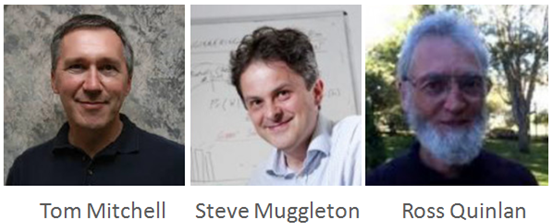
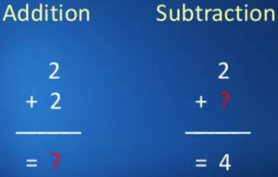
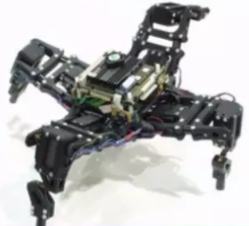
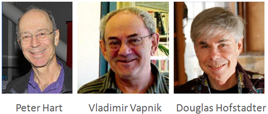
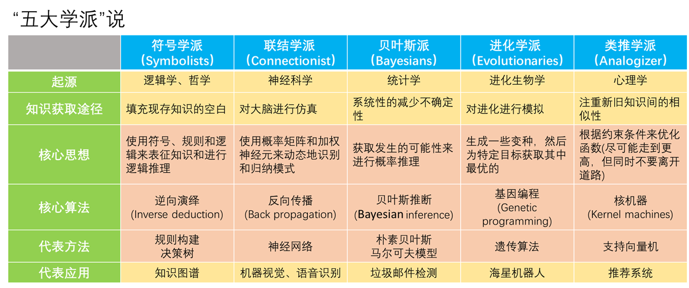
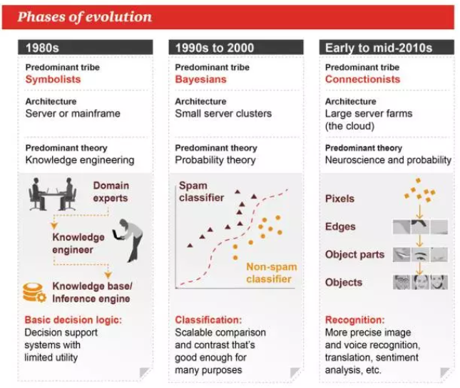
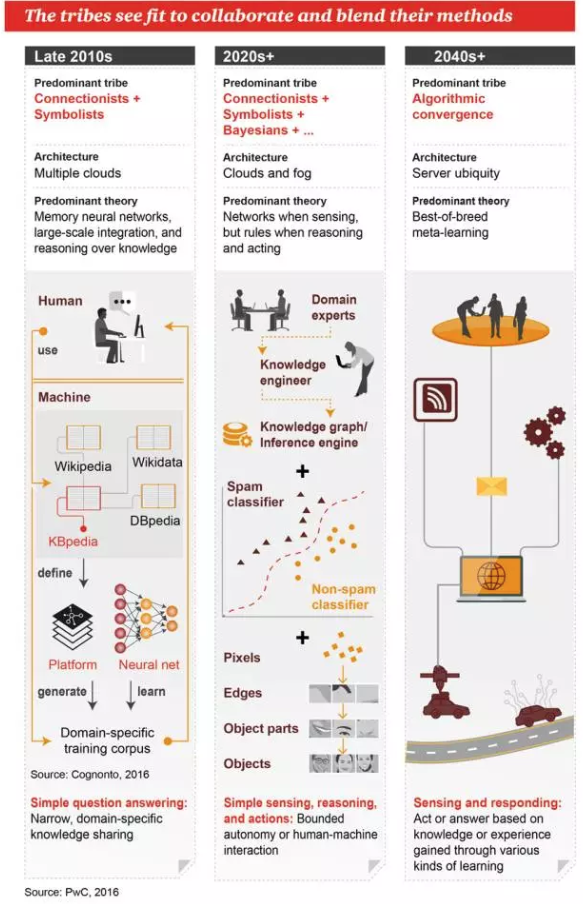

### 人工智能发展简史

***

#### 一、阶段发展史

自1956年人工智能的概念诞生以来，人工智能研究大致经历了六个发展阶段，总结起来就是三起两落，上世纪90年代中期人工智能研究走出第二次低谷后一直平稳发展，直到进入21世纪，大数据和深度学习技术的兴起使得人工智能研究迎来了爆炸式增长。

##### 1. 起源：人工智能的“公元前”（1943~1956）

这一时期是人工智能的起源时期，当时，来自数学、心理学、工程学、经济学、政治学等不同领域的一批科学家开始探讨制造人工智能的可能性。直到1956年，人工智能被正式确立为一门学科。

这一时期的重要事件有：

* 1943年，生理学家麦卡洛克（McCulloch）和数理逻辑学家皮茨（Pitts）创立**M-P神经元模型**，这是后来神经网络模型的起源和基础；

* 1950年，图灵预言了创造具有真正智能的机器的可能性，并提出了著名的“**图灵测试**”；

* 1952年，阿瑟·萨缪尔（Arthur Samuel）在IBM公司研制了第一个具有自我学习能力的**西洋跳棋程序**；

* 1956年，**达特茅斯会议**举行，马文·闵斯基（Marvin Minsky，人工智能之父）、约翰·麦卡锡（John McCarthy，也被称为人工智能之父）、克劳德·香农（Claude Shannon，信息论之父）等资深科学家齐聚一堂，共同确定了人工智能的名称和任务，标志着人工智能这门学科的正式诞生，所以这一年也被称为“人工智能元年”。

  “机器学习”一词最早也是由阿瑟·萨缪尔在达特茅斯会议上被提出的。

  达特茅斯会议的参与者后来大都获得了图灵奖，这个会议的其他参与者包括：

  * 纳撒尼尔·罗切斯特（Nathaniel Rochester），是IBM的第一台商用计算机IBM 701的总设计师，曾编写了世界上第一个汇编语言；
  * 艾伦·纽厄尔（Allen Newell），和下面的赫伯特·西蒙一起合作开发了人工智能早期的重要成果：逻辑理论家和一般问题解决器程序；
  * 赫伯特·西蒙（Herbert Simon）：重要成果同上，顺便一提他还有个中文名叫司马贺。

##### 2. 第一次高潮：逻辑推理时代（1956~1974）

达特茅斯会议之后的数年是人工智能的黄金时代，此时人工智能研究处于“推理期”，那时人们以为只要能赋予机器逻辑推理能力，机器就能具有智能。当时，计算机已经可以解决代数应用题、证明几何定理、学习和使用英语，以致于研究者们在私下的交流和公开发表的论文中表达出相当乐观的情绪，认为具有完全智能的机器将在二十年内出现（结果二十年之后人工智能就凉了）。当时ARPA（国防高等研究计划署）等政府机构也向这一新兴领域投入了大笔资金，进一步促进了人工智能研究的繁荣。

这一时期的重要事件有：

* 1957年，罗森布拉特（Frank Rosenblatt）发明了**感知机算法**，早期的神经网络模型开始出现；
* 1957年，**一般问题解决解器**（General Problem Solver，GPS）问世，它是逻辑推理时代的集大成之作；
* 1964年，美国麻省理工学院AI实验室的约瑟夫·魏岑鲍姆教授开发了世界上**首台聊天机器人ELIZA**，它是今天亚马逊的Alexa、苹果的Siri等一切语音助手的祖宗；

* 1965年，斯坦福大学计算机系教授爱德华·费根鲍姆（E. A. Feigenbaum）主持研制了**第一代专家系统DENLDRA**，它能够分析实验数据来判断未知化合物的分子结构。
* 1969年，闵斯基和Seymour Papert指出了**感知机算法的局限性**，神经网络的研究进入“冰河期”；

##### 3. 第一次低谷：期望越大，失望越大（1974~1980）

到了70年代初，研究者们渐渐发现仅仅具有逻辑推理能力远远不够实现人工智能，许多难题并没有随着时间推移而被解决，很多AI系统一直停留在了玩具阶段。同时，由于计算机性能的瓶颈、计算复杂性的指数级增长、数据量缺失等问题，一些难题看上去好像完全找不到答案。比如像今天已经比较常见的机器视觉功能，在当时就不可能找到一个足够大的数据库来支撑程序去学习，机器无法吸收足够的数据量，自然也就谈不上视觉方面的智能化。

对外界来说，之前学界对人工智能过于乐观的估计使得人们期望过高，但又缺乏有效的进展，巨大的落差之下，许多机构逐渐停止了对AI研究的资助。人工智能遭遇了第一次低谷。

##### 4. 第二次高潮：知识工程时代（1980~1987）

在80年代，一类名为“专家系统”的AI程序开始为全世界的公司所采纳，而“知识处理”成为了主流AI研究的焦点。同时，神经网络方面的研究也有了一定的进展。专家系统在商业领域的成功应用反过来促进了AI的繁荣发展，日本、英国、美国等各国政府也先后为人工智能（尤其是专家系统）的研究提供大规模资助，人工智能研究又重新焕发生机。

这一时期的重要事件有:

* 1980年，专家系统商业化，美国卡耐基·梅隆大学为DEC公司制造出**XCON专家系统**，帮助DEC公司每年节约4000万美元左右的费用；

* 1983年，John Hopfield发明**Hopfield网络**，解决了旅行商（TSP）问题（一个著名的NP难题），使得神经网络重新受到人们的关注；
* 1986年，David Rumelhart重新发明了**反向传播算法**（Back Propagation，BP），解决了多层神经网络的学习问题，神经网络模型得到广泛的应用；

##### 5. **第二次低谷**：知识工程的瓶颈（1987~1993）

从80年代末到90年代初，专家系统所存在的应用领域狭窄、知识获取困难、维护费用居高不下等问题逐渐暴露出来。人们意识到，专家系统面临“知识工程瓶颈”，简单地说，就是由人来把知识总结出来再教给计算机是相当困难的。

同时，若干年前各国制定的宏伟的人工智能计划也并未能实现，于是对AI研究的资助被大幅削减，人工智能研究再次进入低谷。

##### 6. 第三次高潮：统计学习时代（1993~2005）

90年代中期，计算机性能得到提升，大量数据的累积和AI研究者的不懈努力，使得人工智能在许多领域都取得了一定成果，掀起新一轮高潮。在这一时期，“统计学习”闪亮登场并迅速占据主流舞台，代表性技术是支持向量机以及更一般的核方法。但是另一方面，统计学习的兴起也使得神经网络模型难以调参、难以解释的缺陷进一步凸显，于是神经网络的研究再次进入低潮。

这一时期的重要事件有：

* 1995年，Corinna Cortes和Vapnik等提出了**支持向量机**，以其为代表的统计学习方法逐渐兴起；
* 1997年，IBM公司的国际象棋电脑**深蓝**DeepBlue战胜了国际象棋世界冠军卡斯帕罗夫，使得人们重新认识到人工智能的可能性；

##### 7. 爆炸式发展：深度学习时代（2005~至今）

这个时期大家都很熟悉了，正是如今以深度学习为代表的人工智能技术大红大紫的时代。之所以将时间起点定在2005年，是因为这一年被认为是大数据元年，标志性事件是之前在机器翻译领域从来没有技术积累、不为人所知的Google，用海量数据来训练系统，以巨大的优势打败了全世界所有机器翻译研究团队，一跃成为这个领域的领头羊。

进入21世纪后，由于互联网的出现，使得可用的数据量剧增，数据驱动方法的优势越来越明显，最终完成了从量变到质变的飞跃。如今很多需要类似人类智能才能做的事情，计算机已经可以胜任了，这得益于数据量的增加。

全世界各个领域数据不断向外扩展，渐渐形成了另外一个特点，那就是很多数据开始出现交叉，各个维度的数据从点和线渐渐连成了网，或者说，数据之间的关联性极大地增强，在这样的背景下，就出现了大数据。

在有大数据之前，计算机并不擅长解决需要人类智能来解决的问题，但是今天这些问题换个思路就可以解决了，其核心就是变智能问题为数据问题。大数据和进一步提高的计算机性能直接促进了深度学习技术的发展，在语音、图像、自然语言处理等各种复杂的应用领域中都取得了突破性成果。由此，全世界开始了新的一轮技术革命——智能革命。

这一时期的重要事件有：

* 2006年，Geoffrey Hinton提出**深度学习**的概念，论述了训练深度神经网络的可能性，深度学习的曙光出现；
* 2012年，Hinton的学生Alex Krizhevsky提出大规模图像分类网络**AlexNet**，在ImageNet图像识别大赛上获得了远超经典方法的结果，标志着深度学习的正式兴起；
* 2016年，Google的围棋人工智能系统**AlphaGo**与围棋世界冠军李世石进行人机大战，并以4:1的总比分获胜；一年后，AlphaGo又击败了世界排名第一的柯洁，自此以后，深度学习获得广泛关注。

#### 二、学派简介

##### 1. 人工智能的各大流派

科学家们对于如何构建人工智能有着不同的观点，根据对“智能”这一概念的不同理解，人工智能研究者们分成若干派系。**不过不同的派系之间其实并没有很严格划分标准，这里我们只需要了解它们的主要思想和思考问题的方式即可**。关于人工智能学派的说法主要有两种：三大学派说和五大学派说。主流的观点是三大学派说，当然这里我们对两种说法都进行介绍。

###### 1）三大学派说

这三个学派分别是符号主义、连接主义、行为主义。

* **符号主义**（symbolicism）：

  又称为逻辑主义（logicism）、心理学派（psychologism）或计算机学派（computerism）。

  符号主义认为智能产生于大脑抽象思维的过程中，例如概念化的知识表示、模型论语义以及各种推理过程等。他们以物理符号系统假设为基础, 通过对具有物理模式的符号实体的建立、修改、复制和删除等操作生成其他符号结构, 从而实现智能行为。

  符号主义在人工智能发展史上曾长期占据主流，早期的逻辑推理模型、中期的专家系统、知识工程以及如今大火的知识图谱，都是符号主义的产物。大家很熟悉的决策树模型也是符号主义的代表方法之一。

* **连接主义**（connectionism）：

  又称为仿生学派（bionicsism）或生理学派（physiologism）。

  连接主义认为为智能产生于大脑神经元之间的相互作用及信息往来的过程中, 因此通过对大脑神经系统结构的模拟来建立人工神经元网络, 从而实现相应的智能行为。事实上连接主义是最早出现的人工智能学派，甚至早在人工智能的概念诞生之前，连接主义就已经存在了。

  连接主义的典型方法就是神经网络，深度学习正是连接主义的产物。尽管连接主义的方法在如今获得了巨大成功，但是由于人类自己对人脑的工作机制也尚不清楚，因此模仿人脑的连接主义反而成了人工智能研究中最玄学、可解释性最差的学派。

* **行为主义**（actionism）：

  又称为进化主义（evolutionism）或控制论学派（cyberneticsism）。

  行为主义是20世纪末才出现的新兴学派，其思想来源于控制论，与心理学上的行为主义学说也有一定联系。行为主义认为智能行为产生于主体与环境的交互过程中, 复杂的行为可以通过分解成若干个简单的行为加以研究。主体根据环境刺激产生相应的反应, 同时通过特定的反应来陈述引起这种反应的情景或刺激。 因此能以这种快速反馈替代传统人工智能中的精确的数学模型, 从而达到适应复杂、不确定和非结构化的客观环境的目的。

  行为主义的主要研究方向是进化计算（即认为“进化”也是智能体与环境交互的一种行为方式，代表方法是遗传算法）和强化学习。相比于符号主义和连接主义，行为主义是一个比较低调的学派。因为起源于控制论，所以行为主义的研究主要集中在智能机器人控制方面。

  

###### 2）五大学派说

五大学派说是对三大学派说的补充与扩展，这五个学派分别是符号学派、联结学派、进化学派、贝叶斯学派、类推学派。其中符号学派和联结学派就是三大学派说中的符号主义和连接主义。这里主要参考的是以下中文资料：

[三张图读懂机器学习：基本概念、五大流派与九种常见算法](https://mp.weixin.qq.com/s?__biz=MzA3MzI4MjgzMw==&mid=2650725760&idx=1&sn=57391594edfeb9807b6288bfc0dacd30&chksm=871b19feb06c90e85023a2fd9a6e447cd6c967ac25f21abf01685a0cf38f8adccf3012d5d54c&scene=0#rd)

[华盛顿大学教授Pedro Domingos：机器学习领域五大流派（附演讲ppt）](https://mp.weixin.qq.com/s?__biz=MzA3MzI4MjgzMw==&mid=400687937&idx=1&sn=d398dcf7472150557d076bc14e57aed5&scene=21#wechat_redirect)

[机器学习的五大流派](https://blog.csdn.net/rogerchen1983/article/details/79681463)

[机器学习的五大学派](https://blog.csdn.net/kangguang/article/details/79156882)

这些资料的来源是：

华盛顿大学教授Pedro Domingos关于五大流派介绍的PPT

PwC发布的解读机器学习基础的图表

* **符号学派**（Symbolists）

  * **起源**：逻辑学、哲学

  * **知识获取**：填充现存知识的空白

  * **核心思想**：使用符号、规则和逻辑来表征知识和进行逻辑推理

  * **核心算法**：逆向演绎（Inverse deduction）

  * **代表方法**：规则构建、决策树

  * **代表应用**：知识图谱

  * **代表人物**：Tom Mitchell、Steve Muggleton、Ross Quinlan

    

  * **注解**：符号学派的观点是和数理逻辑密切相关的。我们可以从加减法的角度来理解反向演绎过程：

    

    或者另一个例子：

    

    这个例子中，从“苏格拉底是人”和“人终有一死”推出结论，是演绎的过程；而根据“苏格拉底终有一死”和“苏格拉底是人”反推回去，就是逆向演绎的过程（或者说归纳的过程）。在演绎的过程中，关键要素是“苏格拉底是人”和“人类终有一死”这两个知识，从这两个现存知识出发，我们可以得到新的知识“苏格拉底终有一死”，逆向演绎的过程同样如此。所以我们说，符号学派是在填补现存知识的空白（即图中的问号部分）。

    

* **联结学派**（Connectionist）

  * **起源**：神经科学

  * **知识获取**：对大脑进行仿真

  * **核心思想**：使用概率矩阵和加权神经元来动态地识别和归纳模式

  * **核心算法**：反向传播算法（Back propagation）

  * **代表方法**：神经网络

  * **代表应用**：机器视觉、语音识别

  * **代表人物**：Yann LeCun、Geoff Hinton、Yoshua Bengio

    

  * **注解**：早期连接主义是从人类神经元的工作机制中得到启发，不过发展到今天的神经网络其实已经和最初模仿人类大脑的思想没太大关系了。反向传播实际上是在动态的改变神经元连接的权重，它注重解决的是参数学习的问题。

    

* **贝叶斯派**（Bayesians）

  * **起源**：统计学

  * **知识获取**：系统性的减少不确定性

  * **核心思想**：获取发生的可能性来进行概率推理

  * **核心算法**：贝叶斯推断（Bayesian inference）

  * **代表方法**：朴素贝叶斯、马尔可夫模型

  * **代表应用**：垃圾邮件检测

  * **代表人物**：David Heckerman、Judea Pearl、Michael Jordan

    

  * **注解**：贝叶斯公式是贝叶斯派的基础，这个派别是概率论中的贝叶斯学派在机器学习领域的延伸。贝叶斯派认为本质上我们获取的知识都是不确定的，我们只能通过不断的观测来修正之前的认知，从概率上来减少这种不确定性。从某种意义上来说，这种思想暗含了一种哲学观点——“我们永远无法得知真理，我们只能不断地逼近真理”。贝叶斯派的“推断”和符号学派的“推理”最本质的区别在于，后者是由明确的逻辑关系得出的确定性结论，而前者则更像是在进行猜测，并且确定这种猜测有多大把握是正确的。

    

* **进化学派**（Evolutionaries）

  * **起源**：进化生物学

  * **知识获取**：对进化进行模拟

  * **核心思想**：生成一些变种，然后为特定目标获取其中最优的

  * **核心算法**：基因编程（Genetic programming）

  * **代表方法**：遗传算法

  * **代表应用**：海星机器人

  * **代表人物**：John Koda、John Holland、Hod Lipson

    

  * **注解**：进化学派是个比较冷门的学派。它的核心思想是通过特定的方法去生成一系列可能的模型变种，然后根据目标从中挑选一个最合适的，其余都淘汰，这就是一次“进化”的过程。接着在之前的最优模型上再产生新的变种，继续进行迭代，实现不断的“进化”。典型的例子就是遗传算法：

    

    上面提到的海星机器人是由佛蒙特大学的Josh Bongard研发的，它能够通过内部模拟来「感知」自己身体各部件的状况，并进行连续建模，从而在不需要外部编程的情况下自己学会走路，当机器人外部受到破坏，比如说失去了一条腿，它可以重新建模并学习到一种新的行走方式。Josh Bongard在论文《Evolved Machines Shed Light on Robustness and Resilience》中对此进行了详细介绍。

    

    进化学派的观点实际上和强化学习的思想很相似，在三大学派的说法中，它们都属于行为主义学派。（不太确定这里的进化学派是否就是指行为主义学派。）

    

* **类推学派**（Analogizer）

  * **起源**：心理学

  * **知识获取**：注重新旧知识间的相似性

  * **核心思想**：根据约束条件来优化函数（尽可能走到更高，但同时不要离开道路）

  * **核心算法**：核机器（Kernel machines）

  * **代表方法**：支持向量机

  * **代表应用**：推荐系统

  * **代表人物**： Peter Hart、Vladimir Vapnik、Douglas Hofstadter

    

  * **注解**：不是很理解为什么要把SVM归入类比思想中，而且从描述上来看，这一派的思想与其说是类比，不如说就是传统的统计学习的思想（经验风险最小化，同时也要考虑正则）。不过类比的思想确实在机器学习中是广泛存在的，度量学习（metric learning）、迁移学习（transfer learning）、最近邻算法（Nearest Neighbor）、协同过滤（Collaborative Filtering）都和这种类比思想有很强的关联性。

    

* **终极算法**

  也就是把五大学派的方法结合起来，将五大学派对应的五个问题都解决的算法。从长远来看，这也是实现通用人工智能的一个必然趋势。我们用终极算法如何治疗癌症为例，来说明五大学派在其中扮演的角色。

  首先明确问题，为了治愈癌症，我们要解决细胞的代谢网络：哪些基因调节哪些别的基因，由此产生的蛋白质控制哪些化学反应，以及将新微粒加入混合物中将会对网络产生什么影响。

  显然，让机器从零开始努力学习这些东西显得有点愚蠢，因为这种做法忽略了过去几十年生物学家苦心积累的知识。这时，我们就需要**符号学派**的帮助，来将这些知识与来自DNA测序仪、基因表达芯片等的数据结合起来。

  但是，只有知识或数据，是得不出理想结果的，因为我们通过逆向演绎得到的知识都是纯定性的。我们不仅需要了解哪些知识和数据能产生交互，还要了解它们之间产生交互的程度。这其实是一个参数学习的过程，而**联结学派**的反向传播可以做到这些。

  即便如此，如果没有某个基础结构，逆向演绎和反向传播将会迷失在太空中。有了这个基础结构，它们找到的交互和参数才能构成整体。这是**进化学派**要处理的问题，基因编程可以找到这个基础结构。这时，有了新成代谢的完整知识，以及给定病人的相关数据，我们就可以为他找到治疗方法。

  但实际上，我们拥有的知识总是非常不完整的，甚至在有些地方会出错。即便如此，我们还是要继续进行，这就是概率推理的目标，我们需要使用**贝叶斯派**的方法来权衡观测证据与先验知识，从而估计结果的不确定性。

  在情形最困难的例子中，病人的癌症看起来与之前的癌症病例有很大不同，而我们掌握的知识对此也束手无策。**类推学派**能提供解决方案，方法就是从看似有很大差别的情形中找到相似点，把重点放在相似点上，然后忽略其他不同点。

  从上面的例子中，我们可以总结出各学派扮演的角色：

  * 进化学派——选择基本结构

  * 联结学派——从数据中学习参数

  * 符号学派——整合知识与数据

  * 贝叶斯派——权衡证据

  * 类推学派——推广到其他情形

    

##### 2. 符号主义v.s.连接主义

在所有的人工智能学派中，符号主义和连接主义是最重要的两个学派，也是发展得最多的两个学派。实际上，符号主义和连接主义的“斗争”贯穿了整个人工智能的发展史。有趣的是，连接主义（神经网络）的发展史也经历了和整个人工智能发展史一样的“三起两落”阶段。

在人工智能发展的早期，连接主义其实一直受到符号主义的压制。尤其是在1969年，符号主义的代表人物马文·闵斯基指出单层神经网络（感知机）无法解决非线性问题，而多层网络的训练算法尚看不到希望，这直接给了连接主义和神经网络“致命一击”。当然，在这之后不久，整个人工智能的发展也进入了第一次低谷。

人工智能走出第一次低谷后，以专家系统和知识工程为主的研究迅速占据了主流，符号主义率先进入全盛时期。

连接主义也不甘寂寞。1983年发明的Hopfield网络和1986年发明的反向传播算法为神经网络注入了新的活力，使得多层神经网络的训练成为可能，连接主义再度崛起。

（*注：实际上1974年BP算法就被发明了，但当时神经网络正处于冰河期，所以没能受到应有的重视，1984年BP算法实际上是被重新发明了一次*）

1989年，Hornik和Cybenko等人证明了神经网络的万能近似定理：前馈神经网络，只需具备单层隐含层和有限个神经单元，就能以任意精度拟合任意复杂度的函数。这个定理让学术界再次认识到神经网络的强大之处，促进了后续研究的繁荣发展。

风水轮流转，与此同时，符号主义却开始悄然衰落。 最早的征兆发生在AI硬件方面，当时研究AI领域常用的编程语言是Lisp，而Lisp machine是专门被优化用来运行Lisp程序的计算机。80年代，研究AI的学校都买入了这种机器，最后却发现用它们做不出来AI。不久之后，IBM和苹果公司相继研发出了PC电脑，它们比Lisp machine便宜，运算力也更强。依靠着强大的运算能力，IBM PC和苹果机不需要使用AI的方法，也能解决大多数问题，于是Lisp Machine顺理成章的被淘汰。

另一方面，专家系统面临的知识工程瓶颈问题也越发受到诟病。多方因素聚集起来，直接宣判了符号主义的“死刑”，AI也进入了第二次低谷期。

AI走出第二次低谷后不久，支持向量机的发明使得统计学习方法迅速占据了AI研究和应用的舞台，原先还在苦苦支撑的多层神经网络因为难以训练等问题再次被打入冷宫，连接主义也再次走向衰落。

（*注：有人认为支持向量机也是连接主义的成果，因为支持向量机最初是以“支持向量网络”的名义被发表的，而且支持向量机也的确可以被看成是一种特殊的神经网络，但是我个人认为支持向量机最初的思想与连接主义的观点还是有差别的。*）

然而进入21世纪以后，大数据和计算机硬件的发展又让连接主义卷土重来。2006年，Geoffrey Hinton提出深度置信网络（Deep Belief Net，DBN），其由一系列受限玻尔兹曼机（Restricted Boltzmann Machine，RBM）构成。在阐述他的方法时，Hinton首次提出了深度学习的概念，指出了训练深度神经网络的可能性。这之后，他又与Ruslan Salakhutdinov提出了深度玻尔兹曼机（Deep Boltzmann Machine，DBM）。这一系列的方法重新点燃了学术界对于神经网络和玻尔兹曼机的热情，深度学习迎来了曙光。

2012年，Hinton的学生Alex Krizhevsky提出了基于卷积神经网络（Convolutional Neural Network，CNN）的图像分类模型——AlexNet。得益于大量的训练数据和高效的计算平台，AlexNet在当年的ImageNet图像分类大赛上取得了远超传统方法的表现。在这之后，以CNN为代表的深度学习技术开始占据人工智能研究的主流，并在多个领域取得了突破性的成果。

2016年，谷歌Deep Mind团队研制的基于深度强化学习的围棋机器人AlphaGo战胜了世界冠军李世石。这一事件之后，深度学习技术开始走出学术界，引起全世界的广泛关注。

可以说，现如今深度学习技术的大规模流行是连接主义学派的一次重大胜利，然而深度学习就没有缺点吗？并不是，事实上，深度学习现在已经遇到了瓶颈。

成也萧何，败也萧何。大数据成全了深度学习，但也使得深度神经网络的训练过于依赖大量的数据样本。于是，怎么去搜集、整理、标注海量数据就成为了一个问题。同时，深度神经网络的训练也十分依赖对超参数的手动调试，超参数设置略微不同，结果可能就有天壤之别。这两点导致的直接后果就是现在深度学习饱受诟病的“有多少人工，就有多少智能” 。

从更深层次讲，过于依赖特定数据集也导致了深度神经网络的泛化性能很差，很难适应没有出现在训练数据集中的新情形。同时，神经网络一直存在的可解释性差的问题到了深度神经网络中变得更加严重，甚至于如何解释深度神经网络的工作机制都成为了一个专门的研究领域。

深度学习的这种种缺陷导致学术界现在对于重新引入符号主义方法的呼声越来越高。从我个人角度来理解，以深度学习为代表的连接主义方法擅长处理大量的数据，对应的是智能系统中“感知”的部分；而符号主义则在知识的表示方面更有优势，对应的是智能系统中“推理”的部分。

现在学术界想要重新引入符号主义思想，或许是为了将现在单一的“数据驱动”方式变为”知识+数据驱动” 的方式，以希望解决现在深度学习的瓶颈。符号主义和连接主义持续几十年的“相杀”会不会以这种“相爱”的方式结尾呢？让我们拭目以待。         

​                                 

#### 三、图片式总结

附：PwC关于人工智能学派和发展的图解

