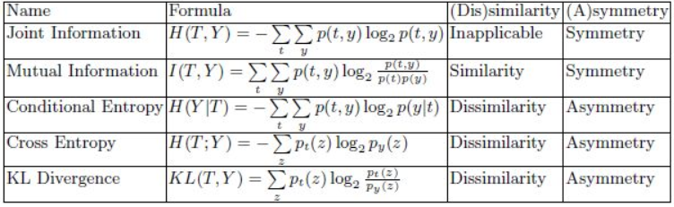
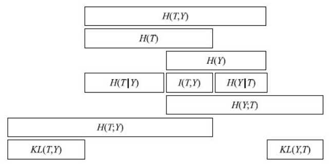

### 信息论基本概念汇总

***

总览：

这些度量中，互信息可以用来衡量相似性（越大越相似），而条件熵、交叉熵和相对熵（即KL散度）可以用来度量相异性（越大越不相似）。

这些量之间的关系如下

#### 1. 信息量

如果事件$X$发生，那么$p(x)$能为“事件$x$发生”所提供的信息量：
$$
h(X)=-\log _{2} p(x)
$$
也就是消除事情不确定性所需要的信息量，单位是比特。

#### 2. 熵

熵是接收的每条消息中包含的信息的平均量，它是不确定性的度量，越随机的信号源其熵越大。

离散：
$$
\mathbb{H}(X)=-\sum_{x} p\left(x_{i}\right) \log _{2} p\left(x_{i}\right)
$$
连续：
$$
\mathbb{H}(X)=-\int p(x) \log _{2} p(x)
$$
在最优化理论中，很多算法用熵作为优化目标，Watanabe也提出过“学习就是一个熵减的过程”，算法学习的过程就是信息不确定性减小的过程。

#### 3. 联合熵

度量二维随机变量的不确定性：
$$
\mathbb{H}(X, Y)=-\sum_{i} \sum_{j} p\left(x_{i}, y_{j}\right) \log _{2} p\left(x_{i}, y_{j}\right)
$$

####  4. 条件熵

$\mathbb{H}(Y | X)$表示已知$X$，求$Y$的平均不确定性
$$
\mathbb{H}(Y | X)=-\sum_{i} \sum_{j} p\left(x_{i}, y_{j}\right) \log _{2} p\left(y_{j} | x_{i}\right)
$$

$$
\mathbb{H}(Y | X)=\sum_{i} p\left(x_{i}\right) \mathbb{H}\left(Y | x_{i}\right)
$$

推导过程如下：
$$
\begin{aligned}\mathbb{H}(Y | X)&=-\sum_{i} \sum_{j} p\left(x_{i}\right) p\left(y_{i} | x_{i}\right) \log _{2} p\left(y_{i} | x_{i}\right) \\ &=-\sum_{i} p\left(x_{i}\right) \sum_{j} p\left(y_{i} | x_{i}\right) \log _{2} p\left(y_{i} | x_{i}\right) \\ &=\sum_{i} p\left(x_{i}\right) \mathbb{H}\left(Y | x_{i}\right)\end{aligned}
$$
由联合熵和条件熵可得：
$$
\begin{aligned}\mathbb{H}(X, Y)&=-\sum_{i} \sum_{j} p\left(x_{i}, y_{j}\right) \log _{2} p\left(x_{i}, y_{j}\right) \\&=-\sum_{i} \sum_{j} p\left(x_{i}, y_{j}\right) \log _{2} p\left(y_{j} | x_{i}\right)\\ &\qquad +\sum_{i}\left(\sum_{j} p\left(x_{i}, y_{j}\right)\right) \log _{2} p\left(x_{i}\right)\\ &=\mathbb{H}(Y | X)+\mathbb{H}(X)\end{aligned}
$$

#### 5. 相对熵

又称为KL散度。主要用来衡量两个分布的相似度。假设连续随机变量$x$，真实的概率分布为$p(x)$，模型得到的近似分布为$q(x)$。

离散：
$$
\begin{aligned} \mathbb{K} \mathbb{L}(p \| q)=&-\sum_{i} p\left(x_{i}\right) \ln q\left(x_{i}\right)-\left(-\sum p\left(x_{i}\right) \ln p\left(x_{i}\right)\right) \\=& \sum_{i} p\left(x_{i}\right) \ln \frac{p\left(x_{i}\right)}{q\left(x_{i}\right)} \end{aligned}
$$
连续：
$$
\begin{aligned} \mathbb{K} \mathbb{L}(p \| q)=&-\int_{x} p(x) \ln p(x)+p(x) \ln q(x) \\ =&\int_{x} p(x) \ln \frac{p(x)}{q(x)} \end{aligned}
$$
对离散变量的相对熵：
$$
\begin{aligned} \mathbb{K} \mathbb{L}(p \| q)&=-\sum_{i} p \left(x_{i}\right) \ln q\left(x_{i}\right)-\left(-\sum p\left(x_{i}\right) \ln p\left(x_{i}\right)\right) \\ &=\mathbb{H}(p, q)-\mathbb{H}(p) \end{aligned}
$$
其中$\mathbb{H}(p, q)$被称为交叉熵。

#### 6. 交叉熵

用来衡量两个分布之间的相似程度，$p$为真实概率分布，$q$为模型预测的概率分布：
$$
\mathbb{H}(p, q)=-\sum_{i} p\left(x_{i}\right) \ln q\left(x_{i}\right)
$$

#### 7. 互信息

相对熵是衡量同一个变量的两个一维分布之间的相似性，而互信息是用来衡量两个相同的一维分布变量之间的独立性 。

互信息$\mathbb{I}(p, q)$是衡量联合分布$p(x, y)$和$p(x) p(y)$分布之间的关系，即它们之间的相关系数
$$
\begin{aligned}\mathbb{I}(X, Y)&=\mathbb{K} \mathbb{L}(p(x, y) \| p(x) p(y)) \\ &=\sum_{i} \sum_{j} p\left(x_{i}, y_{j}\right) \ln \frac{p\left(x_{i}, y_{j}\right)}{p\left(x_{i}\right) p\left(y_{j}\right)} \\& =-\mathbb{H}(X, Y)+\mathbb{H}(X)+\mathbb{H}(Y) \\ &=\mathbb{H}(X)-\mathbb{H}(X | Y) \\ &=\mathbb{H}(Y)-\mathbb{H}(Y | X)\end{aligned}
$$
$\mathbb{I}(X, Y)$反映的是在知道了$Y$的值以后$X$的不确定性的减少量。 可以理解为$Y$的值透露了多少关于$X$的信息量。

实际上，互信息体现了两变量之间的依赖程度：如果$\mathbb{I}(X, Y) \gg 0$，表明$X$和$Y$是高度相关的；如果$\mathbb{I}(X, Y) =0$，表明$X$和$Y$是相互独立的；如果$\mathbb{I}(X, Y) \ll 0$，表明$Y$的出现不但未使$X$得不确定性减少，反而还增大了$X$的不确定性，常常是不利的。

