### 常用概率分布汇总

***

#### 1. 离散变量

##### 1.1 离散均匀分布（discrete uniform）

随机变量的有限的$n$个取值拥有相同概率的分布。

概率质量函数：
$$
P(x=k)=\left\{ \begin{aligned} \frac{1}{n} &\quad a\leq k\leq b
\\0 &\quad \text{otherwise}
\end{aligned} \right.
$$
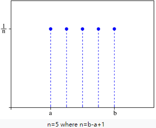

累积分布函数：
$$
F(x) = \left\{ \begin{aligned}  
&0 &\qquad \text{for} \ \  k<a \\
&\frac{k-a+1}{n} &\qquad \text{for} \ \  a \leq k \leq b \\
&1 &\qquad \text{for} \ \ k>b
\end{aligned} \right.
$$
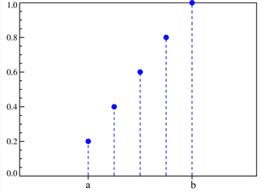

期望：$\frac{a+b}{2}$

方差：$\frac{n^{2}-1}{12}$

##### 1.2 伯努利分布（Bernoulli）

又名0-1分布，描述**二元随机变量**的一种分布。伯努利试验是在同样的条件下重复地、各次之间相互独立地进行的一种试验。若伯努利试验成功，记随机变量取值为1；伯努利试验失败，随机变量取值为0。记其成功概率为$p$（$0\leq p \leq 1$），失败概率为$q=1-p$。

概率质量函数：
$$
f_{X}(x)=p^{x}(1-p)^{1-x}=\left\{\begin{array}{ll}{p} & {\text { if } x=1} \\ {q} & {\text { if } x=0}\end{array}\right.
$$
期望：$p$

方差：$pq$

*在机器学习中，我们会使用多个伯努利分布的相乘来对二分类问题建模，比如 logistic回归，注意这里使用的不是二项分布，因为对于特定数据集来说，每个样本从属的类别都是固定的，不存在二项分布中多种组合的情况。*

##### 1.3 二项分布（Binomial）

如果随机变量$X$服从参数为$n$和$p$的二项分布，我们记为$X \sim b(n, p)$或$X \sim B(n, p)$。二项分布描述$n$次伯努利试验（$n$次独立重复实验）中成功$k$次的概率。

概率质量函数：
$$
f(k ; n, p)=\operatorname{Pr}(X=k)=\left( \begin{array}{l}{n} \\ {k}\end{array}\right) p^{k}(1-p)^{n-k}
$$
对于$k=0,1,2, \ldots, n$，其中$\left( \begin{array}{l}{n} \\ {k}\end{array}\right)=\frac{n !}{k !(n-k) !}$。

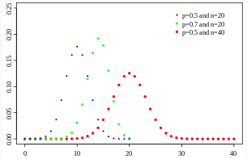

累积分布函数：
$$
F(x ; n, p)=\operatorname{Pr}(X \leq x)=\sum_{i=0}^{\lfloor x\rfloor} \left( \begin{array}{c}{n} \\ {i}\end{array}\right) p^{i}(1-p)^{n-i}
$$
其中$\lfloor x\rfloor$是小于或等于$x$的最大整数。

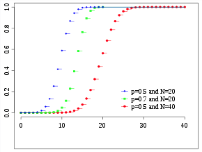

期望：$n p$

方差：$n p(1-p)$

伯努利分布是二项分布在$n=1$时的特殊情况。

##### 1.4 多项分布（Multinomial）

多项分布是二项分布的推广，在$N$次独立重复实验中，随机变量的可能状态从两种（成功或失败）推广至多种，就得到了多项分布。

如果一个随机变量$X=\{X_1, X_2, \ldots, X_n \}$满足下列条件：

* $X_i \geq 0 \ (1 \leq i \leq n)$，且$X_1 + X_2 + \ldots + X_n = N$；
* 设$k_1, k_2, \ldots, k_n$为任意非负整数，且$k_1 + k_2 + \ldots + k_n = N$。

则事件$\{ X_1 = k_1, X_2 = k_2, \ldots, X_n = k_n \}$的概率（即多项分布的PMF）为
$$
P(X_1 = k_1, X_2 = k_2, \ldots, X_n = k_n) = \frac{N !}{k_{1} ! \cdots k_{n} !} p_{1}^{k_{1}} \cdots p_{k}^{k_{n}}
$$
其中$p_i \geq 0 \  (1 \leq i \leq n)$，$p_{1}+p_{2}+\ldots+p_{n}=1$。

多项分布描述的是$N$次独立重复试验中，$X_1$发生$k_1$次，$X_2$发生$k_2$次……$X_n$发生$k_n$次的概率。

均值：$\mathrm{E}\left(X_{i}\right)=n p_{i}$

方差：$\operatorname{Var}\left(X_{i}\right)=n p_{i}\left(1-p_{i}\right)$

协方差：$\operatorname{Cov}\left(X_{i}, X_{j}\right)=-n p_{i} p_{j}(i \neq j)$

##### 1.5 多努利分布（Multinoulli）

又称范畴分布或多类别分布（categorical distribution），是指具有$n$个不同状态的单个离散型随机变量上的分布，其中$n$是一个有限值。Multinoulli分布由分布向量$p \in[0,1]^{n-1}$给出，即代表取各个不同状态的概率。其中最后的第$n$个状态的概率可以通过$1-1^{T} p$给出。

Multinoulli分布是多项分布在试验次数$N=1$时的特殊情况。*注意在大多数机器学习的文章中，所使用的“多项式分布”实际上就是指的Multinoulli分布*。

【**伯努利分布、二项分布、多努利分布、多项分布的区别**】

* 抛一次硬币，正面朝上的概率，这是伯努利分布。

* 抛$N$次硬币，正面朝上出现了$k$次的概率，这是二项分布。

* 抛一次骰子，第$i$面朝上的概率，这是Multinoulli分布。

* 抛$N$次骰子， 第1面朝上出现了$k_1$次 ，第2面朝上出现了$k_2$次......第$n$面朝上出现了 $k_n$ 次的概率，这是多项分布。

Multinoulli分布与多项式分布的关系类似于伯努利分布与二项分布的关系。

##### 1.6 泊松分布（Poisson）

泊松分布适合于描述单位时间内随机事件发生的次数的概率分布。如某一服务设施在一定时间内受到的服务请求的次数，电话交换机接到呼叫的次数、汽车站台的候客人数、机器出现的故障数、自然灾害发生的次数、DNA序列的变异数、放射性原子核的衰变数、激光的光子数分布等等。

概率质量函数：
$$
P(X=k)=\frac{e^{-\lambda} \lambda^{k}}{k !}
$$
泊松分布的参数$\lambda$是单位时间（或单位面积）内随机事件的平均发生率。

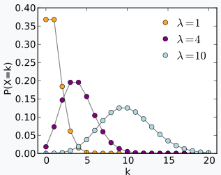

期望：$\lambda$

方差：$\lambda$

#### 2. 连续变量

##### 2.1 均匀分布（uniform）

一个服从区间$[a,b]$上的均匀分布的连续性随机变量$X$的概率密度函数为：
$$
f(x)=\left\{\begin{array}{cc}{\frac{1}{b-a}} & {\text { for } a \leq x \leq b} \\ {0} & {\text { elsewhere }}\end{array}\right.
$$
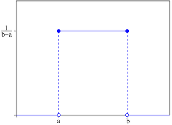

累积分布函数：
$$
F(x)=\left\{\begin{array}{cl}{0} & {\text { for } x<a} \\ {\frac{x-a}{b-a}} & {\text { for } a \leq x<b} \\ {1} & {\text { for } x \geq b}\end{array}\right.
$$
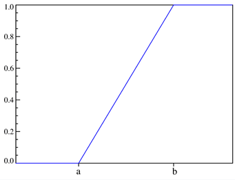

期望：$\frac{a+b}{2}$

方差：$\frac{(b-a)^{2}}{12}$

##### 2.2 高斯分布（Gaussian）

即正态分布（Normal distribution）。随机变量服从一个均值为$\mu$，方差为$\sigma^2$的正态分布，记为$X \sim N\left(\mu, \sigma^{2}\right)$，其概率密度函数为：
$$
f(x)=\frac{1}{\sigma \sqrt{2 \pi}} e^{-\frac{(x-\mu)^{2}}{2 \sigma^{2}}}
$$
正态分布的期望值$\mu$等于位置参数，决定了分布的位置；其方差$\sigma^2$的开平方或标准差$\sigma$等于尺度参数，决定了分布的幅度。

PDF的图形如下：

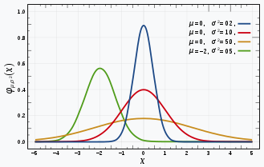

累积分布函数没有解析表达式：
$$
F(x ; \mu, \sigma)=\frac{1}{\sigma \sqrt{2 \pi}} \int_{-\infty}^{x} \exp \left(-\frac{(t-\mu)^{2}}{2 \sigma^{2}}\right) d t
$$
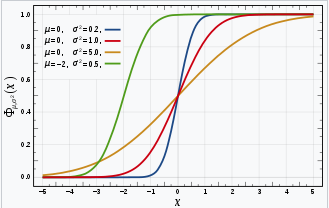

###### 2.2.1 多元高斯分布

随机变量$\mathbf{x} = \{x_{1}, \dots, x_{k} \}$服从多元高斯分布，其PDF为：
$$
f_{\mathbf{x}}\left(x_{1}, \ldots, x_{k}\right)=\frac{1}{\sqrt{(2 \pi)^{k}|\mathbf{\Sigma}|}} \exp \left(-\frac{1}{2}(\mathbf{x}-\boldsymbol{\mu})^{\mathrm{T}} \boldsymbol{\Sigma}^{-1}(\mathbf{x}-\boldsymbol{\mu})\right)
$$
其中$\boldsymbol{ \mu }$代表均值向量，$\boldsymbol{\Sigma}$是协方差矩阵，$|\boldsymbol{\Sigma}|$代表$\boldsymbol{\Sigma}$的行列式。

##### 2.3 指数分布（Exponential ）

指数分布可以用来表示独立随机事件发生的时间间隔，比如旅客进入机场的时间间隔、打进客服中心电话的时间间隔、中文维基百科新条目出现的时间间隔等等。

概率密度函数：
$$
f(x ; \lambda)=\left\{\begin{array}{cc}{\lambda e^{-\lambda x}} & {, x \geq 0} \\ {0} & {, x<0}\end{array}\right.
$$
其中$\lambda>0$是分布的一个参数，常被称为率参数（rate parameter），即每单位时间发生该事件的次数。

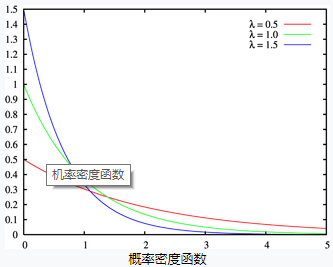

累积分布函数：

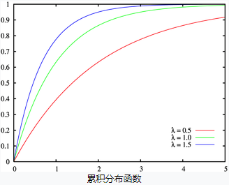

期望：$\lambda^{-1}$

方差：$\lambda^{-2}$

##### 2.4 Beta分布

贝塔分布是定义在（0，1）区间内的连续概率分布，有两个参数$\alpha, \beta>0$。

概率密度函数：
$$
\begin{aligned} f(x ; \alpha, \beta) &=\frac{x^{\alpha-1}(1-x)^{\beta-1}}{\int_{0}^{1} u^{\alpha-1}(1-u)^{\beta-1} d u} \\ &=\frac{\Gamma(\alpha+\beta)}{\Gamma(\alpha) \Gamma(\beta)} x^{\alpha-1}(1-x)^{\beta-1} \\ &=\frac{1}{\mathrm{B}(\alpha, \beta)} x^{\alpha-1}(1-x)^{\beta-1} \end{aligned}
$$
其中$\Gamma(z)$为Gamma函数，定义为：
$$
\Gamma(z)=\int_{0}^{\infty} \frac{t^{z-1}}{\mathrm{e}^{t}} \mathrm{d} t
$$
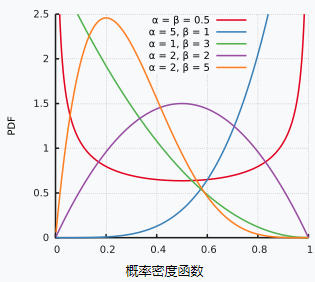

期望：$\mathrm{E}[x]=\frac{\alpha}{\alpha+\beta}$

方差：$\frac{\alpha \beta}{(\alpha+\beta)^{2}(\alpha+\beta+1)}$

##### 2.5 Gamma分布

Gamma分布有两个参数，参数$\alpha$称为形状参数，参数$\beta$称为尺度参数，令$X \sim \Gamma(\alpha, \beta)$，且令$\lambda=\frac{1}{\beta}$，则概率密度函数为：
$$
f(x)=\frac{x^{(\alpha-1)} \lambda^{\alpha} e^{(-\lambda x)}}{\Gamma(\alpha)}, x>0
$$
其中Gamma函数的特征为：
$$
\left\{\begin{array}{ll}{\Gamma(\alpha)=(\alpha-1) !} & {\text { if } \alpha \text { is } \mathbb{Z}^{+}} \\ {\Gamma(\alpha)=(\alpha-1) \Gamma(\alpha-1)} & {\text { if } \alpha \text { is } \mathbb{R}^{+}} \\ {\Gamma\left(\frac{1}{2}\right)=\sqrt{\pi}}\end{array}\right.
$$
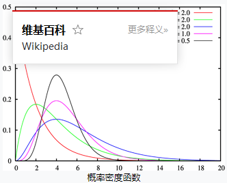

期望：$\alpha \beta$

方差：$\alpha \beta^2$

##### 2.6 拉普拉斯分布（Laplace）

拉普拉斯分布可以看作是两个不同位置的指数分布背靠背拼接在一起，所以它也叫作**双指数分布**。拉普拉斯分布有两个参数：位置参数$\mu$和尺度参数$b>0$。

概率密度函数为：
$$
f(x | \mu, b)=\frac{1}{2 b} \exp \left(-\frac{|x-\mu|}{b}\right)
$$
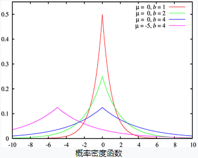

期望：$\mu$

方差：$2b^2$

拉普拉斯分布的概率密度函数让我们联想到正态分布，但是，正态分布是用相对于平均值的差的平方来表示，而拉普拉斯概率密度用相对于平均值的差的绝对值来表示。因此，拉普拉斯分布的尾部比正态分布更加平坦。

##### 2.7 狄利克雷分布（Dirichlet）

狄利克雷分布是Beta分布在多维变量上的推广。假设随机变量$X=\{x_{1}, \dots, x_{K}\}$，并且$x_{1}+\ldots+x_{K-1}<1$，$x_{K}=1-x_{1}-\ldots-x_{K-1}$。参数为$\alpha = \{\alpha_{1}, \dots, \alpha_{K}\}$。

概率密度函数为：
$$
f\left(x_{1}, \ldots, x_{K} ; \alpha_{1}, \ldots, \alpha_{K}\right)=\frac{1}{\mathrm{B}(\alpha)} \prod_{i=1}^{K} x_{i}^{\alpha_{i}-1}
$$
其中
$$
\mathrm{B}(\alpha)=\frac{\prod_{i=1}^{K} \Gamma\left(\alpha_{i}\right)}{\Gamma\left(\sum_{i=1}^{K} \alpha_{i}\right)}
$$
期望：
$$
\mathrm{E}\left[X_{i}\right]=\frac{\alpha_{i}}{\sum_{k} \alpha_{k}}
$$
方差：
$$
\operatorname{Var}\left[X_{i}\right]=\frac{\tilde{\alpha}_{i}\left(1-\tilde{\alpha}_{i}\right)}{\overline{\alpha}+1}
$$
其中$\tilde{\alpha}_{i}=\frac{\alpha_{i}}{\sum_{i=1}^{K} \alpha_{i}}$，并且$\overline{\alpha}=\sum_{i=1}^{K} \alpha_{i}$。

协方差：
$$
\operatorname{Cov}\left[X_{i}, X_{j}\right]=\frac{-\tilde{\alpha}_{i} \tilde{\alpha}_{j}}{\overline{\alpha}+1}(i \neq j)
$$

#### 3. 共轭分布

假设变量$x$服从分布$P(x | \Theta)$，其中$\Theta$为参数，$X=\left\{x_{1}, x_{2}, \ldots, x_{m}\right\}$为变量$x$的观测样本，假设参数$\Theta$服从先验分布$\Pi(\Theta)$。若由先验分布$\Pi(\Theta)$和抽样分布$P(X | \Theta)$决定的后验分布$F(\Theta | X)$与$\Pi(\Theta)$是同类型分布，则称先验分布$\Pi(\Theta)$为分布$P(x | \Theta)$或$P(X | \Theta)$的共轭分布（conjugate distribution）。

**贝塔分布与伯努利分布共轭**；

**狄利克雷分布与Multinoulli分布共轭**；

**高斯分布的共轭仍然是高斯分布。**

先验分布反映了某种先验信息，后验分布既反映了先验分布提供的信息、又反映了样本提供的信息。当先验分布与抽样分布共轭时，后验分布与先验分布属于同种类型，这意味着先验信息与样本提供的信息具有某种同一性。于是，若使用后验分布作为进一步抽样的先验分布，则新的后验分布仍将属于同种类型。因此，共轭分布在不少情形下会使问题得到简化。

