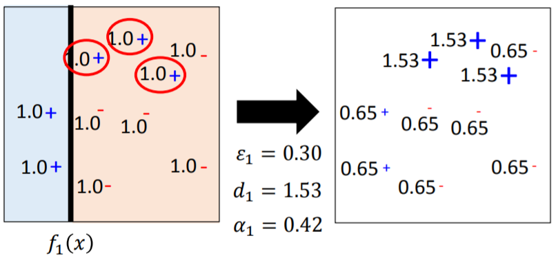
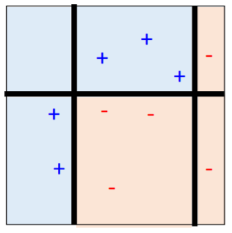
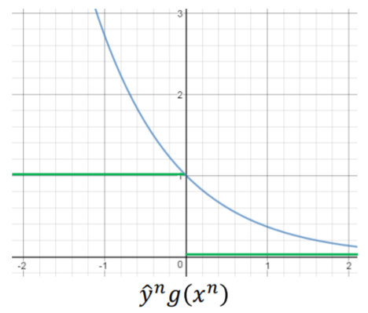

### AdaBoost算法原理详解

***

主要参考李宏毅老师机器学习课程中的讲解：

[ensemble](http://speech.ee.ntu.edu.tw/~tlkagk/courses/ML_2017/Lecture/Ensemble.pdf)

以及周志华老师《机器学习》书中对应章节。

AdaBoost是Boosting族算法中的著名代表，其原理有多种理解方式，这里我们按照李宏毅老师课程中的思路来进行分析。

#### 1. 算法实现

AdaBoost希望在训练过程中，后一个基学习器能与前一个基学习器形成互补，弥补之前做的不好的地方。AdaBoost通过对数据集进行重新加权的方式来达成这一目的，使得之前分类错误的样本在训练新的基学习器时受到更多的关注。在实际操作时，我们只要对loss函数进行重新调整即可。

下面我们来推导权重的计算方式。

标准的AdaBoost处理的是二分类问题，我们假设训练数据为$\left\{ \left( x ^ { 1 } , \hat { y } ^ { 1 } \right) , \cdots , \left( x ^ { n } , \hat { y } ^ { n } \right) , \cdots , \left( x ^ { N } , \hat { y } ^ { N } \right) \right\}​$，标签$\hat { y } = \pm 1​$，不同的基分类器用$\{ f_1, f_2, ..., f_T\}​$表示，$u_i^{j}​$表示在训练第$i​$个基分类器时第$j​$个样本对应的权重。对于第一个基分类器$f_1​$，其误差率$\varepsilon _ { 1 }​$为：
$$
\varepsilon _ { 1 } = \frac { \sum _ { n } u _ { 1 } ^ { n } \delta \left( f _ { 1 } \left( x ^ { n } \right) \neq \hat { y } ^ { n } \right) } { Z _ { 1 } }
$$
其中$Z _ { 1 } = \sum _ { n } u _ { 1 } ^ { n }$是归一化系数。很显然$\varepsilon _ { 1 }<0.5$，因为不论是多弱的分类器，我们总能将误差率控制在0.5以下（大于0.5时只要将输出取反即可）。

将样本的权重值从$u _ { 1 } ^ { n }​$变为$u _ { 2 } ^ { n }​$，使得分类器$f_1​$失效，即
$$
\frac { \sum _ { n } u _ { 2 } ^ { n } \delta \left( f _ { 1 } \left( x ^ { n } \right) \neq \hat { y } ^ { n } \right) } { Z _ { 2 } } = 0.5 \tag{1.1}
$$
这意外着在新的权重$u _ { 2 } ^ { n }$下，$f_1$只是在做随机的预测。接下来我们在新的权重$u _ { 2 } ^ { n }$下训练新的分类器$f_2$，这样得到的$f_2$即可与$f_1$形成互补，可以理解为$f_2$做到了$f_1$做不到的事情（尽管$f_2$不一定能做到$f_1$也能做到的事情）。

改变权重的原则是：

* 如果样本$x^n$被$f_1$错误的分类，即$f _ { 1 } \left( x ^ { n } \right) \neq \hat { y } ^ { n }$，那么将其对应的权重$u _ { 1 } ^ { n }$乘以一个数$d_1$，得到新的权重$u _ { 2 } ^ { n }$，这意味着被分错的样本将受到更多关注；
* 如果样本$x^n$被$f_1$正确的分类，即$f _ { 1 } \left( x ^ { n } \right) = \hat { y } ^ { n }$，那么将其对应的权重$u _ { 1 } ^ { n }$除以$d_1$，得到新的权重$u _ { 2 } ^ { n }$，这意味着被分对的样本将受到关注减少。

注意到，式（1.1）的分子可以改写为：
$$
\sum _ { n } u _ { 2 } ^ { n } \delta \left( f _ { 1 } \left( x ^ { n } \right) \neq \hat { y } ^ { n } \right) = \sum _ { f _ { 1 } \left( x ^ { n } \right) \neq \hat { y } ^ { n } } u _ { 1 } ^ { n } d _ { 1 } \tag{1.2}
$$
式（1.1）的分母可以改写为：
$$
\begin{aligned}
Z_2 &= \sum _ { n } u _ { 2 } ^ { n } \\&= \sum _ { f _ { 1 } \left( x ^ { n } \right) \neq \hat { y } ^ { n } } u _ { 2 } ^ { n } + \sum _ { f _ { 1 } \left( x ^ { n } \right) = \hat { y } ^ { n } } u _ { 2 } ^ { n } \\&= \sum _ { f _ { 1 } \left( x ^ { n } \right) \neq y ^ n } u _ { 1 } ^ { n } d _ { 1 } + \sum _ { f _ { 1 } \left( x ^ { n } \right) = y ^ { n } } u _ { 1 } ^ { n } / d _ { 1 }
\end{aligned}
\tag{1.3}
$$
将式（1.2）和式（1.3）代回式（1.1），并颠倒分子分母的顺序，得
$$
\frac { \sum _ { f _ { 1 } \left( x ^ { n } \right) \neq \hat { y } ^ { n } } u _ { 1 } ^ { n } d _ { 1 } + \sum _ { f _ { 1 } \left( x ^ { n } \right) = \hat { y } ^ { n } } u _ { 1 } ^ { n } / d _ { 1 } } { \sum _ { f _ { 1 } \left( x ^ { n } \right) \neq \hat { y } ^ { n } } u _ { 1 } ^ { n } d _ { 1 } } = 2
$$
整理得
$$
\frac { \sum _ { f _ { 1 } \left( x ^ { n } \right) = \hat { y } ^ { n } } u _ { 1 } ^ { n } / d _ { 1 } } { \sum _ { f _ { 1 } \left( x ^ { n } \right) \neq \hat { y } ^ { n } } u _ { 1 } ^ { n } d _ { 1 } } = 1
$$
即
$$
\sum _ { f _ { 1 } \left( x ^ { n } \right) = \hat { y } ^ { n } } u _ { 1 } ^ { n } / d _ { 1 } = \sum _ { f _ { 1 } \left( x ^ { n } \right) \neq \hat { y } ^ { n } } u _ { 1 } ^ { n } d _ { 1 } \tag{1.4}
$$
同时，根据
$$
\varepsilon _ { 1 } = \frac { \sum _ { f _ { 1 } \left( x ^ { n } \right) \neq \hat { y } ^ { n } } u _ { 1 } ^ { n } } { Z _ { 1 } }
$$
可得
$$
\sum _ { f _ { 1 } \left( x ^ { n } \right) \neq \hat { y } ^ { n } } u _ { 1 } ^ { n } = Z _ { 1 } \varepsilon _ { 1 } \tag{1.5}
$$
以及
$$
\sum _ { f _ { 1 } \left( x ^ { n } \right) = \hat { y } ^ { n } } u _ { 1 } ^ { n } = Z _ { 1 } \left( 1 - \varepsilon _ { 1 } \right) \tag{1.6}
$$
将式（1.5）和式（1.6）代回式（1.4），得
$$
Z _ { 1 } \left( 1 - \varepsilon _ { 1 } \right) / d _ { 1 } = Z _ { 1 } \varepsilon _ { 1 } d _ { 1 }
$$
整理后即可得到系数$d_1$的计算方式：
$$
d _ { 1 } = \sqrt { \left( 1 - \varepsilon _ { 1 } \right) / \varepsilon _ { 1 } }
$$
显然$d_1> 1$。

于是我们可以得到：
$$
d _ { t } = \sqrt { \left( 1 - \varepsilon _ { t } \right) / \varepsilon _ { t } }
$$
规定
$$
\alpha _ { t } = \ln \sqrt { \left( 1 - \varepsilon _ { t } \right) / \varepsilon _ { t } } \tag{1.7}
$$
对于分类错误的样本，其权重更新为：
$$
u _ { t + 1 } ^ { n } = u _ { t } ^ { n } \times d _ { t } = u _ { t } ^ { n } \times \exp \left( \alpha _ { t } \right)
$$
对于分类正确的样本，其权重更新为：
$$
u _ { t + 1 } ^ { n } = u _ { t } ^ { n } / d _ { t } = u _ { t } ^ { n } \times e x p \left( - \alpha _ { t } \right)
$$
可以整合一下，权重的更新规则为：
$$
u _ { t + 1 } ^ { n } = u _ { t } ^ { n } \times \exp \left( - \hat { y } ^ { n } f _ { t } \left( x ^ { n } \right) \alpha _ { t } \right) \tag{1.8}
$$
按照这种方式，我们可以得到一系列分类器$f _ { 1 } ( x ) , \ldots , f _ { t } ( x ),\dots,f_T(x)​$，通过加权和的方式，可以得到最终结果：
$$
H ( x ) = \operatorname { sign } \left( \sum _ { t = 1 } ^ { T } \alpha _ { t } f _ { t } ( x ) \right) \tag{1.9}
$$
式（1.7）告诉我们，错误率$\varepsilon _ { t }$，$\alpha _ { t }$的值越大。所以式（1.9）的含义即是在最后考虑所有分类器时，错误率小的分类器会被给予更高的权重，这显然是合理的。

综上所述，整个AdaBoost的算法表述如下：

**给定**：训练数据$\left\{ \left( x ^ { 1 } , \hat { y } ^ { 1 } , u _ { 1 } ^ { 1 } \right) , \cdots , \left( x ^ { n } , \hat { y } ^ { n } , u _ { 1 } ^ { n } \right) , \cdots , \left( x ^ { N } , \hat { y } ^ { N } , u _ { 1 } ^ { N } \right) \right\}$，标签$\hat { y } = \pm 1$，初始权重$u _ { 1 } ^ { n } = 1$（所有样本等权重）。

**训练**：从$t = 1 , \dots , T$循环：

* 训练弱分类器$f _ { t } ( x )$，对应权重$\left\{ u _ { t } ^ { 1 } , \cdots , u _ { t } ^ { N } \right\}$，对应错误率$\varepsilon _ { t }$；

* 对循环$n = 1 , \dots , N$：

  * 如果$x ^ { n }$被$f _ { t } ( x )$错误分类，即$\hat { y } ^ { n } \neq f _ { t } \left( x ^ { n } \right)$，则更新权重为
    $$
    u _ { t + 1 } ^ { n } = u _ { t } ^ { n } \times d _ { t } = u _ { t } ^ { n } \times \exp \left( \alpha _ { t } \right)
    $$
    其中$d _ { t } = \sqrt { \left( 1 - \varepsilon _ { t } \right) / \varepsilon _ { t } }$，$\alpha _ { t } = \ln \sqrt { \left( 1 - \varepsilon _ { t } \right) / \varepsilon _ { t } }$；

  * 否则，更新权重为
    $$
    u _ { t + 1 } ^ { n } = u _ { t } ^ { n } / d _ { t } = u _ { t } ^ { n } \times e x p \left( - \alpha _ { t } \right)
    $$

* 得到分类器$f _ { 1 } ( x ) , \ldots , f _ { t } ( x ),\dots,f_T(x)$。

**结果整合**：最终预测结果为所有分类器的加权和：$H ( x ) = \operatorname { sign } \left( \sum _ { t = 1 } ^ { T } \alpha _ { t } f _ { t } ( x ) \right)​$。

#### 2. 简单例子

以训练三个决策树桩作为弱分类器，即$T=3$为例，来说明AdaBoost的运作方式。

* $t=1​$：

可以看到有三个样本被分类错误，对数据重新加权。

* $t=2$：

此时仍有三个样本被分类错误，再次进行重新加权。

* $t=3$：

此时仍有三个样本被分类错误，但基分类器数量已达到要求，所以迭代终止。

最终的分类器是三个基分类器的加权和：
$$
H ( x ) = \operatorname { sign } \left( \sum _ { t = 1 } ^ { T } \alpha _ { t } f _ { t } ( x ) \right)
$$
即如下分类器：

整合以后，最终的效果是这样的：

这就是AdaBoost分类器的工作流程。

#### 3. 误差分析

AdaBoost的强大之处在于，随着基分类器数量的增加（即$T$增加），最终整合的分类器$H(x)$的训练误差会越来越小，直到变为0。下面从数学上来证明这一点。

最终的总分类器$H(x)$的误差率$\epsilon$为：
$$
\begin{aligned}
\epsilon &= \frac { 1 } { N } \sum _ { n } \delta \left( H \left( x ^ { n } \right) \neq \hat { y } ^ { n } \right) \\
&= \frac { 1 } { N } \sum _ { n }\delta \left( \hat { y } ^ { n } g \left( x ^ { n } \right) < 0 \right) \\
&\leq \frac { 1 } { N } \sum _ { n } \exp \left( - \hat { y } ^ { n } g \left( x ^ { n } \right) \right) 
\end{aligned}
$$
最后一步的不等式用到了误差函数的上界，如下：

下面我们来证明：
$$
\frac { 1 } { N } \sum _ { n } \exp \left( - \hat { y } ^ { n } g \left( x ^ { n } \right) \right) ) = \frac { 1 } { N } Z _ { T + 1 } \tag{3.1}
$$
我们用$Z _ { t }$来表示当训练$f _ { t }$时所有权重的和，那么$Z _ { T + 1 }$即为：
$$
Z _ { T + 1 } = \sum _ { n } u _ { T + 1 } ^ { n }
$$
根据
$$
\begin{array} { l } { u _ { 1 } ^ { n } = 1 } \\ { u _ { t + 1 } ^ { n } = u _ { t } ^ { n } \times \exp \left( - \hat { y } ^ { n } f _ { t } \left( x ^ { n } \right) \alpha _ { t } \right) } \end{array}
$$
可以得到
$$
u _ { T + 1 } ^ { n } = \prod _ { t = 1 } ^ { T } \exp \left( - \hat { y } ^ { n } f _ { t } \left( x ^ { n } \right) \alpha _ { t } \right)
$$
则
$$
\begin{aligned}
Z _ { T + 1 } &= \sum _ { n } \prod _ { t = 1 } ^ { T } \exp \left( - \hat { y } ^ { n } f _ { t } \left( x ^ { n } \right) \alpha _ { t } \right) \\
&= \sum _ { n } \exp \left( - \hat { y } ^ { n } \sum _ { t = 1 } ^ { T } f _ { t } \left( x ^ { n } \right) \alpha _ { t } \right)\\
&= \sum _ { n } \exp \left( - \hat { y } ^ { n } g \left( x ^ { n } \right) \right)
\end{aligned}
$$
其中$g \left( x ^ { n } \right)=\sum _ { t = 1 } ^ { T } f _ { t } \left( x ^ { n } \right) \alpha _ { t }$。

所以式（3.1）得证。

接下来只要证明$Z _ { T + 1 }$会越来越小，即可证明误差会越来越小。

我们有：
$$
\begin{array} { l } { Z _ { 1 } = N } \\ { Z _ { t } = Z  _ { t - 1 } \varepsilon _ { t } \exp \left( \alpha _ { t } \right) + Z  _ { t - 1 } \left( 1 - \varepsilon _ { t } \right) \exp \left( - \alpha _ { t } \right) } \end{array}
$$
注意到$Z _ { t - 1 } \varepsilon _ { t }$代表$Z _ { t - 1 }$中被分错的部分，$Z _ { t - 1 } \left( 1 - \varepsilon _ { t } \right)$代表$Z _ { t - 1 }$中被分对的部分。进一步地，有
$$
\begin{aligned}
Z_t &= Z _ { t - 1 } \varepsilon _ { t } \sqrt { \left( 1 - \varepsilon _ { t } \right) / \varepsilon _ { t } } + Z _ { t - 1 } \left( 1 - \varepsilon _ { t } \right) \sqrt { \varepsilon _ { t } / \left( 1 - \varepsilon _ { t } \right) } \\
&= Z _ { t - 1 } \times 2 \sqrt { \varepsilon _ { t } \left( 1 - \varepsilon _ { t } \right) }
\end{aligned}
$$
由于$\varepsilon _ { t } < 0.5$，因此总有2$\sqrt { \varepsilon _ { t } \left( 1 - \varepsilon _ { t } \right) } < 1$，所以$Z_t$总是比$Z _ { t - 1 }$小。

简单递归，可得
$$
Z _ { T + 1 } = N \prod _ { t = 1 } ^ { T } 2 \sqrt { \varepsilon _ { t } \left( 1 - \varepsilon _ { t } \right) }
$$
所以我们可以得知，$Z _ { T + 1 }$是越来越小的，因此误差也是越来越小的。

总结一下我们可以知道，AdaBoost实际上是在优化以下的loss函数：
$$
\frac { 1 } { N } Z _ { T + 1 } = \prod _ { t = 1 } ^ { T } 2 \sqrt { \epsilon _ { t } \left( 1 - \epsilon _ { t } \right) } = \frac { 1 } { N } \sum _ { n } \exp \left( - \hat { y } ^ { n } g \left( x ^ { n } \right) \right) ) 
$$
这个loss函数是理想二分类误差函数的上界，将其在图中画出即为：

上图还给出了其他分类器的loss曲线。

#### 4. 梯度解释

我们还可以从梯度下降的角度来理解AdaBoost，或者说所谓的“加性模型”。

我们令
$$
g _ { t - 1 } ( x ) = \sum _ { i = 1 } ^ { t - 1 } \alpha _ { i } f _ { i } ( x )
$$
从之前的分析我们可以知道，AdaBoost的宗旨实际上是希望找到一个函数$f _ { t } ( x )$以及$a _ { t }$来提升$g _ { t - 1 } ( x )$。我们有：
$$
g _ { t } ( x ) = g _ { t - 1 } ( x ) + \alpha _ { t } f _ { t } ( x ) \tag{4.1}
$$
最终输出是：
$$
H ( x ) = \operatorname { sign } \left( g _ { T } ( x ) \right)
$$
根据第三节，我们可以得到$g ( x )$的优化目标是最小化：
$$
L ( g ) = \sum _ { n } l \left( \hat { y } ^ { n } , g \left( x ^ { n } \right) \right) = \sum _ { n } \exp \left( - \hat { y } ^ { n } g \left( x ^ { n } \right) \right)
$$
所以我们需要找到一个$g ( x )$，使得$L ( g ) = \sum _ { n } \exp \left( - \hat { y } ^ { n } g \left( x ^ { n } \right) \right)$最小。如果我们已经知道了$g ( x ) = g _ { t - 1 } ( x )$，如何来更新$g ( x )$呢？

答案很简单，梯度下降即可。我们有：
$$
\begin{aligned}
g _ { t } ( x ) &= g _ { t - 1 } ( x ) - \eta \left. \frac { \partial L ( g ) } { \partial g ( x ) } \right| _ { \mathrm { g } ( x ) = g _ { t - 1 } ( x ) } \\
&= g _ { t - 1 } ( x ) + \sum _ { n } \exp \left( - \hat { y } ^ { n } g _ { t - 1 } \left( x ^ { n } \right) \right) \left( \hat { y } ^ { n } \right)
\end{aligned}\tag{4.2}
$$
观察一下式（4.1）和（4.2）即可发现，AdaBoost实际上是希望$\alpha _ { t } f _ { t } ( x )​$能和$- \eta \left. \frac { \partial L ( g ) } { \partial g ( x ) } \right| _ { \mathrm { g } ( x ) = g _ { t - 1 } ( x ) }​$有相同的方向，这样更新的效果是相同的。这里我们可以认为$\alpha _ { t }​$扮演了类似于学习率$\eta​$的角色，那么即可认为，我们是在要求$f _ { t } ( x )​$（Boosting的角度）尽可能要和$\sum _ { n } \exp \left( - \hat { y } ^ { n } g _ { t } \left( x ^ { n } \right) \right) \left( \hat { y } ^ { n } \right)​$（梯度下降的角度）有相同的方向。换句话说，我们希望$f _ { t } ( x )​$和$\sum _ { n } \exp \left( - \hat { y } ^ { n } g _ { t } \left( x ^ { n } \right) \right) \left( \hat { y } ^ { n } \right)​$的乘积越大越好。所以，我们是在寻找$f _ { t } ( x )​$，使得如下的目标函数最大化：
$$
\sum _ { n } \exp \left( - \hat { y } ^ { n } g _ { t } \left( x ^ { n } \right) \right) \left( \hat { y } ^ { n } \right)f _ { t } ( x ^ n)
$$
这个式子可以这样理解：对于每一个训练样本，我们都希望$\left( \hat { y } ^ { n } \right)f _ { t } ( x ^ n)$越大越好（视为某种对误差的度量，其值越大误差越小），而前面的$\exp \left( - \hat { y } ^ { n } g _ { t } \left( x ^ { n } \right) \right) $可以理解为某种权重，我们可以将这个权重进行改写：
$$
\begin{aligned}
u _ { t } ^ { n } &= \exp \left( - \hat { y } ^ { n } g _ { t - 1 } \left( x ^ { n } \right) \right) \\
&= \exp \left( - \hat { y } ^ { n } \sum _ { i = 1 } ^ { t - 1 } \alpha _ { i } f _ { i } \left( x ^ { n } \right) \right)\\
&= \prod _ { i = 1 } ^ { t - 1 } \exp \left( - \hat { y } ^ { n } \alpha _ { i } f _ { i } \left( x ^ { n } \right) \right)
\end{aligned}
$$
可以发现，这个权重正好就是我们在AdaBoost中获得的权重！所以，在AdaBoost中，我们寻找弱分类器$f _ { t } ( x )$的过程就可以看作是梯度下降的过程。

然后剩下的问题就是如何确定$\alpha_t​$。假设我们已经找到了$f _ { t } ( x )​$，那么现在希望找到$\alpha _ { t }​$来让loss值$L  (g)​$最小。列出$L  (g)​$的表达式，有：
$$
\begin{aligned} L ( g ) &= \sum _ { n } \exp \left( - \hat { y } ^ { n } \left( g _ { t - 1 } ( x ) + \alpha _ { t } f _ { t } ( x ) \right) \right)  \\  &= \sum _ { n } \exp \left( - \hat { y } ^ { n } g _ { t - 1 } ( x ) \right) \exp \left( - \hat { y } ^ { n } \alpha _ { t } f _ { t } ( x ) \right) \\&= \sum _ {\hat y ^ { n } \neq f _ { t } ( x ) } ^ { n } \exp \left( - \hat { y } ^ { n } g _ { t - 1 } \left( x ^ { n } \right) \right) \exp \left( \alpha _ { t } \right) \\ &\qquad + \sum _ { \hat { y } ^ { n } = f _ { t } ( x ) } \exp \left( - \hat { y } ^ { n } g _ { t - 1 } \left( x ^ { n } \right) \right) \exp \left( - \alpha _ { t } \right) \end{aligned}
$$
对$\alpha _ { t }$求导
$$
\frac { \partial L ( g ) } { \partial \alpha _ { t } } = 0
$$
即可得到
$$
\alpha _ { t } = \ln \sqrt { \left( 1 - \varepsilon _ { t } \right) / \varepsilon _ { t } }
$$
这恰好就是AdaBoost要求的$\alpha _ { t }$。

综上所述，AdaBoost实际上就可以理解为是在做梯度下降。AdaBoost的整个算法是下面两步的迭代：

* 训练一个基分类器$f_t(x)$，即求解$f_t(x)$；
* 计算新的权重对训练集进行加权，即求解$\alpha_t$。

从梯度下降的角度来看，求解函数$f_t(x)$可以理解为是在求解梯度，而求解$\alpha_t$可以理解为是在自适应的确定学习率，这也是AdaBoost名称中“Adaptive”的由来。

