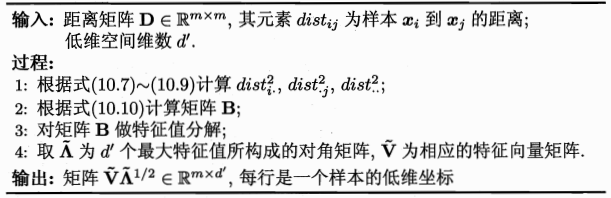

### MDS降维原理

***

【参考资料】

周志华	《机器学习》

MDS全称为多维缩放（Multiple Dimensional Scaling），是一种经典的线性降维技术。其基本思想是**使原始空间中样本点之间的距离在低维空间中得以保持**。

假设$m​$个$d​$维的样本在原始空间的距离矩阵为$\mathbf{D} \in \mathbb{R}^{m \times m}​$，其第$i​$行第$j​$列的元素$dist_{ij}​$为样本$x_{i}​$到样本$x_j​$的距离。经过降维后，样本在$d^\prime​$维空间的表示$\mathbf{Z} \in \mathbb{R}^{d^{\prime} \times m}​$，并且$d^{\prime} \leqslant d​$。根据MDS的思想，任意两个样本在$d^{\prime}​$维空间的欧式距离要等于原始空间中的距离，即$\left\|z_{i}-z_{j}\right\|=d i s t_{i j}​$。

令$\mathbf{B}=\mathbf{Z}^{\mathrm{T}} \mathbf{Z} \in \mathbb{R}^{m \times m}$，其中$\mathbf{B}$为降维后样本的内积矩阵，$b_{i j}=\boldsymbol{z}_{i}^{\mathrm{T}} \boldsymbol{z}_{j}$，有
$$
\begin{aligned} \operatorname{dist}_{i j}^{2} &=\left\|z_{i}\right\|^{2}+\left\|z_{j}\right\|^{2}-2 z_{i}^{\mathrm{T}} z_{j} \\ &=b_{i i}+b_{j j}-2 b_{i j} \end{aligned}
$$
为便于讨论，令降维后的样本$\mathbf{Z}$被中心化，即$\sum_{i=1}^{m} z_{i}=0$。显然，矩阵$\mathbf{B}$的行与列之和均为零，即$\sum_{i=1}^{m} b_{i j}=\sum_{j=1}^{m} b_{i j}=0$。易知
$$
\begin{array}{l}{\sum_{i=1}^{m} \operatorname{dist}_{i j}^{2}=\operatorname{tr}(\mathbf{B})+m b_{j j}} \\ {\sum_{j=1}^{m} \operatorname{dist}_{i j}^{2}=\operatorname{tr}(\mathbf{B})+m b_{i i}} \\ {\sum_{i=1}^{m} \sum_{j=1}^{m} \operatorname{dist}_{i j}^{2}=2 m \operatorname{tr}(\mathbf{B})}\end{array}
$$
其中$\operatorname{tr}(\mathbf{B})=\sum_{i=1}^{m}\left\|\boldsymbol{z}_{i}\right\|^{2}$。令
$$
\operatorname{dist}_{i .}^{2}=\frac{1}{m} \sum_{j=1}^{m} d i s t_{i j}^{2}\\
\operatorname{dist}_{\cdot j}^{2}=\frac{1}{m} \sum_{i=1}^{m} d i s t_{i j}^{2}\\
d i s t_{ . .}^{2}=\frac{1}{m^{2}} \sum_{i=1}^{m} \sum_{j=1}^{m} d i s t_{i j}^{2}
$$
可得
$$
b_{i j}=-\frac{1}{2}\left(d i s t_{i j}^{2}-d i s t_{i .}^{2}-d i s t_{ ; j}^{2}+d i s t_{ . . )}^{2}\right.
$$
由此，即可通过降维前后保持不变的距离矩阵$\mathbf{D}$求取内积矩阵$\mathbf{B}$。

对矩阵$\mathbf{B}$做特征值分解，$\mathbf{B}=\mathbf{V} \mathbf{\Lambda} \mathbf{V}^{\mathbf{T}}$，其中$\boldsymbol{\Lambda}=\operatorname{diag}\left(\lambda_{1}, \lambda_{2}, \dots, \lambda_{d}\right)$为特征值构成的对角矩阵，$\lambda_{1} \geqslant \lambda_{2} \geqslant \ldots \geqslant \lambda_{d}$，$\mathbf{V}$为特征向量矩阵。假定其中有$d^{*}$个非零特征值，它们构成对角矩阵$\boldsymbol{\Lambda _ {*}}=\operatorname{diag}\left(\lambda_{1}, \lambda_{2}, \dots, \lambda_{d^*}\right)$，令$\mathbf{V}_{*}$表示相应的特征向量矩阵，则$\mathbf{Z}$可表达为
$$
\mathbf{Z}=\mathbf{\Lambda}_{*}^{1 / 2} \mathbf{V}_{*}^{\mathrm{T}} \in \mathbb{R}^{d^{*} \times m}
$$
在现实应用中为了有效降维，往往仅需降维后的距离与原始空间中的距离尽可能接近，而不必严格相等。此时，可取$d^{\prime} \ll d$个最大特征值构成对角矩阵$\tilde{\boldsymbol{\Lambda}}=\operatorname{diag}\left(\lambda_{1}, \lambda_{2}, \ldots, \lambda_{d^{\prime}}\right)$，令$\mathbf{\tilde{V}}$表示相应的特征向量矩阵，则$\mathbf{Z}$可表达为
$$
\mathbf{Z}=\tilde{\boldsymbol{\Lambda}}^{1 / 2} \tilde{\mathbf{V}}^{\mathrm{T}} \in \mathbb{R}^{d^{\prime} \times m}
$$
MDS算法的完整描述如下：

MDS和PCA非常相似，都是要计算数据样本点在某个空间中的表示，差别仅在于PCA的输入是样本点在原空间的坐标，而MDS则需要输入各个点的距离度量，事实上已经有证明如果MDS输入的是样本点在原空间的欧式距离，则与PCA等价。