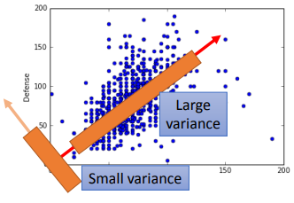
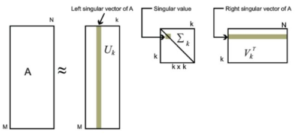

#### PCA原理解析

***

【**参考资料**】

[主成分分析（PCA）原理总结](https://www.cnblogs.com/pinard/p/6239403.html)

[奇异值分解(SVD)原理](https://zhuanlan.zhihu.com/p/32600280)

李宏毅《机器学习》课程[对应章节](http://speech.ee.ntu.edu.tw/~tlkagk/courses/ML_2017/Lecture/PCA%20(v3).pdf)  

Ian Goodfellow等	《Deeping Learning》

有两种定义PCA的方式，一种是使数据投影到低维空间后的方差尽可能大，另一种是使投影后数据点的信息损失最小。这两种方式会导出相同的定义。

约定有$m​$个数据点$\left(x^{(1)}, x^{(2)}, \ldots, x^{(m)}\right)​$，每个数据点的特征为$n​$维。现在将数据向低维空间投影，该低维空间的坐标系为$$\left\{w_{1}, w_{2}, \ldots, w_{d}\right\}​$$，其维度$d<n​$。$w_i​$（$i=1,\ldots,d​$）是一组标准正交基，满足：
$$
\|w_{i}\|_{2}=1, w_{i}^{T} w_{j}=0
$$
样本点$x^{(i)}$在低维空间的投影为$z^{(i)}=\left(z_{1}^{(i)}, z_{2}^{(i)}, \dots, z_{d}^{(i)}\right)^{T}$，其中$z_{j}^{(i)}=w_{j}^{T} x^{(i)}$是$x^{(i)}$在低维坐标系里第$j$维的坐标。

#### 1. 最大方差形式

最大方差理论要求投影后的数据点尽可能分开，即方差尽可能大。

对于任意一个样本$x^{(i)}$，在新的坐标系中的投影为$W^{T} x^{(i)}$，其中$W$是$n \times d$维的权重，$W_{i, :}=w_{(i)}^{T}$。所以新坐标系中投影的方差为$W^{T} (x^{(i)}-\overline{x}) (x^{(i)}-\overline{x})^{T} W$，$\overline{x}$为样本点的均值。要使所有样本点的投影方差和$\sum_{i=1}^{m}W^{T} (x^{(i)}-\overline{x}) (x^{(i)}-\overline{x})^{T} W$最大，也就是要使矩阵$W^{T}SW$的迹最大，其中$S= \sum_{i=1}^{m}\left({x}^{(i)}-\overline{x}\right)\left({x}^{(i)}-\overline{x}\right)^{T}$代表协方差矩阵。

于是，目标函数可以表示为
$$
\begin{eqnarray}
\underset {W}{\operatorname{argmax}} \ \operatorname{tr}(W^{T}SW) \quad \text{s.t.} \  W^TW=I
\end{eqnarray} \tag{1}
$$
标准正交基的约束$W^{T} W=I$是必须的，如果没有这个约束，$W$只要无穷大即可，这显然不符合我们的预期。

利用拉格朗日函数可以得到
$$
J(W)=\operatorname{tr}\left(W^{T} S W+\lambda\left(I-W^{T} W\right)\right)
$$
对$W$求导，整理可得
$$
S W=\lambda W \tag{2}
$$
这表明，我们要找的$W$是协方差矩阵$S$的特征向量。把式（2）代回式（1）的目标函数，可以得到目标函数为$\operatorname{tr} (\lambda I)$，要取得它的最大值，我们只需要取$S$的前$d$个最大的特征值即可，所以$W$就是$S$的前$d$个最大特征值对应的特征向量所组成的矩阵。

#### 2. 最小误差形式

最小距离形式的思想是用投影后的数据点来重构高维空间中的数据点，使得重构的数据点与原数据点之间的误差（或者距离）尽可能小，即信息损失尽可能的小。

利用投影后的数据来进行重构，得到$\tilde {x} = Wz$。根据误差最小原则，有
$$
W^{*}=\underset{W}{\arg \min }\|\tilde{x}-x\|_{2}^{2} \quad \text{s.t.} \ W^TW=I
$$
对所有样本进行求和，并利用$\tilde{x}^{(i)}=W z^{(i)}$可得
$$
\begin{aligned} \sum_{i=1}^{m}\left\|\tilde{x}^{(i)}-x^{(i)}\right\|_{2}^{2} &=\sum_{i=1}^{m}\left\|W z^{(i)}-x^{(i)}\right\|_{2}^{2} \\ &=\sum_{i=1}^{m}\left(W z^{(i)}\right)^{T}\left(W z^{(i)}\right)-2 \sum_{i=1}^{m}\left(W z^{(i)}\right)^{T} x^{(i)}+\sum_{i=1}^{m} x^{(i) T} x^{(i)} \end{aligned}
$$
（根据$W^{T} W=I$，有）
$$
=\sum_{i=1}^{m} z^{(i) T} z^{(i)}-2 \sum_{i=1}^{m} z^{(i) T} W^{T} x^{(i)}+\sum_{i=1}^{m} x^{(i) T} x^{(i)}
$$
（利用$z^{(i)}=W^{T} x^{(i)}$）
$$
\begin{aligned}&=\sum_{i=1}^{m} z^{(i) T} z^{(i)}-2 \sum_{i=1}^{m} z^{(i) T} z^{(i)}+\sum_{i=1}^{m} x^{(i) T} x^{(i)} \\ &=-\sum_{i=1}^{m} z^{(i) T} z^{(i)}+\sum_{i=1}^{m} x^{(i) T} x^{(i)}\end{aligned}
$$
（$z^{(i) T} z^{(i)}$是一个标量，加上迹运算值不改变）
$$
=-\sum_{i=1}^{m} \text{tr}(z^{(i) T} z^{(i)})+\sum_{i=1}^{m} x^{(i) T} x^{(i)}\\
=\text{tr}(-\sum_{i=1}^{m}z^{(i) T} z^{(i)})+\sum_{i=1}^{m} x^{(i) T} x^{(i)}
$$
（再次利用$z^{(i)}=W^{T} x^{(i)}$）
$$
\begin{aligned}
&=-\operatorname{tr}\left(\sum_{i=1}^{m} x^{(i) T}WW^T x^{(i)}\right) +\sum_{i=1}^{m} x^{(i) T} x^{(i)}\\
&=-\sum_{i=1}^{m}\operatorname{tr} \left( x^{(i) T}WW^T x^{(i)}\right)+\sum_{i=1}^{m} x^{(i) T} x^{(i)}
\end{aligned}
$$
（利用迹运算的轮换性质）
$$
\begin{aligned}
&=-\sum_{i=1}^{m} \operatorname{tr}\left( W^{T} x^{(i)}x^{(i) T} W\right)+\sum_{i=1}^{m} x^{(i) T} x^{(i)}\\
&= -\operatorname{tr}\left(W^{T}\left(\sum_{i=1}^{m} x^{(i)} x^{(i) T}\right) W\right)+\sum_{i=1}^{m} x^{(i) T} x^{(i)}\\
&= -\operatorname{tr}\left(W^{T} X X^{T} W\right)+\sum_{i=1}^{m} x^{(i) T} x^{(i)}
\end{aligned}
$$
由于$\sum_{i=1}^{m} x^{(i) T} x^{(i)}$是一个常量，与优化目标无关，所以我们的优化目标可以重写为
$$
\underset{W}{\operatorname{argmin}} \ -\operatorname{tr}\left(W^{T} XX^T W\right) \quad \text { s.t. } W^{T} W=I
$$
假设原始数据经过了中心化，即减去均值$\overline{x}$，中心化后的数据均值为零，那么$XX^T$就是中心化后数据的协方差矩阵$S$，优化目标可写为
$$
\underset{W}{\operatorname{argmin}}-\operatorname{tr}\left(W^{T} S W\right) \quad \text { s.t. } W^{T} W=I
$$
与最大方差形式得到的优化目标一致。

#### 3. 算法形式

PCA算法流程如下：

**输入**：$n$维样本集$D=\left(x^{(1)}, x^{(2)}, \ldots, x^{(m)}\right)$，要降到的维数$d$

**输出**：降维后的样本集$D^{\prime}$

**1**. 对所有的样本进行中心化：$x^{(i)}=x^{(i)}-\frac{1}{m} \sum_{j=1}^{m} x^{(j)}$

**2**. 计算样本的协方差矩阵$X X^{T}​$

**3**. 对矩阵$X X^{T}$进行特征值分解

**4**. 取出最大的$d$个特征值对应的特征向量$\left(w_{1}, w_{2}, \ldots, w_{d}\right)$，将所有的特征向量标准化后，组成特征向量矩阵$W$

**5**. 对样本集中的每一个样本$x^{(i)}$，转化为新的样本$z^{(i)}=W^{T} x^{(i)}$

**6**. 得到输出样本集$D^{\prime}=\left(z^{(1)}, z^{(2)}, \ldots, z^{(m)}\right)$

第1步中，先对数据进行中心化，是为了方便计算后面的协方差矩阵。

有时候，我们不指定降维后的$d$的值，而是指定一个降维到的主成分比重阈值$t$，这个阈值在0~1之间。假如$n$个特征值为$\lambda_{1} \geq \lambda_{2} \geq \dots \geq \lambda_{n}$，则$d$可以通过下式得到：
$$
\frac{\sum_{i=1}^{d} \lambda_{i}}{\sum_{i=1}^{n} \lambda_{i}} \geq t
$$

#### 4. PCA的SVD解法

回顾一下SVD分解的定义：
$$
A=U \Sigma V^{\top}
$$
其中$U$是$AA^{T}$的特征向量组成的矩阵，$V$是$A^{T} A$的特征向量组成的矩阵，$\Sigma$是奇异值矩阵，它的非零元素是矩阵$AA^{T}$或$A^TA$的非零特征值的平方根。

如果我们将$A$视为中心化后的原始数据，那么$AA^T$就可以看成协方差矩阵，$U$就对应投影矩阵$W$，$\Sigma V^{\top}$对应投影后的坐标矩阵$Z$。如果对奇异值分解的三个矩阵进行裁剪，那么同样可以完成降维。所以，PCA可以直接用SVD分解来求解。

