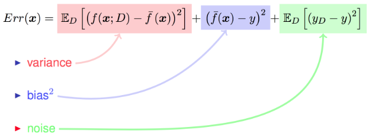
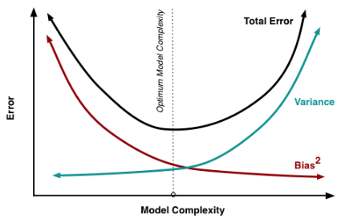

### 偏差-方差分解

***

【**参考资料**】

周志华	《机器学习》

学习算法的预测误差，或者说泛化误差(generalization error)可以分解为三个部分：偏差(bias)，方差(variance) 和噪声(noise)。在估计学习算法性能的过程中，我们主要关注偏差与方差。因为噪声属于不可约减的误差 (irreducible error)。

算法在不同数据集上学得的结果很可能不同，即便这些训练集是来自同一个分布。

|            符号            |                          涵义                           |
| :------------------------: | :-----------------------------------------------------: |
|        $\mathbf{x}$        |                        测试样本                         |
|            $D$             |                         数据集                          |
|          $y_{D}$           |              $\mathbf{x}$在数据集中的标记               |
|            $y$             |                 $\mathbf{x}$的真实标记                  |
|            $f$             |                   训练集$D$学得的模型                   |
|    $f(\mathbf{x} ; D)$     | 由训练集$D$学得的模型$f$对$f(\mathbf{x} ; D)$的预测输出 |
| $\overline{f}(\mathbf{x})$ |        模型$f$对$\mathbf{x}$的 **期望预测** 输出        |

由于噪声的存在，所以有可能$y_{D} \neq y$。

**以回归任务为例**，学习算法的期望预测为：
$$
\overline{f}(\mathbf{x})=E_{D}[f(\mathbf{x} ; D)]
$$
使用样本数相同的不同训练集产生的方差为：
$$
\operatorname{var}(\mathbf{x})=\mathrm{E}_{\mathrm{D}}\left[(\mathrm{f}(\mathbf{x} ; \mathbf{D})-\overline{\mathrm{f}}(\mathbf{x}))^{2}\right]
$$
噪声为：
$$
\varepsilon^{2}=E_{D}\left[\left(y_{D}-y\right)^{2}\right]
$$
期望预测与真实标记的误差称为偏差(bias)，即
$$
\operatorname{bias}^{2}(\mathbf{x})=(\overline{\mathbf{f}}(\mathbf{x})-\mathbf{y})^{2}
$$
为便于讨论，假定噪声期望为0，即$E_{D}\left[\left(y_{D}-y\right)\right]=0$。

对算法的期望泛化误差进行分解：
$$
\begin{aligned} 
E(f ; D) &=\mathbb{E}_{D}\left[\left(f(\boldsymbol{x} ; D)-y_{D}\right)^{2}\right] \\ &=\mathbb{E}_{D}\left[\left(f(\boldsymbol{x} ; D)-\overline{f}(\boldsymbol{x})+\overline{f}(\boldsymbol{x})-y_{D}\right)^{2}\right] \\
&= \mathbb{E}_{D}\left[(f(\boldsymbol{x} ; D)-\overline{f}(\boldsymbol{x}))^{2}\right]+\mathbb{E}_{D}\left[\left(\overline{f}(\boldsymbol{x})-y_{D}\right)^{2}\right] \\ 
&\quad +\mathbb{E}_{D}\left[2(f(\boldsymbol{x} ; D)-\overline{f}(\boldsymbol{x}))\left(\overline{f}(\boldsymbol{x})-y_{D}\right)\right] \\
&= \mathbb{E}_{D}\left[(f(\boldsymbol{x} ; D)-\overline{f}(\boldsymbol{x}))^{2}\right]+\mathbb{E}_{D}\left[\left(\overline{f}(\boldsymbol{x})-y_{D}\right)^{2}\right]\\
&= \mathbb{E}_{D}\left[(f(\boldsymbol{x} ; D)-\overline{f}(\boldsymbol{x}))^{2}\right]+\mathbb{E}_{D}\left[\left(\overline{f}(\boldsymbol{x})-y+y-y_{D}\right)^{2}\right] \\&= \mathbb{E}_{D}\left[(f(\boldsymbol{x} ; D)-\overline{f}(\boldsymbol{x}))^{2}\right]+\mathbb{E}_{D}\left[(\overline{f}(\boldsymbol{x})-y)^{2}\right]+\mathbb{E}_{D}\left[\left(y-y_{D}\right)^{2}\right] \\ &\quad +2 \mathbb{E}_{D}\left[(\overline{f}(\boldsymbol{x})-y)\left(y-y_{D}\right)\right] \\& =\mathbb{E}_{D}\left[(f(\boldsymbol{x} ; D)-\overline{f}(\boldsymbol{x}))^{2}\right]+(\overline{f}(\boldsymbol{x})-y)^{2}+\mathbb{E}_{D}\left[\left(y-y_{D}\right)^{2}\right]\\
&= \operatorname{bias}^{2}(\mathbf{x}) + \operatorname{var}(\mathbf{x}) + \varepsilon^{2}
\end{aligned}
$$
上式的第三行最后一项为0，倒数第三行的最后一项为0，前者利用了噪声和模型$f$相互独立的事实，有：
$$
\begin{aligned}
\mathbb{E}_{D}\left[2(f(\boldsymbol{x} ; D)-\overline{f}(\boldsymbol{x}))\left(\overline{f}(\boldsymbol{x})-y_{D}\right)\right] 
&= \mathbb{E}_{D}\left[2(f(\boldsymbol{x} ; D)-\overline{f}(\boldsymbol{x}))\right]\cdot \mathbb{E}_{D}\left[(\overline{f}(\boldsymbol{x})-y_{D})\right]\\
&= 2\mathbb{E}_{D}\left[(f(\boldsymbol{x} ; D)-E_{D}[f(\mathbf{x} ; D)])\right] \cdot \mathbb{E}_{D}\left[(\overline{f}(\boldsymbol{x})-y_{D})\right]\\
&= 2\left( \mathbb{E}_{D}[(f(\boldsymbol{x} ; D)]-E_{D}[f(\mathbf{x} ; D)]\right) \cdot \mathbb{E}_{D}\left[(\overline{f}(\boldsymbol{x})-y_{D})\right]\\&=0
\end{aligned}
$$
后者利用噪声期望为0的假设。

至此，继续来看一下偏差，方差与噪声的含义：

* 偏差：度量了模型的期望预测和真实结果的偏离程度，刻画了**模型本身的拟合能力**。

* 方差：度量了同样大小的训练集的变动所导致的学习性能的变化，即**刻画了数据扰动所造成的影响**。

* 噪声：表达了当前任务上任何模型所能达到的期望泛化误差的下界，**刻画了学习问题本身的难度**。

为了得到泛化性能好的模型，我们需要使偏差较小，即能充分拟合数据，并且使方差小，使数据扰动产生的影响小。但是偏差和方差在一定程度上是有冲突的，这称作为偏差-方差窘境。

下图给出了在模型训练不足时，拟合能力不够强，训练数据的扰动不足以使学习器产生显著变化，此时偏差主导泛化误差，此时称为欠拟合现象。当随着训练程度加深，模型的拟合能力增强，训练数据的扰动慢慢使得方差主导泛化误差。当训练充足时，模型的拟合能力非常强，数据轻微变化都能导致模型发生变化，如果过分学习训练数据的特点，则会发生过拟合。

虽然偏差和方差确实反映了各类学习任务内在的误差决定因素，但像上面那样优美的形式仅在于基于均方误差的回归任务中得以推导出。对分类任务，由于0/1损失函数的跳变性，理论上推导出偏差-方差分解很困难。