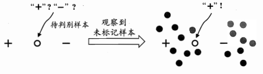
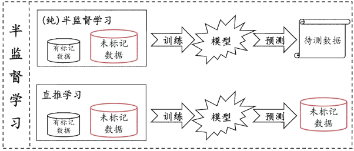

### 半监督学习介绍

***

【**参考资料**】

周志华	《机器学习》

李宏毅	机器学习课程 [半监督学习](<http://speech.ee.ntu.edu.tw/~tlkagk/courses/ML_2016/Lecture/semi%20(v3).pdf>)

[如何理解 inductive learning 与 transductive learning?](<https://www.zhihu.com/question/68275921>)

#### 1. 为什么需要半监督学习

因为收集大量的数据很容易，但是一一标注它们的代价很高昂。半监督学习研究在具有少量标记数据的情况下，如何利用大量的未标记数据来提升模型的泛化能力。

#### 2. 未标记数据的作用

未标记的样本不直接包含标签信息，但是**它们所包含的数据分布信息对模型建立具有极大地帮助**，因为未标记样本是从与有标记样本相同的数据源中**独立同分布采样**而来的。

比如在上图中，若仅基于图中的一个正例和一个反例，则由于待判别样本恰位于两者正中间，大体上只能随机猜测；若能观察到图中的未标记样本，则将很有把握判别为正例。

#### 3. 半监督学习的假设

为了利用无标记数据的分布，半监督学习通常会作出一些假设。半监督学习方法的效果很大程度上取决于假设的合理性。最常用的两个假设是Low-density Separation Assumption和Smoothness Assumption。

**Low-density Separation Assumption**的思想是"非黑即白"，即分类的决策边界要落在数据分布密度低的区域；**Smoothness Assumption**的思想是“近朱者赤，近墨者黑”，即未标记样本的类别是由与它相似的样本的类别决定的。

#### 4. 归纳式学习和直推式学习

半监督学习的数据包含一些标记数据$\left\{\left(x^{r}, \hat{y}^{r}\right)\right\}_{r=1}^{R}$以及无标记数据$\left\{x^{u}\right\}_{u=R}^{R+U}$，通常$U >> R​$。半监督学习的场景可进一步划分为归纳式学习（Inductive learning）和直推式学习（Transductive learning）。

**如果未标记数据不是最终的测试数据，那么是归纳式学习的场景**。我们平时说的learning一般指的也是归纳式学习。在归纳式半监督学习的情况下，我们有训练集$\mathcal{D}=\left\{\mathbf{X}_{t r}, \mathbf{y}_{t r}, \mathbf{X}_{u n}\right\}$和测试集$\mathbf{X}_{t e}$。此时$\mathbf{X}_{u n}$和$\mathbf{X}_{t e}$都是未标记的，但在测试时$\mathbf{X}_{t e}​$是在训练过程中没有见过的。因此，归纳式学习是由特殊到一般的学习，测试数据只是用来测试模型的泛化性能。

**如果未标记数据就是最终的测试数据，那么是直推式学习的场景**。在直推式半监督学习的情形下，$\mathbf{X}_{u n}=\mathbf{X}_{t e}$，即训练时就使用了测试数据$\mathbf{X}_{t e}$，注意这里只使用了未标记的$\mathbf{X}_{t e}$特征，没有使用其标签。直推式学习是由特殊到特殊的学习，目的只是为了解决在target domain（即$\mathbf{X}_{t e}$）上的问题。

上图中的纯半监督学习即归纳式学习。

