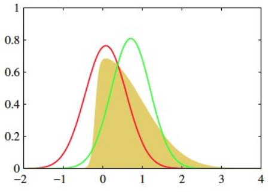
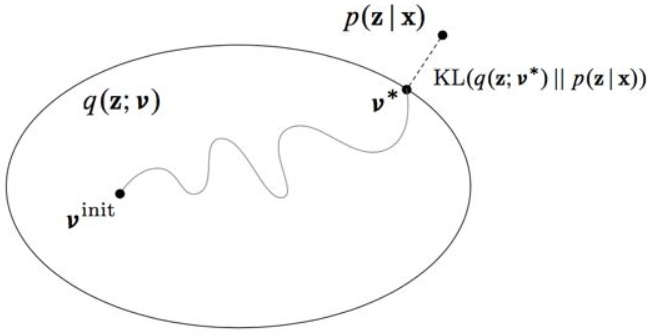

### 变分推断原理

***

【参考资料】

[如何简单易懂地理解变分推断(variational inference)？](https://www.zhihu.com/question/41765860)

[变分推断——深度学习第十九章](https://zhuanlan.zhihu.com/p/49401976)

Ian Goodfellow等	《深度学习》第十九章

李航	《统计学习方法（第二版）》第20章

#### 1. 问题引入

变分推断（variational inference）是贝叶斯学习中常用的、含有隐变量模型的学习和推理方法。

**为什么需要变分推断？**

概率模型进行训练的一大难点是**难以进行推断**。在贝叶斯统计中，所有的**对于未知量的推断(inference)问题可以看做是对后验概率(posterior)的计算**，比如对隐变量或者参数的推断，而后验概率通常难以计算。

具体来讲，对于一个含有隐变量的模型来说，根据贝叶斯公式，计算隐变量$z$的后验概率涉及到求解积分项：
$$
p(z|x)=\frac{p(z)p(x|z)}{p(x)}=\frac{p(z)p(x|z)}{\int_{z} p(z)p(x|z)dz }
$$
对于离散的隐变量来说，贝叶斯公式右端分母上的积分求解可以转换为对$z$的所有可能取值的求和。但是对于连续的隐变量来说，积分项$\int_{z} p(z) p(x | z) d z$的求解是无法避免的。在大多数情况下，积分$\int_{z} p(z) p(x | z) d z$都是很难求解的，如果积分项内分布的形式比较简单，那么我们还可以通过解析的形式把积分的结果写出来，但是如果分布的形式比较复杂，那么要想得到积分的解析解几乎是不可能的。在这种情况下，采样方法（如MCMC）是一种近似计算积分的可行方法，但是要想得到比较精确的计算结果，需要进行大量的采样。

还有一个必须要考虑的事项是计算的效率问题。对于每一个观测数据样本$x$来说，要计算对应的隐变量$z$的后验概率，需要涉及到对$z$的所有可能取值求和（隐变量取值离散的情况）或者通过大量的采样并求和来近似积分项的计算（隐变量取值连续的情况）。然后，我们需要再针对所有样本$x$进行求和来获得整个数据集的估计情况。所以这其中涉及到了一个两步的求和过程（先对$z$求和，再对$x$求和），一旦观测样本$x$的数据量较多，那么计算代价就很高，并且计算消耗随着数据量的增加指数增长。

引入变分推断就是为了解决上面两个问题，它为我们**提供了一种更快更简单的适用于大量数据的近似推断方法**。

------

**变分推断怎么解决推断问题？**

变分推断的基本思想是引入一个形式比较简单的分布$q(z)$来近似难以计算的后验$p(z|x)$，$q(z)$被称为**变分分布**。当$q(z)$和$p(z|x)$的差距很小时，$q(z)$就可以作为$p(z|x)$的一个近似结果，这样就避免了原来的计算过程中积分的求解。

举个例子：

在上图中，黄色的分布是我们的原始目标$p$，比较难求。它看上去有点像高斯，那我们尝试从高斯分布中找一个红$q$和一个绿$q$，分别计算一下$p$和他们重叠部分面积，选更像$p$的$q$作为$p$的近似分布。

分布$q$和$p$的近似程度是通过KL散度来衡量的，这里我们的关键点**从“求分布”的推断问题，变成了“缩小距离”的优化问题**。

我们的优化目标就是最小化KL散度$\text{KL}(q(z)\| p(z|x))$。具体来讲，我们需要构造一个简单分布$q(z;v)$，并且不断更新分布$q$的参数$v$，使得KL散度最小。这个过程涉及两步，一是概率分布$q$的形式的选择，二是分布$q$的参数的选择。一般来讲，我们在选择概率分布$q$的时候，通常会直观选择$p$可能的概率分布（比如高斯分布），这样能够更好的保证$p$和$q$的相似程度。之后，我们通过改变$v$，使得$q$去不断逼近$p$。

不过很不幸的是，我们的优化目标，即KL散度中，不可求的后验概率$p(z|x)$依然存在，所以变分推断中还需要进行进一步的处理，来摆脱后验概率$p(z|x)$。

#### 2. 证据下界

KL散度$\text{KL}(q(z)\| p(z|x))$可以进行改写：
$$
\begin{aligned}
\text{KL}(q(z)\| p(z|x))  &= \int_{z} q(z)\operatorname{log} \frac{q(z)}{p(z|x)} dz = E_q[\operatorname{log} \frac{q(z)}{p(z|x)}]\\
&= E_q[\operatorname{log}q(z)]-E_q[\operatorname{log}p(z|x)]\\
&= E_q[\operatorname{log}q(z)]-E_q[\operatorname{log}p(x,z)]+E_q[\operatorname{log}p(x)]\\
&=  E_q[\operatorname{log}q(z)]-E_q[\operatorname{log}p(x,z)]+\operatorname{log}p(x)\\
&= \operatorname{log}p(x) - \{E_q[\operatorname{log}p(z|x)]- E_q[\operatorname{log}q(z)]\}
\end{aligned}
$$
上式的最后一行可以改写为：
$$
\operatorname{log}p(x) = E_q[\operatorname{log}p(z|x)]- E_q[\operatorname{log}q(z)] + \text{KL}(q(z)\| p(z|x)) \tag{2.1}
$$
注意到KL散度大于等于零，所以我们有
$$
\operatorname{log}p(x) \geq E_q[\operatorname{log}p(z|x)]- E_q[\operatorname{log}q(z)] \tag{2.2}
$$
不等式（2.2）的右端是左端的下界，左端称为证据（evidence），右端称为证据下界（evidence lower bound，ELBO），记作
$$
\begin{aligned}
L(q) &= E_q[\operatorname{log}p(z|x)]- E_q[\operatorname{log}q(z)] \\
&= E_q[\operatorname{log}p(z|x)]- H(q(z))
\end{aligned} \tag{2.3}
$$
上式中$H(q(z))$代表$q(z)$的熵。

通过改写，KL散度$\text{KL}(q(z)\| p(z|x))$的最小化可以通过证据下界$L(q)$的最大化来实现，因为我们的目标是求解$q(z)$使KL散度最小化，这时$\operatorname{log}p(x)$是常量。因此，变分推断变成求解证据下界最大化的问题。

***

**变分分布$q(z)$的选取**

**变分推断的核心思想就是在一个关于$q$的有约束的分布族上最大化证据下界**。也就是说，我们会对$q$加以限制，使其变成一个容易计算的简单形式。

通常我们会使用**平均场**（mean field）假设，即假设$q(z)$对$z$的所有分量都是相互独立的，满足：
$$
q(z)=q(z_1)q(z_2)\ldots q(z_n)
$$
使用平均场可以大大简化我们的计算，最简单的例子就是想象一下多元高斯分布和多个一元高斯分布的求解，显然前者的计算要复杂得多，因为涉及到协方差矩阵的计算，而后者只需要针对每个分量单独求均值和方差即可。

不过**变分推断存在的问题**是，如果$p$本身不在我们选取的$q$的分布族中，那么$q$可能永远无法去近似$p$，计算结果就会出现偏差。这是变分推断的固有缺陷，计算结果是一个难以提前估计的近似。

#### 3. 变分EM

有时我们需要求解参数$\theta$来最大化对数似然$\operatorname{log}p(x|\theta)$，如果是含有隐变量的情况，我们可以使用EM算法。但是EM算法的E-Step涉及到求解后验概率$p(z|x)$，如果后验难以求解，那么我们可以引入变分推断来近似计算后验，这是的算法是普通EM算法的推广，称为**变分EM算法**。

在变分EM中，我们需要求解的目标函数即为证据下界$L(q,\theta)$，根据式（2.2），这时我们实际上是在最大化$\operatorname{log}p(x|\theta)$的下界。

**变分EM的步骤**如下：

1）**E-Step**：固定$\theta$，求$L(q,\theta)$对$q$的最大化；

2）**M-Step**：固定$q$，求$L(q,\theta)$对$\theta$的最大化。

E-Step中，我们实际上就是在求解近似后验$q$，相当于在构造下界去逼近$\operatorname{log}p(x|\theta)$；M-Step中，我们是在最大化构造好的下界。整个过程是一个**坐标上升**求解参数的过程。

标准的EM算法实际上也可以理解为一个坐标上升的过程，在标准EM中，我们构造的下界也正是变分推断中的证据下界，所以本质上，标准EM算法、变分EM算法和变分推断都是相通的。

标准EM和变分EM的区别在于，在标准EM的E-Step中，我们相当于是在精确求解后验概率$p(z|x)$；而在变分EM中，我们是在近似求解后验概率，由于我们对近似分布$q$进行了限制（比如平均场假设），所以找到的最优的$q$不一定会是真正的后验$p(z|x)$，而是它的一个近似。虽然这样做会使得结果不那么精确，但是却大大简化了计算，尤其是在一些分布较为复杂的情形中，要精确求解后验很困难，标准EM未必可用，而变分EM却依旧可以使用。