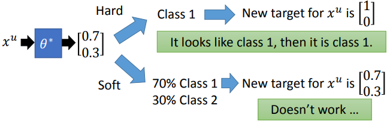
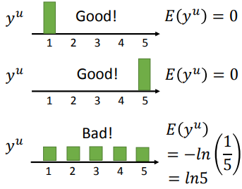
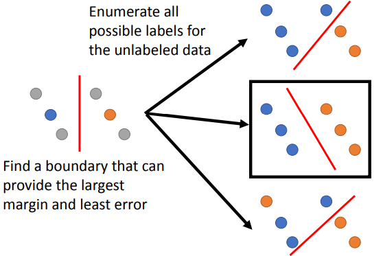
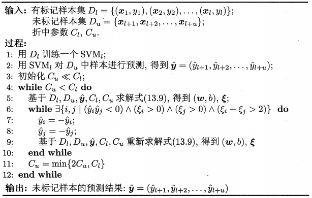

### 基于低密度分隔假设的半监督方法简介

***

【**参考资料**】

李宏毅  机器学习课程  [半监督学习](<http://speech.ee.ntu.edu.tw/~tlkagk/courses/ML_2016/Lecture/semi%20(v3).pdf>)

周志华	《机器学习》

#### 1. Self-training

给定带标签的数据集$\left\{\left(x^{r}, \hat{y}^{r}\right)\right\}_{r=1}^{R}$，以及无标签数据集$\left\{x^{u}\right\}_{u=l}^{R+U}$。重复以下过程：

1）利用带标签的数据集训练一个模型$f^{*}$；

2）将$f^{*}$应用到无标签数据集，将预测结果作为伪标签；

3）从无标签数据集中移除一部分数据，将这些数据和它们的伪标签加入带标签的数据集中。

怎么从无标签数据集中移除一部分样本是一个开放性问题，一般来讲，可以选择分类置信度最大的几个样本。

【**关于回归**】

Self-training方法无法应用到回归问题，因为将回归模型$f^*$应用到无标签数据时，得到的预测结果必定在回归曲线上，如果将这些预测结果作为伪标签与无标记数据一同加入带标签集合中，重新训练时模型的loss已经是0，即伪标签不会对$f^*$的训练产生影响。

【**软标签 v.s. 硬标签**】

Self-training和半监督生成方法有一定的相似性，区别在于，Self-training使用的是硬标签（hard label），而半监督生成式方法可以看成是在使用软标签（soft label）。考虑下图，假设$\theta^{*}$是模型从带标签数据中学习得到的参数：

现在对于某个未标记样本$x^u$，分类得到的结果为$[0.7,0,3]$。如果使用Self-training的方法，我们会直接给$x_u$分配硬标签，那么对于$x^u$来说，新的训练目标就是$[1,0]$，这即是“非黑即白”思想的体现；如果现在我们用软标签$[0.7,0,3]$来代替硬标签，即$x^u$有70%是类别1，有30%是类别2，那么对于$x^u$来说，训练的目标没有发生变化，loss仍然是0，因此不会起作用。**因此，结论是，Self-training方法只能使用硬标签。**

#### 2. Entropy-based Regularization

这类方法的思想是，无标签数据$x^u$的预测标签$y^u$的分布要越稀疏（或者说分散）越好，这种稀疏程度用熵来衡量，如

即有：
$$
E\left(y^{u}\right)=-\sum_{m=1}^{5} y_{m}^{u} \ln \left(y_{m}^{u}\right)
$$
要求$y^u$的熵$E\left(y^{u}\right)$越小越好，可以直接将其作为正则化项，那么整个目标函数为：
$$
L=\sum_{x^{r}} C\left(y^{r}, \hat{y}^{r}\right) + \lambda \sum_{x^{u}} E\left(y^{u}\right)
$$
即不仅要求模型在有标签数据上的分类loss越小越好，同时还要求无标签数据的预测结果的熵尽可能小。

#### 3. TSVM

TSVM是一种在半监督情形下的SVM，其基本思想是最小化带标签数据的误差，同时最大化无标签数据的分类间隔。原始的TSVM处理二分类问题，具体来讲，首先给所有的无标签数据指派标签，并穷举所有可能的情况，针对每一种情况都训练一个SVM，最终需要的SVM是使得分类误差最小同时分类间隔最大的。

形式化地说，给定$D_{l}=\left\{\left(\boldsymbol{x}_{1}, y_{1}\right),\left(\boldsymbol{x}_{2}, y_{2}\right), \ldots,\left(\boldsymbol{x}_{l}, y_{l}\right)\right\}$和$D_{u}=\{\boldsymbol{x}_{l+1}， \boldsymbol{x}_{l+2}, \dots, \boldsymbol{x}_{l+u} \}$，其中$y_{i} \in\{-1,+1\}$，$l \ll u$，$l+u=m$。TSVM的学习目标是为$D_{u}$中的样本给出预测标记$\hat{\boldsymbol{y}}=\left(\hat{y}_{l+1}, \hat{y}_{l+2}, \dots, \hat{y}_{l+u}\right)$，$\hat{y}_{i} \in\{-1,+1\}$，使得
$$
\min _{\boldsymbol{w}, b, \hat{\boldsymbol{y}}, \xi} \frac{1}{2}\|\boldsymbol{w}\|_{2}^{2}+C_{l} \sum_{i=1}^{l} \xi_{i}+C_{u} \sum_{i=l+1}^{m} \xi_{i}\\
\begin{aligned}
s.t. \quad y_{i}\left(\boldsymbol{w}^{\mathrm{T}} \boldsymbol{x}_{i}+b\right) &\geqslant 1-\xi_{i}, \quad i=1,2, \ldots, l\\
\hat{y}_{i}\left(\boldsymbol{w}^{\mathrm{T}} \boldsymbol{x}_{i}+b\right) &\geqslant 1-\xi_{i}, \quad i=l+1, l+2, \ldots, m\\
\xi_{i} &\geqslant 0, \quad i=1,2, \ldots, m
\end{aligned} \tag{3.1}
$$
尝试未标记样本的指派是一个穷举过程，仅当未标记样本很少时才有可能直接求解，因此，TSVM采用启发式的方法来迭代寻找式（3.1）的近似解。

具体过程是，首先利用有标记样本学得一个SVM，然后利用这个SVM对未标记的数据进行预测，将预测结果作为伪标签。

此时$\hat{y}$成为已知，将其代入式（3.1）得到一个标准SVM问题，求解可得新的划分超平面和松弛向量；注意到此时未标记样本的伪标签很可能不准确，因此$C_{u}$要设置为比$C_{l}$小的值，使有标记样本所起作用更大。

接下来，TSVM找出两个标记指派为异类且很可能发生错误的未标记样本，交换它们的标记，再重新求出新的划分超平面和松弛向量，然后再找出两个标记指派为异类且很可能发生错误的未标记样本……

标记指派完成后，逐渐增大$C_{u}$以提高未标记样本对优化目标的影响，进行下一轮标记指派调整，直至$C_{u}=C_{l}$为止。

TSVM的算法描述如下：

在算法的第6-10行，若存在一对未标记样本$\boldsymbol{x}_{i}$与$\boldsymbol{x}_{j}$，其标记指派$\hat{y}_{i}$与$\hat{y}_{j}$不同，且对应的松弛变量满足$\xi_{i}+\xi_{j}>2$，则意味着$\hat{y}_{i}$与$\hat{y}_{j}$很可能使错误的，需对二者进行交换。

【**类别不平衡问题**】

在对未标记样本进行标记指派和调整的过程中，有可能出现类别不平衡问题，即某类的样本远多于另一类。为了减轻类别不平衡造成的影响，可将优化目标中的$C_{u}$拆分成$C_{u}^{+}$与$C_{u}^{-}$两项，分别对应基于伪标记而当作正、反例使用的未标记样本，并在初始化时令
$$
C_{u}^{+}=\frac{u_{-}}{u_{+}} C_{u}^{-}
$$
其中$u_{+}$与$u_{-}$为基于伪标记而当作正、反例使用的未标记样本数。

