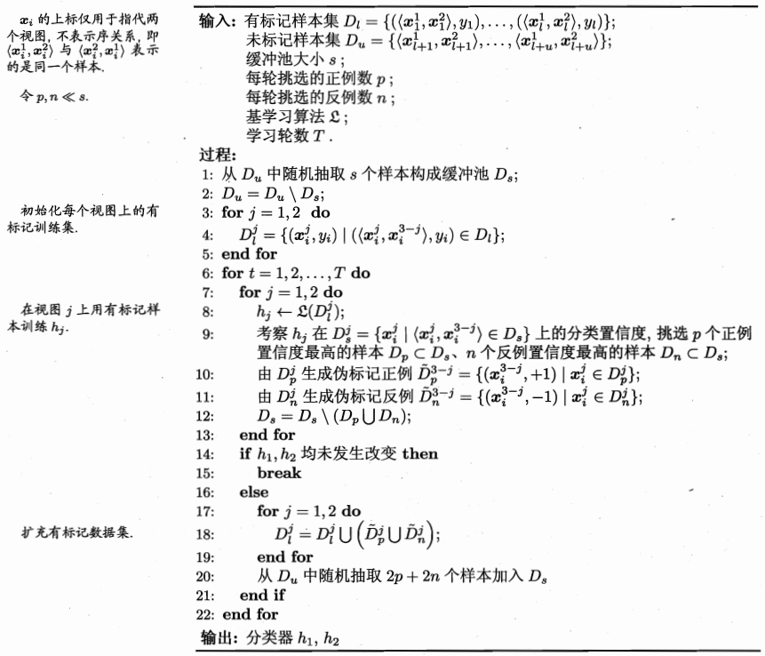

### 基于分歧的半监督方法简介

***

【**参考资料**】

周志华	《机器学习》

#### 0. 分歧与多视图学习

半监督学习中，基于分歧的方法（disagreement-based methods）使用多学习器，而学习器之间的“分歧”对未标记数据的利用至关重要。

这类方法起源于多视图学习（multi-view learning），在多视图学习的场景中，一个数据对象拥有多个属性集或模态，每个属性集对应于一个视图。比如对于一个电影片段来说，可能的数据视图就有画面和声音。

假设不同的视图之间具有相容性，即其所包含的关于输出空间$\mathcal{Y}$的信息是一致的，在此基础上，不同视图的信息可以形成互补（即从多个角度看待同一个问题）。多视图学习就是研究如何利用数据不同视图的相容互补性，来更好地进行学习。

如果在数据的不同视图上分别单独训练学习器，那么这些学习器之间就会有存在较大的分歧，基于分歧的方法正是通过这种“分歧”来充分利用不同视图之间的信息互补性。

#### 1. Co-training

Co-training最早就是起源于多视图学习，现在是半监督学习方法中的重要代表。假设数据拥有两个充分且条件独立的视图，“充分”是指每个视图都包含足以产生最优学习器的信息，“条件独立”则是指在给定类别标记下两个视图独立。

在此情形下，Co-training的过程是：首先在每个视图上基于有标记样本分别训练出一个分类器，然后让每个分类器分别去挑选自己“最有把握的”（即分类置信度最高的）未标记样本赋予伪标记，并将伪标记样本提供给另一个分类器作为新增的有标记样本用于训练更新……

这个“互相学习、共同进步”的过程不断迭代进行，直到两个分类器都不再发生变化，或达到预先设定的迭代轮数为止。

需要注意的是，如果在每轮学习中都考察分类器在所有未标记样本上的分类置信度，会有很大的计算开销，因此在Co-training算法中使用了未标记样本缓冲池。

标准的Co-training算法（简化版）如下：

详细的算法描述如下：

Co-training算法一开始是为多视图的数据准备的，它利用数据的不同视图或模态来产生分歧。事实上，还有其他产生分歧的方式，比如采用不同的基学习算法、不同的数据采样、同一模型的不同参数设置等等，这些都可以理解是广义上的多视图。不过Co-training这类基于分歧的方法要想产生较好地效果，需要巧妙的构建数据多视图，尤其是在有标记样本很少的情况下。