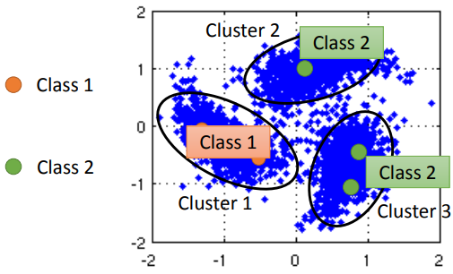
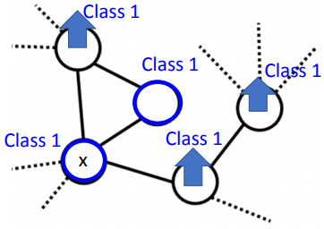
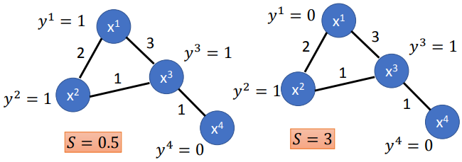

### 基于平滑性假设的半监督学习方法简介

***

【**参考资料**】

李宏毅  机器学习  [半监督学习](<http://speech.ee.ntu.edu.tw/~tlkagk/courses/ML_2016/Lecture/semi%20(v3).pdf>)

周志华	《机器学习》

#### 1. Cluster and label

先对数据进行聚类，然后根据每个cluster中的带标签样本来对整个cluster进行标记。

#### 2. 图半监督方法

图方法是针对数据点去构造图，其主要思想是标签传播（label propagation），带标签的数据点会决定其近邻点的标签，并且这种影响会随着图的路径进行传播。

基于所有数据点去构造一个图，边的权重可以设定为高斯径向基函数的形式：
$$
W_{i, j}=\exp \left(-\gamma\left\|x^{i}-x^{j}\right\|^{2}\right)
$$
然后，我们定义一个叫做“平滑性”（smoothness）的指标来衡量图上标签的相似性：
$$
S=\frac{1}{2} \sum_{i, j} w_{i, j}\left(y^{i}-y^{j}\right)^{2} \tag{2.1}
$$
其中，求和针对带标记和无标记的所有数据。

这个指标越小，表明标签越平滑。

上图的例子中，显然左边的标记方式是更合理的，平滑性指标也显示左边要更好。

式（2.1）可以转换为拉普拉斯矩阵的形式：
$$
S=\frac{1}{2} \sum_{i, j} w_{i, j}\left(y^{i}-y^{j}\right)^{2}=\boldsymbol{y}^{T} L \boldsymbol{y}
$$
其中$L=D-W$是拉普拉斯矩阵，$y=\left[\cdots y^{i} \cdots y^{j} \cdots\right]^{T}$是一个$(R+U)$维的向量，$R$为带标记样本的数目，$U$为无标记样本的数目。显然$S$与模型的参数有关，因为$y^i$取决于模型的参数。

最终$S$作为一个正则化项，加入到带标签样本的监督分类loss中
$$
L=\sum_{x^{r}} C\left(y^{r}, \hat{y}^{r}\right) + \lambda S
$$

