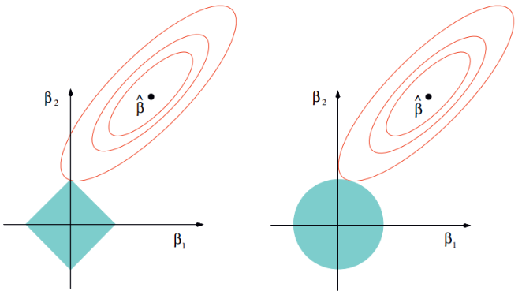

### 岭回归与LASSO方法原理

***

【**参考资料**】

[机器学习十大经典算法之岭回归和LASSO回归（学习笔记整理）](https://blog.csdn.net/weixin_43374551/article/details/83688913)

[机器学习方法：回归（二）：稀疏与正则约束ridge regression，Lasso](https://blog.csdn.net/xbinworld/article/details/44276389)

[【机器学习】正则化的线性回归 —— 岭回归与Lasso回归](https://www.cnblogs.com/Belter/p/8536939.html)

#### 1. 问题引入

线性回归模型的参数估计公式是：
$$
\boldsymbol{w}=\left(X^{T} X\right)^{-1} X^{T} y
$$
如果特征矩阵$X$的列向量（即特征）之间存在较大的相关性，那么$\left|X^{T} X\right|$会趋近于0，使得$\left(X^{T} X\right)^{-1}$对角线上的值很大，从而使得回归系数$w$趋于无穷大，此时我们得到的$w​$是没有意义的。这种特征之间的相关性又被称为多重共线性。另外，如果自变量个数多于样本数量，那么线性回归的结果也是很差的。

为了解决自变量之间存在多重共线性或者自变量个数多于样本量的情况，就要使用所谓的shrinkage method，例如岭回归（ridge regression）或者LASSO。这些方法的实质是给原模型的参数加上正则化，限制参数的变化范围，从而减少模型的方差。

#### 2. 岭回归

线性回归模型的目标函数是
$$
J(w)=\sum(y-X w)^{2}
$$
在此基础上，岭回归加入了对参数的$L2$正则
$$
\begin{aligned} J(w) &=\sum(y-X w)^{2}+\lambda\|w\|_{2}^{2} \\ &=\sum(y-X w)^{2}+\sum \lambda w^{2} \end{aligned}
\tag{2.1}
$$
其中$\lambda>0​$。

此时模型的解发生了改变，有
$$
\begin{array}{c}{J(w)=(y-X w)^{T}(y-Xw)+\lambda w^{T} w} \\ {=y^{T} y-y^{T} X w-w^{T} X^{T} y+w^{T} X^{T} X w+\lambda w^{T} w}\end{array}
$$
令$\frac{\partial J(\beta)}{\partial \beta}=0$，有
$$
\begin{array}{c}{0-X^{T} y-X^{T} y+2 X^{T} X \beta+2 \lambda \beta=0} \\ {\Rightarrow \beta=\left(X^{T} X+\lambda I\right)^{-1} X^{T} y}\end{array}
$$
$L2$范数惩罚项的加入使得$\left(X^{T} X+\lambda I\right)$满秩，保证了可逆，但是也由于惩罚项的加入，使得回归系数$w​$的估计不再是无偏估计。所以岭回归是以放弃无偏性、降低精度为代价解决病态矩阵问题的回归方法。

单位矩阵$I$的对角线上全是1，像一条山岭一样，这也是岭回归名称的由来。

当然，除了用正规方程外，目标函数（2.1）也可以用梯度下降来求解
$$
\nabla_{w} J(w)=\frac{1}{m} X^{T} \cdot(X w-y)+\lambda w
$$

$$
w:=w-\left(\frac{\alpha}{m} X^{T} \cdot(X w-y)+\lambda w\right)
$$

其中$\alpha$为学习率。

目标函数（2.1）等价于以下的优化问题
$$
\min _{w} \frac{1}{2}\|y-X w\|^{2}, \quad s . t .\|w\|_{2}<\theta
$$
这里的条件是$w​$的模长不能超过限制$\theta​$，这里的$\theta​$和式（2.1）中的$\lambda​$是一一对应的。

#### 3. LASSO

LASSO的全称是least absolute shrinkage and selection operator，与岭回归不同的是，LASSO引入的是$L1$正则。

目标函数为
$$
\begin{aligned} J(w) &=\sum(y-X w)^{2}+\lambda\|w\|_{1} \\ &=\sum(y-X w)^{2}+\sum \lambda|w| \\ &=MSE(w)+\lambda l_{1}(w) \end{aligned} \tag{3.1}
$$
由于绝对值函数在零点不可导，所以这里需要用到sub-gradient。式（3.1）的梯度是
$$
\nabla_{w} M S E(w)+\lambda \left( \begin{array}{c}{\operatorname{sign}\left(w_{1}\right)} \\ {\operatorname{sign}\left(w_{2}\right)} \\ {\vdots} \\ {\operatorname{sign}\left(w_{n}\right)}\end{array}\right)
$$
其中$\operatorname{sign}\left(w_{i}\right)$由$w_i$的符号决定：$w_{i}>0$，$ \operatorname{sign}\left(w_{i}\right)=1 $； $w_{i}=0$， $\operatorname{sign}\left(w_{i}\right)=0$ ； $w_{i}<0$， $\operatorname{sign}\left(w_{i}\right)=-1$。

同样地，目标函数（3.1）可以等价转化为如下的优化问题
$$
\min _{w} \frac{1}{2}\|y-X w\|^{2}, \quad s . t .\|w\|_{1}<\theta
$$
【**LASSO的稀疏性**】

LASSO有一个很重要的性质，通过施加$L1$正则，LASSO得到的参数中有很多都是0，也就是说，**LASSO得到的参数的解是稀疏的**。这个性质也是LASSO和岭回归区别最大的地方。

LASSO和岭回归的效果如下图所示：

图中红色的椭圆是MSE loss的等高线，而青色区域就是参数的限制范围，红色椭圆和青色区域的切点就是目标函数的最优解。我们可以看到，如果限制范围是圆，即岭回归对应的情况，则很容易切到圆周的任意一点，但是很难切到坐标轴上，因此没有稀疏解；但是如果是菱形或者多边形，即LASSO对应的情况，则很容易切到坐标轴上，因此很容易产生稀疏的结果。

除了回归以外，LASSO的稀疏性天然可以做机器学习中的另外一件事——特征选择（feature selection），把非零的系数对应的维度选出即可，达到对问题的精简、去噪，以及减轻过拟合。

