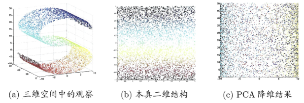

### 核PCA原理解析

***

【**参考资料**】

[核主成分分析（Kernel-PCA）](https://blog.csdn.net/zhangping1987/article/details/30492433)

[Kernel PCA](https://www.zybuluo.com/hainingwyx/note/748071)

[Kernel Principal Component Analysis](https://shengtao96.github.io/2017/06/09/Kernel-Principal-Component-Analysis/)

周志华	《机器学习》

#### 1. PCA的缺陷

有些高维空间不适合PCA的线性降维方法，这时候就需要一些非线性降维的手段。

#### 2. KPCA原理推导

Kernel PCA的基本思想是将原数据点非线性映射到高维空间，然后在高维空间中进行降维操作。

已知数据集为$\mathbf{x}_{1}, \mathbf{x}_{2}, \cdots, \mathbf{x}_{M}$，其中$\mathbf{x}_{i} \in R^{N}$，$i=1,2, \cdots, M$。存在一个非线性映射$\Phi : R^{N} \mapsto R^{F}$，映射后的数据集为$\Phi\left(\mathbf{x}_{1}\right), \Phi\left(\mathbf{x}_{2}\right), \cdots, \Phi\left(\mathbf{x}_{n}\right)$。PCA是在$R^{N}$中讨论的，那么KPCA就是在映射后的空间$R^{F}$中讨论的。一般情况下，映射$\Phi$是无法显式求解的，所以需要引入核函数$K : R^{N} \times R^{N} \mapsto R$，使得：
$$
K\left(\mathbf{x}_{i}, \mathbf{x}_{j}\right)=\Phi\left(\mathbf{x}_{i}\right)^{T} \Phi\left(\mathbf{x}_{j}\right)
$$

***

传统PCA中，我们要求解协方差矩阵及其特征值和特征向量，在KPCA中，我们需要求解的则是映射后的数据的协方差矩阵及其特征向量：
$$
C=\frac{1}{M} \sum_{i=1}^{M}\left(\Phi\left(\mathbf{x}_{i}\right)-\frac{1}{M} \sum_{j=1}^{M} \Phi\left(\mathbf{x}_{j}\right)\right)\left(\Phi\left(\mathbf{x}_{i}\right)-\frac{1}{M} \sum_{j=1}^{M} \Phi\left(\mathbf{x}_{j}\right)\right)^{T}
$$
为了讨论方便，令
$$
\Psi\left(\mathbf{x}_{i}\right)=\Phi\left(\mathbf{x}_{i}\right)-\frac{1}{M} \sum_{j=1}^{M} \Phi\left(\mathbf{x}_{j}\right)
$$
所以$C$可以表示为
$$
C=\frac{1}{M} \sum_{i=1}^{M} \Psi\left(\mathbf{x}_{i}\right) \Psi\left(\mathbf{x}_{i}\right)^{T}
$$
由于通常映射$\Phi$是无法显式求解的，所以我们要从另一个角度来讨论$C$的特征向量的求解。设$\mathbf{v}$是$C$的特征向量，$\lambda$是对应$\mathbf{v}$的特征值，即
$$
C \mathbf{v}=\lambda \mathbf{v}
$$

$$
\frac{1}{M} \sum_{i=1}^{M} \Psi\left(\mathbf{x}_{i}\right) \Psi\left(\mathbf{x}_{i}\right)^{T} \mathbf{v}=\lambda \mathbf{v}
$$

显然
$$
\mathbf{v}=\frac{1}{M \lambda} \sum_{i=1}^{M}\left(\Psi\left(\mathbf{x}_{i}\right)^{T} \mathbf{v}\right) \Psi\left(\mathbf{x}_{i}\right)
$$
令$a_{i}=\frac{1}{M \lambda}\left(\Psi\left(\mathbf{x}_{i}\right)^{T} \mathbf{v}\right)$，$i=1,2, \cdots, M$，使得
$$
\mathbf{v}=\sum_{i=1}^{M} a_{i} \Psi\left(\mathbf{x}_{i}\right)
$$
于是我们便可以知道$C$的特征向量的性质，即$\mathbf{v}$是由$\Psi\left(\mathbf{x}_{1}\right), \Psi\left(\mathbf{x}_{2}\right), \cdots, \Psi\left(\mathbf{x}_{M}\right)$张成的。

因为
$$
C \mathbf{v}=\lambda \mathbf{v}
$$
所以
$$
\Psi\left(\mathbf{x}_{k}\right)^{T}(C \mathbf{v})=\lambda \Psi\left(\mathbf{x}_{k}\right)^{T} \mathbf{v}, k=1,2, \cdots, M
$$
把$\mathbf{v}=\sum_{i=1}^{M} a_{i} \Psi\left(\mathbf{x}_{i}\right)$，带入上式得：

右式：
$$
\lambda \Psi\left(\mathbf{x}_{k}\right)^{T} \mathbf{v}=\lambda \sum_{i=1}^{M} a_{i} \Psi\left(\mathbf{x}_{k}\right)^{T} \Psi\left(\mathbf{x}_{i}\right)=\lambda\left[\Psi\left(\mathbf{x}_{k}\right)^{T} \Psi\left(\mathbf{x}_{1}\right) \quad \Psi\left(\mathbf{x}_{k}\right)^{T} \Psi\left(\mathbf{x}_{1}\right) \cdots \quad \Psi\left(\mathbf{x}_{k}\right)^{T} \Psi\left(\mathbf{x}_{M}\right)\right] \left[ \begin{array}{c}{a_{1}} \\ {a_{2}} \\ {\vdots} \\ {a_{M}}\end{array}\right]
$$
左式：
$$
\begin{aligned}
&\quad \Psi\left(\mathbf{x}_{k}\right)^{T}(C \mathbf{v})=\frac{1}{M} \sum_{i=1}^{M}\left(\Psi\left(\mathbf{x}_{k}\right)^{T}\left(\sum_{j=1}^{M} \Psi\left(\mathbf{x}_{j}\right) \Psi\left(\mathbf{x}_{j}\right)^{T}\right) \Psi\left(\mathbf{x}_{i}\right)\right)\\
&=\frac{1}{M}\left[\Psi\left(\mathbf{x}_{k}\right)^{T}\left(\sum_{j=1}^{M} \Psi\left(\mathbf{x}_{j}\right) \Psi\left(\mathbf{x}_{j}\right)^{T}\right) \Psi\left(\mathbf{x}_{1}\right) \cdots \quad \Psi\left(\mathbf{x}_{k}\right)^{T}\left(\sum_{j=1}^{M} \Psi\left(\mathbf{x}_{j}\right) \Psi\left(\mathbf{x}_{j}\right)^{T}\right) \Psi\left(\mathbf{x}_{M}\right)\right] \left[ \begin{array}{c}{a_{1}} \\ {a_{2}} \\ {\vdots} \\ {a_{M}}\end{array}\right]
\end{aligned}
$$
其中$k=1,2,3, \cdots, M$。

我们用矩阵表示上式等式，即：
$$
\lambda \overline{\mathrm{K}} \mathrm{a}=\frac{1}{M} \overline{\mathrm{K}}^{2} \mathrm{a}
$$
其中：
$$
\overline{\mathbf{K}}=\left[ \begin{array}{cccc}{\Psi\left(\mathbf{x}_{1}\right)^{T} \Psi\left(\mathbf{x}_{1}\right)} & {\Psi\left(\mathbf{x}_{1}\right)^{T} \Psi\left(\mathbf{x}_{2}\right)} & {\cdots} & {\Psi\left(\mathbf{x}_{1}\right)^{T} \Psi\left(\mathbf{x}_{M}\right)} \\ {\Psi\left(\mathbf{x}_{2}\right)^{T} \Psi\left(\mathbf{x}_{1}\right)} & {\Psi\left(\mathbf{x}_{2}\right)^{T} \Psi\left(\mathbf{x}_{2}\right)} & {\cdots} & {\Psi\left(\mathbf{x}_{2}\right)^{T} \Psi\left(\mathbf{x}_{M}\right)} \\ {\vdots} & {\vdots} & {\vdots} & {\vdots} \\ {\Psi\left(\mathbf{x}_{M}\right)^{T} \Psi\left(\mathbf{x}_{1}\right)} & {\Psi\left(\mathbf{x}_{M}\right)^{T} \Psi\left(\mathbf{x}_{2}\right)} & {\cdots} & {\Psi\left(\mathbf{x}_{M}\right)^{T} \Psi\left(\mathbf{x}_{M}\right)}\end{array}\right]
$$

$$
\overline{\mathbf{K}}_{i j}=\Psi\left(\mathbf{x}_{i}\right)^{T} \Psi\left(\mathbf{x}_{j}\right)
$$

$$
\mathbf{a}=\left[ \begin{array}{c}{a_{1}} \\ {a_{2}} \\ {\vdots} \\ {a_{M}}\end{array}\right]
$$

那么
$$
\lambda M \mathbf{a} = \overline{\lambda}\mathbf{a}=\overline{\mathbf{K}} \mathbf{a}
$$
即$\mathbf{a}​$是$\overline{\mathbf{K}}​$的特征向量。

***

关于$\overline{\mathbf{K}}​$的求法：

设$\boldsymbol{I} \in R^{M \times M}$，$\mathbf{I}_{i j}=1$，$i=1,2,3, \cdots, M$，$j=1,2,3, \cdots, M$，即$\mathbf{I}$为全1矩阵，那么
$$
\begin{aligned} &\quad\overline{\mathbf{K}}_{i j}=\Psi\left(\mathbf{x}_{i}\right)^{T} \Psi\left(\mathbf{x}_{j}\right)=\left(\Phi\left(\mathbf{x}_{i}\right)-\frac{1}{M} \sum_{m=1}^{M} \Phi\left(\mathbf{x}_{m}\right)\right)^{T}\left(\Phi\left(\mathbf{x}_{j}\right)-\frac{1}{M} \sum_{n=1}^{M} \Phi\left(\mathbf{x}_{n}\right)\right) \\ &=\Phi\left(\mathbf{x}_{i}\right)^{T} \Phi\left(\mathbf{x}_{j}\right)-\frac{1}{M} \sum_{m=1}^{M} \Phi\left(\mathbf{x}_{m}\right)^{T} \Phi\left(\mathbf{x}_{j}\right)-\frac{1}{M} \sum_{n=1}^{M} \Phi\left(\mathbf{x}_{i}\right)^{T} \Phi\left(\mathbf{x}_{n}\right)+\frac{1}{M^{2}} \sum_{m, n=1}^{M} \Phi\left(\mathbf{x}_{m}\right)^{T} \Phi\left(\mathbf{x}_{n}\right) \\ &=\mathbf{K}_{i j}-\frac{1}{M} \sum_{m=1}^{M} \mathbf{I}_{i m} \mathbf{K}_{m j}-\frac{1}{M} \sum_{n=1}^{M} \mathbf{K}_{i n} \mathbf{I}_{n j}+\frac{1}{M^{2}} \sum_{m, n=1}^{M} \mathbf{I}_{i m} \mathbf{K}_{m n} \mathbf{I}_{n j}\end{aligned}
$$
其中：$\mathbf{K}_{i j}=\Phi\left(\mathbf{x}_{i}\right)^{T} \Phi\left(\mathbf{x}_{j}\right)$，$\mathbf{K}$为核矩阵，即$\mathbf{K}_{i j}=K\left(\mathbf{x}_{i}, \mathbf{x}_{j}\right)=\Phi\left(\mathbf{x}_{i}\right)^{T} \Phi\left(\mathbf{x}_{j}\right)$。

利用矩阵乘法，可以转化为
$$
\overline{\mathbf{K}}=\mathbf{K}-\mathbf{I}_{M} \mathbf{K}-\mathbf{K} \mathbf{I}_{M}-\mathbf{I}_{M} \mathbf{K} \mathbf{I}_{M} \tag{1}
$$
其中$\mathbf{I}_{M}=\frac{1}{M} \mathbf{I}​$。

至此，$\overline{\mathbf{K}}​$已经求出，那么特征向量$\mathbf{a}​$也可以求出了。

***

求解新数据$\mathbf{t}_{j}$，$j=1,2,3, \cdots, L$的核主成分，即求：
$$
\left(\Psi\left(\mathbf{t}_{j}\right), \mathbf{v}\right)=\sum_{i=1}^{M} a_{i}\left(\Psi\left(\mathbf{x}_{i}\right), \Psi\left(\mathbf{t}_{j}\right)\right)=\sum_{i=1}^{M} a_{i} \Psi\left(\mathbf{x}_{i}\right)^{T} \Psi\left(\mathbf{t}_{j}\right)
$$
同$\overline{\mathbf{K}}$的求法
$$
\begin{aligned}
&\quad \overline{\mathbf{K}}_{i j}^{\text {test}}=\Psi\left(\mathbf{x}_{i}\right)^{T} \Psi\left(\mathbf{t}_{j}\right)=\left(\Phi\left(\mathbf{x}_{i}\right)-\frac{1}{M} \sum_{m=1}^{M} \Phi\left(\mathbf{x}_{m}\right)\right)^{T}\left(\Phi\left(\mathbf{t}_{j}\right)-\frac{1}{M} \sum_{n=1}^{M} \Phi\left(\mathbf{x}_{n}\right)\right)\\
&=\Phi\left(\mathbf{x}_{i}\right)^{T} \Phi\left(\mathbf{t}_{j}\right)-\frac{1}{M} \sum_{m=1}^{M} \Phi\left(\mathbf{x}_{m}\right)^{T} \Phi\left(\mathbf{t}_{j}\right)-\frac{1}{M} \sum_{n=1}^{M} \Phi\left(\mathbf{x}_{i}\right)^{T} \Phi\left(\mathbf{x}_{n}\right)+\frac{1}{M^{2}} \sum_{m, n=1}^{M} \Phi\left(\mathbf{x}_{m}\right)^{T} \Phi\left(\mathbf{x}_{n}\right)\\
&=\mathbf{K}_{i j}^{t e s t}-\frac{1}{M} \sum_{m=1}^{M} \mathbf{I}_{i m} \mathbf{K}_{m j}^{t e s t}-\frac{1}{M} \sum_{n=1}^{M} \mathbf{K}_{i n} \overline{\mathbf{I}}_{n j}+\frac{1}{M^{2}} \sum_{m, n=1}^{M} \mathbf{I}_{i m} \mathbf{K}_{m n} \mathbf{I}_{n j}
\end{aligned}
$$
其中$\mathbf{K}_{i j}^{\text {test}}=\Phi\left(\mathbf{x}_{i}\right)^{T} \Phi\left(\mathbf{t}_{j}\right)$。

转化为矩阵乘法，即
$$
\overline{\mathbf{K}}^{t e s t}=\mathbf{K}^{t e s t}-\frac{1}{M} \mathbf{I}_{M} \mathbf{K}^{t e s t}-\frac{1}{M} \mathbf{K} \mathbf{I}_{M \times L}+\frac{1}{M^{2}}\left(\sum_{m, n=1}^{M} \Phi\left(\mathbf{x}_{m}\right)^{T} \Phi\left(\mathbf{x}_{n}\right)\right) \mathbf{I}_{M \times L}
$$
其中：$\mathbf{I}_{M} \in R^{M \times M}$和$\mathbf{I}_{M \times L} \in R^{M \times L}$每一元素都为1。

***

这里还有一个小问题，由于$\mathbf{v}​$受到单位向量的约束，所以$\mathbf{a}​$也要受到约束，即
$$
\begin{aligned} &(\mathbf{v}, \mathbf{v})=\left(\sum_{i=1}^{M} a_{i} \Psi\left(\mathbf{x}_{i}\right)\right)^{T}\left(\sum_{j=1}^{M} a_{j} \Psi\left(\mathbf{x}_{j}\right)\right) \\=& \sum_{i=1}^{M} \sum_{j=1}^{M} a_{i} a_{j}\left(\Psi\left(\mathbf{x}_{i}\right), \Psi\left(\mathbf{x}_{j}\right)\right) \\=& \sum_{i=1}^{M} \sum_{j=1}^{M} a_{i} a_{j} \overline{\mathbf{K}}_{i j} \\=& \overline{\lambda} \mathbf{a}^{T} \mathbf{a} \\=& 1 \end{aligned}
$$
其中$\overline{\lambda}​$为特征向量$\mathbf{a}​$对应的$\overline{\mathrm{K}}​$的特征值。

这里令$\mathbf{a}^{T} \mathbf{a}$也单位化为1，那么$\mathbf{a}^{T} \mathbf{a}$除以$\sqrt{\overline{\lambda}}$j即能保证$\|\mathbf{v}\|^{2}=1$。

#### 3. KPCA算法步骤

1）选择一个核函数

2）计算核矩阵$\mathbf{K}​$

3）按照$\overline{\mathbf{K}}=\mathbf{K}-\mathbf{I}_{M} \mathbf{K}-\mathbf{K I}_{M}-\mathbf{I}_{M} \mathbf{K} \mathbf{I}_{M}​$计算中心化的核矩阵$\overline{\mathbf{K}}​$

4）求出中心化核矩阵$\overline{\mathbf{K}}$的特征向量和特征值

5）将特征向量按对应特征值大小从上到下按行排列成矩阵，取前$k​$列组成矩阵$\alpha​$

6）将每一行特征向量单位化，每一行特征向量除去对应特征值的开方值

7）计算降维后数据的核主成分投影
$$
y_{j}=\sum_{i=1}^{M} \alpha_{j i} K\left(x_{i},x\right), j=1, \cdots k \tag{3.1}
$$

注意这里$y_j$是一个scalar，代表第$j$个核主成分，$\alpha_{j}$代表第$j$个特征向量，$\alpha_{ji}$代表第$j$个特征向量的第$i$个元素（$i=1,\cdots , M$），每一个$i$对应了一个$K(x_i,x)$。所以式（3.1）实际上是利用$\alpha_{ji}$对每一个训练样本$x_i$和测试样本的核$K(x_i,x)$加权求和。

