### 流形学习与非线性降维方法概述

***

【参考资料】

李宏毅  机器学习课程  [Neighbor Embedding](http://speech.ee.ntu.edu.tw/~tlkagk/courses/ML_2017/Lecture/TSNE.pdf)

知乎@暮暮迷了路  [求简要介绍一下流形学习的基本思想？](https://www.zhihu.com/question/24015486)

[浅谈流形学习中的几种经典降维方法](http://closure11.com/%E6%B5%85%E8%B0%88%E6%B5%81%E5%BD%A2%E5%AD%A6%E4%B9%A0%E4%B8%AD%E7%9A%84%E5%87%A0%E7%A7%8D%E7%BB%8F%E5%85%B8%E9%99%8D%E7%BB%B4%E6%96%B9%E6%B3%95/)

浙江大学  何晓飞  [流形学习的几何观点](http://www.cad.zju.edu.cn/reports/%C1%F7%D0%CE%D1%A7%CF%B0.pdf)

周志华    《机器学习》

#### 1. 基本概念

##### 1.1 流形

维基百科上给出的流形（manifold）的定义是：

> In mathematics, a manifold is a topological space that locally resembles Euclidean space near each point. More precisely, each point of an n-dimensional manifold has a neighbourhood that is homeomorphic to the Euclidean space of dimension n.

大致意思是，所谓的流形是一种局部可以**近似**为**欧式空间**的特殊拓扑空间，并且n维流形中的任意一个点都可以找到一个邻域，使得它们之间的结构关系可以近似嵌入到一个n维欧式空间中去。

流形描述了数据在高维空间中的某种低维分布方式。举个例子来说，三维空间中的球面就是一个二维的流形，一个球面上的点永远也无法填满整个三维空间，反过来，如果我们要研究的数据分布在球面上，那么球面以外，即整个三维空间中的其他点，我们是不需要关心的。在现实生活最直接的一个例子就是地球表面，它是三维宇宙空间中的一个二维流形。

##### 1.2 测地线

测地线（geodesic）是弯曲的“直线”，它代表了**流形上两点的最短距离**。在传统欧式几何中，两点之间的距离用直线来表示，即欧式距离。但是在大多数情况下，流形上的点之间的距离都不能用直线来衡量，因为直线根本就不在流形上（尽管在流形所处的高维空间中）。最典型的例子，就是地球表面上两点之间距离的测量，显然我们是希望通过一条弯曲的弧线来表示这种距离关系，而不是用穿过地球表面的一条直线。

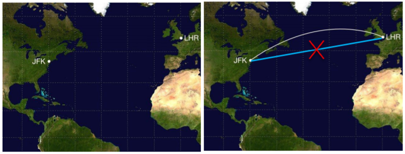

又比如著名的“瑞士卷”流形：

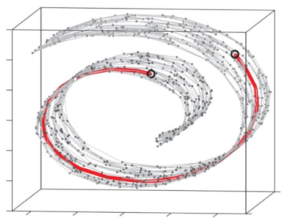

图中的红色曲线就是一条测地线，显然它和正常的欧式距离（即直接连接两个黑色空心圆点的直线）是有区别的，在流形上，两个黑色空心圆点的真正距离，比直接用欧式距离表示的要远的多。

##### 1.3 内蕴空间和外围空间

数学家用内蕴空间（intrinsic space）和外围空间（ambient space）中的坐标来描述流形上点的位置。内蕴空间坐标是流形内部空间使用的坐标（例如地球表面的经纬度），而外围空间坐标是把流形嵌入到一个外围空间（例如欧式空间）以后各个点在外围空间中的坐标（比如传统的$xyz​$坐标）。一般来说如果我们需要分析的流形比较复杂，很难对其内蕴空间进行描述，那我们可以通过分析其外围空间下的坐标来对其内部结构进行理解。

#### 2. 基本思想

流形学习的基本观点是，我们所能观察到的数据实际上是由一个低维流形映射到高维空间上的。在1.1节中我们已经可以看到，一些高维中的数据会产生维度上的冗余，如果这些数据分布在一个低维的流形上，那么实际上只需要比较低的维度就能唯一地表示。

基于此，流形学习最典型的应用，就是在降维上面。流形学习假设下的降维，研究如何展开一个流形，同时保持流形的几何结构，理想情况下希望能够保持测地线距离。当流形展开完毕（即降维完成）后，我们就能在低维空间中用欧式距离来度量点之间的关系。

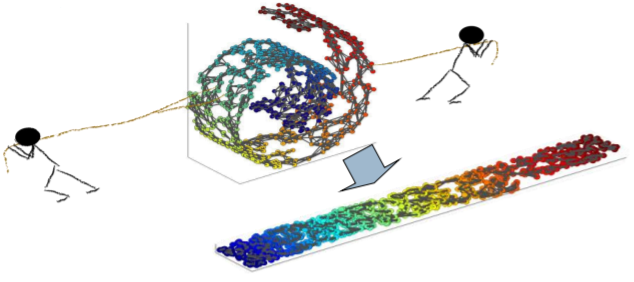

经典的流形学习降维方法，都是非线性降维方法，用来弥补PCA无法处理非线性流形的问题。

#### 3. 经典方法

##### 3.1 ISOMAP

ISOMAP全称是等度量映射（Isometric Mapping）。ISOMAP的基本思想是希望在映射过程中保持流形上测地线的距离。实际上ISOMAP就是流行学习框架下的MDS，通俗来讲，其核心算法就是把原始由欧式距离计算得到的距离矩阵换成流形学习中的测地线距离，然后执行MDS。

应用ISOMAP的一个关键问题是，在流形结构未知的情况下，如何根据有限的数据采样来估算流形上的测地线。ISOMAP的解决方法是利用数据点构造一个邻接图，用图上的最短距离来近似测地线。

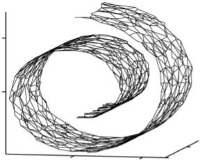

具体来讲，利用流形在局部上可以近似欧式空间的性质，针对每个点，我们可以找出其近邻点，构造近邻连接图，近邻点之间存在连接，其权重即为欧式距离，而非近邻点之间不存在连接，其权重为无限大。于是，计算两点之间测地线距离的问题，就转换为计算邻接图上两点之间的最短路径问题，可以调用经典的Dijkstra算法或Floyd算法解决。

当数据点趋于无穷多时，基于邻接图估计的测地线距离的近似值，就会趋近于流形上真正的测地线距离。

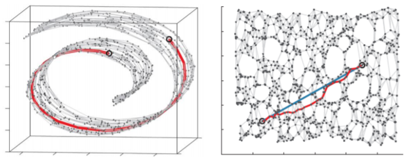

在得到任意两点之间的距离后，就可以通过MDS算法来获得样本点在低维空间中的坐标。

ISOMAP算法的完整描述如下：

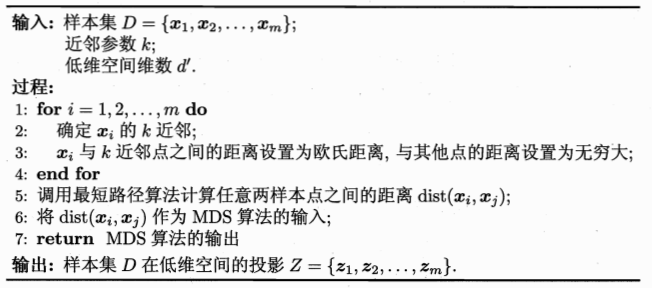

【**新样本点的映射**】

ISOMAP仅得到了训练样本在低维空间的坐标，如果要将新样本映射到低维空间，常用的解决方案是将训练样本的高维空间坐标作为输入，低维空间坐标作为输出，训练一个回归学习器来对新样本的坐标进行预测。

【**“短路”和“断路”问题**】

近邻点的选择有两种方式，一种是指定近邻点个数，例如欧式距离最近的$k$个点为近邻点，这样得到的近邻图称为$k$近邻图；另一种是指定距离阈值$\epsilon$，距离小于$\epsilon$的点被认为是近邻点，这样得到的近邻图称为$\epsilon$近邻图。两种方式均有不足，例如若近邻范围指定得较大，则距离很远的点可能被误认为近邻，这样就出现“短路”问题；近邻范围指定得较小，则图中有些区域可能与其他区域不存在连接，这样就出现“断路”问题。短路和断路都会给后续的最短路径计算造成误导。

##### 3.2 LLE

LLE全称为局部线性嵌入（Locally Linear Embedding）。LLE试图保持局部样本点之间的线性重构关系，其基本出发点也是流形的局部对欧式空间的近似性。

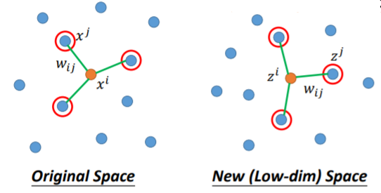

LLE先为每个样本$x_i$找到其近邻下标集合$Q_i$，然后计算出基于$Q_{i}$中的样本点对$x_i$进行线性重构的系数$\boldsymbol{w}_{i}$：
$$
\begin{aligned}\min _{\boldsymbol{w}_{1}, \boldsymbol{w}_{2}, \ldots, \boldsymbol{w}_{m}} & \sum_{i=1}^{m}\left\|\boldsymbol{x}_{i}-\sum_{j \in Q_{i}} w_{i j} \boldsymbol{x}_{j}\right\|_{2}^{2} \\ \text { s.t. } & \sum_{j \in Q_{i}} w_{i j}=1\end{aligned}
$$
其中$\boldsymbol{x}_{i}$和$\boldsymbol{x}_{j}$均为已知，令$C_{j k}=\left(\boldsymbol{x}_{i}-\boldsymbol{x}_{j}\right)^{\mathrm{T}}\left(\boldsymbol{x}_{i}-\boldsymbol{x}_{k}\right)$，$w_{i j}$有闭式解
$$
w_{i j}=\frac{\sum_{k \in Q_{i}} C_{j k}^{-1}}{\sum_{l, s \in Q_{i}} C_{l s}^{-1}}
$$
求出$w_{ij}$后，LLE在低维空间中保持$\boldsymbol{w}_{i}$不变，于是$\boldsymbol{x}_{i}$对应的低维空间坐标$\boldsymbol{z}_{i}$可通过下式求解：
$$
\min _{\boldsymbol{z}_{1}, \boldsymbol{z}_{2}, \ldots, \boldsymbol{z}_{m}} \sum_{i=1}^{m}\left\|\boldsymbol{z}_{i}-\sum_{j \in Q_{i}} w_{i j} \boldsymbol{z}_{j}\right\|_{2}^{2}
\tag{3.2.1}
$$
令$\mathbf{Z}=\left(\boldsymbol{z}_{1}, \boldsymbol{z}_{2}, \ldots, \boldsymbol{z}_{m}\right) \in \mathbb{R}^{d^{\prime} \times m}$，$(\mathbf{W})_{i j}=w_{i j}$，$\mathbf{M}=(\mathbf{I}-\mathbf{W})^{\mathrm{T}}(\mathbf{I}-\mathbf{W})$，则式（3.2.1）可重写为
$$
\begin{aligned}&\min _{\mathbf{Z}} \operatorname{tr}\left(\mathbf{Z} \mathbf{M} \mathbf{Z}^{\mathrm{T}}\right) \\ &\text { s.t. } \mathbf{Z} \mathbf{Z}^{\mathrm{T}}=\mathbf{I}\end{aligned}
\tag{3.2.2}
$$
式（3.2.2）可通过特征值分解求解：$\mathbf{M}$最小的$d^{\prime}$个特征值对应的特征向量组成的矩阵即为$\mathbf{Z}^{\mathrm{T}}$。

LLE完整的算法描述如下

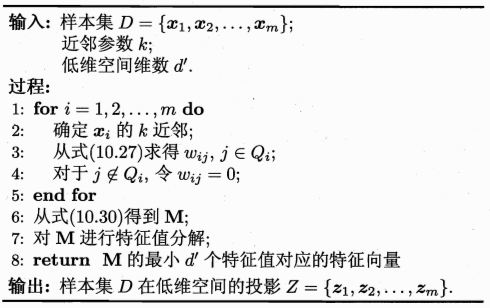

LLE的这种基于近邻点嵌入的思想又被称为Neighbor Embedding，在流形学习的很多方法中都有体现。

【**ISOMAP v.s. LLE**】

Isomap希望保持任意两点之间的测地线距离；LLE希望保持局部线性关系。从保持几何的角度来看，Isomap保持了更多的信息量。

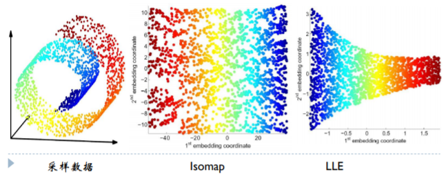

然而，ISOMAP的全局方法有一个很大的问题就是要考虑任意两点之间的关系，这个数量将随着数据点数量的增多而爆炸性增长，从而使得计算难以负荷。因此，以 LLE为开端的局部分析方法的变种和相关的理论基础研究逐渐受到更多的关注。

##### 3.3 LE

LE全称拉普拉斯特征映射（Laplacian Eigenmaps），是流形学习中谱图方法的典型代表。LE希望保持流形的近邻关系，即将原始空间中相近的点映射成目标空间中相近的点。

LE算法的第一步需要构建一个近邻图，然后去计算每条边的权重。与LLE需要估计出一个$W​$矩阵的做法不同的是，LE中的权重$W​$是直接定义好的，常用的定义方式有Gaussian Heat Kernel：
$$
w_{i j}=\left\{\begin{array}{ll}{e^{-\frac{| | x_{i}-\left.x_{j}\right\|^{2}}{t}}} & {j \in \mathbb{N}_{i}} \\ {0} & {\text { otherwise }}\end{array}\right.
$$
或者0-1权重的形式：
$$
w_{i j}=\left\{\begin{array}{ll}1 & {j \in \mathbb{N}_{i}} \\ {0} & {\text { otherwise }}\end{array}\right.
$$
LE的目标函数为：
$$
\min _{Z^{T} D Z=1, Z^{T} D \mathbf{1}=0} \frac{1}{2} \sum_{i, j} w_{i j}\left\|z_{i}-z_{j}\right\|^{2}
$$
这里有两个约束条件，约束条件一$Z^{T} D Z=1$的作用是确保新坐标的scale有一个范围，而不是任意的变动；约束条件二$Z^{T} D \mathbf{1}=0$则是为了防止落入把所有点都映射到相同坐标的trivial解，比如让$z_i=z_j=0$。

利用图的拉普拉斯矩阵，LE的目标函数可以转换为：
$$
\min _{Z^{T} D Z=1, Z^{T} D \mathbf{1}=0} \operatorname{trace}\left(Z^{T} L Z\right)
$$
这个目标函数可以进一步转化为一个特征向量求解问题：
$$
L z=\lambda z
$$
于是，求解新的坐标，就只要对拉普拉斯矩阵$L$进行特征分解，然后取$q$个最小的非零特征值所对应的特征向量（注意是取最小，与PCA不同），组成$q \times n$的矩阵，即为我们需要的新的空间坐标。

【**附：拉普拉斯矩阵**】

拉普拉斯矩阵是图上的拉普拉斯算子，定义为
$$
L=D-W
$$
其中$D$是图的度矩阵，是一个对角线元素为结点的度的对角阵，有$D=\operatorname{diag}(W \cdot \mathbf{1})$，$W$是权重矩阵。

举个例子，给定下面的简单图

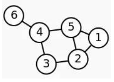

其邻接矩阵$W$为：
$$
\left( \begin{array}{cccccc}{0} & {1} & {0} & {0} & {1} & {0} \\ {1} & {0} & {1} & {0} & {1} & {0} \\ {0} & {1} & {0} & {1} & {0} & {0} \\ {0} & {0} & {1} & {0} & {1} & {1} \\ {1} & {1} & {0} & {1} & {0} & {0} \\ {0} & {0} & {0} & {1} & {0} & {0}\end{array}\right)
$$
度矩阵$D$为：
$$
\left( \begin{array}{llllll}{2} & {0} & {0} & {0} & {0} & {0} \\ {0} & {3} & {0} & {0} & {0} & {0} \\ {0} & {0} & {2} & {0} & {0} & {0} \\ {0} & {0} & {0} & {3} & {0} & {0} \\ {0} & {0} & {0} & {0} & {3} & {0} \\ {0} & {0} & {0} & {0} & {0} & {1}\end{array}\right)
$$
根据拉普拉斯矩阵的定义，计算其拉普拉斯矩阵$L$:
$$
\left( \begin{array}{rrrrrr}{2} & {-1} & {0} & {0} & {-1} & {0} \\ {-1} & {3} & {-1} & {0} & {-1} & {0} \\ {0} & {-1} & {2} & {-1} & {0} & {0} \\ {0} & {0} & {-1} & {3} & {-1} & {-1} \\ {-1} & {-1} & {0} & {-1} & {3} & {0} \\ {0} & {0} & {0} & {-1} & {0} & {1}\end{array}\right)
$$
拉普拉斯矩阵$L$具有如下性质：

* $L$是对称半正定矩阵

* $L \mathbf{1}=0\mathbf{1}$，即$L$得最小特征值是0，相应的特征向量是$\mathbf{1}$

* $L$有$n$个非负实特征值$0=\lambda_{1} \leq \lambda_{2} \leq \ldots \leq \lambda_{n}$

* 且对于任何一个实向量$f \in \mathbb{R}^{n}$，有下式成立：
  $$
  f^{T} L f=\frac{1}{2} \sum_{i, j=1}^{N} w_{i j}\left(f_{i}-f_{j}\right)^{2}
  $$

##### 4. t-SNE

t-SNE全称为T-distributed Stochastic Neighbor Embedding，是最常用的降维可视化方法。

LLE和LE只考虑将原始空间中相似的点映射到一起，而没有考虑将不相似的点分开，所以降维以后本来不相干的点可能会被叠加在一起。

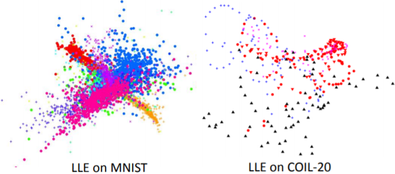

t-SNE希望降维后，原来相似的点能够聚集到一起，同时不相似的点要分开。具体做法是，首先计算原始空间中，各个点之间的相似度$S\left(x^{i}, x^{j}\right)​$，并将其标准化
$$
P\left(x^{j} | x^{i}\right)=\frac{S\left(x^{i}, x^{j}\right)}{\sum_{k \neq i} S\left(x^{i}, x^{k}\right)}
$$
同样地，对于降维后的点，也计算相似度$S^{\prime}\left(z^{i}, z^{j}\right)​$，并进行标准化
$$
Q\left(z^{j} | z^{i}\right)=\frac{S^{\prime}\left(z^{i}, z^{j}\right)}{\sum_{k \neq i} S^{\prime}\left(z^{i}, z^{k}\right)}
$$
然后，t-SNE的目标是找到一组$z​$，使得$P\left(x^{j} | x^{i}\right)​$和$Q\left(z^{j} | z^{i}\right)​$这两个分布越接近越好，即最小化它们之间的KL散度
$$
\begin{aligned}
L&=\sum_{i} K L\left(P\left(* | x^{i}\right) \| Q\left(* | z^{i}\right)\right)\\
&=\sum_{i} \sum_{j} P\left(x^{j} | x^{i}\right) \log \frac{P\left(x^{j} | x^{i}\right)}{Q\left(z^{j} | z^{i}\right)}
\end{aligned}
$$
t-SNE使用SGD来求解$z$。

在t-SNE中，原始空间的相似度量$S\left(x^{i}, x^{j}\right)$和降维空间中的相似度量$S^{\prime}\left(z^{i}, z^{j}\right)$可以是不同的，标准化操作保证了不同的相似度量的尺度不会产生太大影响。

对于原始空间，t-SNE采用的相似度量是
$$
S\left(x^{i}, x^{j}\right)  =\exp \left(-\left\|x^{i}-x^{j}\right\|_{2}\right)
$$
这种相似度量的曲线下降的很快，只要两点之间的差异稍微大一些，在指数函数的作用下，这种差异就会被进一步放大。

对于降维空间，t-SNE采用的相似度量是
$$
S^{\prime}\left(z^{i}, z^{j}\right)=1 / 1+\left\|z^{i}-z^{j}\right\|_{2}
$$
这两种度量形式的函数曲线如下图所示

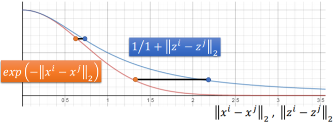

可以看到，在比较相近的距离内，降维前后数据点之间的差异变化较小；但是只要距离稍微增大，降维后数据点之间的差异就会进一步增大。因此，t-SNE降维后，原始空间中相距较远的点之间的距离被进一步放大了。换句话说，t-SNE使得原来数据点之间的gap被进一步的凸显出来，这种性质使得t-SNE成为了一种良好的可视化工具。

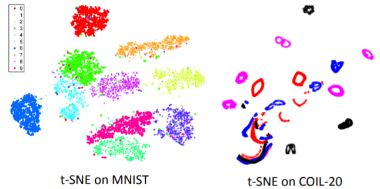

