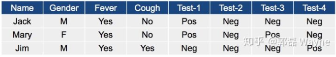
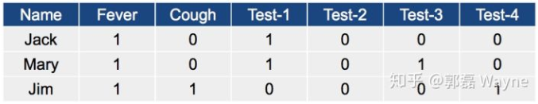
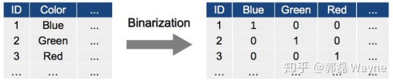

### 聚类基本问题之性能度量和距离计算

***

【参考资料】

周志华	《机器学习》

[一篇文章透彻解读聚类分析（附数据和R代码）](https://zhuanlan.zhihu.com/p/37856153)

先给出相关的符号定义。假定样本集$D = \left\{ x _ { 1 } , x _ { 2 } , \ldots , x _ { m } \right\}$包含$m$个无标记样本，每个样本$\boldsymbol { x } _ { i } = \left( x _ { i 1 } ; x _ { i 2 } ; \ldots ; x _ { i n } \right)$是一个$n$维特征向量，则聚类算法将样本集$D$划分为$k$个不相交的簇$\left\{ C _ { l } | l = 1,2 ; \ldots , k \right\}$，其中$C _ { l ^ { \prime } } \cap _ { l ^ { \prime } \neq l } C _ { l } = \varnothing$且$D = \bigcup _ { l = 1 } ^ { k } C _ { l }$。相应地，我们用$\lambda _ { j } \in \{ 1,2 , \dots , k \}$表示样本$\boldsymbol { x } _ { j }$的“簇标记”（cluster label），即$x _ { j } \in C _ { \lambda _ { j } }$。于是，聚类的结果可用包含$m$个元素的簇标记向量$\boldsymbol { \lambda } = \left( \lambda _ { 1 } ; \lambda _ { 2 } ; \ldots ; \lambda _ { m } \right)$表示。

聚类算法涉及到两个基本问题——性能度量和距离计算。

#### 1. 性能度量

聚类的目标是“物以类聚”，即同一簇的样本尽可能彼此相似，不同簇的样本尽可能不同。换言之，聚类结果的“簇内相似度”（intra-cluster similarity）高且“簇间相似度”（inter-cluster similarity）低。

聚类性能度量大致有两类。一类是将聚类结果与某个“参考模型”进行比较，例如领域专家给出的划分结果，这类指标称为“外部指标”（external index）；另一类是直接考察聚类结果而不利用任何参考模型，称为“内部指标”（internal index）。

##### 1.1 外部指标

假设数据集$D = \left\{ x _ { 1 } , x _ { 2 } , \ldots , x _ { m } \right\}$，经过聚类后得到的簇划分为$C = \left\{ C _ { 1 } , C _ { 2 } , \ldots , C _ { s } \right\}$，参考模型给出的簇划分$C ^ { * } = \left\{ C _ { 1 } ^ { * } , C _ { 2 } ^ { * } , \ldots , C _ { s } ^ { * } \right\}$，相应的，令$\lambda$和$\lambda ^ { * }$分别表示与$C$和$C ^ { * }$对应的簇标记向量。我们将样本两两配对考虑，定义：
$$
\begin{aligned} a & = | S S | , S S = \left\{ \left( x _ { i } , x _ { j } \right) | \lambda _ { i } = \lambda _ { j } , \lambda _ { i } ^ { * } = \lambda _ { j } ^ { * } , i < j \right\} \\ b & = | S D | , S D = \left\{ \left( x _ { i } , x _ { j } \right) | \lambda _ { i } = \lambda _ { j } , \lambda _ { i } ^ { * } \neq \lambda _ { j } ^ { * } , i < j \right\} \\ c & = | D S | , D S = \left\{ \left( x _ { i } , x _ { j } \right) | \lambda _ { i } \neq \lambda _ { j } , \lambda _ { i } ^ { * } = \lambda _ { j } ^ { * } , i < j \right\} \\ d & = | D D | , D D = \left\{ \left( x _ { i } , x _ { j } \right) | \lambda _ { i } \neq \lambda _ { j } , \lambda _ { i } ^ { * } \neq \lambda _ { j } ^ { * } , i < j \right\} \end{aligned} \tag{1.1}
$$
其中集合$SS$包含了在$C$中隶属于相同簇且在$C ^ { * }$中也隶属于相同簇的样本对，集合$SD$包含了在$C$中隶属于相同簇但在$C ^ { * }$中隶属于不同簇的样本对，其他以此类推。由于每个样本对$\left( \boldsymbol { x } _ { i } , \boldsymbol { x } _ { j } \right) ( i < j )$仅能出现在一个集合中，因此有$a + b + c + d = m ( m - 1 ) / 2$成立。

基于式（1.1）可以导出聚类性能度量常用的外部指标：

* Jaccard系数（Jaccard Coefficient，JC）
  $$
  \mathrm { JC } = \frac { a } { a + b + c }
  $$

* FM指数（Fowlkes and Mallows Index，FMI）
  $$
  \mathrm { FMI } = \sqrt { \frac { a } { a + b } \cdot \frac { a } { a + c } }
  $$

* Rand指数（Rand Index，RI）
  $$
  \mathrm { RI } = \frac { 2 ( a + d ) } { m ( m - 1 ) }
  $$

显然，上述性能度量的结果均在$[0,1]$区间内，且值越大越好。

##### 1.2 内部指标

考虑聚类结果的簇划分$\mathcal { C } = \left\{ C _ { 1 } , C _ { 2 } , \dots , C _ { k } \right\}$，定义
$$
\operatorname { avg } ( C ) = \frac { 2 } { | C | ( | C | - 1 ) } \sum _ { 1 \leqslant i < j \leqslant | C | } \operatorname { dist } \left( \boldsymbol { x } _ { i } , \boldsymbol { x } _ { j } \right) \tag{1.2}
$$

$$
\operatorname { diam } ( C ) = \max _ { 1 \leqslant i < j \leqslant | C | } \operatorname { dist } \left( \boldsymbol { x } _ { i } , \boldsymbol { x } _ { j } \right) \tag{1.3}
$$

$$
d _ { \min } \left( C _ { i } , C _ { j } \right) = \min _ { \boldsymbol { x } _ { i } \in C _ { i } , \boldsymbol { x } _ { j } \in C _ { j } } \operatorname { dist } \left( \boldsymbol { x } _ { i } , \boldsymbol { x } _ { j } \right) \tag{1.4}
$$

$$
d _ { \mathrm { cen } } \left( C _ { i } , C _ { j } \right) = \operatorname { dist } \left( \boldsymbol { \mu } _ { i } , \boldsymbol { \mu } _ { j } \right) \tag{1.5}
$$

其中，$\operatorname { dist } ( \cdot , \cdot )$用于计算样本之间的距离；$\mu$代表簇$C$的中心点$\mu = \frac { 1 } { | C | } \sum _ { 1 \leq i \leq | C | } x _ { i }$。显然，$\operatorname { avg } ( C )$对应于簇$C$内样本间的平均距离，$\operatorname { diam } ( C )$对应于簇$C$内样本间的最远距离，$d _ { \min } \left( C _ { i } , C _ { j } \right)$对应于簇$C _ { i }$与簇$C _ { j }$最近样本间的距离，$d _ { \operatorname { cen } } \left( C _ { i } , C _ { j } \right)$对应于簇$C _ { i }$与簇$C _ { j }$中心点间的距离。

基于式（1.2）~（1.5）可以导出常用的聚类性能度量指标：

* DB指数（Davies-Bouldin Index，DBI）
  $$
  \mathrm { DBI } = \frac { 1 } { k } \sum _ { i = 1 } ^ { k } \max _ { j \neq i } \left( \frac { \operatorname { avg } \left( C _ { i } \right) + \operatorname { avg } \left( C _ { j } \right) } { d _ { c e n } \left( \mu _ { i } , \mu _ { j } \right) } \right)
  $$

* Dunn指数（Dunn Index，DI）
  $$
  \mathrm { DI } = \min _ { 1 \leq i \leq k } \left\{ \min _ { j \neq i } \left( \frac { d _ { \min } \left( C _ { i } , C _ { j } \right) } { \max _ { 1 \leq l \leq k } \operatorname { diam } \left( C _ { l } \right) } \right) \right\}
  $$
  

显然，DBI的值越小越好，而DI则相反，值越大越好。

#### 2. 距离计算

根据属性的数值类型不同，需要使用不同的距离计算方式，下面列举以下常见类型属性的距离计算方法。

##### 2.1 数值属性

数值属性（numerical attribute），又称连续属性（continuous attribute），即取值连续的属性。给定样本$\boldsymbol { x } _ { i } = \left( x _ { i 1 } ; x _ { i 2 } ; \ldots ; x _ { i n } \right)$与样本$\boldsymbol { x } _ { j } = \left( x _ { j 1 } ; x _ { j 2 } ; \ldots ; x _ { j n } \right)$，最常用的是**闵科夫斯基距离**（Minkowski Distance）：
$$
\operatorname { dist } _ { \mathrm { mk } } \left( \boldsymbol { x } _ { i } , \boldsymbol { x } _ { j } \right) = \left( \sum _ { u = 1 } ^ { n } \left| x _ { i u } - x _ { j u } \right| ^ { p } \right) ^ { \frac { 1 } { p } }
$$
$p=2$时，闵科夫斯基距离即**欧式距离**（Euclidean Distance）：
$$
\operatorname { dist } _ { \mathrm { ed } } \left( \boldsymbol { x } _ { i } , \boldsymbol { x } _ { j } \right) = \left\| \boldsymbol { x } _ { i } - \boldsymbol { x } _ { j } \right\| _ { 2 } = \sqrt { \sum _ { u = 1 } ^ { n } \left| x _ { i u } - x _ { j u } \right| ^ { 2 } }
$$
$p=1$时，闵科夫斯基距离即曼哈顿距离（Manhattan Distance）：
$$
\operatorname { dist } _ { \operatorname { man } } \left( \boldsymbol { x } _ { i } , \boldsymbol { x } _ { j } \right) = \left\| \boldsymbol { x } _ { i } - \boldsymbol { x } _ { j } \right\| _ { 1 } = \sum _ { u = 1 } ^ { n } \left| x _ { i u } - x _ { j u } \right|
$$
当样本空间中不同属性的重要性不同时，可使用“加权距离”，如带权闵科夫斯基距离：
$$
\operatorname { dist } _ { \mathrm { wmk } } \left( \boldsymbol { x } _ { i } , \boldsymbol { x } _ { j } \right) = \left( w _ { 1 } \cdot \left| x _ { i 1 } - x _ { j 1 } \right| ^ { p } + \ldots + w _ { n } \cdot \left| x _ { i n } - x _ { j n } \right| ^ { p } \right) ^ { \frac { 1 } { p } }
$$
需要注意的是，在计算连续属性之间的距离时，需要考虑数据标度的问题，比如某个属性取值范围是（2000，3000），另一个属性的取值范围是（10，20）。这时需要对数据进行标准化，比如Z-score标准化：
$$
Z _ { f } = \frac { X _ { f } - m e a n _ { f } } { S _ { f } }
$$

##### 2.2 二值属性

即取值为0或1的属性，可以利用**列联表**（contingency table）和**Jaccard相似度**计算距离。我们通过一个例子来说明二值属性的距离计算。

假设我们有三个同学，他们有不同的特征，我们想衡量他们哪一对特征是更接近的：

我们首先将变量用0，1表示

对于样本$X$和$Y$，建立如下的列联表

其中$a$代表的是$X$和$Y​$中取值都为1的属性数，其他以此类推。我们使用Jaccard相似度来计算距离，如下：
$$
d ( X , Y ) = \frac { b + c } { a + b + c }
$$
Jaccard相似度实际上就是交并比，这里改变了它的原始定义（原来分母上应为$a$），因为需要遵循“距离越大相似度越小”的原则。$b+c$代表的是样本$X$和样本$Y$中，其中一方取1，另一方取0的情况。

于是，我们可以计算这三位同学的距离：
$$
d ( J a c k , M a r y ) = \frac { 0 + 1 } { 2 + 0 + 1 } = 0.33
$$

$$
d ( J a c k , J i m ) = \frac { 1 + 2 } { 1 + 1 + 2 } = 0.75
$$

$$
d ( M a r y , J i m ) = \frac { 2 + 2 } { 1 + 2 + 2 } = 0.8
$$

所以Jack和Mary是最相近的两个。

##### 2.3 有序属性

有序属性（ordinal attribute）的取值通常是离散的，但是不同的取值间有顺序关系，比如Level$\in${Low$,$ Medium, High$\}$。计算距离的方法是转化为连续变量，再用闵科夫斯基距离计算，即：

1）用每个值对应的排名$r \in [ 1 \ldots N ]$来代替这个值；

2）计算z-scores来标准化排名，让$r$在$[0,1]$之间；

3）计算闵科夫斯基距离。

##### 2.4 无序属性

无序属性，或者说类别属性，取值是离散的，例如Color$\in${blue, green, red, ……}。这里介绍两种处理方法。

第一种是将类别属性二值化，比如

转化成二值属性之后再列联表分析。

第二种是采用**VDM**（Value Difference Metric）。令$m _ { u , a }$表示在属性$u$上取值为$a$的样本数，$m _ { u , a , i }$表示在第$i$个样本簇中在属性$u$上取值为$a$的样本数，$k$为样本簇数，则属性$u$上两个离散值$a$与$b$之间的VDM距离为
$$
\operatorname { VDM } _ { p } ( a , b ) = \sum _ { i = 1 } ^ { k } \left| \frac { m _ { u , a , i } } { m _ { u , a } } - \frac { m _ { u , b , i } } { m _ { u , b } } \right| ^ { p }
$$
使用VDM的另一个好处是，可以结合闵科夫斯基距离处理混合属性。假定有$n _ { c }$个有序属性、$n - n _ { c }$个无序属性，不失一般性，令有序属性排列在无序属性之前，则
$$
\operatorname { MinkovDM } _ { p } \left( \boldsymbol { x } _ { i } , \boldsymbol { x } _ { j } \right) = \left( \sum _ { u = 1 } ^ { n _ { c} } \left| x _ { i u } - x _ { j u } \right| ^ { p } + \sum _ { u = n _ { c } + 1 } ^ { n } \operatorname { VDM } _ { p } \left( x _ { i u } , x _ { j u } \right) \right) ^ { \frac { 1 } { p } }
$$
