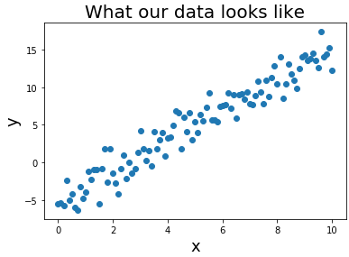
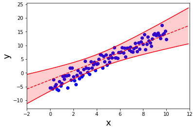
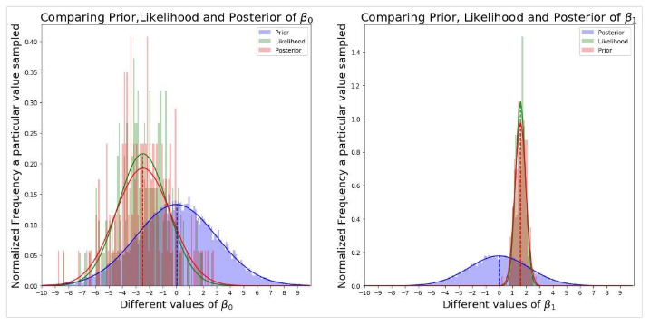
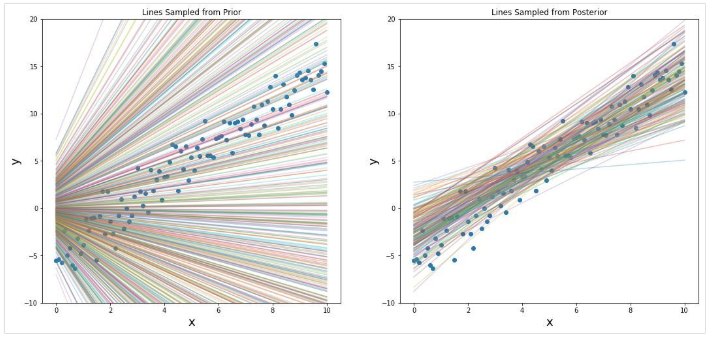

### 贝叶斯线性回归的通俗理解

------

【**参考资料**】

[解开贝叶斯黑暗魔法：通俗理解贝叶斯线性回归](<https://cloud.tencent.com/developer/article/1097341>)

[如何通俗地解释贝叶斯线性回归的基本原理？](<https://www.zhihu.com/question/22007264>)

#### 1. 问题的引入

**为什么需要贝叶斯线性回归？**

考虑一个简单的情形，在线性回归中，我们假设数据具有以下形式：
$$
y=\beta_{1} x+\beta_{0}+\epsilon
$$
这里我们作出第一个重要的假设：

* 【**假设1**】 数据的采样误差，即噪声$\epsilon$服从正态分布$\epsilon \sim \mathcal{N}\left(\mu, \sigma_{\epsilon}^{2}\right)$。

根据公式（1），我们生成的数据如下所示

现在，**普通最小二乘法（OLS）线性回归**要解决的问题是，寻找一条合适的直线，来拟合这个数据集，我们的模型假设是
$$
y=\beta_{1} x+\beta_{0}
$$
我们的目标是找到$\beta_1$和$\beta_0$，使得我们具有数据的最小RMSE（均方根误差）：
$$
\beta_{1}, \beta_{0}=\operatorname{argmin}_{\beta_{1}, \beta_{0}} \sum_{i=1}^{N}\left(y_{i}-\left(\beta_{1} x_{i}+\beta_{0}\right)\right)^{2}
$$
线性回归的拟合结果如下：

**那么，这个结果说明什么？**

它看起来不错。 实际上几乎是正确的。但是，我们真的可以依靠线性回归对有限的数据给出的答案吗？ 答案是否定的。假如说我们想要一个通用的度量：

**嘿，我之前看过很多这方面的数据，所以我对我的预测很有信心。**

或者

**呃，这一点在某处我没有看到太多数据。 答案可能是这样，但我不太确定。**

在没有数据的地方，我们可以看到，数据的**置信界限（confidence bounds）是增加的**（**因此答案的不确定性增加**）。但是线性回归不能给我们提供这些信息，这就是我们为什么需要贝叶斯线性回归。

#### 2. 一个简单的例子

我们继续使用上面的简单例子来阐述贝叶斯线性回归的原理。

**贝叶斯定理**

假设我们要学习的模型参数是$\theta$（即上面的$\beta_1, \beta_0$），数据是$D$，根据贝叶斯规则：
$$
P(\theta | D)=\frac{P(D | \theta) P(\theta)}{P(D)}
$$
我们需要的是在给定数据的情况下，$\theta$中所有参数（$\beta_1$和$\beta_0$）的联合分布。举例来说，假如$\mathrm{P}(\theta | D)$告诉我们给定数据$\beta_0=0.5$和$\beta_1=2.0$，概率为0.5；$\beta_0=1.5$和$\beta_1=3.0$

，概率为0.1，虽然概率很小，但是$\beta_0=1.5$和$\beta_1=3.0$这两个取值不完全排除。

$\mathrm{P}(\theta | D)$被称为参数的后验分布，我们通过如下步骤来计算：

* $P(D | \theta)$：参数为$\theta$的模型，对观测数据的拟合情况；
* $P(\theta)$：对参数$\theta$ 可能位于何处的先验设想，先验越接近真实，那么能越快越准地发现正确的后验分布；
* $\mathrm{P}(\mathrm{D})$：代表观测数据的概率，这是一个常数值，只要数据不变，它的值就不会发生改变。

------

**先验$P(\theta)$：我们认为参数是怎么样的？**

在贝叶斯学习的设定中，我们不是用某一个值来指定某些参数，而是用分布来表示（例如正态分布）。一般我们作出如下假设：

* 【**假设2**】参数$\theta$的先验服从高斯分布

（*注意，参数服从的高斯分布和数据噪声服从的高斯分布是两个不同的分布。*）

在我们的例子中，我们将参数$\beta_0$和$\beta_1$的先验指定为：
$$
\beta_{0} \sim \mathcal{N}\left(\mu=0, \sigma^{2}=9\right)
$$

$$
\beta_{1} \sim \mathcal{N}\left(\mu=0, \sigma^{2}=5\right)
$$

如果我们对$\beta$做很多次采样，那么我们得到的采样值会接近于真实的正态分布：

正如我们看到的那样，相比$\beta_0$，$\beta_1$的形状更尖，符合我们作出的先验假设。

**为什么好的先验如此重要？**

因为我们必须依赖于好的先验。也就是说，先验与后验越接近，我们会更快得到真正的后验。如果取的先验分布和后验分布一致，那么当从先验分布中抽样时，我们实际上是从后验中取样（这是我们需要的）。

------

**似然$P(D |θ)$：给定参数θ，模型对观测数据的拟合能力**

要计算参数的似然，实际上就是计算$\mathrm{P}(\mathrm{Y} | \mathrm{X}, \mathrm{\theta})$。下面我们将逐步进行计算。

首先根据单个数据样本$(x,y)$的生成过程写出整个数据集$(Y,X)$的似然函数，这里需要用到一个假设：

* 【**假设3**】数据点$(x_i, y_i)$是独立同分布的（i.i.d）。

那么我们可以得到：
$$
P(Y | X, \theta)=P\left(Y | X, \beta_{1}, \beta_{0}\right)=\prod_{i=1}^{N} P\left(y_{i} | x_{i}, \beta_{1}, \beta_{0}\right) \tag{2.1}
$$
根据
$$
y=\beta_{1} * x+\beta_{0}+\epsilon \qquad\text { where } \epsilon \sim \mathcal{N}\left(\mu, \sigma_{\epsilon}^{2}\right) \tag{2.2}
$$
我们可以使用$x, \beta_1, \beta_0$和$\epsilon$来表示$y$，即
$$
P(Y | X, \theta)=\prod_{i=1}^{N} P\left(\beta_{1} x_{i}+\beta_{0}+\epsilon_{i} | x_{i}, \beta_{1}, \beta_{0}\right) \tag{2.3}
$$
注意到在这里，$x_i, \beta_1, \beta_0$给定的情况下，$\beta_{1} x_{i}+\beta_{0}$的值是确定的，于是我们可以将它们从条件概率中去除：
$$
P(Y | X, \theta)=\prod_{i=1}^{N} P\left(\epsilon_{i} | x_{i}, \beta_{1}, \beta_{0}\right) \tag{2.4}
$$
从式（2.3）转化为式（2.4）的原理很简单：如果我们需要计算$P(A + B | B)$，其实这个公式和当变量$B$“给定”之后的$P(A | B)$是一样的。 换句话说，$P(B | B)= 1$，所以我们可以从$P(A + B | B)$的顶部去除变量$B$，化简成$P(A | B)$，结果不受影响。

接下来需要作出另一个重要假设：

* 【**假设4**】噪声独立于数据，与数据无关。

有下式
$$
P(Y | X, \theta)=\prod_{i=1}^{N} P\left(\epsilon_{i}\right) \tag{2.5}
$$
我们知道，噪声服从于正态分布，其概率密度函数为：
$$
\frac{1}{\sqrt{2 \pi \sigma^{2}}} e^{-\frac{\left(x_{i}-\mu\right)^{2}}{2 \sigma^{2}}}
$$
我们扩展一下之前的假设1：

* 【**假设1+**】噪声服从均值为0，方差为常数$\sigma_{\epsilon}^{2}$的正态分布。

于是，我们把噪声的概率密度函数代入到式（11）中，可以得到：
$$
P(Y | X, \theta)=\prod_{i=1}^{N} \frac{1}{\sqrt{2 \pi \sigma_{\epsilon}^{2}}} e^{-\frac{\left(\epsilon_{i}-0\right)^{2}}{2 \sigma_{\epsilon}^{2}}} \tag{2.6}
$$
并且有
$$
\epsilon_{i}=y_{i}-\left(\beta_{1} x_{i}+\beta_{0}\right) \tag{2.7}
$$
因此最终的似然函数形式是：
$$
P(Y | X, \theta)=\prod_{i=1}^{N} \frac{1}{\sqrt{2 \pi \sigma_{\epsilon}^{2}}} e^{-\frac{\left(y_{i}-\left(\beta_{1} x_{i}+\beta_{0}\right)\right)^{2}}{2 \sigma_{\epsilon}^{2}}} \tag{2.8}
$$
这个式子表明，$y_i$服从均值为$\beta_{1} x_{i}+\beta_{0}$（即模型的预测值$\hat y_{i}$），方差为$\sigma_{\epsilon}^{2}$的正态分布，可以简写为：
$$
f_{n}\left(y_{i} | \mu=\beta_{1} x_{i}+\beta_{0}, \sigma^{2}=\sigma_{\epsilon}^{2}\right)=\frac{1}{\sqrt{2 \pi \sigma_{\epsilon}^{2}}} e^{-\frac{\left(y_{i}-\left(\beta_{1} x_{i}+\beta_{0}\right)\right)^{2}}{2 \sigma_{\epsilon}^{2}}} \tag{2.9}
$$
因此，
$$
P(Y | X, \theta)=\prod_{i=1}^{N} f_{n}\left(y_{i} | \beta_{1} x_{i}+\beta_{0}, \sigma_{\epsilon}^{2}\right) \tag{2.10}
$$

------

**后验$P(θ| D)$：我们最终需要什么？**

为了得到后验概率，我们需要联合$P(Y | X, \beta 1, \beta 0)$，$P(\beta 1, \beta 0)$和$P(Y|X)$进行计算，如下：
$$
P\left(\beta_{1}, \beta_{0} | X, Y\right)=\frac{P\left(Y | X, \beta_{1}, \beta_{0}\right) P\left(\beta_{1}, \beta_{0}\right)}{P(Y|X)} \tag{2.11}
$$
由于$P(D)=P(Y|X)$是常量，所以我们可以用一个常量$Z$来表示它，那么有：
$$
P\left(\beta_{1}, \beta_{0} | X, Y\right)=\frac{P\left(Y | X, \beta_{1}, \beta_{0}\right) P\left(\beta_{1}, \beta_{0}\right)}{Z} \tag{2.12}
$$
换句话说，**后验仅仅是一个加权的先验，其中权重就是给定参数值的数据的似然。**

计算后验分布，有两种解决方法：

* 得到后验分布的解析解；
* 通过对后验分布进行采样，得到许多$\beta_0$和$\beta_1$的值，然后近似这个后验分布。

这里**我们使用采样的方式**。

我们从$\beta_1$和$\beta_0$的先验中取15000对不同的值，并计算它们对应的概率，再通过式（19），来完成对后验分布的近似。更具体地说，就我们的例子而言：
$$
P\left(\beta_{1}, \beta_{0} | X, Y\right) \approx\left\{P\left(\beta_{1}^{(i)}, \beta_{0}^{(i)} | X, Y\right)\right\} \qquad \text { where } i=1, \ldots, 15000
$$
因此我们得到了
$$
P\left(\beta_{1}^{(i)}, \beta_{0}^{(i)} | X, Y\right)
$$
同时，由于数据是独立同分布，并且$\beta_1$和$\beta_0$是独立的，我们可以得到：
$$
P\left(\beta_{1}^{(i)}, \beta_{0}^{(i)} | X, Y\right)=\frac{\prod_{j=1}^{N} P\left(y_{j} | x_{j}, \beta_{1}^{(i)}, \beta_{0}^{(i)}\right) P\left(\beta_{1}^{(i)}\right) P\left(\beta_{0}^{(i)}\right)}{Z} \tag{2.13}
$$
通过符号简化，我们得到
$$
P\left(\beta_{1}^{(i)}, \beta_{0}^{(i)} | x_{j}, y_{j}\right)=\frac{\prod_{j=1}^{N} f_{n}\left(y_{j} | \beta_{1} x_{j}+\beta_{0}, \sigma_{\epsilon}^{2}\right) f_{n}\left(\beta_{1}^{(i)} | 0,5\right) f_{n}\left(\beta_{0}^{(i)} | 0,9\right)}{Z} \tag{2.14}
$$

------

**证据$Z = P(D)$：使后验概率总和为1**

$P(D)$被称为证据，表示我们观测到的数据的概率，由下式得到：
$$
P(D)=\int P(D | \theta) P(\theta) d \theta
$$
**如何计算$Z$？**

我们采样得到参数$\beta_0$和$\beta_1$的所有不同组合的$\mathrm{P}(\mathrm{D} | \beta 1, \beta 0) \mathrm{P}(\beta 1, \beta 0)$（即贝叶斯规则公式右侧的顶部）的总和。 得到的样本越多，将能更真实地得到观测数据的概率。 更具体地说，我们可以这样计算$Z$:
$$
Z=P(D)=\sum_{i=1}^{15000} \prod_{j=1}^{N} f_{n}\left(y_{j} | \beta_{1} x_{j}+\beta_{0}, \sigma_{\epsilon}^{2}\right) f_{n}\left(\beta_{1}^{(i)} | 0,5\right) f_{n}\left(\beta_{0}^{(i)} | 0,9\right)
$$
这个公式没有什么可怕的，这只是重复添加采样得到的结果而已。这里$Z$起到的实际上是归一化的作用，以便让后验概率的和为1。

------

**先验，似然，后验的简单实验**

下面我们用一个例子展示先验，似然和后验。

从图表中，我们可以作出两个重要观察：

* 可以看到，由于我们的先验稍微偏离了真实的后验，因此似然概率实际上是把后验从先验拉开。 如果先验很接近真实的后验，那么这种拉力会下降。

* 与$\beta_0$相比，参数$\beta_1$似乎更敏感。也就是说，参数$\beta_1$的变化比$\beta_0$更会影响结果的准确性。

最后，我们做一个比较，以查看从先验分布（仅前500个样本）和后验分布中抽取的线的差异。

可以看到，从后验中采样的结果会更加地收敛到真实情况。

------

**如何从后验中采样？**

实际上我们不是直接从后验中采样的，而是先从先验中采样得到不同参数的组合，然后在通过贝叶斯公式，利用似然对这些样本对应的先验概率进行修正，得到后验概率，然后再根据后验概率，重新在这些样本中间采样。后验概率大的参数样本，就会有更大的概率被采样到。

在上面的例子对应的代码实现中，从后验中采样是由一次伯努利实验实现的，即二项分布的参数$p$由后验概率的大小决定，后验概率越大，二项分布生成数值1的概率就越大，即对应的参数样本被选中的概率就越大。同时，一旦某个样本被选中，对应的后验概率的大小就代表了选择的这组参数的置信度大小。

代码地址：

https://github.com/thushv89/nlp_examples_thushv_dot_com/blob/master/bayesian_linear_regression.ipynb

所以这里我们**不是直接从后验中采样，而是在先验中采样，然后通过先验来影响后验，间接地近似出后验采样的过程**。

------

**对于一个新的数据点，我们如何获得答案？**

我们需要从根据后验概率采样出不同的参数$\beta_0$和$\beta_1$的组合，然后计算出对应的预测值$\hat y$，**最终的结果是这些预测值的平均值**，同时，我们还可以给出它们的标准差。

#### 3.优缺点

**优点**：

贝叶斯回归在数据点较少的情况下效果比传统的频率派线性回归要好，更不容易过拟合。比起频率派对参数的单一点估计，贝叶斯回归考虑的是参数的分布，即参数的所有可能取值，最终预测值是模型在整个参数空间上的预测值根据后验概率的大小进行权衡后的结果，自然也就避免了过拟合。（点估计只告诉了我们最有可能的情况，而分布包含了整个空间里的情况。）

（*还记得贝叶斯学派和频率学派抛硬币的例子吗？在这个例子里，频率学家只根据少数几次抛硬币的结果就可能作出错误的预测，这就是在少数数据上的一种过拟合，而贝叶斯学派通过引入先验避免了这种情况。*）

**缺点**：

预测结果的准确性依赖于先验的选取，并且计算开销过大，并且后验分布一般是无法直接求的，需要采用近似的方法。另外，如果数据非常多，先验概率所起的作用会越来越小，这时用普通的线性回归效果就已经很好了。

