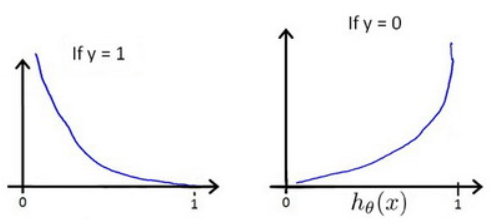

### 逻辑回归原理总结

***

【**参考资料**】

[Logistic Regression（逻辑回归）原理及公式推导](https://blog.csdn.net/programmer_wei/article/details/52072939)

吴恩达机器学习笔记   [第三周](http://www.ai-start.com/ml2014/html/week3.html)

#### 1. 基本形式

逻辑回归（logistic regression）模型表述如下
$$
h_{\theta}(x)=\frac{1}{1+e^{-z}}=\frac{1}{1+e^{-\theta^{T} x}}
$$
其中
$$
y=\frac{1}{1+e^{-x}}
$$
被称为**sigmoid**函数，可以看到，**逻辑回归实质上是将线性回归的结果映射到了sigmoid函数中。**

$h_{\theta}(x)$满足：$0 \leq h_{\theta}(x) \leq 1​$

对于二分类问题，标签$y \in 0,1$，其中0表示负例，1表示正例。$h_{\theta}(x)$的值代表了对应的$y=1$的概率：
$$
P(y=1 | x ; \theta)=h_{\theta}(x)
$$
那么$y=0$的概率为：
$$
P(y=0 | x ; \theta)=1-h_{\theta}(x)
$$
因此，当$h_{\theta}(x)>0.5$时，表明样本标签为1的概率大于标签为0的概率，我们将其归入正类；当$h_{\theta}(x)<0.5$时，样本标签为0的概率大于标签为1的概率，我们将其归入负类。

#### 2. 代价函数

逻辑回归的代价函数为：
$$
J(\theta)=\frac{1}{m} \sum_{i=1}^{m} \operatorname{cost}\left(h_{\theta}\left(x^{(i)}\right), y^{(i)}\right)
$$
其中
$$
\operatorname{cost}\left(h_{\theta}(x), y\right)=\left\{\begin{aligned}-\log \left(h_{\theta}(x)\right) & \qquad\text { if } y=1 \\-\log \left(1-h_{\theta}(x)\right) & \qquad\text { if } y=0 \end{aligned}\right.
$$
$h_{\theta}(x)$与$\operatorname{cost}\left(h_{\theta}(x), y\right)$之间的关系如下图所示：

这样构建的$\operatorname{Cost}\left(h_{\theta}(x), y\right)​$函数的含义是：

* 当实际的$y=1$且$h_{\theta}(x)$也为1时，误差为0；当$y=1$但$h_{\theta}(x)$不为1时，误差随着$h_{\theta}(x)$的减小而增大；
* 当实际的$y=0$且$h_{\theta}(x)$也为0时，误差为0；当$y=0$但$h_{\theta}(x)$不为0时，误差随着$h_{\theta}(x)$的增大而增大。

$\operatorname{Cost}\left(h_{\theta}(x), y\right)$可以简写为
$$
\operatorname{cost}\left(h_{\theta}(x), y\right)=-y \times \log \left(h_{\theta}(x)\right)-(1-y) \times \log \left(1-h_{\theta}(x)\right)
$$
则代价函数为
$$
J(\theta)=-\frac{1}{m} \sum_{i=1}^{m}\left[y^{(i)} \log \left(h_{\theta}\left(x^{(i)}\right)\right)+\left(1-y^{(i)}\right) \log \left(1-h_{\theta}\left(x^{(i)}\right)\right)\right]
$$
这个代价函数又被称为**二分类交叉熵损失函数**（binary cross entropy），或者logistic loss。

可以用梯度下降法来求解参数，有
$$
\begin{aligned}
\theta_{j} &:=\theta_{j}-\alpha \frac{\partial}{\partial \theta_{j}} J(\theta)\\
&=\theta_{j}-\alpha \frac{1}{m} \sum_{i=1}^{m}\left(h_{\theta}\left(x^{(i)}\right)-y^{(i)}\right) x_{j}^{(i)}
\end{aligned}
$$
完整的推导过程如下：

根据
$$
J(\theta)=-\frac{1}{m} \sum_{i=1}^{m}\left[y^{(i)} \log \left(h_{\theta}\left(x^{(i)}\right)\right)+\left(1-y^{(i)}\right) \log \left(1-h_{\theta}\left(x^{(i)}\right)\right)\right]
$$
考虑
$$
h_{\theta}\left(x^{(i)}\right)=\frac{1}{1+e^{-\theta T_{x}^{(i)}}}
$$
则
$$
\begin{array}{l}{y^{(i)} \log \left(h_{\theta}\left(x^{(i)}\right)\right)+\left(1-y^{(i)}\right) \log \left(1-h_{\theta}\left(x^{(i)}\right)\right)} \\ {=y^{(i)} \log \left(\frac{1}{1+e^{-\theta^{T} x^{(i)}}}\right)+\left(1-y^{(i)}\right) \log \left(1-\frac{1}{1+e^{-\theta^{T} x^{(i)}}}\right)} \\ {=-y^{(i)} \log \left(1+e^{-\theta^{T} x^{(i)}}\right)-\left(1-y^{(i)}\right) \log \left(1+e^{\theta^{T} x^{(i)}}\right)}\end{array}
$$
所以
$$
\begin{aligned}
\frac{\partial}{\partial \theta_{j}} J(\theta)&=\frac{\partial}{\partial \theta_{j}}\left[-\frac{1}{m} \sum_{i=1}^{m}\left[-y^{(i)} \log \left(1+e^{-\theta^{T} x^{(i)}}\right)-\left(1-y^{(i)}\right) \log \left(1+e^{\theta^{T} x^{(i)}}\right)\right]\right]\\
&=-\frac{1}{m} \sum_{i=1}^{m}\left[-y^{(i)} \frac{-x_{j}^{(i)} e^{-\theta^{T} x^{(i)}}}{1+e^{-\theta^{T} x^{(i)}}}-\left(1-y^{(i)}\right) \frac{x_{j}^{(i)} e^{\theta^{T} x^{(i)}}}{1+e^{\theta^{T} x^{(i)}}}\right]\\
&=-\frac{1}{m} \sum_{i=1}^{m}\left[y^{(i)} \frac{x_{j}^{(i)}}{1+e^{\theta^{T} x^{(i)}}}-\left(1-y^{(i)}\right) \frac{x_{j}^{(i)} e^{\theta^{T} x^{(i)}}}{1+e^{\theta^{T} x^{(i)}}} \right]\\
&= -\frac{1}{m} \sum_{i=1}^{m} \frac{y^{(i)} x_{j}^{(i)}-x_{j}^{(i)} e^{\theta^{T} x^{(i)}}+y^{(i)} x_{j}^{(i)} e^{\theta^{T} x^{(i)}}}{1+e^{\theta^{T} x^{(i)}}}\\
&=-\frac{1}{m} \sum_{i=1}^{m} \frac{y^{(i)}\left(1+e^{\theta^{T} x^{(i)}}\right)-e^{\theta^{T} x^{(i)}}}{1+e^{\theta T_{x}(i)}} x_{j}^{(i)}\\
&=-\frac{1}{m} \sum_{i=1}^{m}\left(y^{(i)}-\frac{e^{\theta^{T} x^{(i)}}}{1+e^{\theta^{T} x^{(i)}}}\right) x_{j}^{(i)}\\
&=-\frac{1}{m} \sum_{i=1}^{m}\left(y^{(i)}-\frac{1}{1+e^{-\theta^{T} x^{(i)}}}\right) x_{j}^{(i)}\\
&=-\frac{1}{m} \sum_{i=1}^{m}\left[y^{(i)}-h_{\theta}\left(x^{(i)}\right)\right] x_{j}^{(i)}\\
&=\frac{1}{m} \sum_{i=1}^{m}\left[h_{\theta}\left(x^{(i)}\right)-y^{(i)}\right] x_{j}^{(i)}
\end{aligned}
$$
注意：虽然得到的梯度下降算法表面上看上去与线性回归的梯度下降算法一样，但是这里的$h_{\theta}(x)$与线性回归中不同，所以实际上是不一样的。

#### 3. 极大似然

也可以通过极大似然法来求解，概率函数为
$$
P(y | x ; \theta)=\left(h_{\theta}(x)\right)^{y} *\left(1-h_{\theta}(x)\right)^{1-y}
$$
则似然函数为
$$
\begin{aligned}
L(\theta)&=\prod_{i=1}^{m} P\left(y^{(i)} | x^{(i)} ; \theta\right)\\
&=\prod_{i=1}^{m}\left(h_{\theta}\left(x^{(i)}\right)\right)^{y^{(i)}} *\left(1-h_{\theta}\left(x^{(i)}\right)\right)^{1-y^{(i)}}
\end{aligned}
$$
取对数似然：
$$
l(\theta)=\log (L(\theta))=\sum_{i=1}^{m} y^{(i)} \log \left(h_{\theta}\left(x^{(i)}\right)\right)+\left(1-y^{(i)}\right) \log \left(1-h_{\theta}\left(x^{(i)}\right)\right)
$$
极大似然是要求解$l(\theta)$取最大值时的$\theta$，这里可以使用梯度上升法求解，或者稍微变换以下，用梯度下降法求解$-l(\theta)$。具体过程与第二节一致。