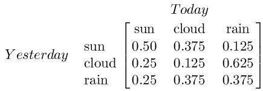
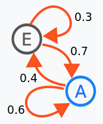
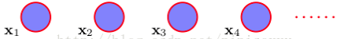

### 马尔科夫链简单介绍

***

【参考资料】

[马尔科夫模型 Markov Model](<https://blog.csdn.net/pipisorry/article/details/46618991>)

[有趣的马氏链及其平稳分布](<https://blog.csdn.net/u012535605/article/details/77507880>)

[马尔可夫链中不变分布的意义是什么？](<https://www.zhihu.com/question/26680016>)

#### 1. 引入与简单例子

马尔科夫链用来表示不同随机状态之间的转移过程，常用来对序列建模。用一句话来概括马尔科夫链的话，那就是**某一时刻状态转移的概率只依赖于它的前一个状态**。举个简单的例子，假如每天的天气是一个状态的话，那么今天是不是晴天只依赖于昨天的天气，而和前天的天气没有任何关系。这么说可能有些不严谨，但是这样做可以大大简化模型的复杂度，因此马尔科夫链在很多时间序列模型中得到广泛的应用，比如循环神经网络RNN，隐式马尔科夫模型HMM等。

对于每一个当前状态，我们都能给出它向下一个状态转移的概率。还是以天气的例子，假如我们获得这样一个**状态转移矩阵**：

状态转移矩阵的第$i$行第$j$列表示在当前状态为$i$的情况下，转移到下一状态$j$的概率。比如上面矩阵的第1行第1列就代表前天是晴天，今天也是晴天的概率；矩阵的第2行第1列代表昨天是多云，今天是晴天的概率。

假如我们有一个初始状态向量，用行向量$s=[0.2, 0.3, 0.5]$，把它与状态转移矩阵相乘，即$s \times P$，我们就能得到下一时刻的状态向量。

通常我们还会用状态图来表示不同状态之间转移的概率，比如下面是一个含有两个状态的马氏链的例子：

#### 2. 具体形式

假设我们现在拥有序列$\{\boldsymbol{x}_{1}, \dots, \boldsymbol{x}_{N}\}$。

【**独立同分布建模**】

处理顺序数据的最简单的方式是忽略顺序的性质，将观测看做独立同分布。然而，这种方法无法利用数据中的顺序模式，例如序列中距离较近的观测之间的相关性。这种建模方式对应于没有连接的图：

【**马尔可夫模型**】

为了在概率模型中表示这种效果，我们需要放松独立同分布的假设。完成这件事的一种最简单的方式是考虑马尔科夫模型（Markov model）。

马尔科夫模型表示观测序列的联合概率分布：
$$
p\left(\boldsymbol{x}_{1}, \ldots, \boldsymbol{x}_{N}\right)=p\left(\boldsymbol{x}_{1}\right) \prod_{n=2}^{N} p\left(\boldsymbol{x}_{n} | \boldsymbol{x}_{1}, \ldots, \boldsymbol{x}_{n-1}\right)
$$
【**一阶马尔可夫链**】

我们通常讨论的马尔科夫链模型就是指一阶马尔科夫链，即特定的观测$x_{n}$只与前一个观测$x_{n-1}$有关。给定$n$时刻之前的所有观测，我们看到的观测$x_n$的条件概率分布为：
$$
p\left(\boldsymbol{x}_{n} | \boldsymbol{x}_{1}, \ldots, \boldsymbol{x}_{n-1}\right)=p\left(\boldsymbol{x}_{n} | \boldsymbol{x}_{n-1}\right)
$$
【**同质马尔科夫链**】

一般我们假设条件概率分布$p\left(\boldsymbol{x}_{n} | \boldsymbol{x}_{n-1}\right)$不随时间发生变化，即状态转移矩阵是不随时间改变的，这称为同质性。

【**马尔科夫链参数个数分析**】

假设观测是具有$K$个状态的离散变量，那么前一状态确定的情况下，一阶马尔科夫链中的条件概率分布$p(x_n|x_{n-1})$由$K-1$个参数指定，每个参数对应于$K$个前置状态，因此参数总数为$K(K-1)$。

#### 3. 收敛性与平稳分布

如果一个马尔科夫链收敛，那么给定一个初始的状态分布，经过$n$次状态转移后（即初始分布$s$于状态转移矩阵的$n$次幂$P^n$相乘），它会逐渐收敛到一个固定的概率分布上，这种收敛性与初始分布的选取无关。我们称这个收敛的分布为平稳分布。

马尔科夫链要能收敛，需要满足以下条件：

* 可能的状态数是有限的。
* 状态间的转移概率需要固定不变（即同质性）。
* 从任意状态能够转变到任意状态
* 不能是简单的循环，例如全是从$x$到$y$再从$y$到$x$。

收敛性的数学表述如下：

如果一个非周期马氏链具有转移概率矩阵$P$，且它的任何两个状态是连通的，$\lim _{n \rightarrow \infty} P_{i j}^{ n}$存在且与$i$无关，记$\lim _{n \rightarrow \infty} P_{i j}^{n}=\pi(j)$。我们有

1. $$
   \lim _{n \rightarrow \infty} P^{n}= \left( \begin{array}{ccccc}{\pi(1)} & {\pi(2)} & {\cdots} & {\pi(j)} & {\cdots} \\ {\pi(1)} & {\pi(2)} & {\cdots} & {\pi(j)} & {\cdots} \\ {\ldots} & {\ldots} & {\cdots} & {\cdots} & {\cdots} \\ {\pi(1)} & {\pi(2)} & {\cdots} & {\pi(j)} & {\cdots} \\ {\cdots} & {\cdots} & {\cdots} & {\cdots} & {\cdots}\end{array}\right)
   $$

2. $\pi(j)=\sum_{i=0}^{\infty} \pi(i) P_{i j}$

3. $\pi$是方程$\pi P=\pi$的唯一非负解

其中，$\boldsymbol{\pi}=[\pi(1), \pi(2), \cdots, \pi(j), \cdots]$，$\sum_{i=0}^{\infty} \pi_{i}=1$，$\pi$称为马氏链的平稳分布。

【**平稳分布的意义**】

马氏链的平稳分布提供了使马氏链和初始状态无关的一个办法，并刻画了马氏链在长时间下的极限行为和平均行为。当初始状态的选取是平稳分布时，对于每一个转换时刻$n$，第$n$步之后的分布依旧是不变分布；当初始状态不是平稳分布时，从一个随机的初始状态出发，马氏链在$n$趋于无穷的时候都会得到平稳分布，最后殊途同归。

