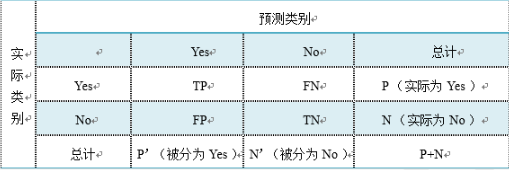
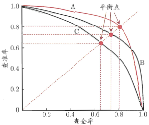
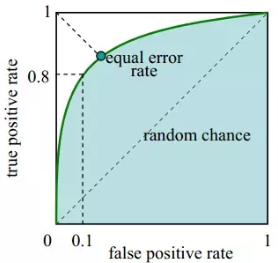
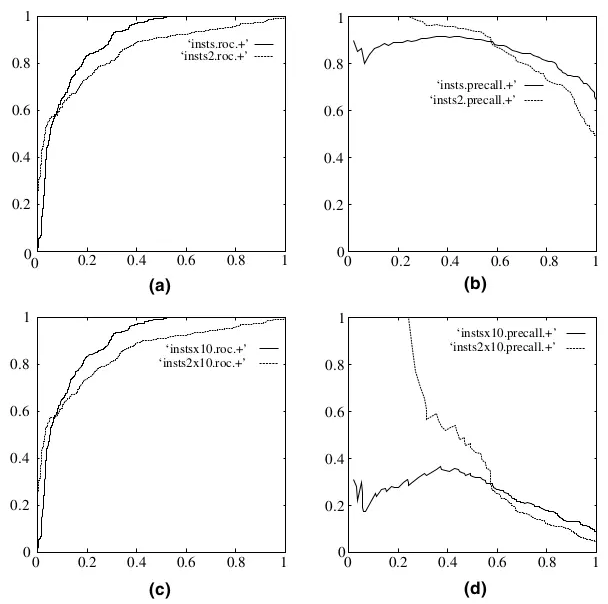
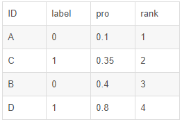
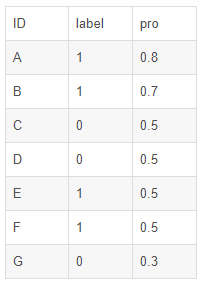
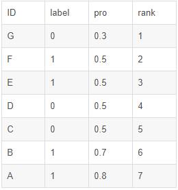

### 分类任务中常用性能指标

***

【**参考资料**】

周志华	《机器学习》

[机器学习之分类性能度量指标 : ROC曲线、AUC值、正确率、召回率](https://www.jianshu.com/p/c61ae11cc5f6)

[AUC的计算方法](https://blog.csdn.net/qq_22238533/article/details/78666436)

[AUC的计算方法总结](https://www.cnblogs.com/peizhe123/p/5081559.html)

#### 1. 混淆矩阵

二分类问题的混淆矩阵（confusion matrix）如下：

* **真正例（True Positives，TP）**：被正确地划分为正例的个数，即实际为正例且被分类器划分为正例的实例数；
* **假正例（False positives，FP）**：被错误地划分为正例的个数，即实际为负例但被分类器划分为正例的实例数；
* **假反例（False Negatives，FN）**：被错误地划分为负例的个数，即实际为正例但被分类器划分为负例的实例数；
* **真反例（True Negatives，TN）**：被正确地划分为负例的个数，即实际为负例且被分类器划分为负例的实例数。　

其中，$P=TP+FN$表示实际为正例的样本个数，$N$，$P'$，$N'$同理。基于混淆矩阵，可以得到一系列指标，详见下文。

#### 2. 正确率&错误率

* **正确率（accuracy）**：正确率是最常见的评价指标，是被分对的样本数在所有样本数中的占比，计算如下
  $$
  \text{accuracy} = \frac{TP+TN}{P+N}
  $$

* **错误率（error rate）**：与正确率相反，描述被分类器错分的比例，即
  $$
  \text{error rate} = \frac{FP+FN}{P+N}
  $$

分对与分错是互斥事件，所以$\text{accuracy} =1 - \text{error rate}$。

#### 3. 灵敏度&特效度

* **灵敏度（sensitivity）**：表示所有正例中被分对的比例，衡量了分类器对正例的识别能力
  $$
  \text{sensitivity}=\frac{TP}{P}
  $$

* **特效度（specificity）**：表示所有负例中被分对的比例，衡量了分类器对负例的识别能力
  $$
  \text{specificity} = \frac{TN}{N}
  $$

对于多分类问题来说，这一对指标实际上就是针对每个单独类别的分类正确率，它们作为独立概念出现的情况不多。需要注意的是，$\text{sensitivity}+\text{specificity} \neq \text{accuracy}$。

#### 4. 精度&召回率

* **精度（precision）**：精度又称为查准率，是精确性的度量，表示被分为正例的示例中实际为正例的比例，计算方式如下
  $$
  \text{precision}=\frac{TP}{TP+FP}
  $$
  注意精度和正确率（accuracy）不是一个概念。（*注：有些资料中也把accuracy翻译为精度，为了防止混淆，这里统一将accuracy称为正确率，precision称为精度*）

* **召回率（Recall）**：召回率又称为查全率，是覆盖面的度量，度量有多个正例被分为正例，计算如下
  $$
  \text{recall}=\frac{TP}{TP+FN}
  $$
  由于$TP+FN=P$，所以召回率与灵敏度是一样的。

精度和召回率的计算方式图解：

精度和召回率是一对矛盾的度量。一般来说，精度高时，召回率往往偏低；而召回率高时，精度往往偏低。周志华老师的《机器学习》中提到这样一个例子：若希望将好瓜尽可能多选出来，则可通过增加选瓜的数量来实现，如果将所有西瓜都选上，那么所有的好瓜也必然都被选上了，但这样精度就会较低；若希望选出的瓜中好瓜比例尽可能高，则可只挑选最有把握的瓜，但这样就难免会漏掉不少好瓜，使得召回率较低。

#### 5. P-R曲线

在很多情形下，我们可根据学习器的预测结果对样例进行排序（即根据置信度从大到小排序），排在前面的是学习器认为“最可能”是正例的样本，排在最后的则是学习器认为“最不可能”是正例的样本。按此顺序逐个把样本作为正例进行预测，则每次可以计算出当前的精度和召回率。以精度为纵轴，召回率为横轴作图，就得到了“**P-R曲线**”。

（*注：虽然在上图中P-R曲线是平滑的，但这里只是为了美观而画成这样的，现实任务中的P-R曲线是非单调、不平滑的，在很多局部有上下波动。*）

P-R图直观地显示出学习器在样本总体上的精度和召回率。在进行比较时，**若一个学习器的P-R曲线被另一个学习器的曲线完全”包住“，则可断言后者的性能优于前者**。例如在上图中，学习器A的性能优于学习器C。如果两个学习器的P-R曲线发生了交叉，例如上图中的A 和B，则一般难以断言两者孰优孰劣，只能在具体的精度或召回率下进行比较。

为了更加全面的比较精度和召回率的综合性能，人们设计了”**平衡点**“（Break-Event Point，BEP）这一度量，它是”精度=召回率“时的取值。通过基于BEP的比较，可认为学习器A优于B。

#### 6. F1度量

F1度量（F1 Score）是另一个用来综合考虑精度和召回率的度量，它是精度和召回率的调和平均，定义为
$$
\frac { 1 } { F 1 } = \frac { 1 } { 2 } \cdot \left( \frac { 1 } { P } + \frac { 1 } { R } \right)
$$
整理以后为：
$$
F 1 = \frac { 2 \times P \times R } { P + R }
$$
这里的$P$指precision，$R$指recall。

在一些应用中，对精度和召回率的重视程度不同。例如在商品推荐系统中，为了尽可能少打扰用户，更希望推荐内容是用户感兴趣的，此时精度更重要；而在逃犯信息检索中，更希望尽可能少漏掉逃犯，此时召回率更重要。F1度量的一般形式——$F_\beta$，能让我们表达出对精度/召回率的不同偏好，它定义为
$$
F _ { \beta } = \frac { \left( 1 + \beta ^ { 2 } \right) \times P \times R } { \left( \beta ^ { 2 } \times P \right) + R }
$$
其中$\beta >0$度量了召回率对精度的相对重要性。$\beta=1$时退化为标准的F1；$\beta>1$时召回率有更大影响；$\beta<1$时精度有更大影响。

很多时候我们有多个二分类混淆矩阵，例如进行多次训练/测试，每次得到一个混淆矩阵；或者是在多个数据集上进行训练/测试，希望估计算法的”全局“性能；甚至是执行多分类任务，每两两类别的组合都对应一个混淆矩阵；……总之，我们希望在$n$个二分类混淆矩阵上综合考虑精度和召回率。

一种直接的做法是先在各混淆矩阵上分别计算出精度和召回率，记为$\left( P _ { 1 } , R _ { 1 } \right) , \left( P _ { 2 } , R _ { 2 } \right) , \dots , \left( P _ { n } , R _ { n } \right)$，再计算平均值，这样就得到”宏精度“（macro-P）、”宏召回率“（macro-R），以及对应的”宏F1“（macro-F1）：
$$
\text { macro -}   P = \frac { 1 } { n } \sum _ { i = 1 } ^ { n } P _ { i }
$$

$$
\text { macro - }  R = \frac { 1 } { n } \sum _ { i = 1 } ^ { n } R _ { i }
$$

$$
\text { macro - } F1 = \frac { 2 \times \text { macro - }  P \times \text { macro - }  R } { \text { macro - }  P + \text { macro - }  R }
$$

还可先将各混淆矩阵的对应元素进行平均，得到$TP$、$FP$、$TN$、$FN$的平均值，分别记为$\overline { T P }$、$\overline { F P }$、$\overline { T N }$、 $\overline { F N }$，再基于这些平均值计算出”微精度“（micro-P）、”微召回率“（micro-R）和”微F1“（micro-F1）：
$$
\operatorname { micro -  } P = \frac { \overline { T P } } { \overline { T P } + \overline { F P } }
$$

$$
\operatorname { micro - }  R = \frac { \overline { T P } } { \overline { T P } + \overline { F N } }
$$

$$
\operatorname { micro - }  F 1 = \frac { 2 \times \operatorname { micro -  }  P \times \operatorname { micro -}  R } { \operatorname { micro -}  P + \operatorname { micro- }  R }
$$

#### 7. ROC曲线

ROC曲线全称”受试者工作特征“（Receiver Operating Characteristic）曲线。ROC曲线的纵轴是”真正例率“（True Positive Rate，简称TPR），即sensitivity或recall；横轴是”假正例率“（False Positive Rate，简称FPR），即1-specificity，两者定义为
$$
\mathrm { TPR } = \frac { T P } { T P + F N }
$$

$$
\mathrm { FPR } = \frac { F P } { T N + F P }
$$

绘制ROC曲线时，我们根据预测结果的置信度得分从大到小排序，选取合适的阈值，每次将一个样本划分为正例，可以得到一组（FPR，TPR），将所有的（FPR，TPR）坐标点连接起来，即可得到ROC曲线。

阈值选取最大时，所有样本都被划分为负例，此时不管是真正例和假正例数目都为0，对应坐标点为（0，0）；随着阈值的逐渐减小，越来越多的样本被划分为正例，但同时这些正例中也掺杂这假正例，即TPR和FPR会同时增大；当阈值选取最小时，所有样本都被划分为正例，即原本是正例的样本被划分为正例，原本是负例的样本也被划分为正例，所以TPR和FPR都为1，对应坐标（1，1）。

ROC曲线中，45度角的斜对角线对应随机猜测的结果。对于一个分类器来说，其ROC曲线应位于45度斜线之上，否则分类就没有意义。进行模型比较时，与P-R曲线类似，如果一个分类器的ROC曲线被另一个分类器的曲线完全”包住“，则可断言后者的性能优于前者；若两个分类器的ROC曲线发生交叉，则无法判断，此时要借助另一个指标——AUC（见下文）。

理想情况下，我们希望TPR=1，FPR=0，即图中（0，1）点，故ROC曲线越靠近（0，1）点，越偏离45度对角线越好，对应Sensitivity、Specificity越大效果越好。

* **一个绘制ROC曲线的例子**

  以20个样本为例，其类别标签和输出概率得分如下：

  

  接下来，我们从高到低，依次将“Score”值作为阈值threshold，当测试样本属于正样本的概率大于或等于这个threshold时，我们认为它为正样本，否则为负样本。举例来说，对于图中的第4个样本，其“Score”值为0.6，那么样本1，2，3，4都被认为是正样本，因为它们的“Score”值都大于等于0.6，而其他样本则都认为是负样本。每次选取一个不同的threshold，我们就可以得到一组FPR和TPR，即ROC曲线上的一点。这样一来，我们一共得到了20组FPR和TPR的值，将它们画在ROC曲线的结果如下图：

  

ROC曲线有个很好的特性：当测试集中的正负样本的分布变化的时候，ROC曲线能够保持不变。在实际的数据集中经常会出现类不平衡（class imbalance）现象，即负样本比正样本多很多（或者相反），而且测试数据中的正负样本的分布也可能随着时间变化。下图是ROC曲线和Precision-Recall曲线的对比：

在上图中，(a)和(c)为ROC曲线，(b)和(d)为Precision-Recall曲线。(a)和(b)展示的是分类其在原始测试集（正负样本分布平衡）的结果，(c)和(d)是将测试集中负样本的数量增加到原来的10倍后，分类器的结果。可以明显的看出，ROC曲线基本保持原貌，而Precision-Recall曲线则变化较大。

#### 8. AUC

AUC（Area Under ROC Curve） 被定义为ROC曲线下的面积，显然这个面积的数值不会大于1。又由于ROC曲线一般都处于y=x这条直线的上方，所以AUC的取值范围一般在0.5和1之间。使用AUC值作为评价标准是因为很多时候ROC曲线并不能清晰的说明哪个分类器的效果更好，而作为一个数值，对应AUC更大的分类器效果更好。

**AUC值的含义**：AUC值是一个概率值，当随机挑选一个正样本以及一个负样本，当前的分类算法根据计算得到的Score值**将这个正样本排在负样本前面的概率就是AUC值**。当然，AUC值越大，当前的分类算法越有可能将正样本排在负样本前面，即能够更好的分类。

从AUC判断分类器（预测模型）优劣的标准：

* AUC = 1，是完美分类器，采用这个预测模型时，存在至少一个阈值能得出完美预测。绝大多数预测的场合，不存在完美分类器。
* 0.5 < AUC < 1，优于随机猜测。这个分类器（模型）妥善设定阈值的话，能有预测价值。
* AUC = 0.5，跟随机猜测一样（例：丢铜板），模型没有预测价值。
* AUC < 0.5，比随机猜测还差；但只要总是反预测而行，就优于随机猜测。

简单说：**AUC值越大的分类器，正确率越高**。

**AUC的计算**：早期文献中是直接通过几何方法计算ROC曲线下的面积来得到AUC值，但是用这种方法计算比较麻烦，所以这里我们介绍两种其他方法：

* 直接根据概率计算：根据AUC的含义我们知道，AUC就是预测得到正样本的概率大于负样本概率的概率。我们可以直接根据这个性质来计算AUC。具体来讲，在有$M$个正样本，$N$个负样本的数据集里，一共有$M*N$对样本（一对样本即，一个正样本与一个负样本）。统计这$M*N$对样本里，正样本的预测概率大于负样本的预测概率的个数，即
  $$
  \frac{\sum I(P_{\text{positive}},P_{\text{negative}})}{M \times N}
  $$
  其中
  $$
  I(P_{\text{positive}},P_{\text{negative}})= \left \{ \begin{aligned} &1, \quad P_{\text{positive}}>P_{\text{negative}} \\ &0.5, \quad P_{\text{positive}}=P_{\text{negative}} \\ &0, \quad P_{\text{positive}} < P_{\text{negative}}\end{aligned}\right.
  $$
  举个例子说明一下：

  

  假设有4条样本。2个正样本，2个负样本，那么M*N=4。即总共有4个样本对。分别是：（D,B）,（D,A）,(C,B),（C,A）。在（D,B）样本对中，正样本D预测的概率大于负样本B预测的概率（也就是D的得分比B高），记为1；同理，对于（C,B）。正样本C预测的概率小于负样本C预测的概率，记为0。最后可以算得，总共有3个符合正样本得分高于负样本得分，故最后的AUC为
  $$
  \frac{1+1+1+0}{4}=0.75
  $$
  假如出现得分一致的时候，例如：

  

  同样本是4个样本对，对于样本对（C,B）其I值为0.5。最后的AUC为
  $$
  \frac{1+1+1+0.5}{4}=0.875
  $$

* 利用公式计算：首先根据score从大到小排序，令最大score对应的样本的rank为$n$（$n$代表总样本数），第二大score对应的样本的rank为$n-1$，以此类推。那么我们可以根据这个公式来计算AUC值：
  $$
  A U C = \frac { \sum _ { i n s _ { i } \in \text {positiveclass} } r a n k _ { i n s _ { i } } - \frac { M \times ( M + 1 ) } { 2 } } { M \times N }
  $$
  其中$\operatorname { rank }  _ { i n s _ { i } }$代表的就是第$i$个样本的序号，$M$，$N$分别是正样本和负样本的个数，$\sum _ { ins _ { i } \in \text {positiveclass} }$代表只把正样本的序号加起来。

  怎么理解这个公式呢？如果我们假设所有的正样本score值都是大于负样本的，那么第一位与任意的进行组合score值都要大，我们取它的rank值为$n$，但是$n-1$中有$M-1$是正样例和正样例的组合这种是不在统计范围内的（为计算方便我们取n组，相应的不符合的有$M$个），所以要减掉，那么同理排在第二位的$n-1$，会有$M-1$个是不满足的，依次类推，故得到后面的公式$M*(M+1)/2$。所以我们不难看出，rank的值代表的是能够产生score前大后小的这样的组合数，但是这里包含了（正，正）的情况，所以要减去这样的组（即排在它后面正例的个数），即可得到上面的公式。

  接下来依然是举例子环节：

  

  将这个例子排序。按概率排序后得到：

  

  接下来代入公式即可
  $$
  \frac { ( 4 + 2 ) - \frac { 2 * ( 2 + 1 ) } { 2 } } { 2 * 2 } = \frac { 6 - 3 } { 4 } = 0.75
  $$
  AUC的值即为0.75。

  假如出现得分一致的情况怎么办？下面举一个例子说明：

  

  在这个例子中，我们有4个取值概率为0.5，而且既有正样本也有负样本的情况。计算的时候，其实原则就是相等得分的rank取平均值。具体来说如下：

  先排序：

  

  这里需要注意的是：相等概率得分的样本，无论正负，谁在前，谁在后无所谓。

  由于只考虑正样本的rank值：

  对于正样本A，其rank值为7

  对于正样本B，其rank值为6

  对于正样本E，其rank值为（5+4+3+2）/4

  对于正样本F，其rank值为（5+4+3+2）/4

  最后我们得到：
  $$
  \frac { 7 + 6 + \frac { ( 5 + 4 + 3 + 2 ) } { 4 } + \frac { ( 5 + 4 + 3 + 2 ) } { 4 } - \frac { 4 * ( 4 + 1 ) } { 2 } } { 4 * 3 } = \frac { 10 } { 12 }
  $$
  

  