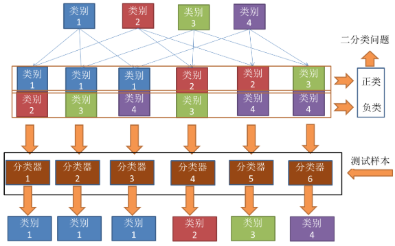
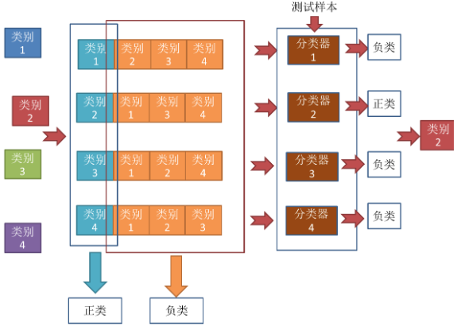
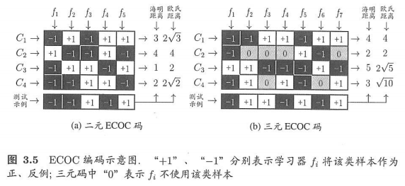

### 多分类学习策略

***

本文介绍机器学习中的多分类拆分策略，参考资料如下：

周志华 《机器学习》

[机器学习中的多分类任务入门](https://blog.csdn.net/qq_22238533/article/details/77774223)

[【机器学习】多分类学习的拆分策略](https://blog.csdn.net/qq_22238533/article/details/77774223)

#### 1. “一对一”（OvO）

“一对一”策略，即One v.s. One，简称OvO。给定数据集合$D = \left\{ \left( \boldsymbol { x } _ { 1 } , y _ { 1 } \right) , \left( \boldsymbol { x } _ { 2 } , y _ { 2 } \right) , \ldots , \left( \boldsymbol { x } _ { m } , y _ { m } \right) \right\}$，$y _ { i } \in \left\{ C _ { 1 } , C _ { 2 } , \dots , C _ { N } \right\}$。 OvO将这$N$个类别两两配对，从而产生$N(N-1)/2$个二分类任务。例如OvO将为区分类别$C_i$和$C_j$训练一个分类器，该分类器把$D$中的$C_i$类样例作为正例，$C_j$类样例作为反例。在测试阶段，新样本将同时提交给所有分类器，于是我们将得到$N(N-1)/2$个分类结果，最终结果可通过投票产生：即把被预测得最多的类别作为最终分类结果。

OvO的示意图如下：

可以得到4个类别一共产生了6个二分类器，预测最多的是类别1，所以最终的预测结果就是类别1。

#### 2. “一对其余”（OvR）

“一对其余”策略，即One v.s Rest，简称OvR。OvR每次将一个类的样例作为正例、所有其他类的样例作为反例来训练$N$个分类器。在测试时若仅有一个分类器预测为正类，则对应的类别标记作为最终分类结果。若有多个分类器预测为正类，则通常考虑各分类器的预测置信度，选择置信度最大的类别标记作为分类结果。

OvR的示意图如下：

可以看到，只有一个分类器预测为正例，对应类别2，最终的预测结果就是类别2。而预测为负例的分类器实际上可以忽略。

#### 3. OvO v.s. OvR

容易看出，OvR只需训练$N$个分类器，而OvO需训练$N(N - 1)/2$个分类器， 因此，**OvO的存储开销和测试时间开销通常比OvR更大。**但在训练时，OvR的每个分类器均使用全部训练样例，而OvO的每个分类器仅用到两个类的样例，因此，**在类别很多时，OvO的训练时间开销通常比OvR更小**。至于预测性能，则取决于具体的数据分布，在**多数情形下两者差不多**。

#### 4. “多对多”（MvM）

”多对多“策略，即Many v.s Many，简称MvM。MvM是每次将若干个类作为正类，若干个其他类作为反类。显然，OvO和OvR是MvM的特例。MvM的正、反类构造必须有特殊的设计，不能随意选取。这里我们介绍一种最常用的MvM技术"纠错输出码" (Error CorrectingOutputCodes，简称 ECOC)。

ECOC是将编码的思想引入类别拆分，并尽可能在解码过程中具有容错性。ECOC工作过程主要分为两步:

* 编码：对$N$个类别做$M$次划分，每次划分将一部分类别划为正类，一部分划为反类，从而形成一个二分类训练集。这样一共产生$M$个训练集，可训练出$M$个分类器。
* 解码：$M$个分类器分别对测试样本进行预测，这些预测标记组成一个编码。将这个预测编码与每个类别各自的编码进行比较，返回其中距离最小的类别作为最终预测结果。

类别划分通过"编码矩阵"指定。编码矩阵有多种形式，常见的主要有**二元码**和**三元码**。前者将每个类别分别指定为正类和反类，后者在正、反类之外，还可指定"停用类"。示意图如下：

在解码阶段，各分类器的预测结果联合起来形成了测试示例的编码，该编码与各类所对应的编码进行比较，将距离最小的编码所对应的类别作为预测结果。在上图3.5(a)中，若基于欧民距离，预测结果将是$C_3$。

* **为什么称为"纠错输出码"呢?**

  这是因为在测试阶段，ECOC编码对分类器的错误有一定的容忍和修正能力。例如图3.5(a) 中对测试示例的正确预测编码是$(-1，+1，+1，-1，+1)$，假设在预测时某个分类器出错了，例如$h$出错从而导致了错误编码$(-1，-1，+1，-1，+1)$，但基于这个编码仍能产生正确的最终分类结果$C_3$。**一般来说，对同一个学习任务，ECOC编码越长，纠错能力越强**。

*  **EOCO编码长度越长，纠错能力越强，那长度越长越好吗？**

   NO！编码越长，意味着所需训练的分类器越多，计算、存储开销都会增大；另一方面，对有限类别数，可能的组合数目是有限的，码长超过一定范围后就失去了意义。

  对同等长度的编码，理论上来说，任意两个类别之间的编码距离越远，则纠错能力越强。因此，在码长较小时可根据这个原则计算出理论最优编码。然而，码长稍大一些就难以有效地确定最优编码，事实上这是NP难问题。不过，通常我们并不需获得理论最优编码，因为**非最优编码在实践中往往己能产生足够好的分类器**。另一方面，**并不是编码的理论性质越好，分类性能就越好**，因为机器学习问题涉及很多因素，例如将多个类拆解为两个“类别子集”，不同拆解方式所形成的两个类别子集的区分难度往往不同，即其导致的二分类问题的难度不同。于是一个理论纠错牲质很好、但导致的二分类问题较难的编码，与另一个理论纠错性质差一些、但导致的二分类问题较简单的编码，最终产生的模型性能孰强孰弱很难说。

  