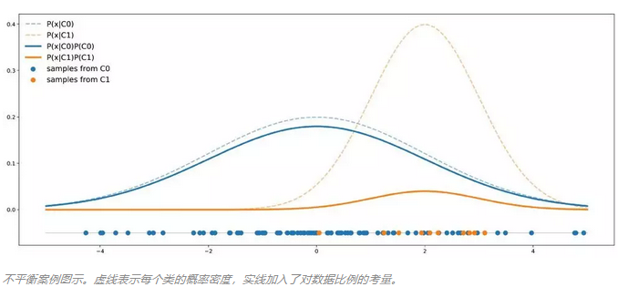
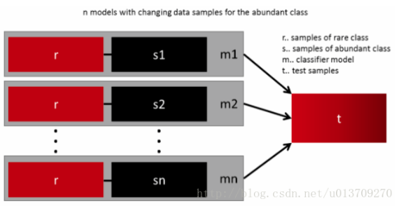
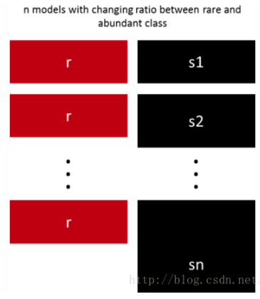
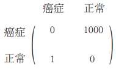

### 类别不平衡问题的解决方法

【**参考资料**】

周志华	《机器学习》

机器之心   [机器学习中如何处理不平衡数据？](https://mp.weixin.qq.com/mp/profile_ext?action=home&__biz=MzIzNjc1NzUzMw==&scene=124#wechat_redirect)

CSDN   [分类中常见的类别不平衡问题解决方法](https://blog.csdn.net/u013829973/article/details/77675147#7%E4%BB%8E%E4%B8%80%E4%B8%AA%E6%96%B0%E7%9A%84%E8%A7%92%E5%BA%A6%E7%90%86%E8%A7%A3%E9%97%AE%E9%A2%98)

CSDN   [机器学习中的数据不平衡解决方案大全](https://blog.csdn.net/u013709270/article/details/72967462)

#### 1. 认识类别不平衡问题

通常的分类学习方法中都有一个共同的假设，即不同类别的训练样例数目相同。如果不同类别的训练样例数目稍有差别，通常对分类影响不大，但是若差别很大，则会对学习造成影响，测试结果非常差。例如二分类问题中有998个反例，正例有2个，那么学习方法只需返回一个永远将新样本预测为反例的分类器，就能达到99.8%的正确率；然而这样的分类器没有价值。

类别不平衡（class-imbalance）是指分类任务中不同类别的训练样例数目差别很大的情况。一般来说，如果类别不平衡比例超过4:1，那么其分类器会大大地因为数据不平衡性而无法满足分类要求的。因此在构建分类模型之前，需要对分类不平衡性问题进行处理。

##### 1.1 识别类别不平衡

当数据集中存在类别不平衡时，仅仅通过观察正确率显然是无法将其识别出来的，这时候我们需要考虑其他评价指标。最基本的是观察混淆矩阵，以及各个类别对应的精度和召回率，尤其是召回率。F1分数、ROC曲线和AUC也可以作为评价标准。

##### 1.2 关于可分离性

我们来更好地理解一下类别不平衡问题。假设现在我们有两个类：C0和C1，其中C0 的点遵循均值为 0、方差为 4 的一维高斯分布；C1 的点遵循均值为 2 、方差为 1 的一维高斯分布。假设数据集中 90% 的点来自 C0，其余 10% 来自 C1。下图是包含 50 个点的数据集按照上述假设的理论分布情况：

在这个例子中，我们可以看到 C0 的曲线总是在 C1 曲线之上，因此对于任意给定点，它出自 C0 类的概率总是大于出自 C1 类的概率。用贝叶斯公式来表示，即：
$$
\mathbb { P } ( C 0 | x ) = \frac { \mathbb { P } ( x | C 0 ) \mathbb { P } ( C 0 ) } { \mathbb { P } ( x ) } > \frac { \mathbb { P } ( x | C 1 ) \mathbb { P } ( C 1 ) } { \mathbb { P } ( x ) } = \mathbb { P } ( C 1 | x )
$$
在这里我们可以清楚地看到先验概率的影响，以及它如何导致一个类比另一个类更容易发生的情况。这就意味着，即使从理论层面来看，只有当分类器每次判断结果都是 C0 时准确率才会最大。所以假如分类器的目标就是获得最大准确率，那么我们根本就不用训练，直接全部判为 C0 即可。

但是类别不平衡并不总是会对分类器性能造成影响的。例如，我们仍假设数据集中 C0、C1 的比例分别为 90% 和 10%；但 C0 遵循均值为 0 、方差为 4 的一维高斯分布、C1 遵循均值为 10 、方差为 1 的一维高斯分布。如下图所示：

在这里我们看到，与前一种情况相反，C0 曲线并不总是高于 C1 曲线，因此有些点出自 C1 类的概率就会高于出自 C0 的概率。在这种情况下，两个类分离得足够开，足以补偿不平衡，分类器不一定总是得到 C0 的结果。

所以，**数据不平衡不代表两个类无法很好地分离，要具体问题具体分析**。

#### 2. 重新处理数据集

解决类别不平衡问题最直接的方法就是扩大数据集，除此以外，还有其他平衡数据集的方法。

##### 2.1 欠采样

欠采样（under-sampling）是指对大类的数据样本进行采样来减少该类数据样本的个数，使其与其他类数目接近，然后再进行学习。不过欠采样若随机丢弃大类样本，可能会丢失一些重要信息。 

解决这个问题的代表算法是**EasyEnsemble**：利用集成学习机制，将大类划分为若干个集合供不同的学习器使用。这样对每个学习器来看都进行了欠采样，但在全局来看却不会丢失重要信息。

##### 2.2 用不同比例欠采样

合适的欠采样比例在很大程度上取决于所使用的数据和模型。进行多次欠采样时，可以尝试使用不同的采样比例，比如有10个模型被训练，那么可能一个比例为1：1（稀有：丰富）的模型和另一个1：3甚至是2：1的模型都是有意义的。最后再把这些模型的结果集成起来。

##### 2.3 过采样

过采样（over-sampling ）是指对小类的数据样本进行采样来增加小类的数据样本个数。 最简单的做法是对小类样本进行重复采样，不过这样有可能会招致严重的过拟合。所以大多数情况下选择合成小类别样本数据，代表算法是**SMOTE**，其做法是通过对训练集中的小类数据进行插值来产生额外的小类样本数据。

过采样法的时间开销通常要远大于欠采样，因为欠采样是丢弃大类别的样本，而过采样则引入了更多的小类别样本。

##### 2.4 聚类筛选

我们还可以通过一种更加优雅的方法来对样本数较多的大类别进行筛选。首先，我们对具有大量样本的丰富类进行聚类操作，假设使用K-means聚类，那么我们可以令K值等于稀有类中的数据样本数目。然后，我们仅保留聚类后的中心点，将其作为富类样本的代表样例，类别标签与原来一致。这样我们就得到了与稀有类别样本数目相等，同时也更具代表性的富类样本。

#### 3. 重新处理问题

人为平衡数据集的方法有时会导致数据的真实分布发生变化，在训练模型时容易引入偏差，导致用平衡后的数据训练出来的模型应用到实际场景中时，效果反而比平衡前更差。这时我们可以换一个角度，不是从数据集本身，而是从重新表示问题出发，来解决类别不平衡问题。

##### 3.1惩罚目标函数

标准的分类目标函数对所有类别的分类错误都是一视同仁的，但在真实案例中，错误的代价有时是不对称的。比如将癌症病人诊断为正常和将正常病人诊断为癌症的代价就截然不同，显然前者的错误代价要高昂的多。因此我们可以对目标函数进行重新加权，当模型将小类别样本错分为大类别样本时，给予其更多的惩罚，这样可以使分类器更加“关心”小类样本。

一个比较简单的做法就是使用各类别样本数目的倒数对目标函数进行重新加权。当然也可以手动设置惩罚矩阵，比如在癌症诊断的例子中，我们给将癌症错分为正常的情况分配1000的权重，给正常错分为癌症的情况分配1的权重，那么惩罚矩阵就是下面这样的：

当然，设置惩罚矩阵是一个复杂的事，因此你需要根据你的任务尝试不同的惩罚矩阵，并选取一个较好的惩罚矩阵。

通过改变目标函数来解决类别不平衡的做法又被称为**代价敏感学习**（cost-sensitive learning）。

##### 3.2 阈值移动

通常来讲，在进行（二）分类时，我们是将输出$y$值与一个阈值进行比较，在$y>0.5$时判断为正类，否则为负类。$y$实际上表达了正类的可能性，几率$\frac{y}{1-y}$则反映了正类可能性与负类可能性之比值，阈值设置为0.5恰表明分类器认为真实正、反类可能性相同，即分类器决策规则为：

若$\frac {y}{1-y} >1​$，则预测为正类。

然而，当训练集中正、反类别的数目不同时，令$m^{+}​$表示正类数目，$m^{-}​$表示负类数目，则观测几率是$\frac {m^{+}}{m^{-}}​$，由于我们通常假设训练集是真实样本总体的无偏估计，因此观测几率就代表了真实几率。于是，只要分类器的预测几率高于观测几率就应判定为正类，即：

若$\frac {y}{1-y} > \frac{m^{+}}{m^{-}}​$，则预测为正类。

但是，我们的分类器实际上还是基于$\frac {y}{1-y} >1$在进行决策，因此需要对其预测值进行调整，使其在基于$\frac {y}{1-y} >1$决策时，实际是在执行$\frac {y}{1-y} > \frac{m^{+}}{m^{-}}$，为此，我们只需令
$$
\frac { y ^ { \prime } } { 1 - y ^ { \prime } } = \frac { y } { 1 - y } \times \frac { m ^ { - } } { m ^ { + } }
$$
就可以做到这一点。所以接下来我们只要使用原始数据集进行训练，在基于上式对预测值进行缩放，然后按照正常方式决策即可。这一策略被称为“再缩放”（rescaling）或阈值移动（threshold-moving）。“再缩放”的思想也是代价敏感学习的基础。

##### 3.3 拆分大类别

另一种直观的做法是重新观察数据，对样本数较多的类别进行拆分，将其转化为数量相对较少的若干个子类，再与稀少类别一同训练。不过应用这种方法的前提是大类别确实能够拆分成具有一定差别的小类别，否则容易造成分类的混淆；另外，每个子类的标签也发生了变化。（一般不推荐这种做法。）

##### 3.4 换角度思考问题

我们可以从不同于分类的角度去解决数据不均衡性问题，我们可以把那些小类的样本作为异常点(outliers)，因此该问题便转化为异常点检测(anomaly detection)与变化趋势检测问题(change detection)。 

异常点检测即是对那些罕见事件进行识别。如：银行信用卡诈骗识别，几十万中样本中可能有几百个诈骗用户。这些事件相对于正常情况是很少见的。 

变化趋势检测类似于异常点检测，不同在于其通过检测不寻常的变化趋势来识别。如通过观察用户模式或银行交易来检测用户行为的不寻常改变。

#### 4. 尝试不同的分类算法

因为不同的算法适用于不同的任务与数据，应该使用不同的算法进行比较。决策树往往在类别不均衡数据上表现不错。它使用基于类变量的划分规则去创建分类树，因此可以强制地将不同类别的样本分开。目前流行的决策树算法有：C4.5、C5.0、CART和Random Forest等。