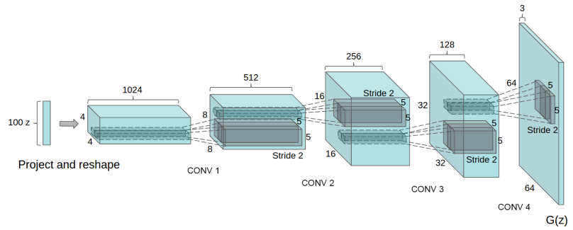

#### DCGAN小结

***

【参考文献】

Unsupervised Representation Learning with Deep Convolutional Generative Adversarial Networks	2015

DCGAN是将CNN结构与GAN结合到一起的典型工作。DCGAN探索了一些稳定训练的实践：

* **下采样**：所有的池化层都用strided convolution替代；
* **全连接层**：移除卷积层之上的全连接层；
* **BN**：除了generator的output layer和discriminator以外的层使用BN；
* **激活函数**：generator中除最后一层使用tanh激活，其他所有层使用relu；discriminator的所有层都使用leaky relu，输出层除外使用sigmoid；

关于第二点移除全连接层，在generator中，输入层可以视为一个全连接层，它负责将采样到的vector $z$ 映射为一个新的vector，然后这个vector会被reshape成图像形式的尺寸输入到后续层；在discriminator中，最后的卷积输出会被展平并输入到一个sigmoid单元中用于判别；除此以外，整个结构中没有任何全连接层。

其他细节：

* 真实图像要被归一化到[-1, 1]区间内，以便与generator的tanh输出匹配。

