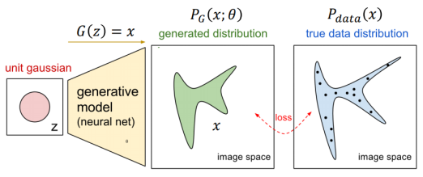
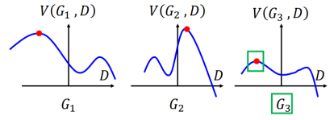
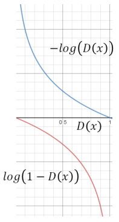
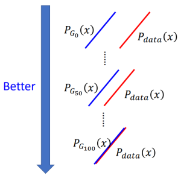
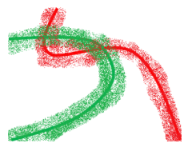
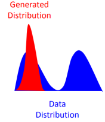
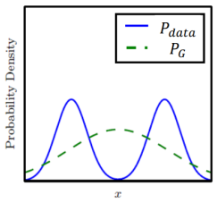
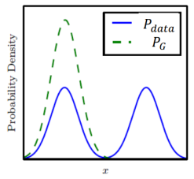

### GAN的基本原理介绍

#### 0. 声明

这份学习笔记大量参考了台大李宏毅老师2017年春季《Machine Learning and having it deep and structured》课程中GAN的部分，课程链接如下：

http://speech.ee.ntu.edu.tw/~tlkagk/courses_MLDS17.html

#### 1. 基本介绍

通常我们在做generation的时候，会期望生成的数据分布$P _ { G } ( x ; \theta )$尽可能的接近真实的数据分布$P _ { d a t a } ( x )$。如果用KL散度来来衡量，那么我们的目标就是找到一组参数$\theta$使得
$$
\arg \min _ { \theta } K L \left( P _ { d a t a } ( x ) \| P _ { G } ( x ; \theta ) \right)
$$
怎么得到$P _ { G } ( x ; \theta )$呢？混合高斯分布是一个可行的方法，我们可以调整高斯分布的均值和方差等参数，来让KL散度最小。但高斯混合能表示的分布数目是有限的，我们希望使用一个更一般化的分布，这时候就要借助神经网络来实现。
GAN就是通过NN来生成这样一个更加泛化的分布。

GAN由两部分组成：生成器$G$ (Generator)和判别器$D$ (Discriminator)。生成器$G$的输入从一个标准高斯分布中采样得到，输出就是生成的分布。判别器$D$负责衡量生成分布和原始分布之间的差异，鉴别输入是机器生成的结果还是真实的数据。GAN的训练过程就是生成器和判别器博弈对抗的过程，我们最终的目的是希望判别器不能分辨其输入到底是生成的还是真实的，从而得到一个很接近真实分布的生成结果。

#### 2. 数学原理

下面我们将从理论上来分析GAN是如何做到数据分布生成的。
首先给出GAN的目标函数：
$$
G ^ { * } = \arg \min _ { G } \max _ { D } V ( G , D ) \tag{2.1}
$$
其中$G ^ { * }$就是我们要寻找的生成器，$V ( G , D )$是一个具有如下形式的函数：
$$
V = E _ { x \sim P _ {data} } [ \log D ( x ) ] + E _ { x \sim P _ { G } } [ \log ( 1 - D ( x ) ) ] \tag{2.2}
$$
我们可以借助图示来更好地理解GAN目标函数中的$“min max”$操作。

给定一个生成器$G$，我们可以得到不同形式的$V ( G , D )$。显然$G$可以有无穷多个，相应的$V ( G , D )$也有无穷多个。为简单起见，这里我们只取其中的三个：

$\max _ { D } V ( G , D )$对应于图中曲线上的红色点，它度量了$P _ { G }$和$P _ { d a t a } ( x )$之间的差异（原因之后会解释）。显然，使得$\max _ { D } V ( G , D )$最小的$G$就是我们要找的生成器，对应于图中绿色框的部分。
那么现在的问题是，在$G$给定的情况下，如何找到使得函数V的值最大的$D ^ { * }​$呢？

首先我们把函数$V$改写成如下的形式：
$$
\begin{eqnarray} V & = & E _ { x \sim P _ { \text {data} } } [ \log D ( x ) ] + E _ { x \sim P _ { G } } [ \log ( 1 - D ( x ) ) ] \tag{2.2} \\\\ 
& = & \int _ { x } P _ { \text {data} } ( x ) \log D ( x ) d x + \int _ { x } P _ { G } ( x ) \log ( 1 - D ( x ) ) d x \\\\ 
& = & \int _ { x } \left[ P _ {data} ( x ) \log D ( x ) + P _ { G } ( x ) \log ( 1 - D ( x ) ) \right] d x \end{eqnarray}
$$
假设这里的$D ( x )$可以是任何值，在$x$的值给定的情况下，只要我们能让被积函数的值最大，那么对每个$x$积分后的结果自然就会是最大的。因此，$D ^ { * }$就是使得下式取最大值的点：
$$
f(D) = P _ {data} ( x ) \log D ( x ) + P _ { G } ( x ) \log ( 1 - D ( x ) ) \tag{2.3}
$$
在$G$给定的情况下，数据的原始分布$P _ { d a t a } ( x )$和生成分布$P _ { G }$是确定的常数，只有$D ( x )$是变量，要找到最大值点，只要让式(2.1)对$D ( x )$求导的结果等于0，即：
$$
\frac { d f ( D ) } { d D }=0
$$
可以得到最大值点$D ^ { * }$为：
$$
D ^ { * } ( x ) = \frac { P _ { \text {data} } ( x ) } { P _ { \text { data } } ( x ) + P _ { G } ( x ) }
$$
将$D ^ { * }$的结果代入原函数$V$中，并且进行（一串长长地）公式改写:
$$
\begin{eqnarray}

\max _ { D } V ( G , D ) &=& V \left( G , D ^ { * } \right) \\

&=& E _ { x \sim P _ { \text {data} } } \left[ \log \frac { P _ { \text {data} } ( x ) } { P _ { \text {data} } ( x ) + P _ { G } ( x ) } \right] \\
&& + E _ { x \sim P _ { G } } \left[ \log \frac { P _ { G } ( x ) } { P _ { d a t a } ( x ) + P _ { G } ( x ) } \right] \\\\

&=& \int _ { x } P _ { d a t a } ( x ) \log \frac { P _ { d a t a } ( x ) } { P _ { d a t a } ( x ) + P _ { G } ( x ) } d x \\
&& + \int _ { x } P _ { G } ( x ) \log \frac { P _ { G } ( x ) } { P _ { d a t a } ( x ) + P _ { G } ( x ) } d x \\\\

&=& \int _ { x } P _ { d a t a } ( x ) \log \frac { \frac {1}{2} P _ { d a t a } ( x ) } { \frac {1}{2} [P _ { d a t a } ( x ) + P _ { G } ( x )] } d x \\
&& + \int _ { x } P _ { G } ( x ) \log \frac { \frac {1}{2} P _ { G } ( x ) } { \frac {1}{2} [P _ { d a t a } ( x ) + P _ { G } ( x )] } d x \\\\

&=& - 2 \log 2 + \int _ { x } P _ { d a t a } ( x ) \log \frac { P _ { \text {data} } ( x ) } { \left( P _ { \text {data} } ( x ) + P _ { G } ( x ) \right) / 2 } d x \\
&& + \: \int _ { x } P _ { G } ( x ) \log \frac { P _ { G } ( x ) } { \left( P _ { d a t a } ( x ) + P _ { G } ( x ) \right) / 2 } d x \\\\

& = & - 2 \log 2 + \mathrm { KL } \left( P _ { data } ( x ) \| \frac { P _ { \text { data } } ( x ) + P _ { G } ( x ) } { 2 } \right) \\ 
&&  + \mathrm { KL } \left( P _ { G } ({ x }) \| \frac {P _ { data } ( x ) + P _ { G }  ( x ) } { 2 } \right)\\\\

& = & - 2 \log 2 + 2 J S D \left( P _ { d a t a } ( x ) \| P _ { G } ( x ) \right) \tag{2.4}

\end{eqnarray}
$$
等式（2.4）中的$JSD$函数被称为$Jensen-Shannon \; divergence$，其定义如下：
$$
\begin{align} 
\mathrm { JSD } ( P \| Q ) =& \frac { 1 } { 2 } D ( P \| M ) + \frac { 1 } { 2 } D ( Q \| M ) \\\\ 
M =& \frac { 1 } { 2 } ( P + Q )
\end{align}
$$
注意$JS$散度是对称化的，这一点与$KL$散度不同。当然作为一种$divergence$，$JS$散度同样具有衡量两个分布之间差异性的能力。因此，式（2.4）告诉我们，$\max _ { D } V ( G , D ) = V \left( G , D ^ { * } \right)$这一项所代表的，就是原始数据分布$P_{data}$和生成数据分布$P_{G}$之间的$JS$散度。

现在我们再回过头来看式（2.1）
$$
G ^ { * } = \arg \min _ { G } \max _ { D } V ( G , D ) \tag{2.1}
$$
可以发现，GAN的优化目标实际上就是找到使得原始数据分布$P_{data}$和生成数据分布$P_{G}$之间的$JS$散度最小的生成器$G ^ { * }$！

需要注意的是，在实际操作中，我们无法计算得到式（2.2）中期望的真实值（因为概率分布取值是连续的）:
$$
V = E _ { x \sim P _ {data} } [ \log D ( x ) ] + E _ { x \sim P _ { G } } [ \log ( 1 - D ( x ) ) ] \tag{2.2}
$$
一般的做法是从数据的原始分布和生成分布中采样若干点来估计式（2.2）：
$$
\tilde { V } = \frac { 1 } { m } \sum _ { i = 1 } ^ { m } \log D \left( x ^ { i } \right) + \frac { 1 } { m } \sum _ { i = 1 } ^ { m } \log \left( 1 - D \left( \tilde { x } ^ { i } \right) \right) \tag{2.5}
$$
其中$x ^ { i }$和$\tilde { x } ^ { i }$分别是来自原始分布$P_{ data }$和生成分布$P_{ G }$的采样数据点。

我们可以对式（2.5）作进一步的讨论。如果我们把真实数据$x^{i}$看作正样本，生成数据$\tilde { x } ^ { i }$看作负样本，那么式（2.5）取负的结果正好就是传统的$binary \; cross \; entropy \; loss$，这完美符合了discriminator作为二元分类器的设定！从直观上，我们可以理解为，Discriminator的loss越大，原始分布和生成分布的$JS$散度就越小，Discriminator就越不能分辨输入数据的真假。

#### 3. 训练方式

GAN的训练过程实质上是Generator和Discriminator进行“回合制”博弈的过程。在训练时，我们通常会固定住$G$或者$D$其中一个的参数，然后调节另一个的参数。训练的算法如下：

事实上，在更新Generator的参数时，我们会做如下简化：
$$
\begin{eqnarray}
\tilde { V } &=& \frac { 1 } { m } \sum _ { i = 1 } ^ { m } \log D \left( x ^ { i } \right) + \frac { 1 } { m } \sum _ { i = 1 } ^ { m } \log \left( 1 - D \left( G \left( z ^ { i } \right) \right) \right) \tag{2.6} \\\\
\rightarrow \tilde { V } &=& \frac { 1 } { m } \sum _ { i = 1 } ^ { m } \log \left( 1 - D \left( G \left( z ^ { i } \right) \right) \right) \tag{2.7}
\end{eqnarray}
$$
这是因为式（2.6）中的第一项与Generator  $G$的参数更新无关

这里有一个小的trick，在实际操作中，我们通常不会采用式（2.7）的形式（尽管理论上应该使用），而是用如下式子代替：
$$
\tilde { V } = -\frac { 1 } { m } \sum _ { i = 1 } ^ { m } \log \left( D \left( G \left( z ^ { i } \right) \right) \right) \tag{2.8}
$$
这样作的原因是由于式（2.7）的函数曲线在一开始时下降的比较平缓，会造成训练缓慢，而式（2.8）的函数曲线在一开始时下降很快，并且其趋势是与式（2.7）一致的，如下图所示：

为了实现这个目的，实际操作时我们需要将来自生成分布的数据点的label也设为1。

*（事实上，有文献证明在这种情况下GAN优化的是一个包含了 $reverse \; KL \; divergence$项的奇怪度量。）*

#### 4. 存在问题

我们已经知道GAN实际上是在利用$JS$散度来衡量两个分布之间的相似性，然而这种做法本身存在一些问题。在实际训练的过程中，尽管generator生成的图片从肉眼看上去已经很接近真实情况，但是discriminator还是能够很轻易将它们和真实图片区分开来。换句话说，discriminator的loss在大部分情况下都是0，这会造成继续训练的困难。

从直觉上来说，generator从产生随机的噪声到生成以假乱真的图片这一过程，并非是一步到位的，中间必然会存在一些过渡情况。我们可以假设初始的生成分布是$P_ { G _ {0}}(x)$，而模型经过一百次迭代后得到的生成分布$P_{ G_{ 100 } } (x)$已经和真实分布$P_{ data } (x)$相差无几，此时它们的$JS$散度是0。理想情况下，我们希望在之前的迭代中，生成器生成的分布能够逐步逼近真实分布$P_{ data } (x)$，如下图所示：

尽管在我们看来，中间状态$P_{ G_{50} }$已经要比初始状态$P_ { G _ {0}}$更加接近真实数据分布，但是当用$JS$散度作为度量时，$P_{ G_{50} }$和$P_ { G _ {0}}$的表现都是一样的，它们和$P_{ data } (x)$的$JS$散度都是0 （因为分布之间没有任何交叠的部分）。说的形象一些的话，尽管generator已经在尝试做的更好，但discriminator还是能轻易的否决它的“努力”，那么相对来讲generator就会比较没有动力继续朝着更好的方向“进化”，从而造成训练的困难。

既然discriminator表现这么强大，为什么我们不弱化它呢？这其实是一个比较暧昧的问题，因为我们很难确定要将discriminator弱化到什么样的程度。式（2.4）告诉我们，$\max _ { D } V ( G , D )$代表的才是$JS$散度，如果我们将discriminator弱化，它还能找到最大值点，从而正确的计算$JS$散度吗？这点我们不得而知。

一个可行的解决方法是对discriminator的输入加上一定的噪声，也就是让label变得noisy。在这种情况下，discriminator不再能够完美的分辨数据是真实的还是生成的，因为真实分布和生成分布之间的重叠部分变大了。随着模型的迭代，我们会让噪声逐渐衰减。通过这种方式，我们慢慢地引导generator的生成结果逐渐向真实情况逼近。

另一个会经常遇到的问题是**模式崩塌**（*Mode Collapse*），也就说，generator会倾向于输出非常相似的结果，如下图所示：

为什么会出现这种情况呢？起初Ian Goodfellow给出了一个解释。在通常情况下，我们希望优化如下的$KL$散度：
$$
K L = \int P _ { d a t a } \log \frac { P _ { d a t a } } { P _ { G } } d x \tag{4.1}
$$
对于式（4.1）来说，当$P_{ data }$有值而$P_{ G }$为0时，$KL$散度会是无穷大，而优化目标是要最小化$KL$散度，因此模型会竭力避免这种情况，在$P_{ data }$有值时$P_{ G }$也一定要有值，其结果是模型生成的$P_{ G }$会倾向于覆盖$P_{ data }$，哪怕在某些点上$P_{ G }$和$P_{ data }$的值相差很大，如下图：

但在实际训练过程中，我们优化的是式（4.1）的reverse版本（见式（2.7）），即
$$
Reverse \; K L = \int P _ { G } \log \frac { P _ { G } } { P _ { d a t a } } d x \tag{4.2}
$$
对于式（4.2）来说，如果在$P_{ data }$没有值的地方$P_{ G }$产生了一个值，就会使式（4.2）变得无穷大，所以模型生成的$P_{ G }$会倾向于固守在某个区域，而不愿意进行“冒险”，其结果是模型会在某一点上产生一个很高耸的分布，如下图：

这个解释不一定是模式崩塌产生的真正原因。因为实际上我们可以改变loss函数的设计，让模型去优化$KL$散度而不是$Reverse \; KL$散度。但是即便进行了这样的改进，模式崩塌的问题也依旧存在。