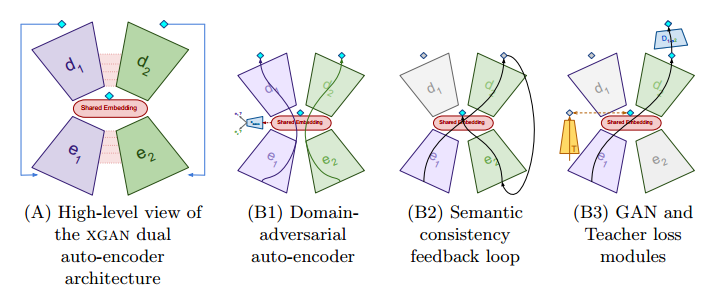

### GAN的无监督条件生成（三）：ComboGAN和XGAN

***

【参考文献】

[1] ComboGAN: Unrestrained Scalability for Image Domain Translation	2017

[2] XGAN: Unsupervised Image-to-Image Translation for Many-to-Many Mappings	2017

GAN的无监督条件生成一般是指图像翻译的任务，通常做法有两类，一类是直接进行转换，另一类是将不同的domain投影到同一个空间。本篇笔记介绍后一类方法的两个代表性工作：ComboGAN和XGAN。

#### 1. ComboGAN

ComboGAN旨在解决多domain之间的图像转换问题。如果有$n$个不同的domain，使用类似CycleGAN的直接转换方法一共需要$2\left(\begin{array}{l}{n} \\ {2}\end{array}\right)=n(n-1)$组生成器和判别器，效率太低。因此，ComboGAN采取将各个domain的图像投影到同一个隐空间的做法，这样每个domain都只需要一组encoder-decoder和一个判别器，转换效率可以得到提高。

进行domain $i$到domain $j$的转换时，只需要将domain $i$的encoder和domain $j$的decoder配对即可。

ComboGAN的目标函数包括三部分：第一部分是同一个domain的encoder和decoder对输入图像的重建loss；第二部分是用来判别转换后图像是否真实的GAN loss；第三部分是要求将转换后图像再转换回去和原始图像保持一致的cycle consistency loss。

每次迭代之前，从所有domain中随机选取两个来进行训练。训练时间是随domain的数量而线性增长的，而不需要大量时间开销来训练多组CycleGAN。

#### 2. XGAN

XGAN旨在捕捉不同域的图像之间存在的相同的高级语义信息。XGAN的作者指出 [2] ，要让图像转换后的语义信息保持不变，只进行image-level的cycle consistency是不足的，作为替代，作者引入了domain adaption中的semantic consistency loss，也就是feature-level的cycle consistency loss。

XGAN同样对每个domain都使用了encoder-decoder-discriminator这样的结构。

**训练的目标函数包含五个部分**：

* **Reconstruction loss：**
  $$
  \mathcal{L}_{r e c, 1}=\mathbb{E}_{\mathbf{x} \sim p_{\mathcal{D}_{1}}}\left(\left\|\mathbf{x}-d_{1}\left(e_{1}(\mathbf{x})\right)\right\|_{2}\right)
  $$
  对于另一个domain也类似。

* **Domain-adversarial loss**：用对抗的方式使得两个domain提出的shared embedding保持一致
  $$
  \begin{array}{l}{\max _{\theta_{e_{1}}, \theta_{e_{2}}} \max _{\theta_{\text {dann}}} \mathcal{L}_{\text {dann}}, \text { where }} \\ {\mathcal{L}_{\text {dann}}=\mathbb{E}_{p_{\mathcal{D}_{1}}} \ell\left(1, c_{\operatorname{dann}}\left(e_{1}(\mathbf{x})\right)\right)+\mathbb{E}_{p_{\mathcal{D}_{2}}} \ell\left(2, c_{\operatorname{dann}}\left(e_{2}(\mathbf{x})\right)\right)}\end{array}
  $$

* **Semantic consistency loss：是XGAN的核心**，目的是在转换过程中保留语义信息
  $$
  \mathcal{L}_{\text {sem}, 1 \rightarrow 2}=\mathbb{E}_{\mathbf{x} \sim p_{\mathcal{D}_{1}}}\left\|e_{1}(\mathbf{x})-e_{2}\left(g_{1 \rightarrow 2}(\mathbf{x})\right)\right\|
  $$
  也有两支，另一支的形式类似。

* **GAN objective**：使转换后图像看起来更真实
  $$
  \begin{array}{l}{\min _{\theta_{g_{1} \rightarrow 2}} \max _{\theta_{1 \rightarrow 2}} \mathcal{L}_{g a n, 1 \rightarrow 2}} \\ {\mathcal{L}_{g a n, 1 \rightarrow 2}=\mathbb{E}_{\mathbf{x} \sim p_{\mathcal{D}_{2}}}\left(\log \left(D_{1 \rightarrow 2}(\mathbf{x})\right)\right)+\mathbb{E}_{\mathbf{x} \sim p_{\mathcal{D}_{1}}}\left(\log \left(1-D_{1 \rightarrow 2}\left(g_{1 \rightarrow 2}(\mathbf{x})\right)\right)\right)}\end{array}
  $$

* **Teacher loss**：这是一个可选的loss，目的是让encoder提出的feature和某个预训练好的网络提取出的feature保持一致，可以认为是从一个教师网络中蒸馏先验知识：
  $$
  \mathcal{L}_{\text {teach}}=\mathbb{E}_{\mathbf{x} \sim p_{\mathcal{D}_{1}}}\left\|T(\mathbf{x})-e_{1}(\mathbf{x})\right\|
  $$
  需要注意的是，Teacher loss是非对称的，即只对其中一个domain添加。因为domain shift的存在，同一个教师网络提出来的不同domain的feature是很不一样的，如果对两个domain都添加各自的Teacher loss，会使得encoder提出来的两个domain的embedding离得越来越远，这和我们的目的是相悖的。

总的loss为：
$$
\mathcal{L}_{\mathrm{XGAN}}=\mathcal{L}_{r e c}+\omega_{d} \mathcal{L}_{d a n n}+\omega_{s} \mathcal{L}_{s e m}+\omega_{g} \mathcal{L}_{g a n}+\omega_{t} \mathcal{L}_{t e a c h}
$$
XGAN还采取了参数共享策略，两个domain的encoder的最后两层和decoder的最初两层参数是共享的。

由于文章中做的是人脸图像的风格转换，所以teacher选取的是预训练好的FaceNet（一个人脸识别的网络）的最后一层卷积特征。

