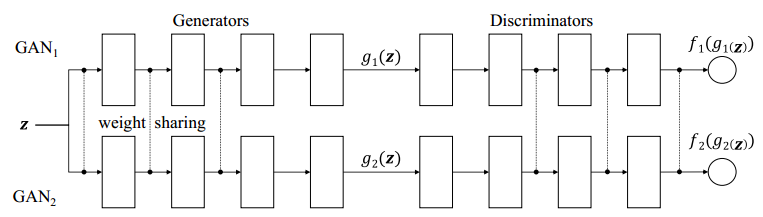
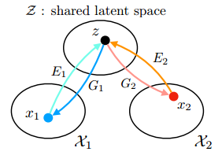
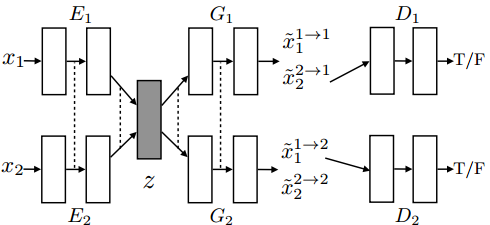
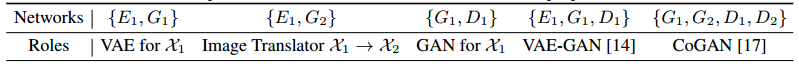
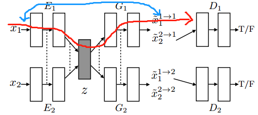
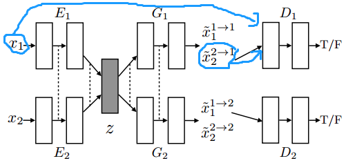
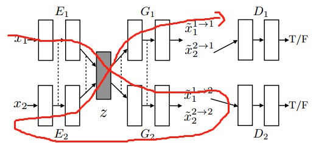
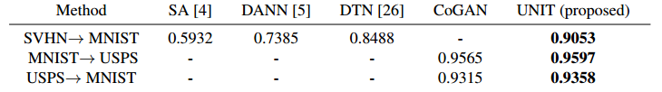

### GAN的无监督条件生成（二）：CoGAN与UNIT

***

【参考文献】

[1] Coupled Generative Adversarial Networks	2017

[2] Unsupervised Image-to-Image Translation Networks	2017

GAN的无监督条件生成一般是指图像翻译的任务，通常做法有两类，一类是直接进行转换，另一类是将不同的domain投影到同一个空间。本篇笔记介绍后一类方法的两个经典工作：CoGAN和UNIT。

#### 1. CoGAN

生成模型，比如GAN中的生成器，一般以随机采样的隐变量作为输入，生成图像作为输出，在这其中，浅层的layer负责从隐变量中解码出抽象的语义信息，而深层layer则负责进一步解码出更具体的图像细节信息。而判别模型则正好相反，比如GAN中的判别器，浅层的layer负责抽取低级别的信息，而高层layer负责抽取更高级的抽象语义信息。

CoGAN（Couple GAN）的基本假设是，**不同domain的一对图像，应该共享同样的高级语义信息**。因此，CoGAN使用了一对GAN，每个GAN负责生成一个domain，对于生成器的浅层layer和判别器的高层layer采用参数共享的策略，保证不同domain对高级语义信息处理的一致性。而domain-specific的信息，则由生成器的高层layer和判别器的浅层layer负责处理。

因此，现在每次只要采样一个隐变量$z$，送入到两支GAN中，就能产生相互关联的一对图像。整个CoGAN可以看作是两组网络的互相对抗，一组是两支GAN的生成器，它们互相合作，另一组是两支GAN的判别器，它们同样有着相互合作的关系。

作者的实验表明 [1]，生成器中共享的层数越多，那么生成的一对图像关联程度就越高，但是判别器中共享层数的多少并没有太大影响，尽管如此，共享判别器的参数依然可以减少参数的数量。

**Unsupervised Domain Adaptation** 

CoGAN可以用于无监督域适应。假如现在domain $D_1$是有label的source domain，domain $D_2$是没有label的target domain。那么CoGAN实现UDA的做法是在判别器上再加一层softmax layer用于分类，并且使用$D_1$的图片和label进行训练。同时，CoGAN还要进行原本的生成一对图像的任务。

由于判别器中高层layer都是共享的，所以$D_1$和$D_2$的分类器的唯一区别就是浅层layer不同。$D_1$的判别器需要处理$D_1$的生成图片和真实图片的鉴别，以及$D_1$的图片分类两个任务，而$D_2$的判别器只需要处理$D_2$的生成图片和真实图片的鉴别。

整个网络训练完毕后，将共享的高层layer与$D_2$的浅层layer组合，就能得到$D_2$上的分类器。这背后的假设依然是两个domain共享同样的高级语义信息，而低级别的domain信息则由domain-specific的低层layer分别处理。

**Cross-Domain Image Transformation**

对于domain $D_1$的一张给定图像$x_1$，CoGAN可以生成它在domain $D_2$的对应图像$x_2$。具体做法是，先根据训练好的生成器$g_1$，找到$x_1$的对应的隐变量$z$，求解如下优化问题：
$$
\mathbf{z}^{*}=\arg \min _{\mathbf{z}} \mathcal{L}\left(g_{1}(\mathbf{z}), \mathbf{x}_{1}\right)
$$
文章中使用了L-BFGS算法来求解这个优化问题。

找到隐变量$z$后，再将其送入$D_2$对应的生成器$g_2$，就能得到转换后的图像$x_2$。

#### 2. UNIT

UNIT（UNsupervised Image-to-image Translation）可以看作是CoGAN的一个改进工作，增强了跨域图像转换的能力。**UNIT的基本假设是，两个domain中的一对图像共享一个相同的隐空间**，因此可以先把其中一个domain的图像转换到共同隐空间，再从共同隐空间映射到另一个domain对应的图像，这种思想与CycleGAN的直接转换不同，中间多了一个隐空间作为桥梁。

UNIT采用了共享参数的两支VAE-GAN结构，并且假定两支VAE的部分拥有相同的隐空间。

与CoGAN类似，UNIT中对编码器$E_1$和$E_2$的高层layer，生成器$G_1$和$G_2$的底层layer都进行了参数共享，来保证语义信息编码和解码的一致性。

UNIT中不同部分扮演的角色如下：

**图像转换的流程**如下：假设给定图像来自domain $\mathcal{X}_{1}$，用$x_1$表示，要生成另一个domain $\mathcal{X}_{2}$中对应的图像$x_2$，首先用对应domain $\mathcal{X}_{1}$的编码器$E_1$对$x_1$进行编码，再用domain $\mathcal{X}_{2}$ 对应的生成器（解码器）$G_2$解码即可。

------

UNIT的**训练过程**比较复杂，涉及到三种loss：

**1）VAE loss**

要求输入图片$x_1$或$x_2$经过VAE后要能重建回原来图像。不同domain产生的后验$q_{1}\left(z_{1} | x_{1}\right) \equiv \mathcal{N}\left(z_{1} | E_{\mu, 1}\left(x_{1}\right), I\right)$和$q_{2}\left(z_{2} | x_{2}\right) \equiv \mathcal{N}\left(z_{2} | E_{\mu, 2}\left(x_{2}\right), I\right)$要向同一个先验$p_{\eta}(z)=\mathcal{N}(z | 0, I)$逼近。注意这里的后验方差固定为1，也就是说没有编码器中没有方差拟合的网络。同时，解码器用Laplacian分布建模，对应的重建loss是L1的形式。
$$
\begin{array}{l}{\mathcal{L}_{\mathrm{VAE}_{1}}\left(E_{1}, G_{1}\right)=\lambda_{1} \operatorname{KL}\left(q_{1}\left(z_{1} | x_{1}\right) \| p_{\eta}(z)\right)-\lambda_{2} \mathbb{E}_{z_{1} \sim q_{1}\left(z_{1} | x_{1}\right)}\left[\log p_{G_{1}}\left(x_{1} | z_{1}\right)\right]} \\ {\mathcal{L}_{\mathrm{VAE}_{2}}\left(E_{2}, G_{2}\right)=\lambda_{1} \operatorname{KL}\left(q_{2}\left(z_{2} | x_{2}\right) \| p_{\eta}(z)\right)-\lambda_{2} \mathbb{E}_{z_{2} \sim q_{2}\left(z_{2} | x_{2}\right)}\left[\log p_{G_{2}}\left(x_{2} | z_{2}\right)\right]}\end{array}
$$

**2）GAN loss**

负责鉴别转换后的图像和真实图像。注意这里只针对转换后的图像（如$\tilde{x}_{2}^{2} \rightarrow 1$）作判别，因为重建图像（如$\tilde{x}_{1}^{1} \rightarrow 1$）已经有reconstruction loss作为约束了。
$$
\begin{array}{l}{\mathcal{L}_{\mathrm{GAN}_{1}}\left(E_{1}, G_{1}, D_{1}\right)=\lambda_{0} \mathbb{E}_{x_{1} \sim P x_{1}}\left[\log D_{1}\left(x_{1}\right)\right]+\lambda_{0} \mathbb{E}_{z_{2} \sim q_{2}\left(z_{2} | x_{2}\right)}\left[\log \left(1-D_{1}\left(G_{1}\left(z_{2}\right)\right)\right)\right]} \\ {\mathcal{L}_{\mathrm{GAN}_{2}}\left(E_{2}, G_{2}, D_{2}\right)=\lambda_{0} \mathbb{E}_{x_{2} \sim P_{\mathcal{X}_{2}}}\left[\log D_{2}\left(x_{2}\right)\right]+\lambda_{0} \mathbb{E}_{z_{1} \sim q_{1}\left(z_{1} | x_{1}\right)}\left[\log \left(1-D_{2}\left(G_{2}\left(z_{1}\right)\right)\right)\right]}\end{array}
$$

**3）Cycle-consistency loss**

为了进一步保证图像转换的质量，还加了Cycle-consistency的约束，即要求转换后的图像再转换回来，要能重建原本的图像。
$$
\begin{aligned} \mathcal{L}_{\mathrm{CC}_{1}}\left(E_{1}, G_{1}, E_{2}, G_{2}\right)=& \lambda_{3} \mathrm{KL}\left(q_{1}\left(z_{1} | x_{1}\right) \| p_{\eta}(z)\right)+\lambda_{3} \mathrm{KL}\left(q_{2}\left(z_{2} | x_{1}^{1 \rightarrow 2}\right)\right) \| p_{\eta}(z) )-\\ & \lambda_{4} \mathbb{E}_{z_{2} \sim q_{2}\left(z_{2} | x_{1}^{1} \rightarrow 2\right)}\left[\log p_{G_{1}}\left(x_{1} | z_{2}\right)\right] \end{aligned}
\\
\begin{aligned} \mathcal{L}_{\mathrm{CC}_{2}}\left(E_{2}, G_{2}, E_{1}, G_{1}\right)=& \lambda_{3} \mathrm{KL}\left(q_{2}\left(z_{2} | x_{2}\right) \| p_{\eta}(z)\right)+\lambda_{3} \mathrm{KL}\left(q_{1}\left(z_{1} | x_{2}^{2 \rightarrow 1}\right)\right) \| p_{\eta}(z) )-\\ & \lambda_{4} \mathbb{E}_{z_{1} \sim q_{1}\left(z_{1} | x_{2}^{2 \rightarrow 1}\right)}\left[\log p_{G_{2}}\left(x_{2} | z_{1}\right)\right] \end{aligned}
$$

所以，**总的loss表示为**：
$$
\begin{array}{c}{\max _{E_{1}, E_{2}, G_{1}, G_{2}} \max _{D_{1}, D_{2}} \mathcal{L}_{\mathrm{VAE}_{1}}\left(E_{1}, G_{1}\right)+\mathcal{L}_{\mathrm{GAN}_{1}}\left(E_{1}, G_{1}, D_{1}\right)+\mathcal{L}_{\mathrm{CC}_{1}}\left(E_{1}, G_{1}, E_{2}, G_{2}\right)} \\ {\mathcal{L}_{\mathrm{VAE}_{2}}\left(E_{2}, G_{2}\right)+\mathcal{L}_{\mathrm{GAN}_{2}}\left(E_{2}, G_{2}, D_{2}\right)+\mathcal{L}_{\mathrm{CC}_{2}}\left(E_{2}, G_{2}, E_{1}, G_{1}\right)}\end{array}
$$
训练$D_1$和$D_2$的时候采用梯度上升，$E_{1}, E_{2}, G_{1},$ 和 $G_{2}$是固定的；训练$E_{1}, E_{2}, G_{1},$ 和 $G_{2}$的时候采用梯度下降，$D_1$和$D_2$是固定的。

------

**Domain Adaptation**

UNIT同样适用于UDA，与CoGAN的做法类似，共享判别器$D_1$和$D_2$高层的参数，同时再加一个softmax layer用于分类。此时网络需要处理两个任务，一是两个domain间的图像翻译，二是对source domain的图像分类。

此外，为了保证$D_1$和$D_2$抽取的高级语义特征的一致性，还对$D_1$和$D_2$的最高层抽取的特征进行了L1约束。所以，为了作UDA，UNIT又引入了两个新的loss，加上之前的图像翻译任务，一共有8个loss。

UNIT的做法比较复杂，但是在UDA任务上，效果并没有比CoGAN提升多少。

