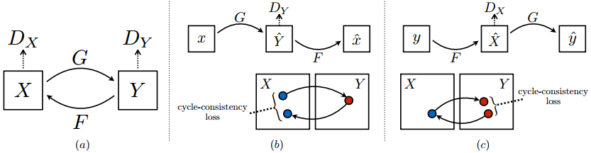
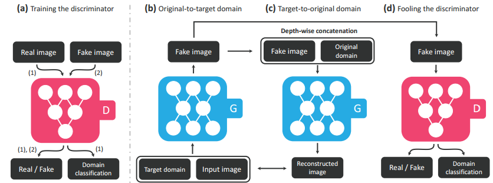
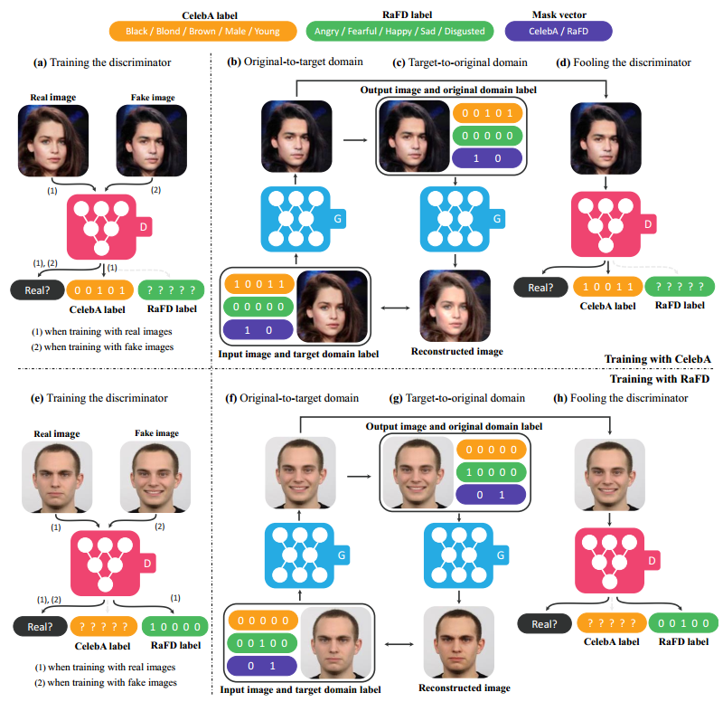

### GAN的无监督条件生成（一）：CycleGAN与StarGAN

***

【参考文献】

[1] Unpaired Image-to-Image Translation using Cycle-Consistent Adversarial Networks	2017

[2] StarGAN: Unified Generative Adversarial Networks for Multi-Domain Image-to-Image Translation	2017

GAN的无监督条件生成一般是指图像翻译的任务，通常做法有两类，一类是直接进行转换，另一类是将不同的domain投影到同一个空间。本篇笔记介绍前一类方法的两个经典工作：CycleGAN和StarGAN。

#### 1. CycleGAN

一些以前的图像翻译问题需要有source domain和target domain的pair数据，而CycleGAN致力于使用unpaired的数据来做到任意两个domain的风格迁移。

**CycleGAN的核心是cycle consistence loss。**也就是说，domain $X$的图像转换到domain $Y$后，再从domain $Y$转换回到domain $X$，产生的图像要和原来的保持一致，反过来也一样。假设现在有两个生成器$G : X \rightarrow Y$和$F : Y \rightarrow X$，那么cycle consistence loss为：
$$
\begin{aligned} \mathcal{L}_{\mathrm{cyc}}(G, F) &=\mathbb{E}_{x \sim p_{\text { data }}(x)}\left[\|F(G(x))-x\|_{1}\right] \\ &+\mathbb{E}_{y \sim p_{\text { data }}(y)}\left[\|G(F(y))-y\|_{1}\right] \end{aligned}
$$
也就是说，CycleGAN中包含两个cycle：前向cycle为$x \rightarrow G(x) \rightarrow F(G(x)) \approx x$，后向cycle为$y \rightarrow F(y) \rightarrow G(F(y)) \approx y$。

当然，还有两个判别器来分别鉴别domain $X$和domain $Y$的生成图像和真实图像。对于domain $Y$，对抗loss为：
$$
\begin{aligned} \mathcal{L}_{\mathrm{GAN}}\left(G, D_{Y}, X, Y\right) &=\mathbb{E}_{y \sim p_{\mathrm{data}}(y)}\left[\log D_{Y}(y)\right] \\ &+\mathbb{E}_{x \sim p_{\mathrm{data}}(x)}\left[\log \left(1-D_{Y}(G(x))\right]\right.\end{aligned}
$$
同理，对于domain $X$来说也一样，对抗loss为$\mathcal{L}_{\mathrm{GAN}}\left(F, D_{X}, Y, X\right)$。

使用cycle consistence loss是必要的，没有这一项，会存在**两个问题**：

* 无法保证domain $X$的图片转换到domain $Y$后还是和原来配对的；
* 模式崩塌问题，生成器只要将domain $X$的图像都映射成domain $Y$中的同一个图像就可以了。

完整的目标函数为：
$$
\begin{aligned} \mathcal{L}\left(G, F, D_{X}, D_{Y}\right) &=\mathcal{L}_{\mathrm{GAN}}\left(G, D_{Y}, X, Y\right) \\ &+\mathcal{L}_{\mathrm{GAN}}\left(F, D_{X}, Y, X\right) \\ &+\lambda \mathcal{L}_{\mathrm{cyc}}(G, F) \end{aligned}
$$

#### 2. StarGAN

StarGAN致力于使用一个生成器来进行多个域之间的风格迁移。这样带来**两个好处**：

* 效率更高，否则对于多个域，就要训练多个一对一的风格迁移模型；
* 可以充分利用数据，多个域、甚至是多个数据集的数据都能用来训练。

StarGAN的做法是把domain label作为条件，和原始图片一同输入生成器，来做到特定domain的图像生成。loss分为三部分：

**1）Adversarial Loss**

就是普通的对抗loss，用来区分真实图片和生成图片：
$$
\begin{aligned} \mathcal{L}_{a d v}=& \mathbb{E}_{x}\left[\log D_{s r c}(x)\right]+\\ & \mathbb{E}_{x, c}\left[\log \left(1-D_{s r c}(G(x, c))\right)\right] \end{aligned}
$$
**2）Domain Classification Loss**

利用了类似于ACGAN的方式，在discriminator上追加一个auxiliary classifier来对domain label进行分类，以达到条件生成的目的。训练判别器时，最小化真实图片的分类loss：
$$
\mathcal{L}_{c l s}^{r}=\mathbb{E}_{x, c^{\prime}}\left[-\log D_{c l s}\left(c^{\prime} | x\right)\right]
$$
训练生成器时，最小化生成图片的分类loss：
$$
\mathcal{L}_{c l s}^{f}=\mathbb{E}_{x, c}\left[-\log D_{c l s}(c | G(x, c))\right]
$$
**3）Reconstruction Loss** 

即CycleGAN中的cycle consistence loss：
$$
\mathcal{L}_{r e c}=\mathbb{E}_{x, c, c^{\prime}}\left[\left\|x-G\left(G(x, c), c^{\prime}\right)\right\|_{1}\right]
$$

------

所以完整的loss如下：
$$
\begin{array}{c}{\mathcal{L}_{D}=-\mathcal{L}_{a d v}+\lambda_{c l s} \mathcal{L}_{c l s}^{r},} \\ {\mathcal{L}_{G}=\mathcal{L}_{a d v}+\lambda_{c l s} \mathcal{L}_{c l s}^{f}+\lambda_{r e c} \mathcal{L}_{r e c}}\end{array}
$$

**利用多个数据集训练**

为了充分利用多个数据集的数据，StarGAN的domain label中加入了一个one-hot的mask vector，图片来自哪个domain，就把对应的位置1。

完整的label vector如下：
$$
\tilde{c}=\left[c_{1}, \ldots, c_{n}, m\right]
$$
其中$c_i$代表第$i$个数据集对应的label向量，它可以是binary的形式（对应多标签），也可以是categorical的形式（对应单标签的one-hot编码），$[\cdot]$代表concat操作。

多数据集训练的示意图如下（图中利用了两个数据集）：

