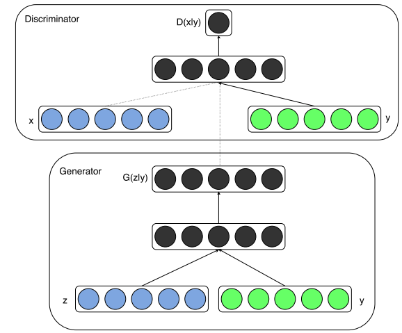
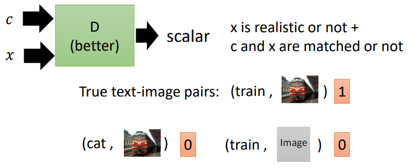
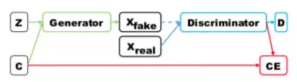

### GAN的有监督条件生成

***

【参考资料】

李宏毅	[conditional GAN讲义](http://speech.ee.ntu.edu.tw/~tlkagk/courses/MLDS_2018/Lecture/CGAN.pdf)

【参考文献】

[1] Conditional Generative Adversarial Nets	2014

[2] Conditional Image Synthesis With Auxiliary Classifier GANs	2016

#### 1. CGAN

CGAN即conditional GAN，是GAN用于条件生成的一类方法。经典的CGAN结构如下[1]：

generator和discriminator都接受一个条件输入$y$，这个$y$可以是图像标签或对应的文本描述等。这时目标函数变为：
$$
\min _{G} \max _{D} V(D, G)=\mathbb{E}_{\boldsymbol{x} \sim p_{\text { data }}(\boldsymbol{x})}[\log D(\boldsymbol{x} | \boldsymbol{y})]+\mathbb{E}_{\boldsymbol{z} \sim p_{\boldsymbol{z}}(\boldsymbol{z})}[\log (1-D(G(\boldsymbol{z} | \boldsymbol{y})))]
$$
为了提高生成的质量，一些基于CGAN的工作会给discriminator增加一类新的负样本，这样负样本有两类，一类是生成图片和正确标签的pair，一类是真实图片和错误标签的pair，这一类负样本会直接告诉discriminator什么是图片和标签不匹配的情况。于是generator不光需要生成真实的图片，还需要保证生成的图片与正确标签相匹配。

#### 2. ACGAN

ACGAN中的AC是Auxiliary Classifier的缩写[2]。与CGAN不同的是，类别标签$c$不直接输入discriminator。Discriminator不仅需要判断每个样本的真假，还需要完成一个分类任务即预测$c$，这通过增加一个辅助分类器来实现。这种做法背后的直觉在于，如果generator生成的样本与给定的标签不匹配，那么分类loss就会较大，即classifier很容易分错生成样本，所以generator生成的样本要尽可能的让classifier分类正确。

对discriminator而言，损失函数如下：
$$
\begin{array}{l}{L_{a d v}(D)=-\mathbb{E}_{x \sim p_{\text { data }}}[\log D(x)]-\mathbb{E}_{z \sim p_{z}, c-p_{c}}[\log (1-D(G(z, c)))]} \\ {L_{c l s}(D)=\mathbb{E}_{x \sim p_{\text { data }}}\left[L_{D}\left(c_{x} | x\right)\right]}\end{array}
$$
对Generator而言，损失函数如下：
$$
\begin{aligned} L_{a d v}(G) &=\mathbb{E}_{z \sim p_{z}, c \sim p_{c}}[\log (1-D(G(z, c)))] \\ L_{c l s}(G) &=\mathbb{E}_{z \sim p_{z}, c \sim p_{c}}\left[L_{D}(c | G(z, c))\right] \end{aligned}
$$
