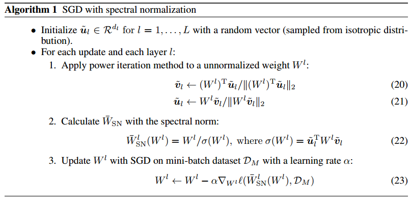

### GAN的谱归一化原理

***

【参考资料】

[详解GAN的谱归一化（Spectral Normalization）](https://mp.weixin.qq.com/s/tWaKMFZ4dQX7kZlT3tiDAQ)

[深度学习中的Lipschitz约束：泛化与生成模型](https://mp.weixin.qq.com/s/xBu25jM5TZ6XkSwttz9NRA)

[Spectral Normalization Explained](https://christiancosgrove.com/blog/2018/01/04/spectral-normalization-explained.html)

#### 1. GAN中的Lipschitz约束

通常在GAN中，我们会对判别器加以Lipschitz约束。假设现在我们有一个判别器$D : I \rightarrow \mathbb{R}$，其中$I$表示图像空间。Lipschitz约束要求判别器函数$D$的输出变化不超过输入变化的$K$倍：
$$
\|D(x)-D(y)\| \leq K\|x-y\|
$$
其中$\|\cdot\|$表示L2范数。如果$K$能取到最小值，那么我们将$K$称为Lipschitz常数。

那么，要求判别器满足Lipschitz约束的理由是什么呢？在WGAN中，Wasserstein距离的Kantorovich-Rubinstein对偶要求判别器满足Lipschitz条件，以保证最大化判别器近似的是Wasserstein距离。对于更一般的GAN来说，虽然没有理论上的要求，但对判别器施加Lipschitz约束仍然可以起到稳定训练的作用，因为它限制了判别器的梯度的变化范围。

#### 2. 多元线性函数的Lipschitz条件

假设我们有一个线性函数$A : \mathbb{R}^{n} \rightarrow \mathbb{R}^{m}$，这个函数可以视作MLP某一层激活函数之前的线性变换操作。现在我们来求解$A$的Lipschitz约束条件。

由于$A$是线性的，所以只要$A$上某一点满足Lipschitz约束，那么$A$上的所有点都满足Lipschitz约束。不失一般性地，我们可以把点$y$取为0，那么Lipschitz约束简化为：
$$
\|A x\| \leq K\|x\|
$$
上式对所有的$x \in I$都满足，等价于：
$$
\langle A x, A x\rangle \leq K^{2}\langle x, x\rangle, \forall x \in I
$$
上式进一步等价于：
$$
\left\langle\left(A^{T} A-K^{2}\right) x, x\right\rangle \leq 0, \forall x \in I \tag{2.1}
$$
矩阵$A^{T} A$是一个半正定矩阵，它的所有特征值均为非负，并且所有的特征向量可以构成一组标准正交基。假设$A^{T} A$的特征向量构成的一组基为$v_1, v_2, \ldots, v_n$，对应的特征值为$\lambda_1, \lambda_2, \ldots, \lambda_n$，我们可以用这组基来表示向量$x$，令$x=\sum_{i} x_{i} v_{i}$，那么式（2.1）可以进一步改写为：
$$
\begin{aligned}\left\langle\left(A^{T} A-K^{2}\right) x, x\right\rangle &=\left\langle\left(A^{T} A-K^{2}\right) \sum_{i} x_{i} v_{i}, \sum_{j} x_{j} v_{j}\right\rangle \\ &=\sum_{i} \sum_{j} x_{i} x_{j}\left\langle\left(A^{T} A-K^{2}\right) v_{i}, v_{j}\right\rangle \\ &=\sum_{i}\left(\lambda_{i}-K^{2}\right) x_{i}^{2} \leq 0 \\ & \Longrightarrow \sum_{i}\left(K^{2}-\lambda_{i}\right) x_{i}^{2} \geq 0 \end{aligned}
$$
由于$\lambda_i$均为非负，所以要满足上式的求和非负，那么就必须满足：
$$
K^{2}-\lambda_{i} \geq 0 \quad   \text { for all } i=1 \ldots n \tag{2.2}
$$
不失一般性地，假设$\lambda_1$是最大特征值，那么要满足式（2.2），就必须有$K \geq \sqrt{\lambda_1}$，所以$K$的最小值就是$\sqrt{\lambda_1}$，即矩阵$A^{T} A$的最大特征值开根号。因此，**一个线性函数的Lipschitz常数就是它的（严格意义上来说是它的梯度的）最大奇异值，或者它的谱范数。**

#### 3. 复合函数Lipschitz约束的性质

现在我们知道，对于一个线性映射$f : \mathbb{R}^{n} \rightarrow \mathbb{R}^{m}$，$f=Wx$，它的Lipschitz常数就是它的梯度（即$W$）的谱范数，或最大奇异值：
$$
\|f\|_{\mathrm{Lip}}=\sup _{x} \sigma(\nabla f(x))
$$
矩阵的谱范数是向量L2范数的诱导范数，根据定义，有：
$$
\sigma(A) :=\max _{h : h \neq 0} \frac{\|A h\|_{2}}{\|\boldsymbol{h}\|_{2}}=\max _{\|\boldsymbol{h}\|_{2} \leq 1}\|A \boldsymbol{h}\|_{2}
$$
在数值上，谱范数等于矩阵$A$的最大奇异值，或者说矩阵$A^TA$的最大特征值的平方根。

现在，引入一个新的函数$g : \mathbb{R}^{m} \rightarrow \mathbb{R}^{l}$，令$g \circ f$表示函数$g$和函数$f$的复合函数。直观上，$g$可以理解为神经网络的激活函数，那么$g \circ f$一层神经网络对应的非线性变换。

根据链式法则，我们有：
$$
\nabla(g \circ f)(x)=\nabla g(f(x)) \nabla f(x)
$$
根据谱范数的定义，我们有：
$$
\begin{eqnarray}
\sigma(\nabla f(x))&=&\sup _{\|v\| \leq 1}\|[\nabla f(x)] v\| \tag{3.1}\\ \sigma(\nabla(g \circ f)(x))&=&\sup _{\|v\| \leq 1} \| [\nabla g(f(x)) ][\nabla f(x)] v \|\tag{3.2}
\end{eqnarray}
$$
式（3.1）中求上界的操作是凸的，所以式（3.2）可以改写为：
$$
\sup _{\|v\| \leq 1}\|[\nabla g(f(x))][\nabla f(x)] v\|\leq \sup _{\|u\| \leq 1}\|[\nabla g(f(x))] u\| \sup _{\|v\| \leq 1}\|[\nabla f(x)] v\|
$$
即：
$$
\|g \circ f\|_{\mathrm{Lip}} \leq\|g\|_{\mathrm{Lip}}\|f\|_{\mathrm{Lip}} \tag{3.
3}
$$
这个性质为我们提供了网络整体的Lipschitz范数的一个上界。

#### 4. 谱归一化

我们假设激活函数的Lipschitz范数$\left\|a_{l}\right\|_{\mathrm{Lip}}$小于等于1（这对大部分激活函数来说都是成立的，比如relu和sigmoid），整个网络的映射函数用$f$表示，根据性质（3.3），有：
$$
\begin{aligned}\|f\|_{\mathrm{Lip}} \leq\left\|\left(\boldsymbol{h}_{L} \mapsto W^{L+1} \boldsymbol{h}_{L}\right)\right\|_{\mathrm{Lip}} \cdot\left\|a_{L}\right\|_{\mathrm{Lip}} \cdot\left\|\left(\boldsymbol{h}_{L-1} \mapsto W^{L} \boldsymbol{h}_{L-1}\right)\right\|_{\mathrm{Lip}} \\ \cdots\left\|a_{1}\right\|_{\mathrm{Lip}} \cdot\left\|\left(\boldsymbol{h}_{0} \mapsto W^{1} \boldsymbol{h}_{0}\right)\right\|_{\mathrm{Lip}}=\prod_{l=1}^{L+1}\left\|\left(\boldsymbol{h}_{l-1} \mapsto W^{l} \boldsymbol{h}_{l-1}\right)\right\|_{\mathrm{Lip}}=\prod_{l=1}^{L+1} \sigma\left(W^{l}\right) \end{aligned}
$$
也就是说，我们只要保证网络每一层的参数的谱范数等于1，就能使得整体映射$f$的Lipschitz范数小于等于1，使其满足Lipschitz约束。

所以，利用参数矩阵的谱范数进行归一化：
$$
\overline{W}_{\mathrm{SN}}(W) :=W / \sigma(W)
$$
就能满足$\sigma\left(\overline{W}_{\mathrm{SN}}(W)\right)=1$。这就是谱归一化（Spectral Normalization）。

#### 5. 幂迭代

最后是关于谱范数的求解。如果直接对矩阵$W$进行SVD分解来求其最大奇异值，会引入较大的计算量。所以我们采用幂迭代（Power iteration）方法来快速近似计算。

Power iteration 是用来近似计算矩阵最大的特征值（dominant eigenvalue 主特征值）和其对应的特征向量（主特征向量）的。

幂迭代方法的原理如下：

假设矩阵$A$是一个$n \times n$的满秩方阵，它的单位特征向量为$v_1, v_2, \ldots, v_n$，对应的特征值为$\lambda_1, \lambda_2, \ldots, \lambda_n$。那么对任意向量$x=\sum_{i} x_{i} v_{i}$，有：
$$
\begin{aligned} A x &=A\left(x_{1} \cdot \nu_{1}+x_{2} \cdot \nu_{2}+\ldots+x_{n} \cdot \nu_{n}\right) \\ &=x_{1}\left(A \nu_{1}\right)+x_{2}\left(A \nu_{2}\right)+\ldots+x_{n}\left(A \nu_{n}\right) \\ &=x_{1}\left(\lambda_{1} \nu_{1}\right)+x_{2}\left(\lambda_{2} \nu_{2}\right)+\ldots+x_{n}\left(\lambda_{n} \nu_{n}\right) \end{aligned}
$$
我们经过$k$次迭代：
$$
\begin{aligned} A^{k} x &=x_{1}\left(\lambda_{1}^{k} \nu_{1}\right)+x_{2}\left(\lambda_{2}^{k} \nu_{2}\right)+\ldots+x_{n}\left(\lambda_{n}^{k} \nu_{n}\right) \\ &=\lambda_{1}^{k}\left[x_{1} \nu_{1}+x_{2}\left(\frac{\lambda_{2}}{\lambda_{1}}\right)^{k} \nu_{2}+\ldots+x_{n}\left(\frac{\lambda_{n}}{\lambda_{1}}\right)^{k} \nu_{n}\right] \end{aligned}
$$
假设$\lambda_1$为最大特征值，那么$\lambda_1> \lambda_2 \geq \ldots \geq \lambda_n$，这里不考虑$\lambda_1$有重根的情况，因为实际中很少见。可知，经过$k$次迭代后，$\lim _{k \rightarrow+\infty}\left(\lambda_{i} / \lambda_{1}\right)^{k}=0(i \neq 1)$。因此：
$$
\lim _{k \rightarrow+\infty} A^{k} x=\lambda_{1}^{k} x_{1} \nu_{1}
$$
也就是说，经过$k$次迭代后，我们将得到矩阵主特征向量的线性放缩，只要把这个向量归一化，就得到了该矩阵的单位主特征向量，进而可以解出矩阵的主特征值。 

因此，我们可以采用 power iteration 的方式求解$W^{T} W$的单位主特征向量，进而求出最大特征值$\lambda_{1}$。Spectral Normalization中给出的算法是这样的：
$$
\begin{eqnarray} \tilde{v} & :=\frac{W^{T} \tilde{u}}{\left\|W^{T} \tilde{u}\right\|_{2}} \tag{5.1} \\ \tilde{u} & :=\frac{W \tilde{v}}{\|W \tilde{v}\|_{2}} \tag{5.2}\end{eqnarray}
$$
如果单纯看分子，我们发现这两步合起来就是$\tilde{v}=W^{T} W \tilde{v}$，反复迭代上面两个式子，即可得到矩阵$W^{T} W$的单位主特征向量$\tilde{v}$，只不过这里是每算“半”步都归一化一次。

那么，知道$W^{T} W$的单位主特征向量$\tilde{v}$后，如何求出最大特征值$\lambda_{1}$呢？
$$
\begin{array}{l}{W^{T} W \tilde{v}=\lambda_{1} v,\|v\|_{2}=1} \\ {\Rightarrow \tilde{v}^{T} W^{T} W \tilde{v}=\lambda_{1} v^{T} v=\lambda_{1}} \\ {\Rightarrow\langle W \tilde{v}, W \tilde{v}\rangle=\lambda_{1}} \\ {\quad \Rightarrow\|W \tilde{v}\|_{2}=\sqrt{\lambda_{1}}}\end{array}
$$
然后，在式（5.2）的两边同时左乘$\tilde{u}^{T}$：
$$
\begin{aligned} \tilde{u}^{T} \tilde{u} &=\frac{\tilde{u}^{T} W \tilde{v}}{\|W \tilde{v}\|_{2}} \\ 1 &=\frac{\tilde{u}^{T} W \tilde{v}}{\sqrt{\lambda_{1}}} \\ \sqrt{\lambda_{1}} &=\tilde{u}^{T} W \tilde{v} \end{aligned}
$$
就是论文中给出的权重矩阵$W$的谱范数计算公式。

这里还有一个小细节，在最终实现的时候，由于每次更新参数的 step size 很小，矩阵$W$的参数变化都很小，因此，可以把参数更新的 step 和求矩阵最大奇异值的 step 融合在一起，即每更新一次权重$\mathrm{W}$，更新一次$\tilde{u}$和$\tilde{v}$，并将矩阵归一化一次，得到的就是最终的算法。

