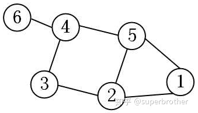
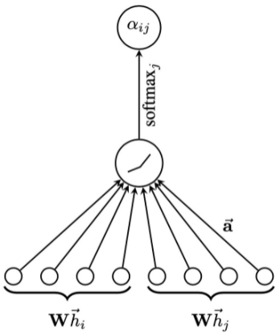
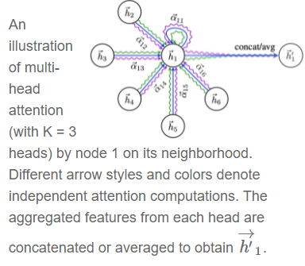

## GAT原理与简易教程

【**参考文献**】

[Understanding Graph Attention Networks (GAT)](https://dsgiitr.com/blogs/gat/)

[向往的GAT（图注意力模型）](https://zhuanlan.zhihu.com/p/81350196)

### 1. GCN的局限

#### 1.1 Graph数据的特征

当我们说起graph或者network的数据结构，通常是包含着顶点和边的关系。研究目标聚焦在顶点之上，边诉说着顶点之间的关系。

对于任意一个顶点 $i$ ，它在图上邻居 $\mathcal{N}_{i}$ ，构成第一种特征，**即图的结构关系。**

当然，除了图的结构之外，**每个顶点还有自己的特征 **$h_{i}$（通常是一个高维向量）。它可以是社交网络中每个用户的个体属性；可以是生物网络中，每个蛋白质的性质；还可以是交通路网中，每个交叉口的车流量。

**graph上的deep learning方法无外乎就是希望学习上面的两种特征。**

 #### 1.2 GCN的不足

GCN是处理transductive任务的一把利器（transductive任务是指：训练阶段与测试阶段都基于同样的图结构），然而GCN有**两大局限性**是经常被诟病的：

（a）**无法完成inductive任务，即处理动态图问题。**inductive任务是指：训练阶段与测试阶段需要处理的graph不同。通常是训练阶段只是在子图（subgraph）上进行，测试阶段需要处理未知的顶点。（unseen node）

**这是因为GCN是 structure-dependent的，参数的学习与邻接矩阵（拉普拉斯矩阵）直接相关。当有新的节点加入，图的结构发生变化，参数就得重新学习。**

（b）**处理有向图的瓶颈，不容易实现分配不同的学习权重给不同的neighbor**（对于同一阶的不同邻居，使用的都是相同的权重，参考https://zhuanlan.zhihu.com/p/72373094）。

**同时因为有向图的拉普拉斯矩阵是非对称矩阵，原来的特征值分解不再适用，因此频域变换理论上无法再像原来一样实现。**

------

**关于GCN学习权重的补充说明**：

以多项式核的GCN为例：
$$
\begin{equation}
y=\sigma\left(\sum_{j=0}^{K-1} \alpha_{j} L^{j} x\right)
\end{equation}
$$
**很明显** $\alpha_{j}$ **是可学习的参数，可以看到** $\alpha_{j}$ **与** $L^{j}$ **保持一致，我们知道** $L^{j}$ **对应着** $j$ **阶neighbor，这意味着在同阶的邻居上参数共享（可以学习的参数相同），不同阶的邻居上参数不共享（可以学习的参数不同）。**

以下图为例，取$K=1,2,3$的卷积核：



* 卷积核（$K=1$）

$$
\begin{equation}
\left[\begin{array}{cccccc}
\alpha_{0} & 0 & 0 & 0 & 0 & 0 \\
0 & \alpha_{0} & 0 & 0 & 0 & 0 \\
0 & 0 & \alpha_{0} & 0 & 0 & 0 \\
0 & 0 & 0 & \alpha_{0} & 0 & 0 \\
0 & 0 & 0 & 0 & \alpha_{0} & 0 \\
0 & 0 & 0 & 0 & 0 & \alpha_{0}
\end{array}\right]
\end{equation}
$$

* 卷积核（$K=2$）

$$
\begin{equation}
\left[\begin{array}{cccccc}
\alpha_{0}+2 \alpha_{1} & -\alpha_{1} & 0 & 0 & -\alpha_{1} & 0 \\
-\alpha_{1} & \alpha_{0}+3 \alpha_{1} & -\alpha_{1} & 0 & -\alpha_{1} & 0 \\
0 & -\alpha_{1} & \alpha_{0}+2 \alpha_{1} & -\alpha_{1} & 0 & 0 \\
0 & 0 & -\alpha_{1} & \alpha_{0}+3 \alpha_{1} & -\alpha_{1} & -\alpha_{1} \\
-\alpha_{1} & -\alpha_{1} & 0 & -\alpha_{1} & \alpha_{0}+3 \alpha_{1} & 0 \\
0 & 0 & 0 & -\alpha_{1} & 0 & \alpha_{0}+\alpha_{1}
\end{array}\right]
\end{equation}
$$

* 卷积核（$K=3$）

$$
\begin{equation}
\left[\begin{array}{cccccc}
\alpha_{0}+2 \alpha_{1}+6 \alpha_{2} & -\alpha_{1}-4 \alpha_{2} & \alpha_{2} & \alpha_{2} & -\alpha_{1}-4 \alpha_{2} & 0 \\
-\alpha_{1}-4 \alpha_{2} & \alpha_{0}+3 \alpha_{1}+12 \alpha_{2} & -\alpha_{1}-5 \alpha_{2} & 2 \alpha_{2} & -\alpha_{1}-5 \alpha_{2} & 0 \\
\alpha_{2} & -\alpha_{1}-5 \alpha_{2} & \alpha_{0}+2 \alpha_{1}+6 \alpha_{2} & -\alpha_{1}-5 \alpha_{2} & 2 \alpha_{2} & \alpha_{2} \\
\alpha_{2} & 2 \alpha_{2} & -\alpha_{1}-5 \alpha_{2} & \alpha_{0}+3 \alpha_{1}+12 \alpha_{2} & -\alpha_{1}-6 \alpha_{2} & -\alpha_{1}-4 \alpha_{2} \\
-\alpha_{1}-4 \alpha_{2} & -\alpha_{1}-5 \alpha_{2} & 2 \alpha_{2} & -\alpha_{1}-6 \alpha_{2} & \alpha_{0}+3 \alpha_{1}+12 \alpha_{2} & \alpha_{2} \\
0 & 0 & \alpha_{2} & -\alpha_{1}-4 \alpha_{2} & \alpha_{2} & \alpha_{0}+\alpha_{1}+2 \alpha_{2}
\end{array}\right]
\end{equation}
$$

**我们可以看到，当 $K=0$ ，只有一个参数，即所有顶点自身的特征都由共享的 $\alpha_0$ 控制，更高阶的neighbor也没有参与运算。**

**当 $K=2$ ，可以注意到所有一阶neighbor上学习的卷积系数都由 $\alpha_0$ 和 $\alpha_1$ 控制。**

**当** $K=3$ **，所有二阶neighbor上学习的卷积系数都仅由 $\alpha_2$ 控制。**

**特别地，如果利用Chebyshev多项式作为卷积核，参数共享方式和上述的内容完全一致，区别只是在于参数前的系数不同。**

**优点：**

- **这样的共享方式是有“物理意义”的，因为我们知道graph通常本身是有local stationary性质的。也就是说随着neighbor阶数的增加，顶点间的相关性递减（相当于距离近的邻域内相关性强）。这种共享方式，本质上可以很容易实现上述性质。**
- **参数很少，如果是超大规模的图，可以利用这种方式。**

**缺点：**

- **参数太少了，只有 $K$ 个，使得模型无法很好地实现在同阶的邻域上分配不同的权重给不同的邻居（也就是GAT论文里说的 enable specifying different weights to different nodes in a neighborhood）**


### 2. GAT的运作方式

GAT layer的输入是一组节点特征 $\mathbf{h}=\vec{h}_{1}, \vec{h}_{2}, \ldots, \vec{h}_{N}, \vec{h}_{i} \in \mathbb{R}^{F}$，其中$N$是节点数量，$F$是每个节点的特征维度。GAT layer输出一组新的特征 $\mathbf{h}=\overrightarrow{h^{\prime}}{ }_{1}, \overrightarrow{h^{\prime}}{ }_{2}, \ldots, \overrightarrow{h^{\prime}}_{N}, \overrightarrow{h^{\prime}}_{i} \in \mathbb{R}^{F^{\prime}}$ ，其中 $F^{\prime}$ 是输出特征的维度。

GAT的操作可以分为四步：

**1）线性变换：**使用参数矩阵 $W \in \mathbb{R}^{F^{\prime} \times F}$ 对每个节点的输入特征进行线性变换：
$$
\begin{equation}
z_{i}^{(l)}=W^{(l)} h_{i}^{(l)}
\end{equation}
$$
**2）计算Attention系数**：针对每一对节点，都产生一个**未归一化**的attention系数。这里首先将两个节点的embedding $z$ concat起来，用 $\|$ 来表示concat 操作；然后使用一个可学习的参数 $\vec{a}^{(l)}$ 与 concat 后的特征进行点积，再通过一个LeakyReLu激活。也可以理解为将concat后的feature通过一个一层的MLP来得到attention系数。

Attention 机制 $a: \mathbb{R}^{F^{\prime}} \times \mathbb{R}^{F^{\prime}} \rightarrow \mathbb{R}$ 在所有的节点组合之间共享：
$$
\begin{equation}
e_{i j}^{(l)}=\operatorname{LeakyReLU}\left(\vec{a}^{(l)^{T}}\left(z_{i}^{(l)} \| z_{j}^{(l)}\right)\right)
\end{equation}
$$


**注意！在这里的attention计算过程中并没有涉及到任何关于图的结构信息，理论上在计算attention系数时可以对所有的节点组合都采用。**

**为了在计算时引入Graph的结构信息，GAT中使用了一种 masked attention的方式，即只对邻接节点和目标节点的组合计算attention系数；对于节点 $i$，只计算节点 $j \in N_{i}$ 的 attention系数 $e_{i j}$。其中$N_i$节点$i$的一阶邻接节点（包括节点$i$自身）。**

**3）Softmax归一化：**对各个节点的attention系数分别进行归一化
$$
\alpha_{i j}^{(l)}=\frac{\exp \left(e_{i j}^{(l)}\right)}{\sum_{k \in \mathcal{N}(i)} \exp \left(e_{i k}^{(l)}\right)}
$$
**4）聚合：**将attention系数乘回到原来的特征之上进行特征聚合：
$$
h_{i}^{(l+1)}=\sigma\left(\sum_{j \in \mathcal{N}(i)} \alpha_{i j}^{(l)} z_{j}^{(l)}\right)
$$
*这里的 self-attention体现在特征的 attention系数是通过特征自己计算出来的，可以类比 SENet。*

------

**Multi-head Attention**

使用多头注意力进一步增加表达能力，类比 CNN 一层中的多个卷积核。



对于$K$个独立的attention模块计算出来的结果，可以使用 Average 或者 Concatenation 两种聚合方式：

* **Concatenation**：先对各个注意力模块的输出加激活，再进行级联，整体输出的特征是 $K F^{\prime}$ 维：
  $$
  h_{i}^{(l+1)}=\|_{k=1}^{K} \sigma\left(\sum_{j \in \mathcal{N}(i)} \alpha_{i j}^{k} W^{k} h_{j}^{(l)}\right)
  $$
  一般对于**中间层**会使用这种方式。

* **Averaging**：直接对多个注意力模块的输出特征求平均：
  $$
  h_{i}^{(l+1)}=\sigma\left(\frac{1}{K} \sum_{k=1}^{K} \sum_{j \in \mathcal{N}(i)} \alpha_{i j}^{k} W^{k} h_{j}^{(l)}\right)
  $$
  一般对于**最后一层**会采用这种方式，类比 Global Average Pooling。
  

------

**GAT中重要的学习参数是**$W$**与**$a(\cdot)$，**因为上述的逐顶点运算方式，这两个参数仅与顶点特征相关，与图的结构毫无关系。所以测试任务中改变图的结构，对于GAT影响并不大，只需要改变**$\mathcal{N}_{i}$，**重新计算即可。**


### 3. 简单实现

在Pytorch中实现一层GAT layer：

```python
import numpy as np
import torch
import torch.nn as nn
import torch.nn.functional as F

class GATLayer(nn.Module):
    """
    Simple PyTorch Implementation of the Graph Attention layer.
    """

    def __init__(self, in_features, out_features, dropout, alpha, concat=True):
        super(GATLayer, self).__init__()
        self.dropout       = dropout        # drop prob = 0.6
        self.in_features   = in_features    # 
        self.out_features  = out_features   # 
        self.alpha         = alpha          # LeakyReLU with negative input slope, alpha = 0.2
        self.concat        = concat         # conacat = True for all layers except the output layer.

        # Xavier Initialization of Weights
        # Alternatively use weights_init to apply weights of choice 
        self.W = nn.Parameter(torch.zeros(size=(in_features, out_features)))
        nn.init.xavier_uniform_(self.W.data, gain=1.414)
        self.a = nn.Parameter(torch.zeros(size=(2*out_features, 1)))
        nn.init.xavier_uniform_(self.a.data, gain=1.414)
        
        # LeakyReLU
        self.leakyrelu = nn.LeakyReLU(self.alpha)

    def forward(self, input, adj):
        # Linear Transformation
        h = torch.mm(input, self.W)
        N = h.size()[0]

        # Attention Mechanism
        a_input = torch.cat([h.repeat(1, N).view(N * N, -1), h.repeat(N, 1)], dim=1).view(N, -1, 2 * self.out_features)
        e       = self.leakyrelu(torch.matmul(a_input, self.a).squeeze(2))

        # Masked Attention
        zero_vec  = -9e15*torch.ones_like(e)
        attention = torch.where(adj > 0, e, zero_vec)
        
        attention = F.softmax(attention, dim=1)
        attention = F.dropout(attention, self.dropout, training=self.training)
        h_prime   = torch.matmul(attention, h)

        if self.concat:
            return F.elu(h_prime)
        else:
            return h_prime
```

使用Pytorch Geometric包在Citation Datasets上实现GAT：

```python
from torch_geometric.data import Data
from torch_geometric.nn import GATConv
from torch_geometric.datasets import Planetoid
import torch_geometric.transforms as T

import matplotlib.pyplot as plt
%matplotlib notebook

import warnings
warnings.filterwarnings("ignore")


name_data = 'Cora'
dataset = Planetoid(root= '/tmp/' + name_data, name = name_data)
dataset.transform = T.NormalizeFeatures()

print(f"Number of Classes in {name_data}:", dataset.num_classes)
print(f"Number of Node Features in {name_data}:", dataset.num_node_features)


# Model
class GAT(torch.nn.Module):
    def __init__(self):
        super(GAT, self).__init__()
        self.hid = 8
        self.in_head = 8
        self.out_head = 1
        
        self.conv1 = GATConv(dataset.num_features, self.hid, heads=self.in_head, dropout=0.6)
        self.conv2 = GATConv(self.hid*self.in_head, dataset.num_classes, concat=False,
                             heads=self.out_head, dropout=0.6)

    def forward(self, data):
        x, edge_index = data.x, data.edge_index
        
        # Dropout before the GAT layer is used to avoid overfitting in small datasets like Cora.
        # One can skip them if the dataset is sufficiently large.
        
        x = F.dropout(x, p=0.6, training=self.training)
        x = self.conv1(x, edge_index)
        x = F.elu(x)
        x = F.dropout(x, p=0.6, training=self.training)
        x = self.conv2(x, edge_index)
        
        return F.log_softmax(x, dim=1)


# Train
device = torch.device('cuda' if torch.cuda.is_available() else 'cpu')

model = GAT().to(device)

data = dataset[0].to(device)
optimizer = torch.optim.Adam(model.parameters(), lr=0.005, weight_decay=5e-4)

model.train()
for epoch in range(1000):
    model.train()
    optimizer.zero_grad()
    out = model(data)
    loss = F.nll_loss(out[data.train_mask], data.y[data.train_mask])
    
    if epoch%200 == 0:
        print(loss)
    
    loss.backward()
    optimizer.step()

    
# Evaluate
model.eval()
_, pred = model(data).max(dim=1)
correct = float(pred[data.test_mask].eq(data.y[data.test_mask]).sum().item())
acc = correct / data.test_mask.sum().item()
print('Accuracy: {:.4f}'.format(acc))
```

