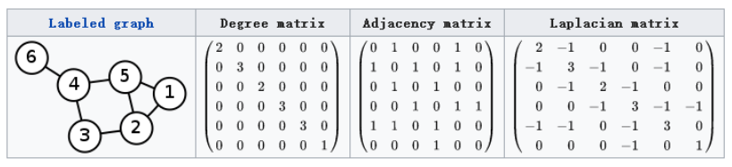
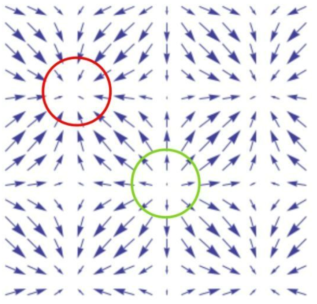
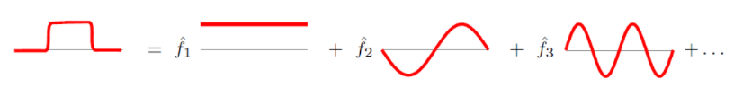
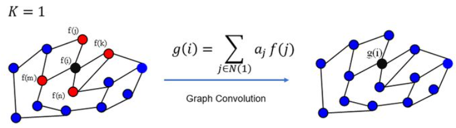
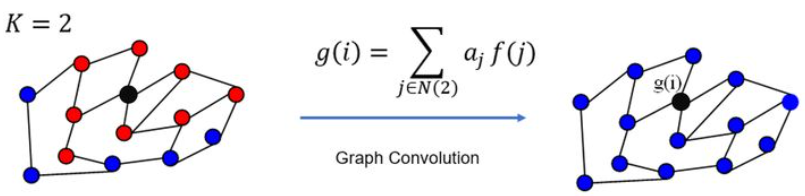
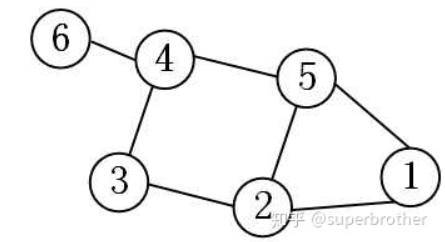

## GCN原理浅析

【**参考文献**】

[如何理解 Graph Convolutional Network（GCN）？@superbrother](https://www.zhihu.com/question/54504471/answer/332657604)

[拉普拉斯矩阵与拉普拉斯算子的关系](https://zhuanlan.zhihu.com/p/85287578)

[Chebyshev多项式作为GCN卷积核](https://zhuanlan.zhihu.com/p/106687580)

[图卷积网络(GCN)原理解析](https://www.jianshu.com/p/35212baf6671)

### 1. 图信号

对于图$G=(V, E)$，通常使用其邻接矩阵$A$来描述。但从信号处理的角度，图可以看做是一种信号，假设一张图有$N$个节点，那么图信号$f$就是一个$N$维的向量，这个向量的每个维度即为图在每个节点的取值（特征），即$f=[f(1), f(2), \cdots,f(N)]$。

如果每个节点的特征是一个多维的向量，其维度为$d$，那么图信号$f$的维度就是$N\times d$，这里可以与多通道图像进行类比来理解，在每个节点/像素位置处，输入特征具有多个通道。

### 2. 拉普拉斯矩阵

设图$G$的邻接矩阵为$A$，度矩阵为$D$，则其拉普拉斯矩阵定义为$L=D-A$。

对于拉普拉斯矩阵$L$，其元素满足：
$$
\begin{equation}
L_{i, j}:= \begin{cases}\operatorname{deg}\left(v_{i}\right) & \text { if } i=j \\ -1 & \text { if } i \neq j \text { and } v_{i} \text { is adjacent to } v_{j} \\ 0 & \text { otherwise }\end{cases}
\end{equation}
$$
其中$\operatorname{deg}(\cdot)$代表节点的度。

在GCN中常会使用另一种归一化形式的拉普拉斯矩阵，定义为
$$
\begin{equation}
L^{\text {sym }}:=D^{-\frac{1}{2}} L D^{-\frac{1}{2}}=I-D^{-\frac{1}{2}} A D^{-\frac{1}{2}}
\end{equation}
$$
其元素满足：
$$
\begin{equation}
L_{i, j}^{s, j}:= \begin{cases}1 & \text { if } i=j \text { and } \operatorname{deg}\left(v_{i}\right) \neq 0 \\ -\frac{1}{\sqrt{\operatorname{deg}\left(v_{i}\right) \operatorname{deg}\left(v_{j}\right)}} & \text { if } i \neq j \text { and } v_{i} \text { is adjacent to } v_{j} \\ 0 & \text { otherwise. }\end{cases}
\end{equation}
$$
即对角元被归一化。

**GCN中使用拉普拉斯矩阵的原因：**

* **拉普拉斯矩阵是对称矩阵，可以进行特征分解（谱分解），这就和GCN的spectral domain对应上了**

* **拉普拉斯矩阵只在中心顶点和一阶相连的顶点上（1-hop neighbor）有非0元素，其余之处均为0**
* **通过拉普拉斯算子与拉普拉斯矩阵进行类比（为了导出图上的傅里叶变换）**

------

**拓展部分：拉普拉斯算子与拉普拉斯矩阵的关系**

**结论**：

**拉普拉斯矩阵就是图上的拉普拉斯算子，或者说是离散的拉普拉斯算子**。

如果$f$是欧式空间中的二阶可微实函数，那么$\Delta f$就是在欧式空间中求其二阶微分（散度），其中$\Delta$是拉普拉斯算子。

如果$f$是图上定义的一组高维向量，那么$Lf$就是在图空间中求其二阶微分（散度），其中$L$是图的拉普拉斯矩阵。

**解释**：

**直接套用导数的定义，无法直观理解拉普拉斯矩阵的物理含义。从散度入手，才是正确的打开方式。**

**梯度（矢量）** ：梯度”$\nabla$“的本意是一个向量（矢量），表示某一函数在该点处的方向导数沿着该方向取得最大值，即函数在该方向处沿着该方向（此梯度方向）变化最快，变化率最大（为该梯度的模）。假设一个三元函数$u=f(x, y, z)$在空间区域$G$内具有一阶连续偏导数，点$P(x, y, z) \in G$，称向量
$$
\begin{equation}
\left\{\frac{\partial f}{\partial x}, \frac{\partial f}{\partial y}, \frac{\partial f}{\partial z}\right\}=\frac{\partial f}{\partial x} \vec{i}+\frac{\partial f}{\partial y} \vec{j}+\frac{\partial f}{\partial z} \vec{k}
\end{equation}
$$
为函数$u=f(x, y, z)$在$P$处的梯度，记为$\operatorname{grad} f(x, y, z)$或$\nabla f(x, y, z)$。

其中：$\nabla=\frac{\partial}{\partial x} \vec{i}+\frac{\partial}{\partial y} \vec{j}+\frac{\partial}{\partial z} \vec{k}$  称为（三维）向量的微分算子或 *Nabla* 算子。

**散度（标量）** 散度 " $\nabla \cdot$ " （divergence）可用于表针空间中各点矢量场发散的强弱程度，物理上，散度的意义是场的有源性。当 $\operatorname{div}(F)>0$，表示该点有散发通量的正源（发散源）；当 $\operatorname{div}(F)<0$ 表示该点有吸收能量的负源（洞或汇）；当 $\operatorname{div}(F)=0$，表示该点无源。

**拉普拉斯算子：** 拉普拉斯算子（Laplace Operator）是$n$维欧几里得空间中的一个二阶微分算子，定义为梯度$\nabla f$的散度：$\Delta f=\nabla^{2} f=\nabla \cdot \nabla f=\operatorname{div}($ grad $f)$

笛卡尔坐标系下的表示法：
$$
\begin{equation}
\Delta f=\frac{\partial^{2} f}{\partial x^{2}}+\frac{\partial^{2} f}{\partial y^{2}}+\frac{\partial^{2} f}{\partial z^{2}}
\end{equation}
$$
$n$维形式$\Delta=\sum_{i} \frac{\partial^{2}}{\partial x_{i}^{2}}$。

**下面推导离散函数的导数：**
$$
\begin{equation}
\frac{\partial f}{\partial x}=f^{\prime}(x)=f(x+1)-f(x) 
\end{equation}
$$
二阶微分为：
$$
\begin{equation}
\begin{aligned}
&\frac{\partial^{2} f}{\partial x^{2}}=f^{\prime \prime}(x) \approx f^{\prime}(x)-f^{\prime}(x-1) =f(x+1)+f(x-1)-2 f(x)
\end{aligned}
\end{equation}
$$
则我们可以将拉普拉斯算子也转化为离散形式（以二维为例）：
$$
\begin{equation}
\begin{aligned}
&\Delta f=\frac{\partial^{2} f}{\partial x^{2}}+\frac{\partial^{2} f}{\partial y^{2}} \\
&=f(x+1, y)+f(x-1, y)-2 f(x, y)+f(x, y+1)+f(x, y-1)-2 f(x, y) \\
&=f(x+1, y)+f(x-1, y)+f(x, y+1)+f(x, y-1)-4 f(x, y)
\end{aligned}
\end{equation}
$$
**现在用散度的概念解读一下：**

- $\Delta f>0$时，**表示该点有散发通量的正源（发散源）**。如下图中绿圈所示，即为散度大于0的点，其附近的矢量场情况。
- $\Delta f<0$ 时，**表示该点有吸收通量的负源（洞或汇）。**如下图中红圈所示，即为散度小于0的点，其附近的矢量场情况。
- $\Delta f=0$ 时，**该点无源**

另一个角度，拉普拉斯算子计算了周围点与中心点的梯度差。当$f(x, y)$受到扰动之后，其可能变为相邻的 $f(x-1, y), f(x+1, y), f(x, y-1), f(x, y+1)$之一，拉普拉斯算子得到的是对该点进行微小扰动后可能获得的总增益 （或者说是总变化）。

**我们现在将这个结论推广到图：** 假设具有$N$个节点的图$G$，此时以上定义的函数$f$不再是二维，而是$N$维向量：$f=\left(f_{1}, f_{2}, \ldots, f_{N}\right)$，其中$f_i$为函数$f$在图中节点$i$处的函数值。类比于$f(x, y)$在节点$(x, y)$处的值。对$i$节点进行扰动，它可能变为任意一个与它相邻的节点$j \in N_{i}$，$N_{i}$表示节点$i$的一阶邻域节点。

我们上面已经知道拉普拉斯算子可以计算一个点到它所有自由度上微小扰动的增益，则通过图来表示就是任意一个节点$j$变化到节点$i$所带来的增益，考虑图中边的权值相等（简单说就是1）则有：
$$
\begin{equation}
\Delta f_{i}=\sum_{j \in N_{i}}\left(f_{i}-f_{j}\right)
\end{equation}
$$
而如果边$E_{i j}$具有权重$W_{i j}$时，则有：
$$
\begin{equation}
\Delta f_{i}=\sum_{j \in N_{i}} W_{i j}\left(f_{i}-f_{j}\right)
\end{equation}
$$
由于当$W_{i j}=0$时表示节点$i,j$不相邻，所以上式可以简化为：
$$
\begin{equation}
\Delta f_{i}=\sum_{j \in N} W_{i j}\left(f_{i}-f_{j}\right)
\end{equation}
$$
继续推导有：
$$
\begin{equation}
\begin{aligned}
&\Delta f_{i}=\sum_{j \in N} w_{i j}\left(f_{i}-f_{j}\right) \\
&=\sum_{j \in N} w_{i j} f_{i}-\sum_{j \in N} w_{i j} f_{j} \\
&=d_{i} f_{i}-w_{i:} f
\end{aligned}
\end{equation}
$$
其中$d_{i}=\sum_{j \in N} w_{i j}$是顶点$i$的度；$w_{i:}=\left(w_{i 1}, \ldots, w_{i N}\right)$是$N$维的行向量，$f=\left(\begin{array}{c}f_{1} \\ \vdots \\ f_{N}\end{array}\right)$是$N$维的列向量；$w_{i:} f$表示两个向量的内积。

对于所有的$N$个节点有：
$$
\begin{equation}
\begin{aligned}
&\Delta f=\left(\begin{array}{c}
\Delta f_{1} \\
\vdots \\
\Delta f_{N}
\end{array}\right)=\left(\begin{array}{c}
d_{1} f_{1}-w_{1:} f \\
\vdots \\
d_{N} f_{N}-w_{N:} f
\end{array}\right) \\
&=\left(\begin{array}{ccc}
d_{1} & \cdots & 0 \\
\vdots & \ddots & \vdots \\
0 & \cdots & d_{N}
\end{array}\right) f-\left(\begin{array}{c}
w_{1:} \\
\vdots \\
w_{N:}
\end{array}\right) f \\
&=\operatorname{diag}\left(d_{i}\right) f-W f \\
&=(D-W) f \\
&=L f
\end{aligned}
\end{equation}
$$
这里的$(D-W)$就是拉普拉斯矩阵$L$。根据前面所述，拉普拉斯矩阵中的第$i$行实际上反应了第$i$个节点在扰动到其他所有节点时所产生的增益累积。直观上来讲，图拉普拉斯反映了当我们在节点$i$上施加一个势，这个势以**哪个**方向能够多**顺畅**的流向其他节点。谱聚类中的拉普拉斯矩阵可以理解为是对图的一种矩阵表示形式。

### 3. 拉普拉斯矩阵的谱分解

GCN的核心基于拉普拉斯矩阵的谱分解。**拉普拉斯矩阵是半正定对称矩阵**，有如下三个性质：

* **实对称矩阵一定n个线性无关的特征向量**
* **半正定矩阵的特征值一定非负**
* **实对阵矩阵的特征向量两两相互正交，是正交矩阵**

由上可以知道拉普拉斯矩阵一定可以谱分解，且分解后有特殊的形式。

对于拉普拉斯矩阵其谱分解为：
$$
\begin{equation}
L=U\left(\begin{array}{lll}
\lambda_{1} & & \\
& \ddots & \\
& & \lambda_{n}
\end{array}\right) U^{-1}
\end{equation}
$$
其中$U=\left(\overrightarrow{u_{1}}, \overrightarrow{u_{2}}, \cdots, \overrightarrow{u_{n}}\right)$是**列向量**为单位特征向量的矩阵，也就是说$\overrightarrow{u_{l}}$是列向量。

由于$U$是正交矩阵，即$U U^{T}=E$，所以特征分解又可以写成：
$$
\begin{equation}
L=U\left(\begin{array}{lll}
\lambda_{1} & & \\
& \ddots & \\
& & \lambda_{n}
\end{array}\right) U^{T}
\end{equation}
$$

### 4. 图傅里叶变换

**把传统的傅里叶变换以及卷积迁移到Graph上来，核心工作其实就是把拉普拉斯算子的特征函数** **$e^{-i \omega t}$** **变为Graph对应的拉普拉斯矩阵的特征向量**。

**(a) Graph上的傅里叶变换**

传统的傅里叶变换定义为：
$$
\begin{equation}
F(\omega)=\mathcal{F}[f(t)]=\int f(t) e^{-i \omega t} d t
\end{equation}
$$
信号$f(t)$与基函数 $e^{-i \omega t}$ 的积分，**那么为什么要找 **$e^{-i \omega t}$ **作为基函数呢？从数学上看，** $e^{-i \omega t}$ **是拉普拉斯算子的特征函数（满足特征方程）,** $\omega$ **就和特征值有关**。

广义的特征方程定义为：
$$
\begin{equation}
A V=\lambda V
\end{equation}
$$
其中$A$是一种变换，$V$是是特征向量或者特征函数（无穷维的向量），$\lambda$ 是特征值。

$e^{-i \omega t}$满足：
$$
\begin{equation}
\Delta e^{-i \omega t}=\frac{\partial^{2}}{\partial t^{2}} e^{-i \omega t}=-\omega^{2} e^{-i \omega t}
\end{equation}
$$
**当然**$e^{-i \omega t}$**就是变换**$\Delta$ **的特征函数**，$\omega$和特征值密切相关。

那么，可以联想了，**处理Graph问题的时候，用到拉普拉斯矩阵**，**自然就去找拉普拉斯矩阵的特征向量了。**

$L$是拉普拉斯矩阵，$U$是其特征向量，自然满足下式：
$$
\begin{equation}
L V=\lambda V
\end{equation}
$$
**离散积分就是一种内积形式，仿上定义Graph上的傅里叶变换：**
$$
\begin{equation}
F\left(\lambda_{l}\right)=\hat{f}\left(\lambda_{l}\right)=\sum_{i=1}^{N} f(i) u_{l}(i)
\end{equation}
$$
$f$是Graph上的$N$维向量，$f(i)$与Graph的顶点一一对应， $u_{l}(i)$表示第$l$个特征向量的第$i$个分量，那么特征值（频率）$\lambda_{l}$下的，$f$的Graph傅里叶变换就是与$\lambda_{l}$对应的特征向量$u_{l}$进行内积运算。

**利用矩阵乘法将Graph上的傅里叶变换推广到矩阵形式：**
$$
\begin{equation}
\left(\begin{array}{c}
\hat{f}\left(\lambda_{1}\right) \\
\hat{f}\left(\lambda_{2}\right) \\
\vdots \\
\hat{f}\left(\lambda_{N}\right)
\end{array}\right)=\left(\begin{array}{cccc}
u_{1}(1) & u_{1}(2) & \ldots & u_{1}(N) \\
u_{2}(1) & u_{2}(2) & \ldots & u_{2}(N) \\
\vdots & \vdots & \ddots & \vdots \\
u_{N}(1) & u_{N}(2) & \ldots & u_{N}(N)
\end{array}\right)\left(\begin{array}{c}
f(1) \\
f(2) \\
\vdots \\
f(N)
\end{array}\right)
\end{equation}
$$
**即**$f$**在Graph上傅里叶变换的矩阵形式为** $\hat{f}=U^{T} f$ 。

**(b) Graph上的傅里叶逆变换**

类似地，**传统的傅里叶逆变换是对频率** $\omega$ **求积分：**
$$
\begin{equation}
\mathcal{F}^{-1}[F(\omega)]=\frac{1}{2 \Pi} \int F(\omega) e^{i \omega t} d \omega
\end{equation}
$$
**迁移到Graph上变为对特征值** $\lambda_{l}$ **求和：**
$$
\begin{equation}
f(i)=\sum_{l=1}^{N} \hat{f}\left(\lambda_{l}\right) u_{l}(i)
\end{equation}
$$
**利用矩阵乘法将Graph上的傅里叶逆变换推广到矩阵形式：**
$$
\begin{equation}
\left(\begin{array}{c}
f(1) \\
f(2) \\
\vdots \\
f(N)
\end{array}\right)=\left(\begin{array}{cccc}
u_{1}(1) & u_{2}(1) & \ldots & u_{N}(1) \\
u_{1}(2) & u_{2}(2) & \ldots & u_{N}(2) \\
\vdots & \vdots & \ddots & \vdots \\
u_{1}(N) & u_{2}(N) & \ldots & u_{N}(N)
\end{array}\right)\left(\begin{array}{c}
\hat{f}\left(\lambda_{1}\right) \\
\hat{f}\left(\lambda_{2}\right) \\
\vdots \\
\hat{f}\left(\lambda_{N}\right)
\end{array}\right)
\end{equation}
$$
**即** $f$ **在Graph上傅里叶逆变换的矩阵形式为：** $f=U \hat{f}$

### 5. 图卷积

**卷积定理：函数卷积的傅里叶变换是函数傅立叶变换的乘积，即对于函数** $f(t)$ **与** $h(t)$ **两者的卷积是其函数傅立叶变换乘积的逆变换：**
$$
\begin{equation}
f * h=\mathcal{F}^{-1}[\hat{f}(\omega) \hat{h}(\omega)]=\frac{1}{2 \Pi} \int \hat{f}(\omega) \hat{h}(\omega) e^{i \omega t} d \omega
\end{equation}
$$
**类比到Graph上并把傅里叶变换的定义带入，** $f$ **与卷积核** $h$  **在Graph上的卷积可按下列步骤求出：**

$f$的傅里叶变换为 $\hat{f}=U^{T} f$，

卷积核$h$的傅里叶变换写成对角矩阵的形式即为：
$$
\begin{equation}
\left(\begin{array}{ccc}
\hat{h}\left(\lambda_{1}\right) & & \\
& \ddots & \\
& & \hat{h}\left(\lambda_{n}\right)
\end{array}\right)
\end{equation}
$$
$\hat{h}\left(\lambda_{l}\right)=\sum_{i=1}^{N} h(i) u_{l}^{*}(i)$是**根据需要设计的卷积核** $h$ **在Graph上的傅里叶变换。**

两者的傅立叶变换乘积即为：
$$
\begin{equation}
\left(\begin{array}{ccc}
\hat{h}\left(\lambda_{1}\right) & & \\
& \ddots & \\
& & \hat{h}\left(\lambda_{n}\right)
\end{array}\right) U^{T} f
\end{equation}
$$
再乘以 $U$ 求两者傅立叶变换乘积的逆变换，则求出卷积：
$$
\begin{equation}
(f * h)_{G}=U\left(\begin{array}{lll}
\hat{h}\left(\lambda_{1}\right) & & \\
& \ddots & \\
& & \hat{h}\left(\lambda_{n}\right)
\end{array}\right) U^{T} f
\end{equation}
$$

------

**注：很多论文中的Graph卷积公式为：**
$$
\begin{equation}
(f * h)_{G}=U\left(\left(U^{T} h\right) \odot\left(U^{T} f\right)\right)
\end{equation}
$$
$\odot$表示Hadamard product（哈达马积），对于两个维度相同的向量、矩阵、张量进行对应位置的逐元素乘积运算。这个卷积公式和上面的是完全等价的。

证明如下：

设$\hat{f}=U^{T} f$，其为$n$维的向量，分量形式为：
$$
\begin{equation}
\hat{f}=\left(\begin{array}{c}
\hat{f}\left(\lambda_{1}\right) \\
\hat{f}\left(\lambda_{2}\right) \\
\vdots \\
\hat{f}\left(\lambda_{n}\right)
\end{array}\right)
\end{equation}
$$
其中$\hat{f}\left(\lambda_{l}\right)=\sum_{i=1}^{N} f(i) u_{l}(i)$，$u_{l}(i)$ 是第 $l$ 个特征向量的第 $i$ 个分量。对于$\hat{h}=U^{T} h$ 也同样如此。

则有：
$$
\begin{equation}
\left(\begin{array}{ccc}
\hat{h}\left(\lambda_{1}\right) & & \\
& \ddots & \\
& & \hat{h}\left(\lambda_{n}\right)
\end{array}\right) U^{T} f=\left(\begin{array}{ccc}
\hat{h}\left(\lambda_{1}\right) & & \\
& \ddots & \\
& & \hat{h}\left(\lambda_{n}\right)
\end{array}\right) \cdot\left(\begin{array}{c}
\hat{f}\left(\lambda_{1}\right) \\
\hat{f}\left(\lambda_{2}\right) \\
\vdots \\
\hat{f}\left(\lambda_{n}\right)
\end{array}\right)
\end{equation}
$$

$$
\begin{equation}
\left(\left(U^{T} h\right) \odot\left(U^{T} f\right)\right)=\left(\begin{array}{c}
\hat{h}\left(\lambda_{1}\right) \\
\hat{h}\left(\lambda_{2}\right) \\
\vdots \\
\hat{h}\left(\lambda_{n}\right)
\end{array}\right) \odot\left(\begin{array}{c}
\hat{f}\left(\lambda_{1}\right) \\
\hat{f}\left(\lambda_{2}\right) \\
\vdots \\
\hat{f}\left(\lambda_{n}\right)
\end{array}\right)
\end{equation}
$$

到这里，结果已经很显然了，两者的区别仅在于前者是写成了对角矩阵形式的矩阵乘积而后者是两个向量的逐元素乘积，都是下面的$n$维向量：
$$
\begin{equation}
\left(\begin{array}{c}
\hat{h}\left(\lambda_{1}\right) \times \hat{f}\left(\lambda_{1}\right) \\
\hat{h}\left(\lambda_{2}\right) \times \hat{f}\left(\lambda_{2}\right) \\
\vdots \\
\hat{h}\left(\lambda_{n}\right) \times \hat{f}\left(\lambda_{n}\right)
\end{array}\right)
\end{equation}
$$

------

**（1）** **为什么拉普拉斯矩阵的特征向量可以作为傅里叶变换的基？**

傅里叶变换一个本质理解就是：**把任意一个函数表示成了若干个正交函数（由sin,cos 构成）的线性组合。**

**graph傅里叶变换也把graph上定义的任意向量** ![[公式]](https://www.zhihu.com/equation?tex=f) **，表示成了拉普拉斯矩阵特征向量的线性组合，即：**
$$
\begin{equation}
f=\hat{f}\left(\lambda_{1}\right) u_{1}+\hat{f}\left(\lambda_{2}\right) u_{2}+\cdots+\hat{f}\left(\lambda_{n}\right) u_{n}
\end{equation}
$$
那么**：为什么graph上任意的向量** $f$ **都可以表示成这样的线性组合？**

**原因在于** $\left(\overrightarrow{u_{1}}, \overrightarrow{u_{2}}, \cdots, \overrightarrow{u_{n}}\right)$ **是graph上** $n$ **维空间中的** $n$ **个线性无关的正交向量**，由线性代数的知识可以知道：**$n$维空间中$n$个** **线性无关的向量可以构成空间的一组基，而且拉普拉斯矩阵的特征向量还是一组正交基。**

**（2） 怎么理解拉普拉斯矩阵的特征值表示频率？**

在**graph空间上无法可视化展示“频率”**这个概念，那么从**特征方程**上来抽象理解。

将拉普拉斯矩阵$L$的$n$个**非负实特征值，从小到大排列为**$\lambda_{1} \leq \lambda_{2} \leq \cdots \leq \lambda_{n}$，而且最小的特征值 $\lambda_{1}=0$，因为$n$ 维的全1向量对应的特征值为0（由$L$的定义就可以得出）：
$$
\begin{equation}
L\left(\begin{array}{c}
1 \\
1 \\
\vdots \\
1
\end{array}\right)=0
\end{equation}
$$
在由Graph确定的$n$ 维空间中，越小的特征值 $\lambda_{l}$ 表明：拉普拉斯矩阵 $L$ 其所对应的基 $u_{l}$ 上的分量、“信息”越少，那么当然就是可以忽略的低频部分了。（注：此处的高低频与通常的图像傅里叶变换的习惯约定不同。）

### 6. 图卷积网络

Deep learning 中的Convolution就是要设计含有trainable共享参数的kernel，而**graph convolution中的卷积参数就是**$\operatorname{diag}\left(\hat{h}\left(\lambda_{l}\right)\right)$。

#### 6.1 第一代GCN

[Spectral Networks and Locally Connected Networks on Graphs](https://arxiv.org/abs/1312.6203) 中**简单粗暴地把**$\operatorname{diag}\left(\hat{h}\left(\lambda_{l}\right)\right)$变成了卷积核$\operatorname{diag}\left(\theta_{l}\right)$ ，也就是：
$$
\begin{equation}
y_{\text {output }}=\sigma\left(U g_{\theta}(\Lambda) U^{T} x\right)
\end{equation}
$$
其中$g_{\theta}(\Lambda)=\left(\begin{array}{lll}\theta_{1} & & \\ & \ddots & \\ & & \theta_{n}\end{array}\right)$，$\sigma(\cdot)$是激活函数。

第一代的参数方法主要存在一些弊端：

（1）每一次前向传播，都要计算特征值分解，计算代价较高。

（2）卷积核不具有 spatial localization 的性质。

（3）卷积核需要$n$个参数。

#### 6.2 第二代GCN

[Convolutional Neural Networks on Graphs with Fast Localized Spectral Filtering](https://proceedings.neurips.cc/paper/2016/hash/04df4d434d481c5bb723be1b6df1ee65-Abstract.html) 把 $\hat{h}\left(\lambda_{l}\right)$ **巧妙地设计成了** $\sum_{j=0}^{K} \alpha_{j} \lambda_{l}^{j}$，也就是：
$$
\begin{equation}
y_{\text {output }}=\sigma\left(U g_{\theta}(\Lambda) U^{T} x\right)
\end{equation}
$$

$$
\begin{equation}
g_{\theta}(\Lambda)=\left(\begin{array}{ccc}
\sum_{j=0}^{K} \alpha_{j} \lambda_{1}^{j} & & \\
& \ddots & \\
& & \sum_{j=0}^{K} \alpha_{j} \lambda_{n}^{j}
\end{array}\right)
\end{equation}
$$

上面的公式仿佛还什么都看不出来，下面利用矩阵乘法进行变换，来一探究竟。
$$
\begin{equation}
\left(\begin{array}{ccc}
\sum_{j=0}^{K} \alpha_{j} \lambda_{1}^{j} & & \\
& \ddots & \\
& & \sum_{j=0}^{K} \alpha_{j} \lambda_{n}^{j}
\end{array}\right)=\sum_{j=0}^{K} \alpha_{j} \Lambda^{j}
\end{equation}
$$
进而可以导出：
$$
\begin{equation}
U \sum_{j=0}^{K} \alpha_{j} \Lambda^{j} U^{T}=\sum_{j=0}^{K} \alpha_{j} U \Lambda^{j} U^{T}=\sum_{j=0}^{K} \alpha_{j} L^{j}
\end{equation}
$$
上式成立是因为 $L^{2}=U \Lambda U^{T} U \Lambda U^{T}=U \Lambda^{2} U^{T}$ 且 $U^{T} U=E$ 。

那么前传公式就变成了：
$$
\begin{equation}
y_{\text {output }}=\sigma\left(\sum_{j=0}^{K-1} \alpha_{j} L^{j} x\right)
\end{equation}
$$
**其中**$\left(\alpha_{0}, \alpha_{1}, \cdots, \alpha_{K-1}\right)$ **是任意的参数，通过初始化赋值然后利用误差反向传播进行调整。**

这种卷积核设计的优点在于：

（1）**卷积核只有$K$个参数，一般$K$远小于$n$，参数的复杂度被大大降低了。**

（2）**矩阵变换后，神奇地发现不需要做特征分解了，直接用拉普拉斯矩阵** $L$ **进行变换。**

（3）**卷积核具有很好的spatial localization，特别地，** $K$ **就是卷积核的receptive field，也就是说每次卷积会将中心顶点**  **K-hop neighbor上的feature进行加权求和**，**权系数由$\alpha_k$决定**。

**更直观地看，** **$K=1$就是对每个顶点上一阶neighbor的feature进行加权求和，如下图所示：**

被加权的只有节点$i$的一阶邻接节点，如果节点$i$与节点$j$不相邻，那么对应的权重就为0。

同理，$K=2$的情形如下图所示：

注：上图只是以一个顶点作为实例，GCN每一次卷积对所有的顶点都完成了图示的操作。

#### 3. 第三代GCN

第二代GCN本质是一种多项式近似的思想，对于多项式，可以认为其具有非正交的一组基$1,x,x^3,...$
$$
\begin{equation}
g(x)=\theta_{0}+\theta_{1} x+\theta_{2} x^{2}+\cdots
\end{equation}
$$
在对系数进行扰动时，这种多项式是不稳定的。

解决方法是用切比雪夫多项式来代替原来的多项式核。切比雪夫多项式可以通过递归的形式来定义：
$$
\begin{equation}
\begin{aligned}
&T_{0}(x)=1 ; T_{1}(x)=x \\
&T_{k}(x)=2 x T_{k-1}(x)-T_{k-2}(x)
\end{aligned}
\end{equation}
$$
切比雪夫多项式组成了一组正交基。（注：两个函数正交是指两个函数乘积的积分为0）

利用Chebyshev多项式代替卷积核，就可以得到下式：
$$
\begin{equation}
g_{\theta}(\Lambda)=\sum_{k=0}^{K-1} \beta_{k} T_{k}(\tilde{\Lambda})
\end{equation}
$$
其中，$T_{k}(\cdot)$是$k$阶的Chebyshev多项式，$\beta_{k}$是对应的系数（**也就是训练中迭代更新的参数**）。$\tilde{\Lambda}$是re-scaled的特征值对角矩阵，进行这个shift变换的原因是Chebyshev多项式的输入要在$[-1,1]$之间。

这里大家可能会疑问为什么会有$[-1,1]$这个区间的限制？因为第一类Chebyshev多项式的解析形式是：
$$
\begin{equation}
T_{k}(x)=\cos (k \cdot \arccos (x))
\end{equation}
$$
因为 $\arccos (\cdot)$ 函数，所以输入必须在$[-1,1]$之间。

那么如何把$\Lambda$转换在上述区间？一共有两步：

* 由于$\Lambda \geq 0$（原因为拉普拉斯矩阵半正定，特征值非负），除以最大特征值$\lambda_{\max }$，就转化在$[0,1]$区间；
* 再进行$2 \times[0,1]-1$，就实现了目标。于是就有：

$$
\tilde{\Lambda}=2 \Lambda / \lambda_{\max }-I
$$

带入到前传公式，即可得到：
$$
\begin{equation}
y=\sigma\left(U \sum_{k=0}^{K-1} \beta_{k} T_{k}(\tilde{\Lambda}) U^{T} x\right)
\end{equation}
$$
因为Chebyshev多项式本身是一系列幂指数（从其递归形式可以看出；另外矩阵的cos函数也是基于泰勒展开计算，所以还是幂指数的和），根据特征值对角化的性质，可以将矩阵运算放进Chebyshev多项式中（类似的技巧在第二代GCN中也用过）：
$$
\begin{equation}
y=\sigma\left(\sum_{k=0}^{K-1} \beta_{k} T_{k}\left(U \tilde{\Lambda} U^{T}\right) x\right)
\end{equation}
$$
因为$L=U \Lambda U^{T}$, 代入可以得
$$
y=\sigma\left(\sum_{k=0}^{K-1} \beta_{k} T_{k}(\tilde{L}) x\right)
$$
其中， $\tilde{L}=2 L / \lambda_{\max }-I$。这样变换的好处在于：计算过程无需再进行特征向量分解。

（最大特征值$\lambda_{\max }$可以利用幂迭代法（power iteration）求出，详细内容可以参考https://www.cnblogs.com/fahaizhong/p/12240051.html）

在实际运算过程中，可以利用Chebyshev多项式的性质，进行递推。
$$
\begin{equation}
\begin{gathered}
T_{k}(\tilde{L})=2 \tilde{L} T_{k-1}(\tilde{L})-T_{k-2}(\tilde{L}) \\
T_{0}(\tilde{L})=I, T_{1}(\tilde{L})=\tilde{L}
\end{gathered}
\end{equation}
$$
下面来举个栗子，以下图为例：

这里我们利用对称型拉普拉斯矩阵，$L^{\text {sys }}=I-D^{-0.5} A D^{-0.5}$。

$\lambda_{\max } \approx 1.88$

* 当$K=1$时，卷积核为
  $$
  \begin{equation}
  \left[\begin{array}{cccccc}
  \beta_{0} & 0 & 0 & 0 & 0 & 0 \\
  0 & \beta_{0} & 0 & 0 & 0 & 0 \\
  0 & 0 & \beta_{0} & 0 & 0 & 0 \\
  0 & 0 & 0 & \beta_{0} & 0 & 0 \\
  0 & 0 & 0 & 0 & \beta_{0} & 0 \\
  0 & 0 & 0 & 0 & 0 & \beta_{0}
  \end{array}\right]
  \end{equation}
  $$

* 当$K=2$时，卷积核为
  $$
  \begin{equation}
  \left[\begin{array}{cccccc}
  \beta_{0}+0.07 \beta_{1} & -0.44 \beta_{1} & 0 & 0 & -0.44 \beta_{1} & 0 \\
  -0.44 \beta_{1} & \beta_{0}+0.07 \beta_{1} & -0.44 \beta_{1} & 0 & -0.36 \beta_{1} & 0 \\
  0 & -0.44 \beta_{1} & \beta_{0}+0.07 \beta_{1} & -0.44 \beta_{1} & 0 & 0 \\
  0 & 0 & -0.44 \beta_{1} & \beta_{0}+0.07 \beta_{1} & -0.36 \beta_{1} & -0.62 \beta_{1} \\
  -0.36 \beta_{1} & -0.36 \beta_{1} & 0 & -0.36 \beta_{1} & \beta_{0}+0.07 \beta_{1} & 0 \\
  0 & 0 & 0 & -0.62 \beta_{1} & 0 & \beta_{0}+0.07 \beta_{1}
  \end{array}\right]
  \end{equation}
  $$

结合图的邻接关系，明显可以看出卷积核的localize特性。

通过观察我们可以发现，当$K=2$时，对角线上的卷积系数中$\beta_1$前的系数很小。这种方式的好处在于：顶点自身特征基本由$\beta_0$控制，$\beta_1$控制一阶邻居的特征。

#### 4. 最终版GCN

GCN是在ChebNet的基础上继续化简得到的。ChebyNet的卷积公式为：
$$
\begin{equation}
\left\{\begin{array}{l}
\left.y=\sigma\left(\sum_{k=0}^{K} \theta_{k} T_{k}(\hat{L}) x\right)\right) \\
\hat{L}=\frac{2}{\lambda_{\max }} L-I_{N}
\end{array}\right.
\end{equation}
$$
令$K=1$，即只使用一阶切比雪夫多项式。此时，
$$
\begin{equation}
\left.y=\sigma\left(\sum_{k=0}^{1} \theta_{k} T_{k}(\widehat{L}) x\right)\right)=\sigma\left(\theta_{0} T_{0}(\widehat{L}) x+\theta_{1} T_{1}(\widehat{L}) x\right)
\end{equation}
$$
由切比雪夫多项式的迭代定义我们知道
$$
T_{0}(x)=1, T_{1}(x)=x
$$
所以
$$
\sigma\left(\theta_{0} T_{0}(\widehat{L}) x+\theta_{1} T_{1}(\widehat{L}) x\right)=\sigma\left(\theta_{0} x+\theta_{1} \widehat{L} x\right)
$$
令$\lambda_{\max }=2$，则$\widehat{L}=L-I_{N}$，上式$\sigma\left(\theta_{0} x+\theta_{1} \widehat{L} x\right)=\sigma\left(\theta_{0} x+\theta_{1}\left(L-I_{N}\right) x\right)$。

又因$L$是对称归一化的拉普拉斯矩阵，即$L=D^{-1 / 2}(D-A) D^{-1 / 2}$，因此上式：
$$
\begin{equation}
\begin{aligned}
\sigma\left(\theta_{0} x+\theta_{1}\left(L-I_{N}\right) x\right.
&=\sigma\left(\theta_{0} x+\theta_{1}\left(D^{-1 / 2}(D-A) D^{-1 / 2}-I_{N}\right) x\right) \\
&=\sigma\left(\theta_{0} x+\theta_{1}\left(I_{N}-D^{1 / 2} A D^{-1 / 2}-I_{N}\right) x\right) \\
&=\sigma\left(\theta_{0} x+\theta_{1}\left(-D^{1 / 2} A D^{-1 / 2}\right) x\right)
\end{aligned}
\end{equation}
$$
再令$\theta=\theta_{0}=-\theta_{1}$，那么
$$
\sigma\left(\theta_{0} x+\theta_{1}\left(-D^{1 / 2} A D^{-1 / 2}\right) x\right)=\sigma\left(\theta\left(I_{N}+D^{-1 / 2} A D^{-1 / 2}\right) x\right)
$$
如果我们令$\hat{A}=I_{N}+A$，则
$$
\sigma\left(\theta\left(I_{N}+D^{-1 / 2} A D^{-1 / 2}\right) x\right)=\sigma\left(\theta D^{-1 / 2} \hat{A} D^{-1 / 2} x\right)
$$
将其推广到矩阵形式（对于多通道的graph）则得到我们耳熟能详的GCN卷积公式：
$$
H^{(l+1)}=\hat{D}^{-1 / 2} \hat{A} \hat{D}^{-1 / 2} H^{l} W^{l}
$$
