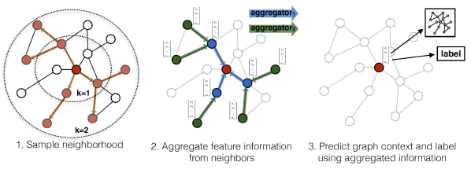
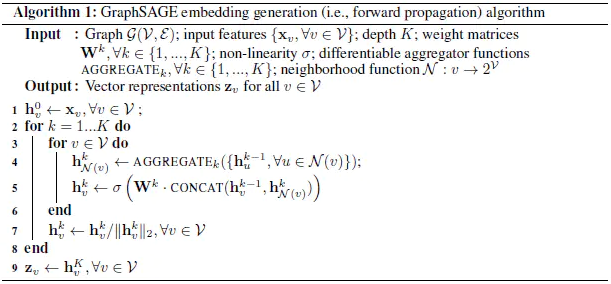
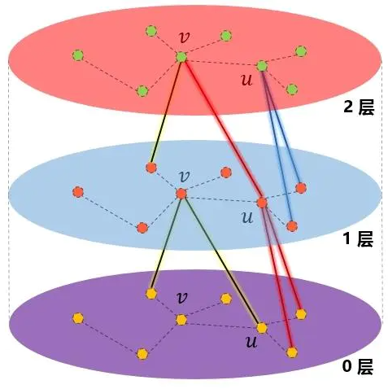
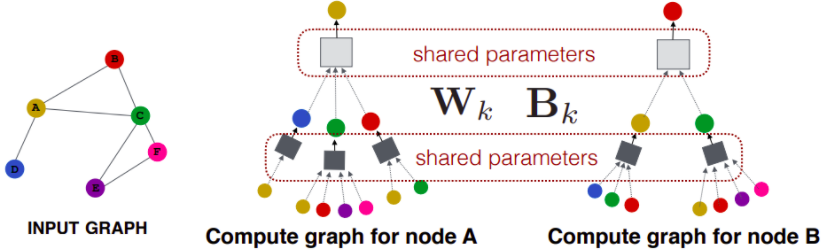
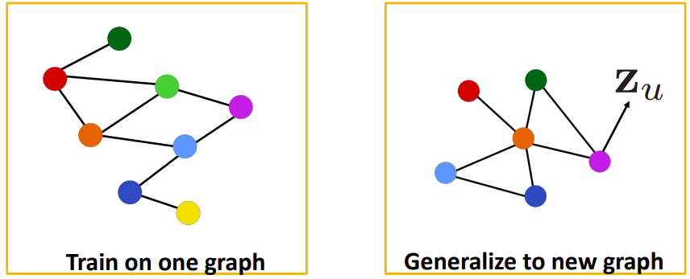
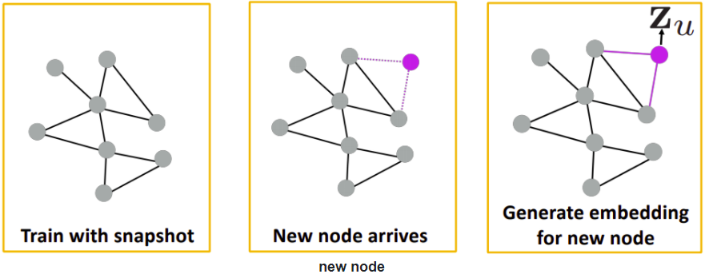

## GraphSAGE原理浅析

【**参考文献**】

[GraphSAGE](https://www.jianshu.com/p/3aa5a4a574e2)

[GraphSAGE: GCN落地必读论文](https://zhuanlan.zhihu.com/p/62750137)

[GRAPH SAGE(SAMPLE AND AGGREGATE) : INDUCTIVE LEARNING ON GRAPHS](https://dsgiitr.com/blogs/graphsage/)

简单代码实现参考：

https://github.com/dsgiitr/graph_nets/blob/master/GraphSAGE/GraphSAGE_Code+Blog.ipynb

### 1. GCN的不足

在大规模图上学习节点embedding，在很多任务中非常有效，如学习节点拓扑结构的 DeepWalk 以及同时学习邻居特征和拓扑结构的GCN。

GCN的不足之处在于，它是一种**transductive learning**的范式，无法泛化到新的未见过的节点或者其他子图上，原因在于：

* GCN中每个节点的表示都是受到其他节点的影响，因此添加一个节点，意味着许许多多与之相关的节点的表示都应该调整。
* GCN的参数学习与邻接矩阵直接相关，是$n\times n$的size，若是有新的节点加入，图的结构会发生变化，邻接矩阵的大小也将发生改变，整个weight就需要重新训练。

为了不重新训练而快速得到新节点的表示，**GraphSAGE（Graph SAmple and aggreGatE）采用inductive learning的学习范式**。

GCN等是直接学习到node embedding的，而GraphSAGE学习的则是一种聚合邻接节点特征的方式（聚合函数），当需要泛化到新的节点上时，这种学习到的聚合方式就可以直接应用，从而得到新节点的node embedding。

### 2. GraphSAGE框架

**GraphSAGE的核心：GraphSAGE不是试图学习一个图上所有node的embedding，而是学习一个为每个node产生embedding的映射。**

文中不是对每个顶点都训练一个单独的embeddding向量，而是训练了一组aggregator functions，这些函数学习如何从一个顶点的局部邻居聚合特征信息（见下图）。**每个聚合函数从一个顶点的不同的hops或者说不同的搜索深度聚合信息。测试或是推断的时候，使用训练好的系统，通过学习到的聚合函数来对完全未见过的顶点生成embedding。**

GraphSAGE的整体流程如下：

1. 对图中每个顶点邻居顶点进行采样，因为每个节点的度是不一致的，为了计算高效， 为每个节点采样固定数量的邻居。
2. 根据聚合函数聚合邻居顶点蕴含的信息。
3. 得到图中各顶点的向量表示供下游任务使用

#### 2.1 前向传播算法

**在每次迭代(或搜索深度)，顶点从它们的局部邻居聚合信息，并且随着这个过程的迭代，顶点会从越来越远的地方获得信息**。

算法中：

* $\zeta=(\nu, \varepsilon)$ 表示节点 $v$ 的特征向量，并且作为输入；
* $h_{u}^{k-1}, \forall u \in N(v)$ 表示在 $k-1$ 层中节点 $v$ 的邻居节点 $u$ 的embedding；
* $h_{N(v)}^{k}$ 表示在第 $k$ 层，节点 $v$ 的所有邻居节点的特征表示；
* $h_{v}^{k}, \forall v \in V$ 表示在第 $k$ 层，节点 $v$ 的特征表示。

* $N(v)$ 定义为集合 $\{u \in v:(u, V) \in \varepsilon$ 中的固定size的均匀取出，即**GraphSAGE中每一层的节点邻居都是是从上一层网络采样的，并不是所有邻居参与，并且采样的后的邻居的size是固定的**

#### 2.2 邻居节点采样

出于对计算效率的考虑，对每个顶点采样一定数量的邻居顶点作为待聚合信息的顶点。设需要的邻居数量，即采样数量为 $S$ , 若顶点邻居数少于 $S$，则采用有放回的抽样方法，直到采样出 $S$ 个顶点。若顶点邻居数大于 $S$ ，则采用无放回的抽样。(即重采样或欠采样。)

当然，若不考虑计算效率，完全可以对每个顶点利用其所有的邻居顶点进行信息聚合，这样是信息无损的。

*这样固定size的采样，每个节点和采样后的邻居的个数都相同，可以把每个节点和它们的邻居拼成一个batch送到GPU中进行批训练。*

* **这里需要注意的是，每一层的node的表示都是由上一层生成的，跟本层的其他节点无关，这也是一种基于层的采样方式。**

* 在图中的“1层”，节点$v$聚合了“0层”的两个邻居的信息，$v$的邻居$u$也是聚合了“0层”的两个邻居的信息。到了“2层”，可以看到节点$v$通过“1层”的节点$u$，扩展到了“0层”的二阶邻居节点。因此，在聚合时，聚合$K$次，就可以扩展到$K$阶邻居。

* **没有这种采样，单个batch的内存和预期运行时是不可预测的，在最坏的情况下是** $O(|V|)$。相比之下，GraphSAGE的每个batch空间和时间复杂度是固定的 $O\left(\prod_{i=1}^{K} S_{i}\right)$，其中 $S_{i}, i \in\{1, \ldots, K\}$ 和 $K$ 是可以指定的参数。

*  **实验发现，$K$不必取很大的值，当$K=2$时，效果就很好了**。至于邻居的个数，原文中提到 $S_{i} \cdot S_{2} \leq 500$，即两次扩展的邻居数之际小于500，**大约每次只需要扩展20来个邻居**时获得较高的性能。
* 论文里说**固定长度的随机游走其实就是随机选择了固定数量的邻居。**

#### 2.3 聚合函数

**因为邻居没有顺序，聚合函数需要满足排序不变量的特性，即输入顺序不会影响函数结果。**

**a. 平均聚合：**先对邻居embedding中每个维度取平均，然后与目标节点embedding拼接后进行非线性转换。
$$
\begin{equation}
\begin{gathered}
h_{N(v)}^{k}=\operatorname{mean}\left(\left\{h_{u}^{k-1}, u \in N(v)\right\}\right) \\
h_{v}^{k}=\sigma\left(W^{k} \cdot \operatorname{CONCAT}\left(h_{v}^{k-1}, h_{N(u)}^{k}\right)\right)
\end{gathered}
\end{equation}
$$
**b. GCN式聚合：**直接对目标节点和所有邻居emebdding中每个维度取平均，后再非线性转换（类似于平滑式的卷积滤波）：
$$
\begin{equation}
h_{v}^{k}=\sigma\left(W^{k} \cdot \operatorname{mean}\left(\left\{h_{v}^{k-1}\right\} \cup\left\{h_{u}^{k-1}, \forall u \in N(v)\right\}\right)\right.
\end{equation}
$$
**c. LSTM式聚合：**LSTM的表达能力更强，但是其不具有顺序不变性，因此需要先对邻居随机排序，然后将乱序的邻居embedding作为输入，让LSTM学到顺序无关的embedding方式。

**d. pooling聚合：**先对每个邻居节点上一层embedding进行非线性转换（等价单个全连接层），再按维度应用 max/mean pooling，捕获邻居集上在某方面的突出的／综合的表现 以此表示目标节点embedding，再与目标节点的输入embedding进行concat，然后再应用一次非线性变换。
$$
\begin{equation}
\begin{gathered}
h_{N(v)}^{k}=\max \left(\left\{\sigma\left(W_{\text {pool }} h_{u i}^{k}+b\right)\right\}, \forall u_{i} \in N(v)\right) \\
h_{v}^{k}=\sigma\left(W^{k} \cdot C O N C A T\left(h_{v}^{k-1}, h_{N(u)}^{k-1}\right)\right)
\end{gathered}
\end{equation}
$$
**实验中LSTM式聚合和pooling聚合效果较好。**

### 3. 学习方式

**a. 无监督loss**

类似contrastive learning，希望节点$u$ 与邻居节点 $v$的embedding相似（对应下面公式第一项），而与不相邻的节点 $v_n$ 不相似（对应公式第二项）。
$$
\begin{equation}
J_{\mathcal{G}}\left(\mathbf{z}_{u}\right)=-\log \left(\sigma\left(\mathbf{z}_{u}^{\top} \mathbf{z}_{v}\right)\right)-Q \cdot \mathbb{E}_{v_{n} \sim P_{n}(v)} \log \left(\sigma\left(-\mathbf{z}_{u}^{\top} \mathbf{z}_{v_{n}}\right)\right)
\end{equation}
$$

* $z_{u}$ 为节点 $u$ 通过GraphSAGE生成的embedding。
* 节点 $v$ 是节点 $u$ 随机游走访问达到的”邻居“。
* $v_{n} \sim P_{n}(u)$ 表示负采样：节点 $v_{n}$ 是从节点 $u$ 的负采样分布 $P_n$ 采样的，$Q$ 为采样样本数。

**b. 有监督loss**

使用下游任务的具体损失函数，如节点分类的交叉熵损失。

### 4. 归纳能力

GraphSAGE学到的聚合函数可以在不同子图之间共享。

例如在蛋白质结构预测任务上，可以泛化到新的图结构上：

加入新节点时，也可以不用重新训练而得到新的embedding（哪怕全部节点都更新一遍，也不用重新训练）：

