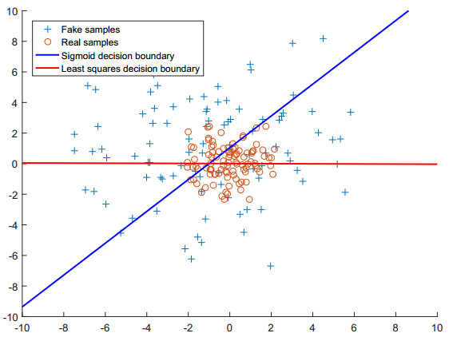
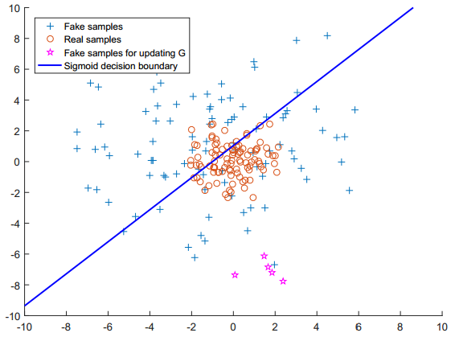
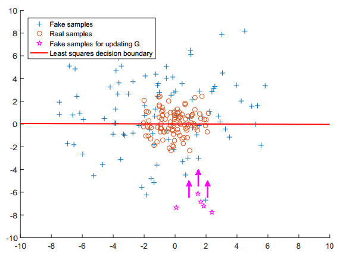
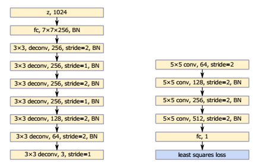
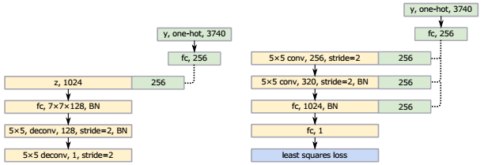
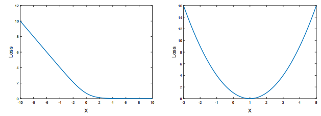

### LSGAN的原理与理解

***

【参考文献】

Least Squares Generative Adversarial Networks	2016

本文讨论的LSGAN是指**Least Square GAN**。

#### 1. 出发点

标准的GAN中，判别器使用的loss是sigmoid交叉熵损失函数，LSGAN的作者提出，将目标函数修改为MSE损失函数，可以引导生成器产生更真实的样本。

这种做法背后的直观解释如下：

理想情况下，对于一个成功训练的GAN，判别器的决策边界应该穿过真实数据的分布（图中红色圆圈点）。我们希望的是生成样本的分布要与真实分布相近，也就是说，希望图中的蓝色加号点也集中在决策边界附近。

如下图，对于sigmoid 交叉熵 loss 来说，如果现在生成样本已经成功地骗过了判别器，那么sigmoid交叉熵loss的值就会趋于饱和，尤其是**对于离决策边界比较远的点（下图中的品红色点），产生的惩罚非常小**，那么对于生成器来说，就没有动力将离决策边界较远的点推向决策边界。也就是说，**生成器仅仅满足于骗过判别器，而不关心生成的样本是否真的接近真实情况**。那么最终的结果就是**生成分布弥散在整个空间中**，虽然这样决策边界也能穿过生成分布，但生成样本的质量得不到保证。

而引入MSE loss能改善这种情况，如下图。**对于离决策边界较远的生成样本点（也就是outlier），MSE会给予较大的惩罚**，这样就能促使生成器产生更接近决策边界的样本点。那么最终的结果就是**一个比较紧凑的、更接近真实分布的生成分布**。

#### 2. 原理

LSGAN的损失函数如下：
$$
\begin{eqnarray}
\min _{D} V_{\mathrm{LSGAN}}(D)&=&\frac{1}{2} \mathbb{E}_{\boldsymbol{x} \sim p_{\mathrm{data}}(\boldsymbol{x})}\left[(D(\boldsymbol{x})-b)^{2}\right]+\frac{1}{2} \mathbb{E}_{\boldsymbol{z} \sim p_{\boldsymbol{z}}(\boldsymbol{z})}\left[(D(G(\boldsymbol{z}))-a)^{2}\right] \tag{2.1}\\
\min _{G} V_{\mathrm{LSGAN}}(G)&=&\frac{1}{2} \mathbb{E}_{\boldsymbol{z} \sim p_{\boldsymbol{z}}}(\boldsymbol{z})\left[(D(G(\boldsymbol{z}))-c)^{2}\right]\tag{2.2}
\end{eqnarray}
$$
其中，$a$是生成数据的标签，$b$是真实数据的标签，$c$是生成器想让判别器给生成数据分配的值。

如果使用LSGAN的目标函数，那么就等价于是在最小化一个**皮尔森-卡方散度**（Pearson $\chi^{2}$ Divergence）。

证明过程如下：

首先，我们可以给生成器的目标函数（2.2）加上一个与优化变量$G$无关的项，改写为：
$$
\min _{G} V_{\mathrm{LSGAN}}(G)=\frac{1}{2} \mathbb{E}_{\boldsymbol{x} \sim p_{\mathrm{data}}(\boldsymbol{x})}\left[(D(\boldsymbol{x})-c)^{2}\right]+\frac{1}{2} \mathbb{E}_{\boldsymbol{z} \sim p_{\boldsymbol{z}}(\boldsymbol{z})}\left[(D(G(\boldsymbol{z}))-c)^{2}\right] \tag{2.3}
$$
然后，固定判别器目标函数（2.1）中的$G$，我们可以求得最优判别器$D^*$。对式（2.1），有：
$$
\begin{eqnarray}
V_{\mathrm{LSGAN}}(D)&=&\frac{1}{2} \mathbb{E}_{\boldsymbol{x} \sim p_{\mathrm{data}}(\boldsymbol{x})}\left[(D(\boldsymbol{x})-b)^{2}\right]+\frac{1}{2} \mathbb{E}_{\boldsymbol{z} \sim p_{\boldsymbol{z}}(\boldsymbol{z})}\left[(D(G(\boldsymbol{z}))-a)^{2}\right]\\
&=& \frac{1}{2} \int_x p_{data}(\boldsymbol{x}) \left[(D(\boldsymbol{x})-b)^{2}\right] dx + \frac{1}{2} \int_x p_g(\boldsymbol{x})\left[(D(\boldsymbol{x})-a)^{2}\right]dx\\
&=& \frac{1}{2} \int _x \{p_{data}(\boldsymbol{x}) \left[(D(\boldsymbol{x})-b)^{2}\right]  + p_g(\boldsymbol{x})\left[(D(\boldsymbol{x})-a)^{2}\right]\}dx
\end{eqnarray}
$$
将积分号中的积分项拿出来：
$$
p_{d a t a}(\boldsymbol{x})\left[(D(\boldsymbol{x})-b)^{2}\right]+p_{g}(\boldsymbol{x})\left[(D(\boldsymbol{x})-a)^{2}\right]
$$
并对$D$进行求导，可以得到最优判别器$D^*$为：
$$
D^{*}(\boldsymbol{x})=\frac{b p_{\mathrm{data}}(\boldsymbol{x})+a p_{g}(\boldsymbol{x})}{p_{\mathrm{data}}(\boldsymbol{x})+p_{g}(\boldsymbol{x})} \tag{2.4}
$$
将$D^*$代入生成器的目标函数（2.3），有：
$$
\begin{array}{l}{2 C(G)=\mathbb{E}_{\boldsymbol{x} \sim p_{\mathrm{d}}}\left[\left(D^{*}(\boldsymbol{x})-c\right)^{2}\right]+\mathbb{E}_{\boldsymbol{x} \sim p_{g}}\left[\left(D^{*}(\boldsymbol{x})-c\right)^{2}\right]} \\ {=\mathbb{E}_{\boldsymbol{x} \sim p_{\mathrm{d}}}\left[\left(\frac{b p_{\mathrm{d}}(\boldsymbol{x})+a p_{g}(\boldsymbol{x})}{p_{\mathrm{d}}(\boldsymbol{x})+p_{g}(\boldsymbol{x})}-c\right)^{2}\right]+\mathbb{E}_{\boldsymbol{x} \sim p_{g}}\left[\left(\frac{b p_{\mathrm{d}}(\boldsymbol{x})+a p_{g}(\boldsymbol{x})}{p_{\mathrm{d}}(\boldsymbol{x})+p_{g}(\boldsymbol{x})}-c\right)^{2}\right]}\\
=\int_{\mathcal{X}} p_{\mathrm{d}}(\boldsymbol{x})\left(\frac{(b-c) p_{\mathrm{d}}(\boldsymbol{x})+(a-c) p_{g}(\boldsymbol{x})}{p_{\mathrm{d}}(\boldsymbol{x})+p_{g}(\boldsymbol{x})}\right)^{2} \mathrm{d} x+\int_{\mathcal{X}} p_{g}(\boldsymbol{x})\left(\frac{(b-c) p_{\mathrm{d}}(\boldsymbol{x})+(a-c) p_{g}(\boldsymbol{x})}{p_{\mathrm{d}}(\boldsymbol{x})+p_{g}(\boldsymbol{x})}\right)^{2} \mathrm{d} x\\
=\int_{\mathcal{X}} \frac{\left((b-c) p_{\mathrm{d}}(\boldsymbol{x})+(a-c) p_{g}(\boldsymbol{x})\right)^{2}}{p_{\mathrm{d}}(\boldsymbol{x})+p_{g}(\boldsymbol{x})} \mathrm{d} x\\
=\int_{\mathcal{X}} \frac{\left((b-c)\left(p_{\mathrm{d}}(\boldsymbol{x})+p_{g}(\boldsymbol{x})\right)-(b-a) p_{g}(\boldsymbol{x})\right)^{2}}{p_{\mathrm{d}}(\boldsymbol{x})+p_{g}(\boldsymbol{x})} \mathrm{d} x
\end{array} 
$$
令$b-c=1$，$b-a=2$，我们就可以得到：
$$
\begin{aligned} 2 C(G) &=\int_{\mathcal{X}} \frac{\left(2 p_{g}(\boldsymbol{x})-\left(p_{\mathrm{d}}(\boldsymbol{x})+p_{g}(\boldsymbol{x})\right)\right)^{2}}{p_{\mathrm{d}}(\boldsymbol{x})+p_{g}(\boldsymbol{x})} \mathrm{d} x \\ &=\chi_{\text { Pearson }}^{2}\left(p_{\mathrm{d}}+p_{g} \| 2 p_{g}\right) \end{aligned}
$$
其中$\chi_{\mathrm{P} \text { earson }}^{2}\left(p_{\mathrm{d}}+p_{g} \| 2 p_{g}\right)$就代表了皮尔森-卡方散度。

关于确定参数$a$，$b$，$c$，作者给出了两种选择。第一种选择就是这就让$a$，$b$，$c$满足$b-c=1$，$b-a=2$，这样最小化生成器的目标函数就等价于最小化$p_{\mathrm{d}}+p_{g}$与2$p_{g}$之间的皮尔森-卡方散度。比如，设定$a=-1$，$b=1$和$c=0$，那么可以得到如下的目标函数：
$$
\begin{aligned} \min _{D} V_{\mathrm{LSGAN}}(D) &=\frac{1}{2} \mathbb{E}_{\boldsymbol{x} \sim p_{\mathrm{data}}(\boldsymbol{x})}\left[(D(\boldsymbol{x})-1)^{2}\right]+\frac{1}{2} \mathbb{E}_{\boldsymbol{z} \sim p_{\boldsymbol{z}}(\boldsymbol{z})}\left[(D(G(\boldsymbol{z}))+1)^{2}\right] \\ \min _{G} V_{\mathrm{LSGAN}}(G) &=\frac{1}{2} \mathbb{E}_{\boldsymbol{z} \sim p_{\boldsymbol{z}}(\boldsymbol{z})}\left[(D(G(\boldsymbol{z})))^{2}\right] \end{aligned}
$$
另一种选择是使用0-1标签来标记正负样本，同时直接让$c=b$，可以得到如下目标函数：
$$
\begin{aligned}
\min _{D} V_{\mathrm{LSGAN}}(D)&=\frac{1}{2} \mathbb{E}_{\boldsymbol{x} \sim p_{\text { data }}(\boldsymbol{x})}\left[(D(\boldsymbol{x})-1)^{2}\right]+\frac{1}{2} \mathbb{E}_{\boldsymbol{z} \sim p_{\boldsymbol{z}}(\boldsymbol{z})}\left[(D(G(\boldsymbol{z})))^{2}\right]\\
 \min _{G} V_{\mathrm{LSGAN}}(G)&=\frac{1}{2} \mathbb{E}_{\boldsymbol{z} \sim p_{\boldsymbol{z}}(\boldsymbol{z})}\left[(D(G(\boldsymbol{z}))-1)^{2}\right]
\end{aligned}
$$

#### 3. 模型结构

作者提出了两种LSGAN的网络结构。第一种借鉴VGG和DCGAN的一些技巧：

第二种结构用于条件生成，文中给出的例子是汉字生成：

#### 4. 优势

LSGAN的优势主要有以下三点：

* **可以生成更真实的样本；**
* **有助于解决训练生成器时梯度消失的问题；**
* **有助于稳定训练。**

关于第一点，我们已经在第一节中看到了。现在解释下第二点和第三点。

首先是关于梯度消失的问题。sigmoid cross entropy和MSE的曲线图如下（左边是sigmoid cross entropy，右边是MSE）：

可以看到sigmoid cross entropy比较容易饱和，尤其是在>0的部分，都比较平坦，这部分产生的梯度为0，不利于生成器去进行更新。而MSE仅在顶点附件比较平坦，可以产生更多的梯度，所以生成器训练起来就更加容易。

关于第三点稳定训练，文中并没有给出直接说明，这里说下我的个人理解。

在原始的GAN中，为了解决一开始生成器的目标函数过饱和的问题，作者把目标函数由原来的$\mathbb{E}_{x \sim P_{g}}[\log (1-D(x))]$ 换成了 $\mathbb{E}_{x \sim P_{g}}[-\log D(x)]$，这样虽然能在一定程度上缓解梯度消失问题，但是最小化的目标由原来的JS散度变成了一个KL散度减去JS散度的项，这样模型一方面要最小化KL散度，一方面又要增大JS散度，这是两个矛盾的过程，所以会造成训练不稳定。而LSGAN最小化MSE loss等价于最小化皮尔森-卡方散度，避免了这种互相矛盾的情况，同时又避免了梯度消失问题，所以训练会稳定一些。

