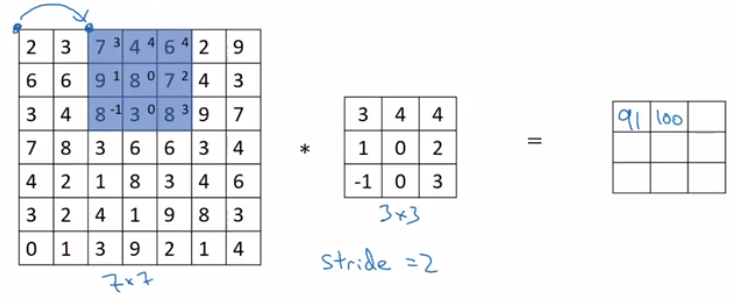
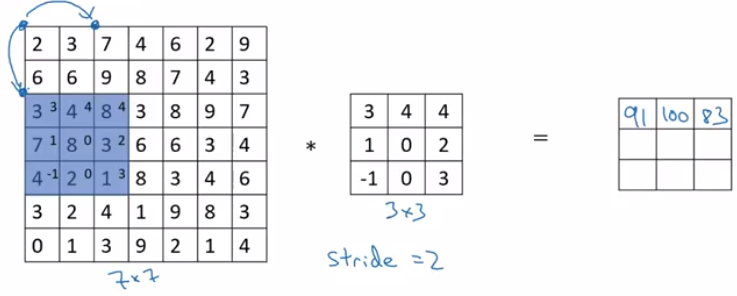
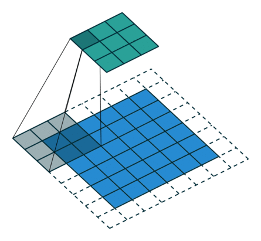

### Strided Convolution & Fractionally Strided Convolution

------

【参考资料】

[Transposed Convolution, Fractionally Strided Convolution or Deconvolution](<https://buptldy.github.io/2016/10/29/2016-10-29-deconv/>)

#### 1. strided convolution

Strided convolutional是一种下采样手段，简单来说，strided convolution就是步长大于1的卷积。与无参数的pooling不同，strided convolution的下采样参数是可以学习的。

卷积操作输出图像的大小与输入图像的尺寸$i \times i$、卷积核的大小$k \times k$、卷积移动的步长$s$和padding的大小$p$有关：
$$
o=\left\lfloor\frac{i+2 p-k}{s}\right\rfloor+ 1
$$
其中$\lfloor x\rfloor$表示对$x$向下取整。

通常取stride=2，就可以达到图像尺寸缩小一半的效果。

不过在实际操作中，strided convolution并没有证实会比pooling有效，因为strided convolution以大于1的步长滑动时，没有被卷积核覆盖到的地方会被忽略；另外，strided convolution引入了额外的参数。

#### 2. fractional strided convolution

fractional strided convolution是一种特殊的反卷积操作。

我们通常所说的deconvolution如下图：

令$i^{\prime}$表示deconvolution的输入尺寸，$k^{\prime}$表示卷积核尺寸，$s^{\prime}$表示移动的步长，$p^{\prime}$表示padding的大小。那么反过来看（即输入输出互换），这个deconvolution对应的卷积操作的参数为$(i=4, k=3, s=1, p=0)$。我们可以发现对应的卷积和非卷积操作其$ (k=k′,s=s′)$，但是反卷积却多了$p′=2$。通过对比我们可以发现卷积层中左上角的输入只对左上角的输出有贡献，所以反卷积层会出现 $p′=k−p−1=2$。通过示意图，我们可以发现，反卷积层的输入输出在$ s=s′=1$的情况下关系为：
$$
o^{\prime}=i^{\prime}-k^{\prime}+2 p^{\prime}+1=i^{\prime}+(k-1)-2 p
$$
Fractionally Strided Convolution，翻译过来大概意思就是小数步长的卷积。对于步长$ s>1$的卷积，我们可能会想到其对应的反卷积步长$ s′<1$。

对于反卷积操作的小数步长我们可以理解为：在其输入特征单元之间插入$ s−1$个0，插入0后把其看出是新的特征输入，然后此时步长$ s′$不再是小数而是为1。因此，结合上面所得到的结论，我们可以得出Fractionally Strided Convolution的输入输出关系为：
$$
o^{\prime}=s\left(i^{\prime}-1\right)+k-2 p
$$
 如下图所示的反卷积，对应一个参数为 $i=5,k=3,s=2,p=1$的正常卷积操作：

