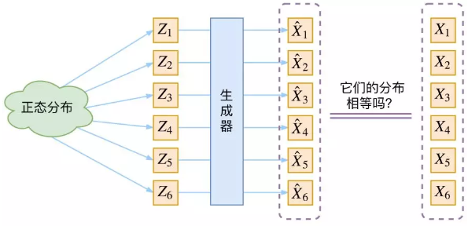
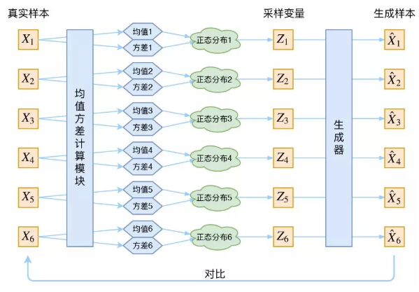
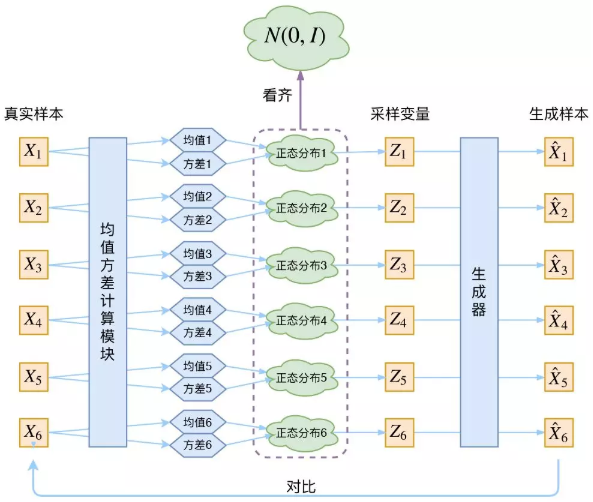
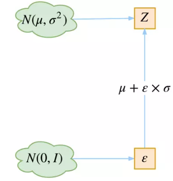
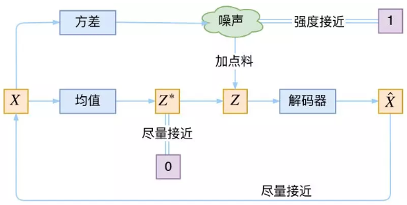
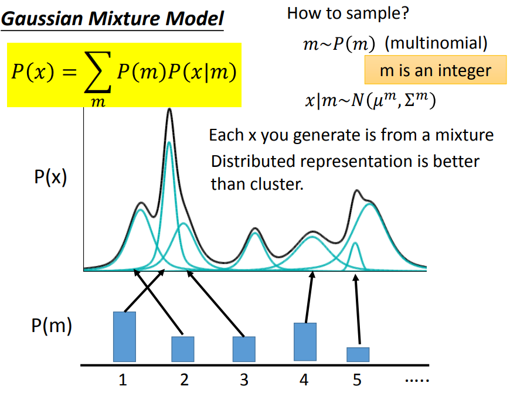
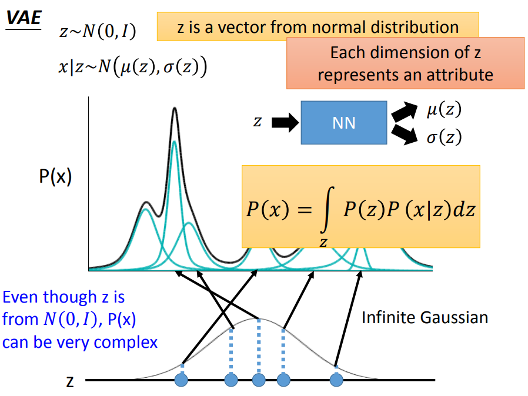
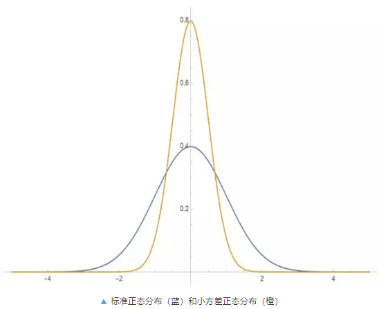

### VAE原理解析及若干理解

***

【参考资料】

[变分自编码器VAE：原来是这么一回事 | 附开源代码](https://mp.weixin.qq.com/s/627RXH2VWN_DNuLuUIJS4A)

[再谈变分自编码器VAE：从贝叶斯观点出发](https://mp.weixin.qq.com/s/NjpFwHcD2mhNogcV7TiUyA)

[变分自编码器VAE：这样做为什么能成？](https://mp.weixin.qq.com/s/BVp-mjRGaMBG4zKUtZHTHw)

[变分自动编码器(VAE)](http://www.fanyeong.com/2018/06/01/vae/)

李宏毅《机器学习》	[VAE讲义](http://speech.ee.ntu.edu.tw/~tlkagk/courses/ML_2016/Lecture/VAE%20(v5).pdf)

#### 1. VAE的形式

**生成模型**

生成模型的目的是要刻画数据$X$的分布$P(x)$。假设我们有一批数据样本$\{x^{(1)},x^{(2)}, \ldots, x^{(n)}\}$，如果我们可以直接根据这些数据得到$P(x)$，那么直接对$P(x)$采样，我们就能得到所有可能的$x$，生成新的$x$的样本就顺理成章了。这是生成模型的终极理想情况。

当然，实际中我们要直接获得$P(x)$是很困难的，所以我们将$P(x)$的表达更换一下：
$$
P(x) = \int_z p(x|z)p(z)dz
$$
这种情况下，我们假设样本$x$与一个隐变量$z$有关，分布$p(x|z)$描述了一个由$z$生成$x$的过程。如果想要生成一个新的样本，那么我们**先从分布$p(z)$中采样一个$z$，然后在根据$p(x|z)$来生成$x$**，这就是生成模型的标准形式。

要想得到一个生成模型，涉及到求解分布$p(z)$和$p(x|z)$的参数。在GMM中，我们会假设隐变量$z$的先验$p(z)$服从一个参数为$\phi$的多项式分布，而$p(x|z)$服从一个参数为$\theta$（即均值和方差）的高斯分布。而在VAE中，我们假设隐变量$z$的先验服从一个标准的（且各分量相互独立的）正态分布$N(0, I)$。所以，生成模型中要求解的参数就变成了分布$p(x|z)$的参数$\theta$。

------

**衡量生成分布与真实分布**

生成模型的难题在于如何判断生成的分布与真实分布之间的相似程度，也就是说，我们需要有一个衡量生成分布与真实分布相似度的指标。知道了这个指标后，我们就能以最小化这个指标为目标，去求解生成模型$p(x|z)$的参数$\theta$。

不同的生成模型衡量生成分布和真实分布相似程度的方式是不同的。GAN使用一个判别器来分辨生成样本和真实样本，将判别器的分类loss作为衡量两个分布相似性的指标，实际上等效为最小化两个分布间的JS散度。

VAE则使用生成样本和真实样本之间的L2距离来衡量两个分布间的相似程度。不过这里有一个问题，用于计算L2距离的生成样本和真实样本之间必须是一一对应的，否则这个指标是没有意义的。如果我们直接从先验$p(z)$中采样，那么我们无法保证生成的样本$\hat x_i$就一定对应于某个真实的样本$x_i$。

------

**VAE的做法**

为了解决上述问题，VAE在训练过程中，把从先验$p(z)$中采样转换为从后验$p(z|x)$中采样。具体来说，给定一个真实样本$x^{(i)}$，我们假设存在一个专属于$x^{(i)}$的后验$p(z^{(i)}|x^{(i)})$，并且进一步假设这个后验是各个分量独立的多元正态分布。这样，我们就把样本$x^{(i)}$和专属于它的一个隐变量$z^{(i)}$绑定到了一起。

现在，当生成新的样本时，我们从$p(z^{(i)}|x^{(i)})$中采样，由于$z^{(i)}$是专属于样本$x^{(i)}$的，所以我们有理由相信，这样生成的$\hat x^{(i)}$能够还原$x^{(i)}$，它们就能够对应起来。

所以，通过这种方式，我们给每个样本都配上了一个专属的正态分布，有多少个样本就有多少个正态分布，每个正态分布都对应一组均值和方差。现在的问题是，怎么找到这些正态分布的参数，即均值和方差？最简单粗暴的方式就是直接由神经网络去拟合。

于是我们构建两个神经网络$\mu^{(i)}=f_1(x^{(i)})$，$\operatorname{log}(\sigma^{(i)})^{2}=f_2(x^{(i)})$，前者负责拟合均值，后者负责拟合方差。这里之所以选择拟合$\log (\sigma^{(i)})^{2}$而不是直接拟合$(\sigma^{(i)})^{2}$，是因为$(\sigma^{(i)})^{2}$总是非负的，需要进行特殊的激活函数处理，而拟合$\log(\sigma^{(i)})^{2}$就不需要了，因为它可正可负。

所以我们可以得到下面的框架:

实际上，这个框架就是一个自编码器的结构，均值方差计算模块对应了encoder的部分，而生成器对应了decoder的部分。

------

**后验分布的对齐**

上面的框架已经很接近VAE的形式了，但是还存在一个问题。当训练完成后，我们是从先验$p(z)$中进行采样，生成新的样本，但是在训练时，我们是从后验$p(z|x)$中采样来生成样本的，这两个过程之间没有什么联系，也就是说，我们无法确定通过后验采样训练得到的模型就一定能匹配到从先验中采样的情形。所以为了解决这个问题，VAE还要求训练过程中所有的后验分布$p(z^{(i)}|x^{(i)})$要与标准的高斯先验对齐。

对齐操作是通过在原来的重构loss上添加正则项来实现的。最简单的做法就是让均值计算网络的输出$\mu^{(i)}=f_1(x^{(i)})$和方差计算网络的输出$\operatorname{log}(\sigma^{(i)} )^{2}=f_2(x^{(i)})$分别与标准高斯分布的均值和方差对齐，即希望二者都趋近于0，这样引入的正则项是：
$$
\mathcal{L}_{\mu}=\left\|f_{1}\left(x^{(i)}\right)\right\|^{2} \quad  \quad \mathcal{L}_{\sigma^{2}}=\left\|f_{2}\left(x^{(i)}\right)\right\|^{2}
$$
不过这样会面临两个正则项的比例如何选取的问题，所以VAE直接使用了后验正态分布和标准高斯分布的KL散度$\operatorname{KL}(N(\mu, \sigma^{2}I)\|N(0,I))$来作为正则项，这个KL散度有解析的表达式，结果为：
$$
\mathcal{L}_{\mu, \sigma^{2}}=\frac{1}{2} \sum_{k=1}^{d}\left(\mu_{k}^{2}+\sigma_{k}^{2}-\log \sigma_{k}^{2}-1\right)
$$
这里$d$是指隐变量的维度，$k$代表的是均值向量和方差向量的第$k$个维度。

**推导过程**：由于我们考虑的是各分量独立的多元正态分布（即平均场假设），因此只需要推导一元正态分布的情形即可，根据定义我们可以写出：
$$
\begin{aligned} & K L\left(N\left(\mu, \sigma^{2}\right) \| N(0,1)\right) \\ &=\int \frac{1}{\sqrt{2 \pi \sigma^{2}}} e^{-(x-\mu)^{2} / 2 \sigma^{2}}\left(\log \frac{e^{-(x-\mu)^{2} / 2 \sigma^{2}} / \sqrt{2 \pi \sigma^{2}}}{e^{-x^{2} / 2} / \sqrt{2 \pi}}\right) d x \\ &=\int \frac{1}{\sqrt{2 \pi \sigma^{2}}} e^{-(x-\mu)^{2} / 2 \sigma^{2}} \log \left\{\frac{1}{\sqrt{\sigma^{2}}} \exp \left\{\frac{1}{2}\left[x^{2}-(x-\mu)^{2} / \sigma^{2}\right]\right\}\right\} d x \\ &=\frac{1}{2} \int \frac{1}{\sqrt{2 \pi \sigma^{2}}} e^{-(x-\mu)^{2} / 2 \sigma^{2}}\left[-\log \sigma^{2}+x^{2}-(x-\mu)^{2} / \sigma^{2}\right] d x \end{aligned}
$$
整个结果分为三项，第一项是$-\log \sigma^{2}$乘以$x$的正态概率密度的积分（也就是1），所以结果是$-\log \sigma^{2}$；第二项实际是正态分布的二阶矩，结果是$\mu^2+\sigma^2$；第三项可以写成：
$$
\begin{aligned}
\int \frac{1}{\sqrt{2 \pi \sigma^{2}}} e^{-(x-\mu)^{2} / 2 \sigma^{2}} &[(x-\mu)^{2} / \sigma^{2}]dx
\\&= \int \frac{1}{\sqrt{2 \pi \sigma^{2}}} e^{-(x-\mu)^{2} / 2 \sigma^{2}}\frac{x^2-2x\mu+\mu^2}{\sigma^2}dx\\
&= \frac{\mu^2+\sigma^2-2\mu^2+\mu^2}{\sigma^2} = 1
\end{aligned}
$$
所以总结果就是：
$$
K L\left(N\left(\mu, \sigma^{2}\right) \| N(0,1)\right)=\frac{1}{2}\left(-\log \sigma^{2}+\mu^{2}+\sigma^{2}-1\right)
$$
**如果没有KL正则项会怎么样？**

我们可以考虑一下如果不对齐到标准正态分布的情况。整个VAE的框架中，重构过程实际上是受到噪声影响的，因为$z^{(i)}$是重新采样出来的，而不是直接由encoder算出来。这个噪声是由方差网络计算出来的，如果没有任何约束，那么模型为了达到最大的重构效果，肯定会想尽办法让方差为0，这样一来采样就没有随机性了，得到的是确定的结果（也就是均值），从一个确定的结果中进行重构显然比从随机的、不确定的结果进行重构要容易得多。

于是，随着训练不断进行，模型会慢慢退化成普通的自编码器，噪声不再起作用，这样VAE的建模就白费力气了。直接训练自编码器，然后用训练完的decoder来进行生成固然是可以的，但这样在生成新样本的时候，我们是从一个不相干的先验中进行采样，生成的质量就得不到保证。

所以，VAE要使用KL正则项来与标准正态分布进行对齐，保证噪声的方差不为0，这样，我们就能与标准正态先验的假设匹配起来，保证生成的质量。

**为什么生成新样本不直接从后验中采样？**

这是不可行的。首先，每个真实样本都对应了一个专属的后验分布，如果要从后验中采样来生成新样本，那么就会面临选择哪个后验的问题。此外，就算确定了要选择哪个后验，从这个后验采样得到的$z$也只是专属于某个真实样本的，生成出来的新样本实际上是在进行对应的真实样本的重构，也就是说，模型只会“模仿”，而不会“创造”。

------

**重参数技巧**

最后是实现模型的一个技巧，英文名是Reparameterization Trick。

在模型训练时，我们要从后验$p(z^{(i)}|x^{(i)})$中采样出一个$z^{(i)}$来，尽管我们知道$p(z^{(i)}|x^{(i)})$是一个正态分布，但它的均值和方差都是借助网络算出来的，我们需要依靠这个过程来反向优化计算均值和方差的网络，但是“采样”这个操作本身是不可导的，为了解决这个问题，我们利用这样一个事实：

* 从$\mathcal{N}\left(\mu, \sigma^{2} I\right)$中采样一个$z$，相当于从$\mathcal{N}(0, I)$中采样一个$\varepsilon$，然后让$z=\mu+\varepsilon \times \sigma$。

利用均值和方差的性质很好理解，如果$\varepsilon \sim \mathcal{N}(0, I)$  ，那么$\varepsilon \times \sigma \sim \mathcal{N}(0, \sigma^2I)$，那么$\mu+\varepsilon \times \sigma \sim \mathcal{N}\left(\mu, \sigma^{2} I\right)$。

通过这种重参数的技巧，“采样”这个操作就不用参与梯度下降了，改为采样的结果去参与，使得整个模型就可以训练了。

------

**VAE与AE的联系**

通过前面的描述我们知道，VAE的损失函数与AE的损失函数的区别就在于一个KL散度的正则项。实际上，**VAE就是在常规的自编码器的基础上，对 encoder 的结果（在VAE中对应着计算均值的网络）加上了“高斯噪声”，使得结果 decoder 能够对噪声有鲁棒性**；**而那个额外的 KL loss（目的是让均值为 0，方差为 1），事实上就是相当于对 encoder 的一个正则项，希望 encoder 出来的东西均有零均值。** 

那另外一个 encoder（对应着计算方差的网络）的作用呢？它是用来**动态调节噪声的强度**的。

直觉上来想，**当 decoder 还没有训练好时（重构误差远大于 KL loss），就会适当降低噪声（KL loss 增加），使得拟合起来容易一些（重构误差开始下降）**。

反之，**如果 decoder 训练得还不错时（重构误差小于 KL loss），这时候噪声就会增加（KL loss 减少），使得拟合更加困难了（重构误差又开始增加），这时候 decoder 就要想办法提高它的生成能力了**。

说白了，**重构的过程是希望没噪声的，而 KL loss 则希望有高斯噪声的，两者是对立的。所以，VAE 跟 GAN 一样，内部其实是包含了一个对抗的过程，只不过它们两者是混合起来，共同进化的**。

#### 2. 数学原理

**变分推断**

我们目的是最大化观测数据$x$的概率分布$P (x)$的对数似然，直接对$P(x)$作最大似然涉及到对积分$P(x)=\int_{z} P(z) P(x | z) d z$的求导，并不好求解，所以引入变分推断，对参数估计的过程进行改写：
$$
\begin{aligned}
\log P(x)&=\int_{z} q(z | x) \log P(x) d z\\
&=\int_{Z} q(z | x) \log \left(\frac{P(z, x)}{P(z | x)}\right) d z\\
&= \int_{Z} q(z | x) \log \left(\frac{P(z, x)}{q(z | x)} \frac{q(z | x)}{P(z | x)}\right) d z \\
&= \int_{Z} q(z | x) \log \left(\frac{P(z, x)}{q(z | x)}\right) d z+\int_{z} q(z | x) \log \left(\frac{q(z | x)}{P(z | x)}\right) d z \\
&= \int_{Z} q(z | x) \log \left(\frac{P(z, x)}{q(z | x)}\right) d z + K L(q(z | x) \| P(z | x))\\
&\geq \int_{z} q(z | x) \log \left(\frac{P(x | z) P(z)}{q(z | x)}\right) d z
\end{aligned}
$$
令$L_b$表示变分下界，那么有：
$$
\begin{aligned}
L_b &= \int_{z} q(z | x) \log \left(\frac{P(x | z) P(z)}{q(z | x)}\right) d z \\
&= \int_{z}q(z | x) \log \left(\frac{P(z)}{q(z | x)}\right) d z+\int_{z} q(z | x) \log P(x | z) d z \\
&= E_{q(z | x)}[\log P(x | z)] - K L(q(z | x)| | P(z))
\end{aligned}
$$
并且，
$$
\log P(x)=L_{b}+K L(q(z | x) \| P(z | x))
$$
所以最大化$\log P(x)$就变成了最大化它的变分下界$L_b$。

------

**损失函数**

对于VAE来说，$L_b$就是它的损失函数：
$$
L_b = E_{q(z | x)}[\log P(x | z)]-K L(q(z | x) \| P(z) )
$$
这个式子中的第一项是概率$P(x|z)$的对数似然，它对应到VAE中decoder的输出；第二项就是VAE中KL散度的正则项。

------

**后验分布近似**

要求解$L_b$，我们需要知道$P(x|z)$，$P(z)$和$q(z|x)$，它们分别对应生成模型（即decoder）的输出概率分布、隐变量$z$的先验概率分布和后验概率分布。

首先，为了便于采样，我们假设$z \sim N(0,I)$，即标准的多元正态分布，这就解决了$P(z)$。

然后是后验$q(z|x)$，正常来讲，求解后验需要用到贝叶斯公式进行推断：
$$
q(z | x)=P(z | x)=\frac{P(x | z) P(z)}{P(x)}=\frac{P(x | z) P(z)}{\int P(x | z) P(z) d z}
$$
但因为涉及到分母上积分项的求解，所以这里我们是通过变分推断去求解的$P(z|x)$的近似$q(z|x)$。

具体来说，我们假设$q(z|x)$也是（各分量独立的）正态分布，其均值和方差由$x$来决定，并且通过一个神经网络进行拟合：
$$
p(z | x)=\frac{1}{\prod_{k=1}^{d} \sqrt{2 \pi \sigma_{k}^{2}(x)}} \exp \left(-\frac{1}{2}\left\|\frac{z-\mu(x)}{\sigma(x)}\right\|^{2}\right)
$$
这样KL散度项就可以解析的算出来（前面已经推导过）：
$$
K L(p(z | x) \| q(z))=\frac{1}{2} \sum_{k=1}^{d}\left(\mu_{k}^{2}(x)+\sigma_{k}^{2}(x)-\ln \sigma_{k}^{2}(x)-1\right)
$$

***

**生成模型近似**

现在只剩生成模型部分$P(x|z)$了。VAE的原文中给了两种候选方案：**伯努利分布或正态分布**。

**伯努利分布模型**：

首先来看伯努利分布，众所周知它其实就是一个二元分布：
$$
p(\xi)=\left\{\begin{array}{l}{\rho, \xi=1} \\ {1-\rho, \xi=0}\end{array}\right.
$$
所以伯努利分布只适用于$x$是一个多元的二值向量的情况，比如$x$是二值图像时（mnist 可以看成是这种情况）。这种情况下，我们用神经网络$ρ(z)$ 来算参数$ρ$，从而得到：
$$
q(x | z)=\prod_{k=1}^{D}\left(\rho_{k}(z)\right)^{x_k}\left(1-\rho_{k}(z)\right)^{1-x_k}
$$
这时取对数可以算出：
$$
-\ln q(x | z)=\sum_{k=1}^{D}\left[-x_{k} \ln \rho_{k}(z)-\left(1-x_{k}\right) \ln \left(1-\rho_{k}(z)\right)\right]
$$
这表明$\rho(z)$要压缩到0~1之间（比如用sigmoid激活），然后用交叉熵作为损失函数，这里$\rho (z)$就起到了类似decoder的作用。

**正态分布模型**：

然后是正态分布，这跟 $q (z|x)$ 是一样的，只不过$x$，$z$交换了位置：
$$
q(x | z)=\frac{1}{\prod_{k=1}^{D} \sqrt{2 \pi \sigma_{k}^{2}(z)}} \exp \left(-\frac{1}{2}\left\|\frac{x-\mu(z)}{\sigma(z)}\right\|^{2}\right)
$$
这里的$\mu (z)$，$\sigma^2 (z)$是输入为$z$，输出分别为均值和方差的神经网络。于是:
$$
-\ln q(x | z)=\frac{1}{2}\left\|\frac{x-\mu_{k}(z)}{\sigma(z)}\right\|^{2}+\frac{D}{2} \ln 2 \pi+\frac{1}{2} \sum_{k=1}^{D} \ln \sigma_{k}^{2}(z)
$$
一般我们不考虑方差$\sigma ^2 (z)$，而是把它固定为一个常数$\sigma ^2$，于是有：
$$
-\ln q(x | z) \sim \frac{1}{2 \sigma^{2}}\left\|x-\mu_{k}(z)\right\|^{2}
$$
这就出现了 MSE 损失函数。

因此，对于二值数据，我们可以对 decoder 用 sigmoid 函数激活，然后用交叉熵作为损失函数，这对应于$q(x|z)$ 为**伯努利分布**；而对于一般数据，我们用 MSE 作为损失函数，这对应于 $q(x|z)$ 为固定方差的**正态分布**。

***

**采样计算技巧**

现在，所有的分布都可以计算出来了，但是还有一个小问题没有解决，那就是采样。后验$q(z|x)$的作用分为两部分，一部分用来计算KL散度$K L(q(z | x) \| P(z))$，另一部分则是用来算$E_{q(z | x)}[\log P(x | z)]$，而要计算期望$E_{q(z | x)}[\log P(x | z)]$就意味着要进行采样：
$$
-\frac{1}{n} \sum_{i=1}^{n} \ln P\left(x | z_{i}\right), \quad z_{i} \sim q(z | x)
$$
采样过程本身可以借助重参数技巧来完成，现在的问题是，采样多少个才合适？

标准的 VAE 非常直接了当：一个！

所以这时VAE的loss函数就变得非常简单了：
$$
\mathcal{L}=\mathbb{E}_{x \sim p(x)}[-\ln P(x | z)+K L(q(z | x) \| P(z))], \quad z \sim q(z | x)
$$
那么最后的问题就是采样一个究竟够了吗？事实上我们会运行多个 epoch，每次的隐变量都是随机生成的，因此当 epoch 数足够多时，事实上是可以保证采样的充分性的。

#### 3. 一些理解

**VAE与GMM**

VAE的生成过程可以看作是一个进阶版的GMM。在标准GMM中，我们从一个多项式分布中对隐变量进行采样，隐变量的可能取值是有限的、离散的，得到的模型是有限个高斯分布的混合。

而在VAE中，我们从一个标准正态分布中对隐变量进行采样，隐变量的取值是连续的，得到的模型可以看作是无数个高斯分布的混合。

------

**VAE与变分EM**

VAE引入变分推断来最大化概率分布$P(x)$的对数似然，而变分EM也是在做相同的事情。如果我们把VAE中近似的隐变量后验$q(z|x)$代入到EM算法的M-Step中，会导出与VAE的目标函数一模一样的变分下界。所以本质上，VAE相当于是在做变分EM。

但是VAE的优势在哪呢？在标准的变分EM中，参数求解是一个坐标上升的过程，E-Step中，我们需要先固定参数$\theta$，去求解近似分布$q$；M-Step中，我们需要固定分布$q$，去求解参数$\theta$。这里的参数$\theta$就对应了VAE中decoder的参数，而求解分布$q$就对应了求解VAE中encoder的参数。显然，整个参数求解是一个分裂的过程。

但是VAE通过重参数技巧，把encoder和decoder的参数求解联系到了一起，这样整个网络就可以使用SGD进行端到端的训练。另外，VAE使用神经网络来拟合分布的参数，这样就与深度学习结合了起来，可以利用神经网络强大的拟合能力来进行参数估计。

所以，VAE可以看作是一个神经网络版的端到端的变分EM算法。

***

**采样一次 v.s. 采样多次**

重新回顾一下生成模型的求解目标：
$$
\log p_{\theta}(x)=\sum_{i=1}^{N} \log p_{\theta}\left(x^{(i)}\right)
$$
其中，
$$
\log p_{\theta}\left(x^{(i)}\right)=\log \int p_{\theta}(x | z) p(z) d z
$$
这个积分当然不好计算，作为替代，我们可以直接对这个积分进行采样，来计算梯度，进行参数求解，这种方式被称为：Naive Monte Carlo Gradient Estimator。具体地，我们从$p(z)$中采样出$L$个数据点$z^{(1)}, z^{(2)}, \ldots, z^{(L)}$，然后用下面的公式去估计$p_{\theta}\left(x^{(i)}\right)$：
$$
p_{\theta}\left(x^{(i)}\right) \approx \frac{1}{L} \sum_{l=1}^{L} p_{\theta}\left(x^{(i)} | z^{l}\right)
$$
新得到的公式中已经没有$z$了，这样我们就能计算出它的梯度$\nabla_{\theta} \log p_{\theta}\left(x^{(i)}\right)$了。这种方法看上去很完美，但是很遗憾，它并不work。主要原因是，$x$的维度非常高，而$z$的维度很低。所以，采样得到的$p_{\theta}(x | z)$很容易偏斜，很容易只能采样到一小部分区域。因此，要获取准确的结果，采样的数据点个数必须非常大，这样会引入极大的计算消耗。

所以，凭空去采样$z$是比较困难的，因为$z$的变化范围比较大，简单采样很难覆盖到所有情形，最直接的做法是选一个变化范围不那么大的$p(z)$，但这样生成的质量得不到保证，因为为了保证生成的多样性，$z$的变化范围必须较大，同时我们对先验$p(z)$进行了过多的约束，会导致对真实分布的拟合失败。

为了解决这样的问题，VAE引入了后验分布$q(z|x)$，利用原始数据$x$缩小了$z$的采样范围。这里背后的直觉是，后验分布$q(z|x)$通常要比先验分布$p(x)$更“紧凑”。

通过变分推断，VAE将从先验中采样转变为了从后验中采样，提高了采样效率。对于紧凑的后验分布来说，进行多次采样的结果几乎都是相同的，所以采样一次和采样多次就没有什么差别了。因此在模型训练的生成阶段，VAE只从后验中进行了一次采样。