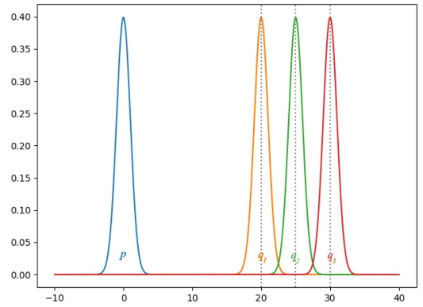
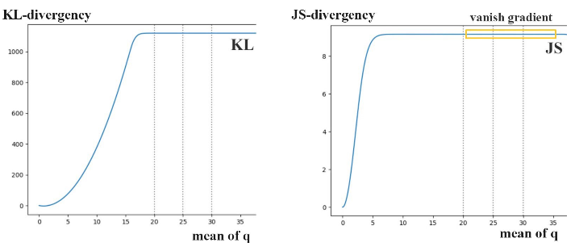
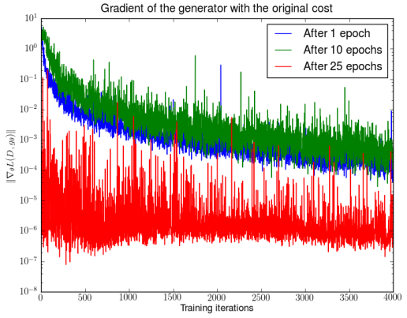
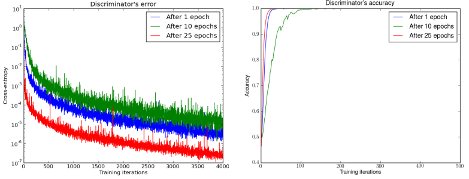
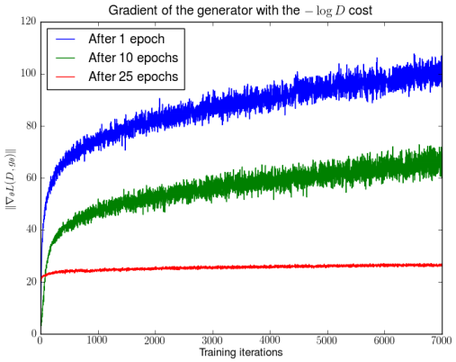
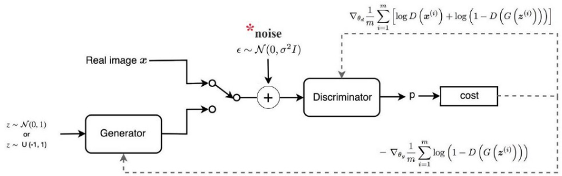

### WGAN（一）：原始GAN存在的问题

***

【参考资料】

[令人拍案叫绝的Wasserstein GAN](https://zhuanlan.zhihu.com/p/25071913)

[GAN — Wasserstein GAN & WGAN-GP](https://medium.com/@jonathan_hui/gan-wasserstein-gan-wgan-gp-6a1a2aa1b490)

【参考文献】

[1] Towards principled methods for training Generative Adversarial Networks	2017

传统的GAN在训练过程中容易出现以下问题：

* 梯度消失，很难训练生成器；
*  训练不稳定，梯度更新变化波动大；
* 模式崩塌，生成的样本形式单一，多样性不足。

在提出WGAN之前，作者 Arjovsky 通过严谨的理论分析论证了传统GAN在训练过程中遇到的各种问题的原因 [1]。

原始的GAN中，判别器要最小化如下损失函数，尽可能把真实样本分为正例，生成样本分为负例：
$$
-\mathbb{E}_{x \sim P_{r}}[\log D(x)]-\mathbb{E}_{x \sim P_{g}}[\log (1-D(x))]
$$
其中$P_{r}$是真实样本分布，$P_{g}$是由生成器产生的样本分布。对于生成器，Goodfellow一开始提出来一个损失函数，后来又提出了一个改进的损失函数，分别是
$$
\mathbb{E}_{x \sim P_{g}}[\log (1-D(x))] \tag{1}
$$

$$
\mathbb{E}_{x \sim P_{g}}[-\log D(x)] \tag{2}
$$

下面我们分别来看下这两种形式的目标函数会存在什么样的问题。

#### 1. 第一种形式的问题：梯度消失

**一句话概括：判别器越好，生成器梯度消失越严重。**Arjovsky分别从JS散度的性质本身和最优判别器两个角度进行了论证。

**1）** **JS散度的问题**

首先我们知道，**在最优判别器的条件下**，最小化生成器的loss式（1）等价于最小化生成分布和真实分布间的JS散度，优化的目标是：
$$
\begin{array}
2 J S\left(P_{r} \| P_{g}\right)-2 \log 2 \\= \mathbb{E}_{x \sim P_{r}} \log \frac{P_{r}(x)}{\frac{1}{2}\left[P_{r}(x)+P_{g}(x)\right]}+\mathbb{E}_{x \sim P_{g}} \log \frac{P_{g}(x)}{\frac{1}{2}\left[P_{r}(x)+P_{g}(x)\right]}-2 \log 2
\end{array} \tag{3}
$$
所以，**我们越训练判别器，它就越接近最优，最小化生成器的loss也就会越近似于最小化**$$P_r$$**和**$$P_g$$**之间的JS散度。**

与KL散度不同，JS散度的**最大值**是$\operatorname{log} 2$，**最小值**（即两个分布完全一致时）是0。理想情况下，我们会希望如果两个分布之间越接近它们的JS散度越小，我们通过优化JS散度就能将$P_g$“拉向”$P_r$，最终以假乱真。问题在于，**这个希望仅在两个分布有所重叠的时候是成立的，但是如果两个分布完全没有重叠的部分，或者它们重叠的部分可忽略，那么JS散度的值就一直是常数**$\operatorname{log} 2$。

具体来说，对于任意一个$x$，只存在下面四种可能：

* $P_{r}(x)=0$ 且 $P_{g}(x)=0$
* $P_{r}(x) \neq 0$ 且 $P_{g}(x)=0$
* $P_{r}(x)=0$ 且 $P_{g}(x) \neq 0$
* $P_{r}(x) \neq 0$ 且 $P_{g}(x) \neq 0$

第一种情况下，JS散度的值为0（因为 $0 \operatorname{log}(0/0)=0$），这种情况对应了两个分布都没有值的区域，这对JS散度的计算没有贡献，所以我们不考虑这种情况；第二种情况下，公式（3）等号右边的第一项的贡献是$\log \frac{P_{r}}{\frac{1}{2}\left(P_{r}+0\right)}=\log 2$，第二项的贡献是$0 \operatorname{log} 0 = 0$，所以JS散度就是常数$\operatorname{log} 2$；第三种情况类似，JS散度同样是常数$\operatorname{log} 2$，第二种情况和第三种情况都对应了两个分布不重叠的情况；第四种情况，对应了两个分布有重叠的区域，但问题在于，这种重叠区域往往是可忽略的，它们对JS散度计算的贡献仍然是0，下面会进行说明。

Arjovsky指出，分布$P_r$和$P_g$不重叠或重叠部分可忽略的可能性非常大。更严谨的说法是：**当**$P_r$**与**$P_g$**的支撑集（support）是高维空间中的低维流形（manifold）时，**$P_r$**与**$P_g$**重叠部分测度（measure）为0的概率为1。**

解释一下上面出现的几个术语：

* 支撑集（support）其实就是函数的非零部分子集，比如ReLU函数的支撑集就是$(0,+\infty)$，一个概率分布的支撑集就是所有概率密度非零部分的集合。
* 流形（manifold）是高维空间中曲线、曲面概念的拓广，我们可以在低维上直观理解这个概念，比如我们说三维空间中的一个曲面是一个二维流形，因为它的本质维度（intrinsic dimension）只有2，一个点在这个二维流形上移动只有两个方向的自由度。同理，三维空间或者二维空间中的一条曲线都是一个一维流形。
* 测度（measure）是高维空间中长度、面积、体积概念的拓广，可以理解为“超体积”。

回过头来看，第一句话“当$P_r$和$P_g$的支撑集是高维空间中的低维流形时”，基本上是成立的，因为我们通常认为，观测到的高维数据（比如图片）是由一个更低维的隐变量所控制的，隐变量的变化就决定了高维数据的变化。

更具体地说，GAN中的生成器一般是从某个低维（比如100维）的随机分布中采样出一个编码向量，再经过一个神经网络生成出一个高维样本（比如64x64的图片就有4096维）。当生成器的参数固定时，生成样本的概率分布虽然是定义在4096维的空间上，但它本身所有可能产生的变化已经被那个100维的随机分布限定了，其本质维度就是100，再考虑到神经网络带来的映射降维，最终可能比100还小，所以生成样本分布的支撑集就在4096维空间中构成一个最多100维的低维流形，“撑不满”整个高维空间。

“撑不满”就会导致真实分布与生成分布难以“碰到面”，这很容易在二维空间中理解：一方面，二维平面中随机取两条曲线，它们之间刚好存在重叠线段的概率为0；另一方面，虽然它们很大可能会存在交叉点，但是相比于两条曲线而言，交叉点比曲线低一个维度，长度（测度）为0，可忽略。三维空间中也是类似的，随机取两个曲面，它们之间最多就是比较有可能存在交叉线，但是交叉线比曲面低一个维度，面积（测度）是0，可忽略。

从低维空间拓展到高维空间，就有了如下逻辑：因为一开始生成器随机初始化，所以$P_r$几乎不可能与$P_g$有什么关联，所以它们的支撑集之间的重叠部分要么不存在，要么就比$P_r$和$P_g$的最小维度还要低至少一个维度，故而测度为0。

**在测度为0的区域去讨论概率$P_r$和$P_g$是没有意义的，此时$P_r$和$P_g$都为0。**这从直观上很容易理解，对于一条一维的曲线，讨论其上某一点的长度是没有意义的，或者说是无穷小；就像我们讨论连续概率密度曲线上的具体某一点的概率，也是没有意义的，或者说概率为无穷小。所以，在测度为0的区域，$P_r$和$P_g$都为0，算出来的JS散度也为0，等于说没有贡献，这就是为什么测度为0的重叠部分可忽略的原因。

那么，把上面所有的分析综合起来，我们得到的结论就是：**在（近似）最优判别器下，最小化生成器的loss等价于最小化**$P_r$**和**$P_g$**之间的JS散度，而由于**$P_r$**和**$P_g$**几乎不可能有不可忽略的重叠，所以无论它们相距多远JS散度都是常数**$\operatorname{log} 2$，**最终导致生成器的梯度（近似）为0，梯度消失。**

所以JS散度并不是衡量两个分布之间距离的最合适的度量，因为**JS散度完全就是突变的**，这点对于KL散度来说也是一样。可以看下面的例子来进一步理解：

图中我们假设$p$代表真实分布，是一个均值为0的高斯分布，$q$代表生成分布，根据模型的迭代，具有不同的均值。下面画出了随着$q$的均值从0到35进行变化时，$p$和$q$的KL散度和JS散度变化的情况：

可以很明显的看到，KL散度和JS散度的变化是突变的，随着$q$的均值增大，JS散度和KL散度的梯度最终会变成0，导致梯度消失。

Arjovsky从实验角度对梯度消失的问题进行了辅助论证：

> 对应文献 [1] 的Figure 2。先分别将DCGAN训练1，20，25个epoch，然后固定生成器不动，判别器重新随机初始化从头开始训练，对于第一种形式的生成器loss产生的梯度可以打印出其尺度的变化曲线，可以看到随着判别器的训练，生成器的梯度均迅速衰减。注意y轴是对数坐标轴。

**2）最优判别器**

作者Arjovsky写了很多公式定理从第二个角度进行论证，但是背后的思想也可以直观地解释：

* 首先，$P_r$和$P_g$之间几乎不可能有不可忽略的重叠，所以无论它们之间的“缝隙”多狭小，都肯定存在一个最优分割曲面把它们隔开，最多就是在那些可忽略的重叠处隔不开而已。
* 由于判别器作为一个神经网络可以无限拟合这个分隔曲面，所以存在一个最优判别器，对几乎所有真实样本给出概率1，对几乎所有生成样本给出概率0，而那些隔不开的部分就是难以被最优判别器分类的样本，但是它们的测度为0，可忽略。
* 最优判别器在真实分布和生成分布的支撑集上给出的概率都是常数（1和0），即分类loss衡为0（对应JS散度为$\operatorname{log} 2$），导致生成器的loss梯度为0，梯度消失。

说白了，就是判别器太强，总是可以很轻易达到最优的情况，将真实样本和生成样本完美的分开。Arjovsky也从实验角度进行了论证：

> 对应文献 [1] 的Figure 1。先分别将DCGAN训练1，20，25个epoch，然后固定生成器不动，判别器重新随机初始化从头开始训练。可以看到，不管是训练了几个epoch，判别器的loss总是能很快收敛到0，正确率总是能很快上升到1。

所以，对于原始GAN的第一种目标函数来说，就存在一种两难的抉择：将判别器训练到最优，就会出现梯度消失的情况，难以训练生成器；不将判别器训练到最优，那么就无法保证对JS散度的完美近似，训练的结果就不准确。所以在实践中，如何决定判别器究竟要训练多少轮，就变成一个很麻烦的问题，这就是GAN难以训练的原因。

#### 2. 第二种形式的问题：训练不稳定和模式崩塌

**一句话概括：最小化第二种生成器loss函数，会等价于最小化一个不合理的距离衡量，导致两个问题，一是梯度不稳定，二是collapse mode即多样性不足。**

采用第二种形式的目标函数，在最优判别器的条件下，等价于是在优化如下目标：
$$
K L\left(P_{g} \| P_{r}\right)-2 J S\left(P_{r} \| P_{g}\right)
$$
这个等价最小化目标存在两个严重的问题。第一是它同时要最小化生成分布与真实分布的KL散度，却又要最大化两者的JS散度，一个要拉近，一个却要推远！这在直观上非常荒谬，在数值上则会导致梯度不稳定。

第二，等价优化目标的前一项是个reverse的KL散度，这是一个不对称的度量。当生成器生成了不真实的样本，即$P_r=(0)$，$P_g \neq 0$时，这个KL散度的值趋近正无穷，惩罚巨大，这种情况对应生成样本缺乏准确性；当生成器没能生成真实样本，即$P_g(x)=0$，$P_r(x) \neq 0$时，KL散度的值趋近于0，惩罚微小，这种情况对应生成样本缺乏多样性。而第二项的JS散度又是对称的，没法对这种极不平衡的情况进行补偿。

**这一放一打之下，生成器宁可多生成一些重复但是很“安全”的样本，也不愿意去生成多样性的样本，因为那样一不小心就会产生第一种情况，得不偿失。这种现象就是大家常说的collapse mode。**

所以，对第二种目标函数来说，**生成器loss面临优化目标荒谬、梯度不稳定、对多样性与准确性惩罚不平衡导致mode collapse这几个问题。**

作者Arjovsky同样对梯度不稳定这点进行了实验验证：

>对应文献 [1] 的Figure 3。先分别将DCGAN训练1，20，25个epoch，然后固定生成器不动，判别器重新随机初始化从头开始训练，对于第二种形式的生成器loss产生的梯度可以打印出其尺度的变化曲线，可以看到随着判别器的训练，蓝色和绿色曲线中生成器的梯度迅速增长，说明梯度不稳定，红线对应的是DCGAN相对收敛的状态，梯度才比较稳定。

#### 3. 过渡性方案

原始GAN问题的根源可以归结为两点，一是等价优化的距离衡量（KL散度、JS散度）不合理，二是生成器随机初始化后的生成分布很难与真实分布有不可忽略的重叠。

文献 [1] 其实已经针对第二点提出了一个解决方案，就是**对生成样本和真实样本加噪声**，直观上说，使得原本的两个低维流形“弥散”到整个高维空间，强行让它们产生不可忽略的重叠。而一旦存在重叠，JS散度就能真正发挥作用，此时如果两个分布越靠近，它们“弥散”出来的部分重叠得越多，JS散度也会越小而不会一直是一个常数，于是（在第一种原始GAN形式下）梯度消失的问题就解决了。在训练过程中，我们可以对所加的噪声进行退火（annealing），慢慢减小其方差，到后面两个低维流形“本体”都已经有重叠时，就算把噪声完全拿掉，JS散度也能照样发挥作用，继续产生有意义的梯度把两个低维流形拉近，直到它们接近完全重合。以上是对原文的直观解释。

在这个解决方案下我们可以放心地把判别器训练到接近最优，不必担心梯度消失的问题。而当判别器最优时，可得判别器的最小loss为：
$$
\begin{aligned} \min L_{D}\left(P_{r+\epsilon}, P_{g+\epsilon}\right) &=-\mathbb{E}_{x \sim P_{r+\epsilon}}\left[\log D^{*}(x)\right]-\mathbb{E}_{x \sim P_{g+\epsilon}}\left[\log \left(1-D^{*}(x)\right)\right] \\ &=2 \log 2-2 J S\left(P_{r+\epsilon} \| P_{g+\epsilon}\right) \end{aligned}
$$
其中$P_{r+\epsilon}$和$P_{g+\epsilon}$分别是加噪后的真实分布与生成分布。反过来说，从最优判别器的loss可以反推出当前两个加噪分布的JS散度。两个加噪分布的JS散度可以在某种程度上代表两个原本分布的距离，也就是说可以通过最优判别器的loss反映训练进程！……真的有这样的好事吗？

并没有，因为加噪JS散度的具体数值受到噪声的方差影响，随着噪声的退火，前后的数值就没法比较了，所以它不能成为$P_r$和$P_g$的本质性衡量。

另外，文献 [1] 中并没有对此方案进行实验验证。 