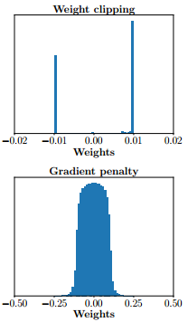
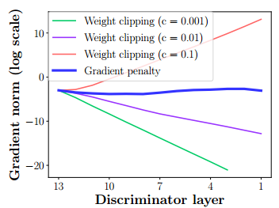
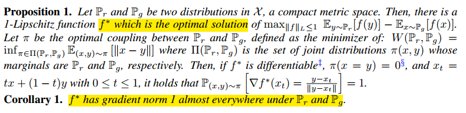
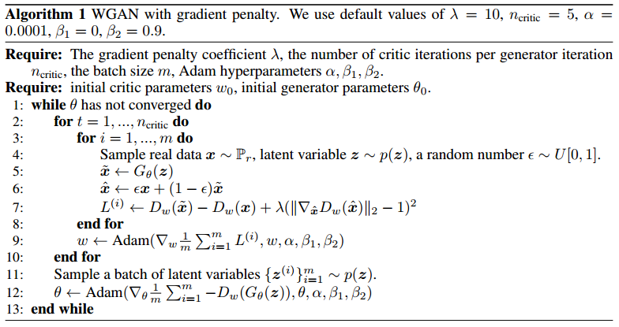

#### WGAN（三）：WGAN-GP原理

***

【参考资料】

[Wasserstein GAN最新进展：从weight clipping到gradient penalty，更加先进的Lipschitz限制手法](https://www.zhihu.com/question/52602529/answer/158727900)

[互怼的艺术：从零直达 WGAN-GP](https://mp.weixin.qq.com/s?__biz=MzIwMTc4ODE0Mw==&mid=2247484880&idx=1&sn=4b2e976cc715c9fe2d022ff6923879a8&chksm=96e9da50a19e5346307b54f5ce172e355ccaba890aa157ce50fda68eeaccba6ea05425f6ad76&scene=21#wechat_redirect)

**WGAN的关键是如何施加Lipschitz约束**，也就是说，在整个样本空间$\mathcal{X}$上，要求判别器函数$D(x)$对输入的梯度的norm不大于一个有限的常数$K$:
$$
\left\|\nabla_{x} D(x)\right\| \leq K, \forall x \in \mathcal{X}
$$
直观上解释，就是当输入的样本稍微变化后，判别器给出的分数不能发生太过剧烈的变化。

原始的WGAN使用weight clipping的方式来实现Lipschitz约束。通过在训练过程中保证判别器的所有参数有界，就保证了判别器不能对两个略微不同的样本给出天差地别的分数值，从而**间接实现了Lipschitz限制。**

不过，weight clipping并不是唯一的，也不是最好的施加Lipschitz约束的方式，所以作者又提出了gradient penalty来改进weight clipping存在的问题。

#### 1. Weight clipping的问题

Weight clippling存在两个问题。

**问题一：学习得到的判别器过于简单**

WGAN的判别器loss希望尽可能拉大真假样本的分数差，然而weight clipping独立地限制每一个网络参数的取值范围，在这种情况下我们可以想象，最优的策略就是尽可能让所有参数走极端，要么取最大值（如0.01）要么取最小值（如-0.01）。

这样带来的结果就是，判别器会非常倾向于学习一个简单的映射函数（几乎所有参数都是正负0.01，都已经可以直接视为一个二值神经网络了，太简单了）。而作为一个深层神经网络来说，这实在是对自身强大拟合能力的巨大浪费！判别器没能充分利用自身的模型能力，经过它回传给生成器的梯度也会跟着变差。也就是说，如果判别器太弱的话，那么生成器也会变弱。

另外，有些函数虽然满足Lipschitz约束，但它们的weight并不一定介于clip的范围$[-c, c]$之间，所以，施加weight clipping实际上减小了对Lipschitz函数的搜索空间。

作者对weight clipping和gradient penalty学到的参数进行了对比：

**问题二：梯度消失或梯度爆炸**

weight clipping会导致很容易一不小心就梯度消失或者梯度爆炸。原因是判别器是一个多层网络，如果我们把clipping threshold设得稍微小了一点，每经过一层网络，梯度就变小一点点，多层之后就会指数衰减；反之，如果设得稍微大了一点，每经过一层网络，梯度变大一点点，多层之后就会指数爆炸。

我们通过一个简单例子来说明这一点，现在考虑一个两层网络：
$$
v_0 = w_0 x\\
y_0 = f(v_0)\\
v_1 = w_1 y_0\\
y_1 = f(v_1)
$$
其中$f$表示激活函数。要更新参数$w_0$，我们需要知道输出$y_1$对$w_0$的导数，根据反向传播的链式法则：
$$
\frac{\partial y_1}{\partial w_0} = \frac{\partial y_1}{\partial v_1}\frac{\partial v_1}{\partial y_0}\frac{\partial y_0}{\partial v_0}\frac{\partial v_0}{\partial w_0} = \frac{\partial y_1}{\partial y_0}\frac{\partial y_0}{\partial w_0}
$$
也就是说，要更新后一层的输出$y_1$对前一层的参数$w_0$的参数，我们需要知道后一层的输出$y_1$对前一层的输出$y_0$的导数，以及前一层的输出$y_0$对前一层的参数$w_0$的导数。考虑到前一层的输出就是后一层的输入，那么$\frac{\partial y_1}{\partial y_0}$就是输出对输入的导数，也就是weight clipping引导的Lipschitz约束作用的对象。

更一般地，假如网络有$N$层，现在要求解其中第$i$层的参数，那么需要从第$N$层开始，往前回传$i$层，有：
$$
\frac{\partial y_N}{\partial w_i} = \frac{\partial y_N}{\partial y_{N-1}} \ldots \frac{\partial y_{i+1}}{\partial y_i}\frac{\partial y_i}{\partial w_i}
$$
现在的问题在于，我们是通过weight clipping来间接控制梯度的范围，我们能掌控的只有weight本身的取值范围，而不知道受它控制的梯度的具体范围。假如weight clipping的阈值$c$过小，那么$\frac{\partial y_N}{\partial y_{N-1}}$的值也会很小，经过多层回传，多个这样的梯度相乘，得到的值就会趋近于0，造成梯度消失。反之，则会造成梯度爆炸。

所以，调节clipping阈值$c$就很重要，只有设得不大不小，才能让生成器获得恰到好处的回传梯度，然而在实际应用中这个平衡区域可能很狭窄，就会给调参工作带来麻烦。

> Discriminator的梯度回传到各层的大小。这里的梯度是指对激活值（即每层输出）的梯度。可以看到gradient penalty使得梯度在后向传播的过程中保持平稳。

#### 2. Gradient penalty

由于weight clipping的种种问题，WGAN的作者们提出了直接对梯度施加约束，来达成Lipschitz限制的方式，即gradient penalty。

令Lipschitz限制条件中的$K=1$，那么有：
$$
\left\|\nabla_{x} D(x)\right\| \leq 1, \forall x \in \mathcal{X}
$$
所以gradient penalty的形式即为：
$$
\max \left(0,\left\|\nabla_{x} D(x)\right\|-1\right) ] \tag{2.1}
$$
这个式子会在梯度范数超过1的时候给予惩罚，小于1的时候则是0。

不过实验证明，另一种形式的gradient penalty效果要更优，这也是WGAN-GP最终采用的形式：
$$
\left(\left\|\nabla_{x} D(x)\right\|-1\right)^{2} \tag{2.2}
$$
这个式子要求梯度范数要在1附近。

式（2.2）的约束方式实际上利用了Lipschitz约束的一条性质：

大意是说在最优判别器的情况下，对应的梯度范数为1总是处处满足。

式（2.2）与式（2.1）的区别在于，前者是一种双边的约束，梯度范数会在1附近上下波动，而后者是一种单边的约束，仅对范数超过1的梯度进行惩罚。

将gradient penalty与原来的WGAN loss合并，我们就能得到新的判别器loss函数为：
$$
L(D)=-\mathbb{E}_{x \sim P_{r}}[D(x)]+\mathbb{E}_{x \sim P_{g}}[D(x)]+\lambda \mathbb{E}_{x \sim \mathcal{X}}\left[\left\|\nabla_{x} D(x)\right\|_{2}-1\right]^{2} \tag{2.3}
$$
**注意这里的梯度是对样本的梯度，而不是对参数的梯度。**

不过式（2.3）中的gradient penalty项需要对整个样本空间进行采样来计算，这在实践中是不可行的。所以作者提出，我们其实没必要在整个样本空间上施加Lipschitz限制，只要重点抓住生成样本集中区域、真实样本集中区域以及夹在它们中间的区域就行了。这样我们关注的就只是生成分布和真实分布的中间地带，从直觉上来讲，只有这一部分对我们拉近生成分布和真实分布才有影响，至于样本空间的其他地方，我们并不关心。

具体来说，我们先随机采一对真假样本，还有一个0-1的随机数：
$$
x_{r} \sim P_{r}, x_{g} \sim P_{g}, \epsilon \sim U \text { niform }[0,1]
$$
然后在$x_{r}$和$x_{g}$的连线上随机插值采样：
$$
\hat{x}=\epsilon x_{r}+(1-\epsilon) x_{g}
$$
把按照上述流程采样得到的$\hat{x}$所满足的分布记为$P_{\hat{x}}$，就得到最终版本的判别器loss：
$$
L(D)=-\mathbb{E}_{x \sim P_{r}}[D(x)]+\mathbb{E}_{x \sim P_{g}}[D(x)]+\lambda \mathbb{E}_{x \sim \mathcal{P}_{\hat{x}}}\left[\left\|\nabla_{x} D(x)\right\|_{2}-1\right]^{2}
$$
**这就是最终所采用的gradient penalty方法，相应的新WGAN模型简称为WGAN-GP。**我们可以做一个对比：

* weight clipping是对样本空间全局生效，但因为是间接限制判别器的梯度norm，会导致一不小心就梯度消失或者梯度爆炸；

* gradient penalty只对真假样本集中区域、及其中间的过渡地带生效，但因为是直接把判别器的梯度norm限制在1附近，所以梯度可控性非常强，容易调整到合适的尺度大小。

WGAN-GP的完整算法流程如下：

原论文还提到了在应用gradient penalty时，**关于BN的一个注意事项**：由于我们是对每个样本独立地施加梯度惩罚，所以判别器的模型架构中不能使用Batch Normalization，因为它会引入同个batch中不同样本的相互依赖关系。如果需要的话，可以选择其他normalization方法，如Layer Normalization、Weight Normalization和Instance Normalization，这些方法就不会引入样本之间的依赖。论文推荐的是Layer Normalization。

最后还有一点，是关于**gradient penalty的实现问题。**loss中本身包含梯度，优化loss就需要求梯度的梯度，也就是高阶梯度。这个功能并不是现在所有深度学习框架的标配功能，如果没有高阶梯度计算的功能应该怎么做呢？一种简单的方法是将gradient penalty中的**微分换成差分**：
$$
L(D)=-\mathbb{E}_{x \sim P_{r}}[D(x)]+\mathbb{E}_{x \sim P_{g}}[D(x)]+\lambda \mathbb{E}_{x_{1} \sim \mathcal{P}_{\hat{x}}, x_{2} \sim \mathcal{P}_{\hat{x}}}\left[\frac{\left|D\left(x_{1}\right)-D\left(x_{2}\right)\right|}{\left\|x_{1}-x_{2}\right\|}-1\right]^{2}
$$
也就是说，我们仍然是在分布$P_{\hat{x}}$上随机采样，但是一次采两个，然后要求它们的连线斜率要接近1，这样理论上也可以起到一样的效果。