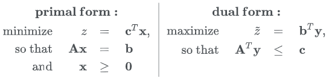

### WGAN（二）：从Wasserstein距离到WGAN

***

【参考资料】

[白话Wassertein距离](https://zhuanlan.zhihu.com/p/57062205)

[从Wasserstein距离、对偶理论到WGAN](https://mp.weixin.qq.com/s/Y8osoAfCKg9MInZ-q2Q33w)

[令人拍案叫绝的Wasserstein GAN](https://zhuanlan.zhihu.com/p/25071913)

[GAN — Wasserstein GAN & WGAN-GP](https://medium.com/@jonathan_hui/gan-wasserstein-gan-wgan-gp-6a1a2aa1b490)

[Wasserstein GAN and the Kantorovich-Rubinstein Duality](https://vincentherrmann.github.io/blog/wasserstein/)

#### 1. Wasserstein距离

Wasserstein距离，又叫推土机距离（Earth Mover‘s Distance）。假设有两个概率分布$p$和$q$，那么Wasserstein距离的定义如下：
$$
\mathcal{W}[p, q]=\inf _{\gamma \in \Pi(p, q]} \iint \gamma(\boldsymbol{x}, \boldsymbol{y}) d(\boldsymbol{x}, \boldsymbol{y}) d \boldsymbol{x} d \boldsymbol{y} 
\tag{1.1}
$$
Wasserstein距离的概念来源于最优传输理论。

在式（1.1）中，$d(x,y)$代表一个距离函数，或者说更准确的说是一个成本函数，代表着从$x$运输到$y$的成本。常用的$d$是基于$l$ 范数衍生出来的，比如：
$$
\|\boldsymbol{x}-\boldsymbol{y}\|_{1}, \quad\|\boldsymbol{x}-\boldsymbol{y}\|_{2}, \quad\|\boldsymbol{x}-\boldsymbol{y}\|_{2}^{2}
$$
都是常见的选择。

而$\gamma$是一个联合分布，它的边缘分布就是原来的$p$和$q$：
$$
\int \gamma(\boldsymbol{x}, \boldsymbol{y}) d \boldsymbol{y}=p(\boldsymbol{x})\\
\int \gamma(\boldsymbol{x}, \boldsymbol{y}) d \boldsymbol{x}=q(\boldsymbol{y})
$$
事实上$\gamma$就描述了一种运输方案，而$\Pi$则是所有可能的运输方案的集合。$\gamma(\boldsymbol{x_i}, \boldsymbol{y_j})$代表了要从某一位置$\boldsymbol{x_i}$处搬离多少货物到另一位置$\boldsymbol{y_j}$处，比如$\gamma(\boldsymbol{x_1}, \boldsymbol{y_1}) $代表了从位置$\boldsymbol{x_1}$处搬到位置$\boldsymbol{y_1}$处的货物量，$\gamma(\boldsymbol{x_2}, \boldsymbol{y_1}) $代表了从位置$\boldsymbol{x_2}$处搬到位置$\boldsymbol{y_1}$处的货物量，以此类推。$\int \gamma(\boldsymbol{x}, \boldsymbol{y
_1}) d \boldsymbol{x}=q(\boldsymbol{y_1})$就代表了从$\boldsymbol{x}$一共需要搬多少货物到$\boldsymbol{y_1}$，或者说位置$\boldsymbol{y_1}$的货物总量。再对$\boldsymbol{y}$进行积分，即$\iint \gamma(\boldsymbol{x}, \boldsymbol{y})d \boldsymbol{x} d \boldsymbol{y}$，就代表了从$\boldsymbol{x}$的各个位置搬到$\boldsymbol{y}$的各个位置的货物总量。如果还要考虑从某一位置$\boldsymbol{x_i}$搬到另一位置$\boldsymbol{y_j}$的成本$d(\boldsymbol{x_i}, \boldsymbol{y_j})$，那么我们得到的就是总运输成本$\iint \gamma(\boldsymbol{x}, \boldsymbol{y}) d(\boldsymbol{x}, \boldsymbol{y}) d \boldsymbol{x} d \boldsymbol{y} $。

注意到式（1.1）中还有一个求下界，所以，**从所有的运输方案中，找出总运输成本$\iint \gamma(\boldsymbol{x}, \boldsymbol{y}) d(\boldsymbol{x}, \boldsymbol{y}) d \boldsymbol{x} d \boldsymbol{y}$ 最小的方案，这个方案的成本，就是我们要算的Wasserstein距离。**

**为什么要求下界呢**？从直觉上来讲，两地间的“距离”一般是指最短的直接距离，比如两点之间线段最短，我们就用连接两点的线段的长度来表示两点之间的距离。如果没有这个“最短”的限定，那么我们可以用任意的曲线或者折线去连接两个点，而这些曲线或折线的长度是没有上界的，对距离的计算没有意义。

如果我们把$p$理解为原始分布，而$q$理解为目标分布，那么Wasserstein距离就能用来衡量两个分布的相似度。现在，我们不仅要将分布$p$的概率质量搬到分布$q$的位置处，还要把概率的形状也“摆成”一样的，而这样做的最小成本就对应了Wasserstein距离。Wasserstein距离越小，最小成本就越小，意味着我们把分布$p$变成分布$q$所要花的代价就越小，也就意味着分布$p$和$q$的差异越小。

------

下面我们通过简单的例子来对Wasserstein距离进行更直观的理解。

考虑下面的搬方块问题，如何把下面左图中的（实线）方块搬到右图中的（虚线）方块，并且使得移动距离最短？这里移动距离（或者传输距离）定义为：位置之间的距离差。比如左边的方块1在位置#1，如果搬到右边的位置#7，那么距离就是6。

对于上图的问题，首先，我们可以把位置#1的三个方块，其中1个放到位置#7，剩下两个放到位置#10，那么运输距离（即位置之间的距离差）为6+2x9；然后把位置#2的方块放到位置#8，运输距离为6；最后把位置#3的方块放到位置#9，运输距离为6。这个运输方案我们记为$\gamma_{1}$。显然，运输方案有很多种，下面就展示了两种运输方案。

上面两种运输方案的运输距离是一样的，有时候，运输方案不一样，距离也会不一样。比如下面这个：

对于不同的运输方案，我们可以通过引入一组变量$x$和$y$来定义一个联合概率分布$\gamma(x, y)$，来进行表示。$\gamma(1,10)$就代表了有多少方块从位置1被搬到了位置10。

注意，位置10的所有方块一定来自#1~#3中的任意位置，并且不管来自哪里，方块总数始终为2，即$\sum y(*, 10)=2$，这就对应了$\gamma(x, y)$的边缘概率分布是$p(x)$或者$q(y)$这一点。

------

**Wasserstein距离的优势**

与KL散度和JS散度的突变性不同，Wasserstein距离的变化是平滑的，**即便两个分布没有重叠，Wasserstein距离仍然能够反映它们的远近，可以提供有意义的梯度，而不会像KL散度和JS散度一样出现梯度消失**。

我们可以通过一个简单的例子来展示这一点。考虑如下二维空间中的两个分布$P_1$和$P_2$，$P_1$在线段AB上均匀分布，$P_2$在线段CD上均匀分布，通过控制参数$\theta$可以控制两个分布的距离远近。

此时容易得到：

$K L\left(P_{1} \| P_{2}\right)=K L\left(P_{1} \| P_{2}\right)=\left\{\begin{array}{ll}{+\infty} & {\text { if } \theta \neq 0} \\ {0} & {\text { if } \theta=0}\end{array}\right.$	（突变）

$J S\left(P_{1} \| P_{2}\right)=\left\{\begin{array}{ll}{\log 2} & {\text { if } \theta \neq 0} \\ {0} & {\text { if } \theta-0}\end{array}\right.$	（突变）

$W\left(P_{0}, P_{1}\right)=|\theta|$	（平滑）

WGAN的原论文中还给出了另一个例子：

#### 2. WGAN的理论形式

既然Wasserstein距离拥有比JS散度优越的性质，那么自然可以想到把最小化Wasserstein距离作为GAN的目标函数。为了得到目标函数的具体形式，我们需要做一些推导工作。

现在我们再来完成地重述一下问题，我们实际上在求下式的最小值：
$$
\iint \gamma(\boldsymbol{x}, \boldsymbol{y}) d(\boldsymbol{x}, \boldsymbol{y}) d \boldsymbol{x} d \boldsymbol{y} \tag{2.1}
$$
其中$d(x,y)$是事先给定的，而这个最小值要满足如下约束：
$$
\int \gamma(\boldsymbol{x}, \boldsymbol{y}) d \boldsymbol{y}=p(\boldsymbol{x}), \quad \int \gamma(\boldsymbol{x}, \boldsymbol{y}) d \boldsymbol{x}=q(\boldsymbol{y}), \quad \gamma(\boldsymbol{x}, \boldsymbol{y}) \geq 0 \tag{2.2}
$$
认真盯着式（5），考虑到积分只是求和的极限形式，所以我们可以把$\gamma(\boldsymbol{x}, \boldsymbol{y})$和$d(\boldsymbol{x}, \boldsymbol{y})$离散化，然后看成很长很长的（列）向量 $\Gamma$ 和 $D$:

所以式 (5) 相当于就是将$\Gamma$ 和 $D$ 对应位置相乘，然后求和，也就是内积$\langle\Gamma, D\rangle$。

我们可以把约束条件 (6) 也这样看：把$p(\boldsymbol{x})$，$q(\boldsymbol{y})$分别看成一个长向量，然后还可以拼起来，把积分也看成求和，这时候约束条件 (6) 也可以写成矩阵形式 $\mathrm{A} \Gamma=\mathrm{b}$：

最后不能忘记的是 $\Gamma \geq 0$，它表示 $\Gamma$ 的每个分量都大于等于 0。

**线性规划问题**

现在问题可以用一行字来描述：
$$
\min _{\mathbf{\Gamma}}\{\langle\mathbf{\Gamma}, \boldsymbol{D}\rangle | \boldsymbol{A} \mathbf{\Gamma}=\boldsymbol{b}, \mathbf{\Gamma} \geq 0\} 
\tag{2.3}
$$
这就是**“线性约束下的线性函数最小值”**的问题，可见，虽然原始问题足够复杂，又有积分又有下确界的，但经过转写，它本质上就是一个并不难理解的线性规划问题（当然，“不难理解”并不意味着“容易求解”）。

**对偶形式**

对于一个线性规划问题，我们可以给出它的对偶形式：

对于线性规划问题，强对偶总是成立的，也就是说线性规划的对偶形式的最优解与原始形式的最优解是一致的。

因此，我们可以把式（2.3）化成它的对偶形式：
$$
\min _{\mathbf{\Gamma}}\{\langle\mathbf{\Gamma}, \boldsymbol{D}\rangle | \boldsymbol{A} \mathbf{\Gamma}=\boldsymbol{b}, \mathbf{\Gamma} \geq 0\}=\max _{\boldsymbol{F}}\left\{\langle\boldsymbol{b}, \boldsymbol{F}\rangle | \boldsymbol{A}^{\top} \boldsymbol{F} \leq \boldsymbol{D}\right\} \tag{2.4}
$$
注意上式中的 $b$ 是由两部分拼起来的，所以我们也可以把 $F$ 类似地写成：

现在 $\langle\boldsymbol{b}, \boldsymbol{F}\rangle$ 可以写成：
$$
\langle\boldsymbol{b}, \boldsymbol{F}\rangle=\sum_{n} p\left(\boldsymbol{x}_{n}\right) f\left(\boldsymbol{x}_{n}\right)+\sum_{n} q\left(\boldsymbol{x}_{n}\right) g\left(\boldsymbol{x}_{n}\right)
$$
或者对应的积分形式是：
$$
\langle\boldsymbol{b}, \boldsymbol{F}\rangle=\int[p(\boldsymbol{x}) f(\boldsymbol{x})+q(\boldsymbol{x}) g(\boldsymbol{x})] d \boldsymbol{x}
$$
别忘了约束条件 $\boldsymbol{A}^{\top} \boldsymbol{F} \leq \boldsymbol{D}$：

代入计算后，可以发现这个诺大的矩阵运算实际上就说了这样的一件事情：
$$
\forall i, j, \quad f\left(\boldsymbol{x}_{i}\right)+g\left(\boldsymbol{y}_{j}\right) \leq d\left(\boldsymbol{x}_{i}, \boldsymbol{y}_{j}\right)
$$
或者直接写成：
$$
\forall \boldsymbol{x}, \boldsymbol{y}, \quad f(\boldsymbol{x})+g(\boldsymbol{y}) \leq d(\boldsymbol{x}, \boldsymbol{y})
$$
**从对偶到WGAN**

终于，我们就要接近尾声了，现在我们得到了 Wasserstein距离（1.1）的一个对偶形式了：
$$
\mathcal{W}[p, q]=\max _{f, g}\left\{\int[p(\boldsymbol{x}) f(\boldsymbol{x})+q(\boldsymbol{x}) g(\boldsymbol{x})] d \boldsymbol{x} | f(\boldsymbol{x})+g(\boldsymbol{y}) \leq d(\boldsymbol{x}, \boldsymbol{y})\right\} \tag{2.5}
$$
注意到由$f(\boldsymbol{x})+g(\boldsymbol{y}) \leq d(\boldsymbol{x}, \boldsymbol{y})$我们得到：
$$
f(\boldsymbol{x})+g(\boldsymbol{x}) \leq d(\boldsymbol{x}, \boldsymbol{x})=0
$$
即 $g(\boldsymbol{x}) \leq - f(\boldsymbol{x})$，所以我们有：
$$
\begin{aligned} p(\boldsymbol{x}) f(\boldsymbol{x})+q(\boldsymbol{x}) g(\boldsymbol{x}) & \leq p(\boldsymbol{x}) f(\boldsymbol{x})+q(\boldsymbol{x})[-f(\boldsymbol{x})] \\ &=p(\boldsymbol{x}) f(\boldsymbol{x})-q(\boldsymbol{x}) f(\boldsymbol{x}) \end{aligned}
$$
也就是说，只有当$g=-f$时，式（2.5）中的目标函数才会取到最大值。因为如果目标$p(\boldsymbol{x}) f(\boldsymbol{x})+q(\boldsymbol{x}) g(\boldsymbol{x})$取到最大值时的 $(f, g) = (f^*, g^*)$，并且$f^* < g^*$，那么我们总是可以取$g^* = - f^*$，来获得一个更大的值，即：
$$
p(\boldsymbol{x}) f^*(\boldsymbol{x})+q(\boldsymbol{x}) g^*(\boldsymbol{x}) \leq p(\boldsymbol{x}) f^*(\boldsymbol{x})-q(\boldsymbol{x}) f^*(\boldsymbol{x})
$$
所以，当目标$p(\boldsymbol{x}) f(\boldsymbol{x})+q(\boldsymbol{x}) g(\boldsymbol{x})$取到最大值时，$g=-f$总是满足。因此，我们可以令$g=-f$，把优化问题转化为：
$$
\mathcal{W}[p, q]=\max _{f}\left\{\int[p(\boldsymbol{x}) f(\boldsymbol{x})-q(\boldsymbol{x}) f(\boldsymbol{x})] d \boldsymbol{x} | f(\boldsymbol{x})-f(\boldsymbol{y}) \leq d(\boldsymbol{x}, \boldsymbol{y})\right\}
$$

这便是我们最终要寻找的Wasserstein距离的对偶形式了，令：
$$
\|f\|_L = \frac{f(\boldsymbol{x})-f(\boldsymbol{y})}{d(\boldsymbol{x}, \boldsymbol{y})}
$$
那么约束条件可以表示为$\|f\|_{L} \leq 1$，称为Lipschitz 约束（Lipschitz 常数为1）。

由于$p$，$q$ 都是概率分布，因此我们可以写成采样形式：
$$
\mathcal{W}[p, q]=\max _{f,\|f\| L \leq 1} \mathbb{E}_{\boldsymbol{x} \sim p(\boldsymbol{x})}[f(\boldsymbol{x})]-\mathbb{E}_{\boldsymbol{x} \sim q(\boldsymbol{x})}[f(\boldsymbol{x})]
$$
这就是 WGAN 的判别器所采用的 loss 了，自然地，整个 WGAN 的训练过程就是：
$$
\min _{G} \max _{f,\|f\|_{L} \leq 1} \mathbb{E}_{\boldsymbol{x} \sim p(\boldsymbol{x})}[f(\boldsymbol{x})]-\mathbb{E}_{\boldsymbol{z} \sim q(\boldsymbol{z})}[f(G(\boldsymbol{z}))] \tag{2.6}
$$

#### 3. WGAN的实现方式

WGAN的实现采用的是一阶Lipschitz 约束，即$d(\boldsymbol{x}, \boldsymbol{y})$是L1范数，Lipschitz 约束条件可以表示为：
$$
f(x_1)-f(x_2) \leq |x_1 - x_2|
$$
交换$x_1$和$x_2$的顺序，有：
$$
f\left(x_{2}\right)-f\left(x_{1}\right) \leq\left|x_{2}-x_{1}\right| = \left|x_{1}-x_{2}\right| \\
\Rightarrow f\left(x_{1}\right)-f\left(x_{2}\right) \geq -\left|x_{1}-x_{2}\right|
$$
所以
$$
\left|f\left(x_{1}\right)-f\left(x_{2}\right)\right| \leq \left|x_{1}-x_{2}\right| \tag{3.1}
$$
或者说：
$$
\left|f\left(x_{1}\right)-f\left(x_{2}\right)\right| \leq K\left|x_{1}-x_{2}\right| \tag{3.2}
$$
对于一阶Lipschitz 约束来说，$\|f\|_L = \|f\|_1$就相当于是函数$f$的梯度，那么式（3.2）就是要求$f$的梯度不超过某一个范围。具体来说，Lipschitz 约束使得样本输入$x$出现一个微小变动时，输出值$f(x)$的变化不要超过输入变动的$K$倍，相当于降低了模型对输入扰动的敏感性，避免“失之毫厘，谬以千里”的情况出现。

（*注：实际上 Lipschitz 约束可以推广到多阶范数的形式，即 $f\left(x_{1}\right)-f\left(x_{2}\right) \leq K\|x_{1}-x_{2}\|_p$，又因为$f(x_1)-f(x_2)$是个标量，所以它的$L_p$范数都是相等的，也就有$\|f\left(x_{1}\right)-f\left(x_{2}\right) \|_p \leq K \|x_{1}-x_{2}\|_p$，也即梯度$\nabla_x f(x)$的$L_P$范数小于等于K。*）

常数$K$被称为Lipschitz 常数。实际上**$K$的具体大小不重要，只要它不是正无穷就行**，因为它只是会使得梯度变大$K$倍，并不会影响梯度的方向。文章指出，如果$f$满足的是$K-$Lipschitz 约束，那么算出来的距离会是原来Wasserstein距离的$K$倍，仍是和Wasserstein距离成正比的。

所以WGAN的作者在实现时采取了一个非常简单的施加Lipschitz 约束的方法：限制神经网络$f_{\theta}$的所有参数$w_{i}$不超过某个范围$[-c, c]$，比如$w_{i} \in[-0.01,0.01]$，此时关于输入样本 $x$ 的导数$\frac{\partial f_{w}}{\partial x}$也不会超过某个范围（由反向传播的链式求导法则确定），所以一定存在某个不知道的常数$K$使得$f_{w}$的局部变动幅度不会超过它，Lipschitz 约束得以满足。直觉上，**weight clipping使得当输入有变化时，输出的变化也是有限的**。具体在算法实现中，只需要每次更新完$w$ 后把它clip回这个范围就可以了。

再根据式（2.6），我们就可以得到WGAN的生成器和判别器的 loss 函数：

生成器：$-\mathbb{E}_{x \sim P_{g}}\left[f_{w}(x)\right]$

判别器：$\mathbb{E}_{x \sim P_{g}}\left[f_{w}(x)\right]-\mathbb{E}_{x \sim P_{r}}\left[f_{w}(x)\right]$

直观上，判别器尽可能拉高真样本的分数，拉低假样本的分数，而生成器希望尽可能拉高假样本的分数。但是，因为我们没有对判别器的loss进行诸如sigmoid之类的限制，loss值很容易就会跑到无穷大，所以这里通过施加LipLipschitz 约束来使得判别器得loss变动不要太剧烈。

注意，**将判别器的最小loss取反，实际上就代表了Wassertein距离**，所以**判别器的 loss 取反可以指示训练进程，其数值越小，表示真实分布与生成分布的Wasserstein距离越小，GAN训练得越好。**

综合上面所有内容，WGAN的实现实际上就非常简单了，再原始GAN的基础上，只需要做**四点改动：**

* 判别器最后一层去掉sigmoid
* 生成器和判别器的loss不取log
* 每次更新判别器的参数之后把它们的绝对值截断到不超过一个固定常数 $c$

* 不要用基于动量的优化算法（包括momentum和Adam），推荐RMSProp，SGD也行

前三点都是从理论分析中得到的，已经介绍完毕；第四点却是作者从实验中发现的，属于trick。

WGAN的结构如下：

完整的算法流程如下：

#### 4. 实验结果

作者发现判别器所近似的Wasserstein距离与生成器的生成图片质量高度相关：

而原始GAN近似的JS散度显然做不到这一点，无论什么质量的生成图片，JS散度几乎都是一个常数：

另外，WGAN如果用类似DCGAN架构，生成图片的效果与DCGAN差不多：

> 左：WGAN；右：DCGAN

但是厉害的地方在于WGAN不用DCGAN各种特殊的架构设计也能做到不错的效果，比如如果大家一起拿掉Batch Normalization的话，DCGAN就崩了：

> 左：WGAN；右：DCGAN

如果WGAN和原始GAN都使用多层全连接网络（MLP），不用CNN，WGAN质量会变差些，但是原始GAN不仅质量变得更差，而且还出现了collapse mode，即多样性不足：

> 左：WGAN；右：标准GAN

最后，在所有的WGAN的实验中均未观察到明显的collapse mode。