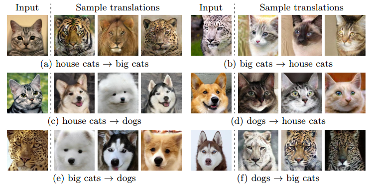
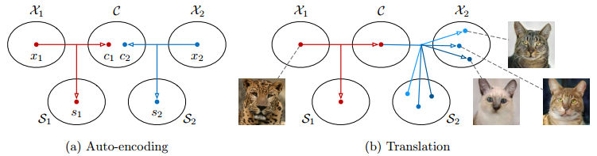
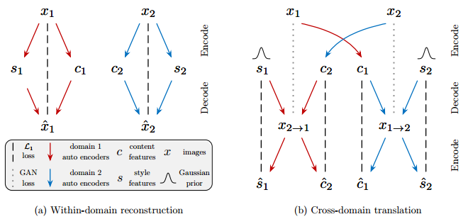
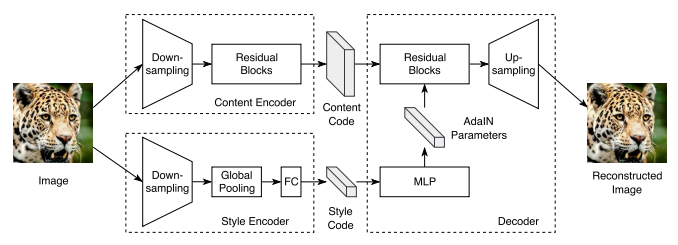
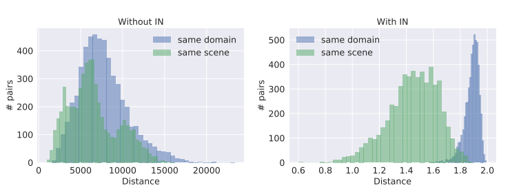

### 一图生万物的MUNIT

***

【参考文献】

[1] Multimodal Unsupervised Image-to-Image Translation 

#### 1. 动机

以往的图像翻译模型，不管是直接转换的CycleGAN，还是通过共同隐空间转换的UNIT，都只能生成单一样式的target domain图片。给定一张原始图片，**MUNIT旨在生成多种样式的target domain图片。**

下图是MUNIT的生成效果：

对于实际图片来说，哪怕属于同一种domain，不同图片所具有的mode或是style也是多种多样的，而诸如CycleGAN和UNIT之类的图像翻译方法并未能捕捉到这种mode信息，生成的图片样式都比较单一。当然，也有一些方法致力于解决这个问题，比如BicycleGAN，不过这类方法需要paired image作为监督信息，而MUNIT则完全不需要。

#### 2. 假设

MUNIT同样需要将图像投影到隐空间后再进行转换，不过与以往做法不同的是，隐空间不是完全共享的。这里借助了disentangle的思想，**假设图像隐空间可以被分解为一个content space和一个style space，content space是在不同domain之间共享的，而style space则是domain-specific的，**换言之，隐空间是部分共享的。

进行图像转换时，先从原始图片中提取出content code，然后再随机在target的style space中采样不同的style code，与content code进行组合，就能生成多样式的输出。

#### 3. 原理

MUNIT同样采用encoder-decoder的框架，并且通过discriminator来判断生成图片的质量。不同的地方在于，由于disentangle的假设，content有content的encoder，style有style的encoder。

整体的loss分为两部分：

1）**Bidirectional reconstruction loss**

这个loss又分为两部分，一部分是image $\rightarrow$ latent $\rightarrow$ image 的重建，另一部分是latent $\rightarrow$ image $\rightarrow$ latent 的重建。

* **Image reconstruction**：即标准的AE重建loss，根据原始图片的content code和style code重建原始图片，共有两支，其中一支如下：
  $$
  \mathcal{L}_{\mathrm{recon}}^{x_{1}}=\mathbb{E}_{x_{1} \sim p\left(x_{1}\right)}\left[\left\|G_{1}\left(E_{1}^{c}\left(x_{1}\right), E_{1}^{s}\left(x_{1}\right)\right)-x_{1}\right\|_{1}\right]
  $$

* **Latent reconstruction** ：这个loss是整个MUNIT的**精华**所在，它是一个跨域交叉的重建过程。这个loss也有两支，其中一支的定义如下：
  $$
  \begin{aligned} \mathcal{L}_{\mathrm{recon}}^{c_{1}} &=\mathbb{E}_{c_{1} \sim p\left(c_{1}\right), s_{2} \sim q\left(s_{2}\right)}\left[\left\|E_{2}^{c}\left(G_{2}\left(c_{1}, s_{2}\right)\right)-c_{1}\right\|_{1}\right] \\ \mathcal{L}_{\mathrm{recon}}^{s_{2}} &=\mathbb{E}_{c_{1} \sim p\left(c_{1}\right), s_{2} \sim q\left(s_{2}\right)}\left[\left\|E_{2}^{s}\left(G_{2}\left(c_{1}, s_{2}\right)\right)-s_{2}\right\|_{1}\right] \end{aligned}
  $$
  其中$q\left(s_{2}\right)$是一个标准高斯先验分布$\mathcal{N}(0, \mathbf{I})$，$p\left(c_{1}\right)$由$c_{1}=E_{1}^{c}\left(x_{1}\right)$给出，而$x_{1} \sim p\left(x_{1}\right)$。

不妨再细致理解一下Latent reconstruction，这其中涉及到content和style两部分的重建。

**Content的重建由以下流程达成**：给定domain 1的原始图片$x_1$，由domain 1对应的content encoder $$E_{1}^{c}$$ 提出content code $c_1$，然后将$x_1$转换到domain 2，得到转换后图像为$x_{1\rightarrow 2}$，再由domain 2对应的content encoder $E_{2}^{c}$提出content code $c_{1 \rightarrow 2}$，由于content code是共享的，所以这里的$c_{1 \rightarrow 2}$就相当于是重建的domain 1的原始图片的content code $\hat{c}_{1}$，它要与原始的code $c_1$保持一致。注意这里**content code的共享是通过跨域重建的方式实现的，而不涉及到两个domain encoder的参数共享。**另外，content code是确定的，并不涉及到采样的操作，这也符合content共享的假设，因为不管style怎么变化，同一类图片要表达的content总是唯一的。

**Style的重建由以下流程达成**：得到$x_1$的content code $c_1$后，从domain 2对应的style的先验中采样一个style $s_2$，将domain 1的原始图片$x_1$转换为domain 2的图片$x_{1 \rightarrow 2}$，然后，用domain 2的style encoder $E_{2}^{s}$提取出转换后图像的style code $\hat{s}_{2}$，它要和原来的先验$s_{2}$保持一致。注意这里是**一个通过后验去重建先验的过程**，而原始图片$x_1$的style code并没有在这里被使用。

2）**Adversarial loss** 

即普通的GAN loss，用于判断decoder转换生成的图片是否和target domain的风格保持一致。其中一支如下：
$$
\mathcal{L}_{\mathrm{GAN}}^{x_{2}}=\mathbb{E}_{c_{1} \sim p\left(c_{1}\right), s_{2} \sim q\left(s_{2}\right)}\left[\log \left(1-D_{2}\left(G_{2}\left(c_{1}, s_{2}\right)\right)\right)\right]+\mathbb{E}_{x_{2} \sim p\left(x_{2}\right)}\left[\log D_{2}\left(x_{2}\right)\right]
$$
这里比较有意思的一点是，上面的style 重建loss $\mathcal{L}_{\text { recon }}^{s_{2}}$，加上这里的对抗loss $\mathcal{L}_{\mathrm{GAN}}^{x_{2}}$，实际上**构成了一个倒转的AAE**。普通的AAE是latent层面的对抗（即encoder得到的latent后验与latent先验的对抗）加上image层面的重建，而这里是latent 层面的重建，加上image层面的对抗，以此来达成后验与先验的逼近。个人理解，这样做的理由在于，一方面latent层面的重建更有助于达成disentangle的目的，因为在图片中，content和style是耦合在一起的，image层面的重建可能不如分别对content code和style code重建来的直接，另一方面，image层面的对抗更有助于生成真实的target图片。

**总的loss函数表示如下**：
$$
\begin{array}{c}{\min _{E_{1}, E_{2}, G_{1}, G_{2}} \max _{D_{1}, D_{2}} \mathcal{L}\left(E_{1}, E_{2}, G_{1}, G_{2}, D_{1}, D_{2}\right)=\mathcal{L}_{\text { GAN }}^{x_{1}}+\mathcal{L}_{\text { GAN }}^{x_{2}}+} \\ {\lambda_{x}\left(\mathcal{L}_{\text { recon }}^{x_{1}}+\mathcal{L}_{\text { recon }}^{x_{2}}\right)+\lambda_{c}\left(\mathcal{L}_{\text { recon }}^{c_{1}}+\mathcal{L}_{\text { recon }}^{c_{2}}\right)+\lambda_{s}\left(\mathcal{L}_{\text { recon }}^{s_{1}}+\mathcal{L}_{\text { recon }}^{s_{2}}\right)}\end{array}
$$

#### 4. 实现

这里介绍一些具体的实现细节。具体使用的AE结构如下：

1）**Content encoder**

使用strided convolution进行下采样，然后通过多个residual block，得到content 的feature map。所有的卷积层都使用了instance normalization。

2）**Style encoder**

同样使用strided convolution进行下采样，然后通过global average pooling和一个FC层，得到向量形式的style code。注意这里不使用instance normalization，因为这样会移除掉原始特征分布的mean和variance，而这些mean和variance代表了一些比较重要的style信息。

3）**Decoder**

使用一系列residual block对content code进行处理，然后再进行上采样得到输出。而style信息通过AdaIN（Adaptive Instance Normalization ）添加进residual block中，具体来说，使用一个MLP，以style code为输入，输出AdaIN的参数$\gamma$和$\beta$。
$$
\operatorname{AdaIN}(z, \gamma, \beta)=\gamma\left(\frac{z-\mu(z)}{\sigma(z)}\right)+\beta
$$
4）**Discriminator**

使用LSGAN loss，并且使用了multi-scale discriminator来生成细节更非富的图片。

5）**Domain-invariant perceptual loss** 

Perceptual loss 常用来提高图像翻译的质量，对于有pair image作为监督信息的任务来说，perceptual loss计算的是生成的target image和原来图片配对的target image在VGG网络的feature space的距离，并使其最小化。而MUNIT讨论的是unpaired的情况，所以这里直接将生成的target图片和原始图片送入VGG网络，并且采用Instance Normalization（不加仿射转换）来滤除domain-specific的信息，然后再计算它们在feature space的距离。

实验证明这种方式有助于将相互配对的不同domain的图片之间的feature distance，与不配对的不同domain图片之间的feature distance区分开来，前者会更小一些。

