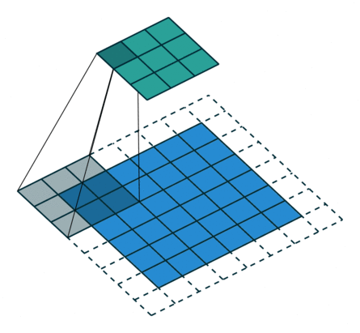
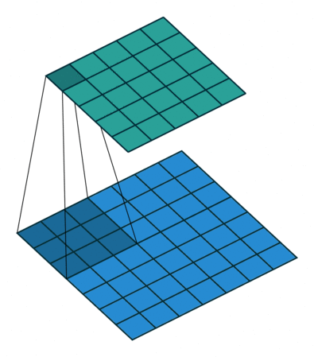
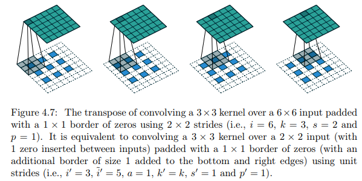

### 卷积与反卷积的相关计算及可视化

***

【**参考资料**】

Vincent Dumoulin, Francesco Visin - [A guide to convolution arithmetic for deep learning](https://arxiv.org/abs/1603.07285) ([BibTeX](https://gist.github.com/fvisin/165ca9935392fa9600a6c94664a01214))

动图来源：[Convolution arithmetic](https://github.com/vdumoulin/conv_arithmetic)

#### 1. 卷积

**符号定义**：

* 考虑2D卷积，即$N=2$

* 输入尺寸是正方形：$i_1=i_2=i$
* 卷积核尺寸是正方形：$k_1=k_2=k$
* 滑动步长（stride）在各维度相同：$s_1=s_2=s$
* padding在各维度相同：$p_1=p_2=p$

**通用结论**：

对于任意的$i, k, p, s$，输出尺寸为：
$$
o=\left\lfloor\frac{i+2 p-k}{s}\right\rfloor+ 1
$$
其中$\lfloor \cdot \rfloor$表示向下取整。

##### 1.1 无padding，步长为1

**关系1**：对任意$i$和$k$，以及$s=1$和$p=0$，有
$$
o=(i-k)+1
$$

##### 1.2 有padding，步长为1

加入padding的情况下，有效的输入尺寸从$i$变成了$i+2p$，*关系1*可以被推广为：

**关系2**：对任意$i, k, p$，以及$s=1$，有
$$
o=(i-k)+2 p+1
$$

###### 1.2.1 Half (same) padding

作用是让输出和输入具有相同的尺寸。

**关系3**：对于任意的 $i$，和**奇数**的 $k$ ($k=2 n+1, \quad n \in \mathbb{N}$)，以及 $s=1$，$p=\lfloor k / 2\rfloor= n$，有
$$
\begin{aligned} o &=i+2\lfloor k / 2\rfloor-(k-1) \\ &=i+2 n-2 n \\ &=i \end{aligned}
$$

###### 1.2.2 Full padding

即填充 $k-1$ 个0，会让输出尺寸变大。

**关系4**：对任意的 $i$ 和 $k$，以及 $p=k-1$ 和 $s=1$，有：
$$
\begin{aligned} o &=i+2(k-1)-(k-1) \\ &=i+(k-1) \end{aligned}
$$

##### 1.3 无padding，步长>1

**关系5**：对任意的 $i$，$k$，$s$ 和 $p=0$，有
$$
o=\left\lfloor\frac{i-k}{s}\right\rfloor+ 1
$$

##### 1.4 有padding，步长>1

这是一般的情况，此时有效输入尺寸是 $i+2p$，模仿*关系2*和*关系5*，有：

**关系6**：对任意 $i, k, p, s$，有
$$
o=\left\lfloor\frac{i+2 p-k}{s}\right\rfloor+ 1
$$

有时卷积核覆盖不到填充后图像的边缘（右边和下边），这种情况下卷积计算时会把多出来的边缘抛弃，如下图

#### 2. 池化

对任意池化，以下关系都成立：

**关系7**：对任意 $i$, $k$, $s$，有
$$
o=\left\lfloor\frac{i-k}{s}\right\rfloor+ 1
$$

#### 3. 反卷积

理解转置卷积（反卷积）的最简单方式是将转置卷积的输入想象成是一个对应的正常卷积的输出，然后转置卷积的作用就是从这个正常卷积的输出中恢复出它的输入（即转置卷积的输出）。说的更直白些，一对卷积和转置卷积的输入和输出是互换的。

考虑上面图2.1中正常卷积的例子，这里的输入是$4 \times 4$，卷积核是$3 \times 3$，输出是$2 \times 2$，那么相对应的转置卷积，输入就是$2 \times 2$，输出是$4 \times 4$。

转置卷积的参数，即输入尺寸、卷积核、步长、padding、输出尺寸，分别用 $i^\prime, k^\prime, s^\prime, p^\prime, o^\prime$ 表示。通过寻找转置卷积的参数和正常卷积参数之间的关系，我们可以从正常卷积的角度来理解转置卷积。很显然，我们有：
$$
i^\prime = o, \ o^\prime = i
$$
（*注：在一些深度学习框架中，比如pytorch，转置卷积是用它对应的正常卷积来描述的，即转置卷积传入的参数是其对应的正常卷积的参数。*）

##### 3.1 无padding，步长为1

**关系 8**：一个 $s=1$，$p=0$ 和卷积核大小 $k$ 的卷积对应的转置卷积满足 $k^\prime = k$，$s^\prime=s$ 和 $p^\prime=k-1$，输出尺寸为：
$$
o^{\prime}=i^{\prime}+(k-1)
$$
即步长和卷积核大小保持不变，但是在转置卷积的输入图像周围填充 $k-1$ 个0.

##### 3.2 有padding，步长为1

从上面知道，一个没有0填充的卷积对应的转置卷积需要进行0填充，那么通过类比可以得知，一个填充了0的卷积，对应的转置卷积会填充更少的0。

**关系 9**：一个参数为 $s=1$，$k$，$p$ 的卷积，对应的转置卷积满足 $k^\prime =k$，$s^\prime = s$，$p^\prime = k-p-1$，输出尺寸为：
$$
o^{\prime}=i^{\prime}+(k-1)-2 p
$$

###### 3.2.1 Half (same) padding

Same padding的卷积，对应的转置卷积是它自身。

**关系10**：参数为$k=2 n+1, \  n \in \mathbb{N}$，$s=1$，$p=\lfloor k / 2\rfloor= n$ 的卷积，对应的转置卷积满足 $k^{\prime}=k$，$s^{\prime}=s$，$p^{\prime}=p$，输出尺寸为：
$$
\begin{aligned} o^{\prime} &=i^{\prime}+(k-1)-2 p \\ &=i^{\prime}+2 n-2 n \\ &=i^{\prime} \end{aligned}
$$

###### 3.2.2 Full padding

Full padding的卷积，对应的转置卷积是没有padding的正常卷积。

**关系11**：参数为 $s=1$，$k$，$p=k-1$的卷积，对应的转置卷积满足 $k^{\prime}=k$，$s^{\prime}=s$，$p^{\prime}=0$，输出尺寸为：
$$
\begin{aligned} o^{\prime} &=i^{\prime}+(k-1)-2 p \\ &=i^{\prime}-(k-1) \end{aligned}
$$

##### 3.3 无padding，步长>1

对于正常卷积来说，步长大于1意味着进行下采样，那么对于转置卷积来说，步长大于1意味着进行上采样。

直觉上讲，步长大于1的转置卷积，对应的是一个步长小于1的正常卷积，但实际上小于1的步长是无法实现的。作为替代，这里的做法是在输入图像的像素之间插入 $s-1$ 个0，然后按照步长为1去移动卷积核，这样会使得卷积核移动的更“慢”。比如一个步长为2的转置卷积，实现时是在输入像素间填充1个0，然后以步长为1移动卷积核，按照正常卷积的方式计算输出，这样就相当于是在按1/2的步长移动卷积核。

对于无填充的情况，我们先假设 $i-k$ 是 $s$ 的倍数，那么将关系5中的 $i$ 替换成 $o^\prime$，$o$ 替换成 $i ^ \prime$，我们可以得到

**关系12**：参数为$p=0$，$s$，$k$，并且满足 $i-k$ 是 $s$ 倍数的卷积，对应的转置卷积满足 $k^{\prime}=k$，$s^{\prime}=1$，$p^{\prime}=k-1$，并且新的输入由原来的输入像素间插入$s-1$个0得到，其尺寸用 $\tilde{i} ^ {\prime}$ 表示， 输出尺寸满足：
$$
o^{\prime}=s\left(i^{\prime}-1\right)+k
$$

##### 3.4 有padding，步长大于1

如果 $i+2p-k$ 是 $s$ 的倍数，那么通过组合关系9和关系12，根据关系6可以推断得到：

**关系13**：参数为 $k$，$s$，$p$，并且输入尺寸 $i$ 满足 $i+2p-k$ 是 $s$ 倍数的卷积，对应的转置卷积满足 $k^{\prime}=k, s^{\prime}=1$，$p^{\prime}=k-p-1$，新的输入通过在原来输入的像素间插入 $s-1$ 个0得到，其尺寸用  $\tilde{i} ^ {\prime}$ 表示，输出尺寸为
$$
o^{\prime}=s\left(i^{\prime}-1\right)+k-2 p
$$

如果  $i+2p-k$ 是 $s$ 的倍数这一条件不满足，那么转置卷积需要引入一个新的参数 $a$ 来表示。

**关系 14**：参数为 $k$，$s$，$p$的卷积，对应的转置卷积参数为 $a$，$\tilde{i} ^ {\prime}$，$k^{\prime}=k, s^{\prime}=1$，$p^{\prime}=k-p-1$，其中$\tilde{i} ^ {\prime}$是在原来输入的像素间插入 $s-1$ 个0得到的新图像的尺寸，$a$ 是 $i+2p-k$ 除以 $s$ 的余数，并且在输入的最右边和最下边填充 $a$ 行0，得到的输出尺寸为：
$$
o^{\prime}=s\left(i^{\prime}-1\right)+a+k-2 p
$$

图4.7就是图2.7中卷积所对应的转置卷积。

#### 4. 空洞卷积

空洞卷积在正常的卷积核之间插入 $d-1$个空格，其中 $d$ 是膨胀系数（dilation rate），$d=1$对应正常卷积。

一个尺寸为 $k$，膨胀系数为 $d$ 的卷积核，其卷积的有效尺寸是：
$$
\hat{k}=k+(k-1)(d-1)
$$
结合关系6，我们可以得到：

**关系15**：对任意 $i$，$k$，$p$，$s$，以及膨胀系数 $d$，有：
$$
o=\left\lfloor\frac{i+2 p-k-(k-1)(d-1)}{s}\right\rfloor+ 1
$$

