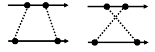
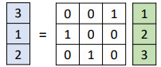

### 基于 Flow 的生成模型简介

***

【**参考资料**】

[Flow-based Deep Generative Models](https://lilianweng.github.io/lil-log/2018/10/13/flow-based-deep-generative-models.html)

[Glow: Better Reversible Generative Models](https://openai.com/blog/glow/)

李宏毅	《机器学习（2019 spring）》

#### 1. 深度生成模型概述

深度生成模型的核心是生成器网络 $G$，它定义了一个概率分布 $P_G$ 。 生成器的目标是使得真实数据被 $G$ 产生出来的概率越大越好，即 $P_G(x^i)$ 越大越好，这里 $x^i$ 是指从真实的数据分布 $P_{data} (x)$ 中采样出来的真实数据。因此，生成器的目标函数可以表达为对数似然函数：
$$
G^{*}=\arg \max _{G} \sum_{i=1}^{m} \log P_{G}\left(x^{i}\right)
$$
不过在大多数情况下，这个目标函数都很难求解，因此不同的生成模型会采用不同的做法。**目前主流的深度生成模型主要分为四种：GAN，VAE，Auto-regressive model 和 Flow-based model 。**

GAN 使用一种很巧妙的方法来建模数据生成。通过引入判别器，GAN 让生成器和判别器之间进行一个 minimax 的博弈，从而让生成分布去逼近真实分布。在目前主流的生成模型中，GAN 的生成效果是最好的。但 GAN 也存在各式各样的问题，尤其是以难以训练著称。

VAE 不直接优化数据的对数似然，而是最大化它的证据下界（Evidence Lower Bound, ELBO），这使得 VAE 对于数据分布的估计往往是模糊近似的。

自回归模型 (Auto-regressive model) 采用逐项生成 (component-by-component) 的方式来生成完整的数据，当前要生成的数据的某一部分，只和之前已经生成的部分有关。但自回归模型同样存在两个问题：一是逐项生成的最佳顺序是无法确定的，二是生成的速度很慢。

流模型 (Flow-based model) 则通过一系列可逆变换来进行生成。由于这些变换都是可逆的，因此隐变量（输入）和生成结果（输出）之间可以任意转换，就好像水流一样，所以被称为 “ 流 (Flow) ” 。与 VAE 不同，流模型直接优化对数似然，因此它的目标函数就是负对数似然函数。

#### 2. 前置数学知识

流模型涉及到的一些主要的数学知识点罗列如下。

##### 2.1 Jacobian 矩阵

Jacobian 矩阵用来描述向量对向量的微分。给定一个函数 $\mathbf{f} : \mathbb{R}^{n} \mapsto \mathbb{R}^{m}$，其将 $n$ 维的输入向量 $\mathbf{x}$  映射为 $m$ 维的输出向量，输出向量的各个维度对输入向量的各个维度的一阶偏微分构成的矩阵称为 Jacobian 矩阵。
$$
\mathbf{J}=\left[\begin{array}{ccc}{\frac{\partial f_{1}}{\partial x_{1}}} & {\cdots} & {\frac{\partial f_{1}}{\partial x_{n}}} \\ {\vdots} & {\ddots} & {\vdots} \\ {\frac{\partial f_{m}}{\partial x_{1}}} & {\cdots} & {\frac{\partial f_{m}}{\partial x_{n}}}\end{array}\right]
$$
Jacobian 矩阵中，不用的列（即横向）放置输入的不同 component，不同的行（即纵向）放置输出的不同 component；矩阵中第 $i$ 行第 $j$ 列的元素是 $\mathbf{J}_{i j}=\frac{\partial f_{i}}{\partial x_{j}}$ 。

Jacobian 矩阵有一个重要的性质：**函数 $f$ 的 Jacobian 矩阵，和它的逆函数 $f^{-1}$ 的 Jacobian 矩阵互为逆矩阵**，即
$$
J_{f} J_{f^{-1}}=I
$$

##### 2.2 行列式

一个方阵的行列式是一个标量，它包含了关于这个矩阵的某些信息。

行列式有一些**重要性质**：

* 性质1：可逆矩阵的行列式和它的逆矩阵的行列式互为倒数
  $$
  \operatorname{det}(\mathrm{A})=1 / \operatorname{det}\left(A^{-1}\right)
  $$

* 性质2：将矩阵的某一行乘以 $k$，得到的新矩阵的行列式是原来行列式的 $k$ 倍。
* 性质3：矩阵转置不改变行列式的值。

几何意义上，矩阵的行列式（的绝对值）代表了这个矩阵的行向量在高维空间中张成的图形的 “体积” 。

##### 2.3 变量改变定理

变量改变定理（Change of Variable Theorem）是流模型的核心，它描述了不同概率分布之间的关系。假设随机变量 $z$ 的概率密度函数是 $\pi (z)$，随机变量 $x$ 的概率密度函数是 $p(x)$，并且 $z$ 和 $x$ 之间有函数关系 $x=f(z)$，变量改变定理可以告诉我们 $\pi (z)$ 和 $p(x)$ 之间的关系，表述如下：
$$
\begin{array}{c}{\mathbf{z} \sim \pi(\mathbf{z}), \mathbf{x}=f(\mathbf{z}), \mathbf{z}=f^{-1}(\mathbf{x})} \\ {p(\mathbf{x})=\pi(\mathbf{z})\left|\operatorname{det} \frac{d \mathbf{z}}{d \mathbf{x}}\right|=\pi\left(f^{-1}(\mathbf{x})\right)\left|\operatorname{det} \frac{d f^{-1}}{d \mathbf{x}}\right|}\end{array}
$$
其中 $\operatorname{det} \frac{d f^{-1}}{d \mathbf{x}}$ 代表函数 $f^{-1}$ 的 Jacobian 矩阵的行列式。

*下面是对 变量改变定理 的直观解释：*

先看一个简单的例子，假设 $x$ 和 $z$ 都是一维变量，并且 $\pi(z)$ 和 $p(x)$ 都服从均匀分布。其中 $\pi(z)$ 是区间 0~1 上的均匀分布，并且 $x=f(z)=2z+1$。

为了满足归一化定理，$\pi(z)$ 在区间 0~1 上的概率密度都是1，也就是说上图中的蓝色方块的面积为1；函数 $f$ 将区间 0~1 映射为区间 1~3，意味着 $x$ 需要在区间 1~3 上服从均匀分布，同样根据归一化定理，$p(x)$ 在区间 1~3 上的取值都为 0.5，即上图绿色方块的面积为1。那么，对于任意一点 $z^{\prime}$，及其对应的 $x^{\prime}$，$\pi(z^{\prime})$ 和 $p(x^{\prime})$ 的关系就可以表示为：
$$
p(x^{\prime}) = \frac{1}{2} \pi(z^{\prime})
$$
现在考虑 $\pi(z)$ 和 $p(x)$ 都服从任意分布的情形。

在一小段距离 $\Delta z$ 内，$z$ 近似服从均匀分布，对于 $x$ 同样如此。任取一点 $z^{\prime}$ , 函数 $f$ 将区间 $z^{\prime}$ ~ $z^{\prime}+\Delta z$ 映射为区间 $ x^{\prime}$ ~ $x^{\prime}+\Delta x$ 。根据归一化定理，上图中的蓝色方块和绿色方块需要有相同的面积，于是有：
$$
\begin{array}{c}{p\left(x^{\prime}\right) \Delta x=\pi\left(z^{\prime}\right) \Delta z} \\ {p\left(x^{\prime}\right)=\pi\left(z^{\prime}\right) \frac{\Delta z}{\Delta x}}\end{array}
$$
当 $\Delta$ 足够小时，$\Delta z / \Delta x$ 可以转换为微分的形式：
$$
p\left(x^{\prime}\right)=\pi\left(z^{\prime}\right)\left|\frac{d z}{d x}\right| = \pi\left(z^{\prime}\right) \left|(f^{-1}
)^{\prime}(x)\right|
$$
注意这里给微分加上了绝对值，这是因为微分是可正可负的，当$\Delta z$ 和 $\Delta x$ 的变化相反时微分就是负值，但是面积总是正的，所以这里要加上绝对值。

现在推广到 $z$ 和 $x$ 都是二维变量，并且服从任意分布的情形。

类似一维的情形，在一小块区间 $(\Delta z_1, \Delta z_2)$ 内，$\pi(z)$ 近似为均匀分布，对 $x$ 同样如此。根据归一化定理，蓝色立方体的体积和绿色立方体的体积需要相等：
$$
p\left(x^{\prime}\right)\left|\operatorname{det}\left[\begin{array}{ll}{\Delta x_{11}} & {\Delta x_{21}} \\ {\Delta x_{12}} & {\Delta x_{22}}\end{array}\right]\right|=\pi\left(z^{\prime}\right) \Delta z_{1} \Delta z_{2}
$$
上式中，用行列式的绝对值代表了绿色立方体的底面积，其中 $\Delta x_{11}$ 代表了 $z_1$ 的改变引起 $x_1$ 的改变量，$\Delta x_{21}$ 代表了 $z_1$ 的改变引起 $x_2$ 的改变量，以此类推。

上式改写为
$$
p\left(x^{\prime}\right)\left|\frac{1}{\Delta z_{1} \Delta z_{2}} \operatorname{det}\left[\begin{array}{ll}{\Delta x_{11}} & {\Delta x_{21}} \\ {\Delta x_{12}} & {\Delta x_{22}}\end{array}\right]\right|=\pi\left(z^{\prime}\right)
$$
利用2.2节中行列式的性质2，进一步改写为
$$
p\left(x^{\prime}\right)\left|\operatorname{det}\left[\begin{array}{ll}{\Delta x_{11} / \Delta z_{1}} & {\Delta x_{21} / \Delta z_{1}} \\ {\Delta x_{12} / \Delta z_{2}} & {\Delta x_{22} / \Delta z_{2}}\end{array}\right]\right|=\pi\left(z^{\prime}\right)
$$

$$
p\left(x^{\prime}\right)\left|\operatorname{det}\left[\begin{array}{ll}{\partial x_{1} / \partial z_{1}} & {\partial x_{2} / \partial z_{1}} \\ {\partial x_{1} / \partial z_{2}} & {\partial x_{2} / \partial z_{2}}\end{array}\right]\right|=\pi\left(z^{\prime}\right)
$$

接着利用2.2节中行列式的性质3，有
$$
p\left(x^{\prime}\right)\left|\operatorname{det}\left[\begin{array}{ll}{\partial x_{1} / \partial z_{1}} & {\partial x_{1} / \partial z_{2}} \\ {\partial x_{2} / \partial z_{1}} & {\partial x_{2} / \partial z_{2}}\end{array}\right]\right|=\pi\left(z^{\prime}\right)
$$
于是有
$$
\begin{array}{l}{p\left(x^{\prime}\right)\left|\operatorname{det}\left(J_{f}\right)\right|=\pi\left(z^{\prime}\right)} \\ {p\left(x^{\prime}\right)=\pi\left(z^{\prime}\right)\left|\operatorname{det}\left(J_{f^{-1}}\right)\right|}\end{array}
$$

#### 3. 流模型正篇

##### 3.1 目标函数

有了变量改变定理，我们就可以将之前的对数似然函数进行改写：
$$
p_{G}\left(x^{i}\right)=\pi\left(z^{i}\right)\left|\operatorname{det}\left(J_{G^{-1}}\right)\right| \qquad z^{i}=G^{-1}\left(x^{i}\right) \\
\log p_{G}\left(x^{i}\right)=\log \pi\left(G^{-1}\left(x^{i}\right)\right)+\log \left|\operatorname{det}\left(J_{G^{-1}}\right)\right|
$$
不过，这带来两个要求，首先，生成器函数 $G$ 不能是任意函数，而一定要是可逆的；其次，直接计算行列式 $\operatorname{det}\left(J_{G}\right)$  (或者 $\operatorname{det}\left(J_{G^{-1}}\right)$) 是很耗费时间的，所以生成器 $G$ 一定要是某些特定的、容易计算 $\operatorname{det}\left(J_{G}\right)$ 的函数。所以为了满足这两点要求，流模型中的生成器都要具有特殊设计的结构。此外，为了满足可逆性的要求，生成器的输入维度和输出维度还要是一致的。**这些要求给流模型的生成器带来了限制，不像GAN 和 VAE 一样可以采用任意函数，这也是流模型的主要缺点。**

为了增强生成能力，流模型中通常将多个可逆的生成器级联：

逐级递推，可以得到目标函数：
$$
\begin{array}{l}{p_{1}\left(x^{i}\right)=\pi\left(z^{i}\right)\left(\left|\operatorname{det}\left(J_{G_{1}^{-1}}\right)\right|\right)} \\ {p_{2}\left(x^{i}\right)=\pi\left(z^{i}\right)\left(\left|\operatorname{det}\left(J_{G_{1}^{-1}}\right)\right|\right)\left(\left|\operatorname{det}\left(J_{G_{2}^{-1}}\right)\right|\right)} \\  …… \\{p_{K}\left(x^{i}\right)=\pi\left(z^{i}\right)\left(\left|\operatorname{det}\left(J_{G_{1}^{-1}}\right)\right|\right) \cdots\left(\left|\operatorname{det}\left(J_{G_{K}^{-1}}\right)\right|\right)} \\ \end{array}
$$
所以有：
$$
\begin{eqnarray} 
\log p_{K} \left(x^{i}\right) & =\log \pi\left(z^{i}\right)+\sum_{h=1}^{K} \log \left| \operatorname{det}\left(J_{G_{K}^{-1}}\right) \right| \\
&= \log \pi\left(z^{i}\right) - \sum_{h=1}^{K} \log \left| \operatorname{det}\left(J_{G_{K}}\right) \right|
\end{eqnarray}
$$
其中 $z^{i}=G_{1}^{-1}\left(\cdots G_{K}^{-1}\left(x^{i}\right)\right)$ 。

不妨来理解一下目标函数，为简单起见，这里考虑只有一个 $G$ 的情况，目标是最大化下面的函数：
$$
\log p_{G}\left(x^{i}\right)=\log \pi\left(G^{-1}\left(x^{i}\right)\right)+\log \left|\operatorname{det}\left(J_{G^{-1}}\right)\right|
$$
这里的 $\pi (z)$ 一般取为标准高斯分布。上式右边第一项中的 $\pi\left(G^{-1}\left(x^{i}\right)\right)$ 代表样本 $x^{i}$ 对应的隐变量 $z^i$ 在标准高斯中出现的概率，为了使这一项最大，$G^{-1}$ 会将 $x^i$ 都映射为 0 向量（因为标准高斯中 0 的概率最大），这显然是有问题的；此时就需要右边的第二项来进行约束，如果 $z^i$ 一直是 0 向量，那么 Jacobian 矩阵 $ J_{G^{-1} }$ 会是一个全零矩阵，对应的行列式也为 0，再取 log 后是无穷小，这就不满足最大化目标的要求。

从目标函数中不难发现，在实际训练中，出现的是 $G^{-1}$，因此我们实际训练的是 $G^{-1}$，只不过训练完毕后，我们用 $G$ 来做生成。

##### 3.2 Coupling Layer

Coupling Layer 是一种特殊设计的、满足可逆条件的生成器，其结构如下：

进入 Coupling Layer 之前，我们将输入 $z$ 分为两部分，其前 1~$d$ 维直接复制到 输出 $x$ 的 1~$d$ 维；$z$ 的 $d$ ~ $D$ 维进行一个参数为 $\beta$ 和 $\gamma$ 的仿射变换（element-wise），得到 $x$ 的 $d$ ~ $D$ 维：
$$
x_{i>d}=\beta_{i} z_{i}+\gamma_{i}
$$
而仿射变换的参数 $\beta$ 和 $\gamma$ 是由 $z$ 的前 $d$ 维分别通过两个网络 $F$ 和 $H$ 得到的，后面会看到，这两个网络与逆变换和 Jacobian 的求解无关，所以它们可以任意复杂。

Coupling Layer 的逆变换很容易求解，即：
$$
\begin{eqnarray}
z_{i \leq d} &=& x_{i} 
\\ z_{i>d} &=& \frac{x_{i}-\gamma_{i}}{\beta_{i}}
\end{eqnarray}
$$
实际操作时，先根据等价映射关系求出 $z$ 的前 $d$ 维，然后再利用 $z$ 的前 $d$ 维求出 $\beta$ 和 $\gamma$，再反向求出 $z$ 的后 $d$ ~ $D$ 维；这个过程中，网络 $F$ 和 $H$ 一直都是前向操作，不涉及到逆变换。

Coupling Layer 的 Jacobian 矩阵的行列式同样容易求解。

因为 $z$ 的前 $d$ 维和 $x$ 的前 $d$ 维是等价映射关系，所以 $J_G$ 的左上部分是一个单位矩阵； $x$ 的前 $d$ 维与 $z$ 的 $d$ ~ $D$ 维无关，所以$J_G$ 的右上部分是零矩阵；$x$ 的  $d$ ~ $D$ 维与 $z$ 的 $d$ ~ $D$ 维之间的关系是 element-wise 的，所以 $J_G$ 的右下角是对角矩阵；此时，已经可以确定整个矩阵 $J_G$ 是一个下三角矩阵，其行列式的值就是对角元素的乘积，而 $J_G$ 的左下角与行列式计算无关，所以尽管$x$ 的  $d$ ~ $D$ 维与 $z$ 的前 $d$ 维之间关系很复杂（涉及到网络 $F$ 和 $H$），但却完全不影响行列式的计算。

根据上面的分析，很容易得到 Jacobian 矩阵 $J_G$ 的行列式为：
$$
\operatorname{det}\left(J_{G}\right)=\frac{\partial x_{d+1}}{\partial z_{d+1}} \frac{\partial x_{d+2}}{\partial z_{d+2}} \cdots \frac{\partial x_{D}}{\partial z_{D}}  =\beta_{d+1} \beta_{d+2} \cdots \beta_{D}
$$
上面讨论的是 Coupling Layer 的一般形式，在不同的方法中，Coupling Layer 的具体形式不同。

###### Real NVP

**RealNVP** (Real-valued Non-Volume Preserving; [Dinh et al., 2017](https://arxiv.org/abs/1605.08803)) 中的 Coupling Layer 如下：
$$
\begin{aligned} \mathbf{z}_{1 : d} &=\mathbf{x}_{1 : d} \\ \mathbf{z}_{d+1 : D} &=\mathbf{x}_{d+1 : D} \odot \exp \left(s\left(\mathbf{x}_{1 : d}\right)\right)+t\left(\mathbf{x}_{1 : d}\right) \end{aligned}
$$
其中 $s$ 和 $h$ 是任意变换函数；实际上就是把上面的参数 $\beta$ 表示成了指数的形式；这种形式又被称为 *affine coupling layer* 。

###### NICE

**NICE** (Non-linear Independent Component Estimation; [Dinh, et al. 2015](https://arxiv.org/abs/1410.8516)) 是 **RealNVP** 的前置工作，它的 coupling layer 没有 scale 参数（即 $\beta$），称为 *additive coupling layer*。
$$
\left\{\begin{array}{l}{\mathbf{z}_{1 : d}=\mathbf{x}_{1 : d}} \\ {\mathbf{z}_{d+1 : D}=\mathbf{x}_{d+1 : D}+m\left(\mathbf{x}_{1 : d}\right)}\end{array} \Leftrightarrow\left\{\begin{array}{l}{\mathbf{x}_{1 : d}=\mathbf{z}_{1 : d}} \\ {\mathbf{x}_{d+1 : D}=\mathbf{z}_{d+1 : D}-m\left(\mathbf{z}_{1 : d}\right)}\end{array}\right.\right.
$$
其中 $m$ 是任意变换函数。

------

###### 多层堆叠

直接堆叠 coupling layer 会带来一个问题：输入的前 $d$ 维会一直等价映射到输出的前 $d$ 维，也就是说最终的输出中会包含一小块输入的噪声。

为避免这个问题，堆叠 coupling layer 时会进行反向连接，即相邻两层中直接复制的部分是互相不重叠的，前一层中没有直接复制的部分到后一层中直接复制，反之亦然。

对于图片数据，这种拆分方法有两种实现方式：第一种是按空间位置划分，比如 pixel 的横坐标 $i$ 和纵坐标 $j$ 加起来是奇数的就直接复制，是偶数的就不复制，这种策略称为 *checkboard masking* ；第二种是按通道拆分，即某些通道直接复制，某些不复制，这种策略称为 *channel-wise masking* 。在 **Real NVP** 中，交替使用了这两种策略。

##### 3.3  1 $\times$ 1 卷积

使用 channel-wise masking 的策略时，需要人为地去打乱通道的顺序，以使 coupling layer 级联时前后 copy 的通道不一样。对通道顺序的打乱可以看成是 1 $\times$ 1 卷积的一种特殊形式：

如果 1 $\times$ 1 卷积的输入通道数和输出通道数一致，那么 1 $\times$ 1 卷积可以视为是对通道进行了打乱，并且打乱的顺序是可以被网络学习的。对于图片来说，打乱通道的 1 $\times$ 1 卷积是是一个 $3 \times 3$  的权重矩阵，对于一个 pixel 位置，有
$$
x = f(z) = Wz
$$

$$
\left[\begin{array}{l}{x_{1}} \\ {x_{2}} \\ {x_{3}}\end{array}\right]=\left[\begin{array}{lll}{w_{11}} & {w_{12}} & {w_{13}} \\ {w_{21}} & {w_{22}} & {w_{23}} \\ {w_{31}} & {w_{32}} & {w_{33}}\end{array}\right]\left[\begin{array}{l}{z_{1}} \\ {z_{2}} \\ {z_{3}}\end{array}\right]
$$

它的 Jacobian 矩阵仍为 $W$ :
$$
J_f=\left[\begin{array}{lll}{\partial x_{1} / \partial z_{1}} & {\partial x_{1} / \partial z_{2}} & {\partial x_{1} / \partial z_{3}} \\ {\partial x_{2} / \partial z_{1}} & {\partial x_{2} / \partial z_{2}} & {\partial x_{2} / \partial z_{3}} \\ {\partial x_{3} / \partial z_{1}} & {\partial x_{3} / \partial z_{2}} & {\partial x_{3} / \partial z_{3}}\end{array}\right]=\left[\begin{array}{ccc}{w_{11}} & {w_{12}} & {w_{13}} \\ {w_{21}} & {w_{22}} & {w_{23}} \\ {w_{31}} & {w_{32}} & {w_{33}}\end{array}\right]=W
$$
把输入和输出的整张三通道图片展开成一个大的向量，可以得到整体的 Jacobian 矩阵为：

上图中的每一个小长方形都代表一个 pixel 位置的三通道向量，由于 $1 \times 1$ 卷积是一个 element-wise 的操作，所以整体的 Jocabian 矩阵是一个块对角矩阵，它的行列式为：
$$
(\operatorname{det}(W))^{d \times d}
$$
其中 $d \times d$ 代表图片尺寸。

对于一个 $3 \times 3$ 矩阵，它的行列式和逆矩阵都很容易计算，所以 $1 \times 1$ 卷积满足要求的。

###### Glow

**Glow** ([Kingma and Dhariwal, 2018](https://arxiv.org/abs/1807.03039)) 模型对 **Real NVP** 进行了简化，只采用 channel-wise masking 的 coupling layer，并且使用 $1 \times 1$ 卷积来打乱通道顺序。

除此以外，Glow 还采用了 **Activation normalization** (简称 actnorm) 的操作。Actnorm 和 BN 不同，它只对输入进行仿射变换：
$$
\mathbf{y}_{i, j}=\mathbf{s} \odot \mathbf{x}_{i, j}+\mathbf{b}
$$
其中仿射变换的参数是可训练的，并且根据第一个 minibatch 来初始化，使得被标准化后第一个 minibatch 的数据服从标准高斯分布。Actnorm 可以适应 batch size 只有 1 的情形。

Glow 中单个生成器的结构如下：

由于可逆变换的存在，**Glow 模型可以对输入图片 $x$ 对应的隐变量 $z$ 进行精确的推断**，**而不是像 VAE 那样的近似推断。**

利用 Glow 模型，可以很方便地对隐变量 $z$ 进行操作，比如将两张图片的隐变量混合进行生成：

或者进行 attribute manipulation，比如想要让原来不含某个 attribute（如微笑）的图片变成包含这个 attribute。这需要一些带有某个 attribute 和不带这个 attribute 的标注的图片，然后分别求出它们的隐变量的平均值，并进行相减，得到的向量就代表了如何从不含某个 attribute 变化为 包含这个 attribute；然后给定一张新的不含这个 attribute的图片，求出它的隐变量，加上之前相减得到的向量，就能生成得到对应的包含这个 attribute 的图片。

