#### 对抗自编码器AAE原理

***

【参考文献】

[1] Adversarial Autoencoders	2015

#### 1. 基本原理

VAE中，假设encoder出来的分布是高斯的，并且使用KL散度来约束后验分布$q(z|x)$靠近先验分布$p(z)$。同时，整个endoer-decoder网络还要最小化重建误差。

AAE的思想与VAE非常相似，只不过区别在于，对隐空间的约束方式从KL散度变成了GAN的对抗方式，而重建loss的部分依然相同。

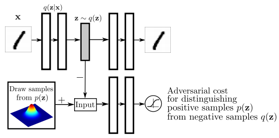

**关于隐空间匹配的分布**

需要注意的是，在AAE中，隐空间匹配的分布变成了aggregated posterior $q(z)$和先验$p(z)$。Aggregated posterior $q(z)$由encoder的后验分布$q(z|x)$和数据分布$p_d(x)$定义：
$$
q(\mathbf{z})=\int_{\mathbf{x}} q(\mathbf{z} | \mathbf{x}) p_{d}(\mathbf{x}) d \mathbf{x}
$$
所谓的aggregated posterior $q(z)$，可以理解为是encoder后验分布$q(z|x)$的混合。要在隐空间中完成对抗，在一个mini-batch中，需要从$p(x)$中采样$n$张图片，计算得到后验的$q(z|x)$，那么隐变量$z$的概率即为$q(\mathbf{z} | \mathbf{x}) p_{d}(\mathbf{x})$，这可以视为是在$q(z)$中进行采样，得到的$z$作为对抗的负样本；然后再从先验$p(z)$中采样$n$个值，作为正样本。所以，这是$n$个数据样本产生的后验一起与先验进行对抗，然后完成匹配的过程。

而VAE中，由于encoder输出的后验和先验分布都是高斯的形式，所以KL散度项可以直接解析的计算出来。因此在VAE中，相当于是独立的把每一个数据点专属的后验$q(z|x)$都拿去和先验$p(z)$进行匹配。这是VAE与AAE所不同的一点。

------

**AAE的训练过程分为两个阶段：**

**阶段一是重建阶段**，这个阶段中要更新encoder和decoder来最小化重建loss；

**阶段二是正则化阶段**，这个阶段中，对抗网络首先更新判别器来分辨真实的先验和encoder输出的后验，然后，更显encoder（即生成器）来迷惑判别器。

#### 2. 与VAE的对比实验

AAE能够学到更加充实，分布中间没有“空隙”的隐空间。分布中间没有“空隙”意味着当我们对隐变量$z$进行插值时，生成的图片依旧会在数据的流形上，而不会产生没有意义的结果。

下图是在MNIST上的实验结果：

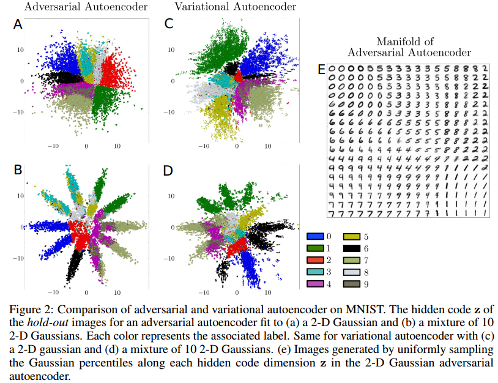

可以看到，AAE能更好地拟合假设的先验分布，而VAE的效果则要略差一些，而且产生的隐空间分布中有“孔洞”。

另外，**AAE还有一项优势，那就是可以拟合任意形式的先验，**而VAE由于要解析地计算KL散度项，所以只能选择一些形式比较简单的先验分布（比如高斯）。

#### 3. 利用label信息

AAE引入label信息来更进一步的提升对先验的拟合程度。文章中针对MNIST数据集，用了一个具有10个混合成份的混合高斯先验来作为例子。理想情况下，我们希望每一个高斯成分只代表一个数字类别。

引入label信息的做法是，给判别器一个额外的one-hot向量作为输入，这个向量代表类别信息，另外，它还有额外的一个类别用来表示无标记的样本。比如，对于MNIST 10类的情况来说，这个one-hot向量就一共有11维。

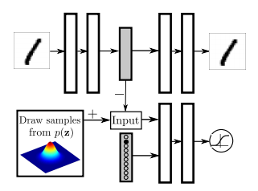

One-hot向量的作用就像一个开关，告诉判别器应该选择哪个高斯成分来进行匹配。对于有标记的正样本，one-hot向量指示的就是从先验中选取的对应的高斯成分；对于无标记的正样本，one-hot向量指示的是从所有10个高斯混合的先验中进行采样。而对于负样本来说，one-hot向量代表的即为这个样本所从属的类别（包括无监督样本的“那一类”）。

实验表明，引入label信息的AAE可以学到非常理想的类别化先验分布。对于形式比较复杂的先验，比如下图中的“瑞士卷”分布，AAE也可以学的很好。

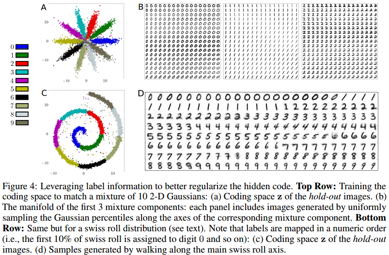

#### 4. 有监督应用

文中给出的有监督应用是指disentangle。在原来AAE框架的基础上，给了decoder一个额外的用于编码类别的one-hot向量作为输入。这样可以认为，encoder输出的隐变量$z$就只包含了与类别信息无关的style信息。

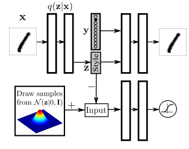

下面是在MNIST和SVHN中的实验结果，其中每行是通过固定style code $z$，然后改变$y$得到的，可以看到每行的风格样式还是比较一致的。

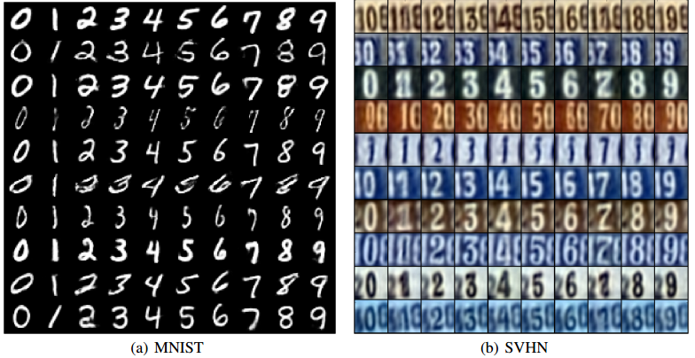

#### 5. 半监督应用

目标是通过无标记的数据来提高有标记数据的分类准确度，采用的框架是在上面的有监督应用框架基础上修改而来的：

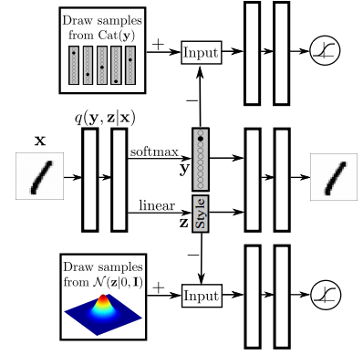

这里要求encoder不仅要预测style code $z$，还要预测类别code $y$，并且通过对抗方式，让隐变量$z$的分布与标准高斯先验匹配，隐变量$y$的分布与categorical distribution先验匹配。另外，还加入了半监督分类的阶段，即要求最小化有标记样本的隐变量$y$与真实标签之间的cross entropy。

与其他半监督方法的对比如下：

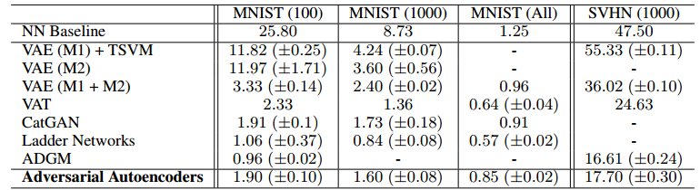

#### 6. 聚类应用

用于聚类的结构是在半监督应用的结构上修改得到的，区别在于移除了半监督分类的部分。在MNIST上聚为16类的结果如下：

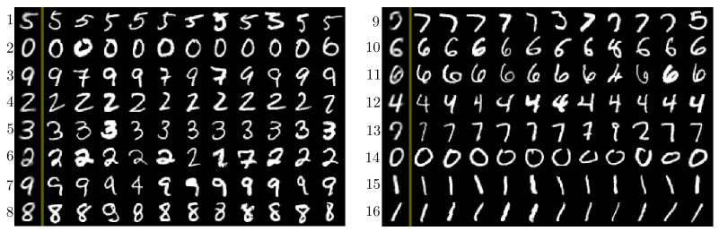

图中左边的第一列是cluster head，是将style code设为0，然后依次将类别code $y$设置为不同的one-hot向量得到的。将图片分到某一类的依据是encoder输出的$q(y|x)$，即选取类别code $y$中最大的那一位所对应的类别。

#### 7. 降维应用

降维所使用的框架如下：

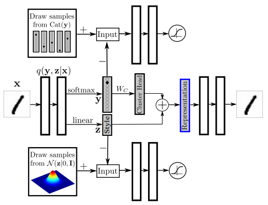

假设降维后的维度为$n$，那么降维后的特征表示是cluster head和style code $z$的加和。Cluster head的是将类别code $y$用参数矩阵$W_C$进行线性映射得到的，假如一共有$m$类，那么$W_C$的大小就是$m \times n$，$W_C$的每一行代表某个类别对应的cluster head的特征表示。

另外还使用了一个额外的loss，目的是要求两个不同的cluster head之间的L2距离尽可能大，采用的是hinge loss的形式，当距离大于一个阈值$\eta$时，惩罚就为0。

MNIST上的降维效果如下：

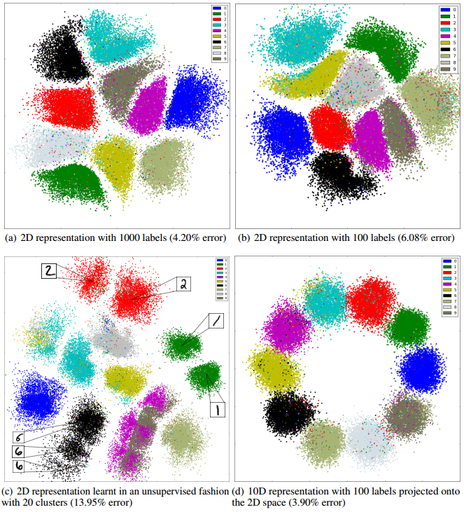

