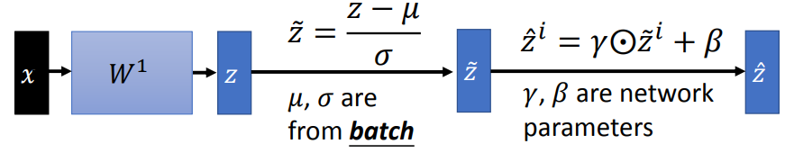
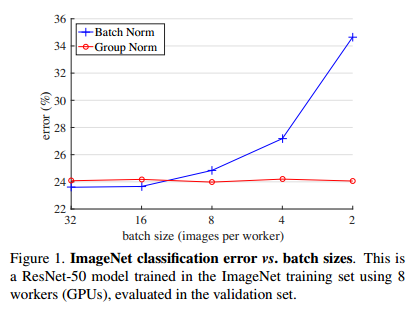

### 深度学习中的标准化操作：BN，LN，IN，GN

------

#### 0. 参考资料

李宏毅老师的深度学习课程中对应部分：

http://speech.ee.ntu.edu.tw/~tlkagk/courses/MLDS_2018/Lecture/ForDeep.pdf

吴育昕和何恺明的论文：

[Group Normalization](https://arxiv.org/abs/1803.08494)

#### 1. 为什么需要特征标准化？

对输入特征进行标准化（feature scaling）是机器学习的优化中很普遍的一项操作，这样做会为优化过程带来一些好处。

考虑下面这个简单的模型

很明显，这个模型的两个输入维度之间相差的尺度很大。这样造成的后果是，我们会得到像下面的loss曲面图：

我们会发现，权重$w_1$具有较大的变化尺度，这是因为$x_1$的尺度很小，相对地，$w_1$就要足够大才能使loss产生比较明显的变化。同理，权重$w_2$的尺度相对较小。于是，在$w_1$的方向上，loss曲线的梯度比较小，而在$w_2$的方向上，loss曲线的梯度很大（可以看到图中loss曲面的等高线较密集）。这样带来的后果就是，模型的训练会变得比较困难，因为我们要在不同的方向上设置不同大小的学习率。

而进行特征标准化以后，我们产生的loss曲面近似于一个正圆形：

这样就会使模型的训练变得容易很多，同时，模型的收敛也会比较快速。

通常来讲，特征标准化的操作就是求出同一特征维度下，不同样本的均值和标准差，然后利用其进行标准化。

#### 2. 批标准化（Batch Normalization）

批标准化（BN）实际上就是在对深层神经网络的每一层输出（下一层的输入）进行标准化。需要注意的是，BN在计算均值和标准差的时候，只在一个训练的batch内进行计算。这会带来一个很显然的问题：**当batch size过小的时候，BN的表现会很差**，因为这时计算得到的统计数值会变得不准确。

一个完整的BN层的计算流程如下：

这里我们对标准化后的特征又进行了线性变换：
$$
\hat { z } ^ { i } = \gamma \odot \tilde { z } ^ { i } + \beta
$$
这里的$\gamma$和$\beta$都是**channel-wise**的参数，由网络学习得到。加入这两个参数的目的，是为了补偿可能存在的因为标准化所带来的表征能力下降。从统计角度上来说，相当于网络并不一定将$z$转化为均值为0，方差为1的标准分布。

在测试的时候，我们没有batch的概念，无法计算均值$\mu $和标准差$\sigma$。理想情况下，我们用整个训练集的$\mu$和$\sigma$来代替。在实际操作中，如果训练集太大，测试时计算并存储整个训练集的代价就很大，解决办法是计算训练过程中每次迭代后的$\mu$和$\sigma$的移动平均，并且给接近训练结束时的$\mu$和$\sigma$较大的权重值。

下面是对BN的**小结**：

* **优点**：
  * 大大方面了优化，加速了整个训练的过程，使得非常深的网络能够收敛；
  * 因为能在一定程度上缓解各层之间分布不一致（Internal covariant shift）的问题，因此通常情况下都能带来结果的提升；
  * 有一定的**正则化**作用，这得益于计算不同batch的均值和标准差时存在的统计不确定性（stochastic uncertainty）；

* **缺点**：
  * batch size较小时表现较差，这阻碍了BN应用在detection，segmentation和video这类无法使用大batch size的任务；
  * testing，inference和transferring时，使用的是training的统计数据，会带来一定的偏差，尤其是在training和testing数据分布不一致的情况下。

#### 3. 其他方法

为了解决BN对batch size大小依赖的问题，衍生出了很多方法，比较有代表性的有**LN（Layer Normalization）、IN（Instance Normalization）、GN（Group Normalization）**。其中效果最好的是**GN**。

这些方法与BN的比较如下图：

这些方法的差别仅在于它们用来求平均和标准差的集合不同。

**BN**计算的是多个样本的同一个channel对应的feature map，也就是在$(N, H, W)$维度上进行计算。我们可以说，**BN是channel-wise的**。

**LN、IN、GN**都不在batch维度上进行计算，所以它们对于batch size的变化更加鲁棒。

**LN**计算的是一个样本下对应的所有channel的feature map，也就是在$(C, H, W)$维度上计算。也可以说，**LN是sample-wise的**。

**IN**仅对一个样本下的一个channel的feature map进行计算，也就是在$(H,W)$维度上计算。也可以说，**IN是feature map-wise的**

**GN**先对同一个样本下的channel进行分组，然后计算每组内feature map的均值和方差并进行标准化。我们可以说，**GN是feature map group-wise**的。其动机是，CNN中不同的filter可能具有类似的相应，因此可以进行标准化。

实际上，GN是对LN和IN的折衷，后两者都可以看作是GN的特殊情形。相比于LN在学习特征表达时多变性的缺乏和IN表征不同channel间相关性能力的缺失，GN在两者间进行了trade-off。

事实上，group-wise的计算本身并不是一件新鲜的事，早期的手工特征如SIFT、HOG中就有对应的操作，后时代的CNN模型如ResNeXt、Xception中也有group convolution的操作。

#### 4. 对比实验

实验部分来自于[Group Normalization](https://arxiv.org/abs/1803.08494)，这里只做简单介绍。

默认情况下，GN的group size的设置为32。

各标准化方法在ImageNet上的表现：

所有方法都能够收敛，但和BN效果最接近的是GN。事实上，GN的训练误差要比BN低，但验证误差要高一些。可能是因为GN损失了一些正则化的能力，因为GN在计算时不存在像BN那样的在各个Batch间的不确定性。

另外，GN在小batch size下的表现也更稳定：

带来的结果之一就是GN在detection、segmentation和action recognition这类batch size受限的任务上的表现要比BN好。

其他部分实验结果略。