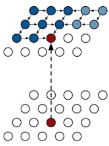
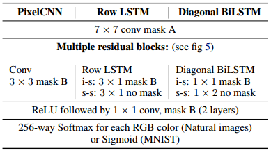

### 自回归模型简介：PixelRNN 与 PixelCNN

***

【**参考资料**】

[Summary of PixelRNN by Google Deepmind](https://towardsdatascience.com/summary-of-pixelrnn-by-google-deepmind-7-min-read-938d9871d6d9)

[Blind Spot problem in PixelCNN](https://towardsdatascience.com/blind-spot-problem-in-pixelcnn-8c71592a14a)

[Auto-Regressive Generative Models (PixelRNN, PixelCNN++)](https://towardsdatascience.com/auto-regressive-generative-models-pixelrnn-pixelcnn-32d192911173)

cs231n 2019  [Lecture 11: Generative Models](http://cs231n.stanford.edu/slides/2019/cs231n_2019_lecture11.pdf)

cs231n 2018  [Lecture 20: Reversible and Autoregressive Models](https://www.cs.toronto.edu/~rgrosse/courses/csc321_2018/slides/lec20.pdf)

论文：Pixel Recurrent Neural Networks 

【**参考代码**】

PixelRNN :  [ https://github.com/carpedm20/pixel-rnn-tensorflow](https://github.com/carpedm20/pixel-rnn-tensorflow)

#### 1. 自回归模型

生成模型的目的是要为概率似然函数建模，一个简单方法是将其拆成一系列条件概率的乘积：
$$
p(\mathbf{x})=\prod_{i=1}^{D} p\left(x_{i} | x_{1}, \ldots, x_{i-1}\right)=\prod_{i=1}^{D} p\left(x_{i} | x_{1 : i-1}\right)
$$
这就是自回归假设，简单来说，就是当前要预测的 $x_i$ 只和过去的值 $x_1$ ~ $x_{i-1}$ 有关，与未来的值无关；现在预测出的值 $x_i$ 也将被用于预测下一个值 $x_{i+1}$。

在自回归假设下，生成变成了一个序列问题。对于不同的任务，序列 $\mathbf{x}=\left[x_{1}, \dots, x_{D}\right]$ 具有不同的含义，对于图片来说，$\mathbf{x}$ 就是一个将图片按行展开构成的序列，$x_i$ 代表一个 pixel 的值。

本篇中我们只考虑图片生成。**自回归模型的图片生成是一个 pixel-by-pixel 的过程，按照从上到下逐行、从左到右逐个 pixel 的形式生成图片。**

对于多通道的图片，自回归生成时按照 RGB 的顺序，即生成某个 pixel 的 R 通道时，只与这个 pixel 之前的值有关；生成 G 通道时，与这个 pixel 的 R 通道和之前 pixel 的值有关；生成 B 通道时，与该 pixel 的 R、G通道和之前的 pixel 有关。此时第 $i$ 个 pixel 的概率变为：
$$
p\left(x_{i, R} | \mathbf{x}<i\right) p\left(x_{i, G} | \mathbf{x}<i, x_{i, R}\right) p\left(x_{i, B} | \mathbf{x}<i, x_{i, R}, x_{i, G}\right)
$$
**生成 pixel 的值被转化为一个分类问题**，通过一个 256-way 的 softmax layer 来实现；训练时则采用 cross-entropy loss 。

自回归模型在图片补全（Image Completion）任务中效果较好，不过由于序列化生成的特点，自回归模型生成的速度特别地慢。

 

#### 2. Masked Convolutions

正式介绍 PixelRNN 和 PixelCNN 之前，先来看一下这两个模型中的重要组成部分—— Masked Convolution 。

Masked convolution 的作用是将模型不应该接触到的部分置0（比如在中心像素左边和下边的位置），以满足自回归假设。PixelRNN 和 PixelCNN 的原文中引入了两种 mask：mask A 和 mask B 。Mask A 将当前位置及其之后的位置全部置0，而 mask B 只将当前位置之后的位置置 0，即允许使用当前位置的值来进行预测。Mask A 一般用在网络的第一层（输入是原始图片），而 mask B 用在之后的层（输入是上一层的输出）。

一个应用在 $5\times 5$ 卷积核上的 mask A，可以看到卷积的输出只与中心像素之前的像素值有关：

三通道卷积中的 mask B，可以看到预测 R 通道时只依赖上一层的 R 通道，预测 G 通道时以来上一层的 R、G 通道，预测 B 通道时依赖 上一层的全部通道：

而正常的卷积在计算各个通道的输出时会依赖上一层的全部通道：

#### 3. PixelRNN

自回归模型最简单的实现方法是训练一个 pixel-by-pixel 生成的 RNN，但是因为 RNN 序列生成的特点，这样做会使得训练时间变得非常长，所以 pixelRNN 的作者引入了两种结构：**Row LSTM** 和 **Diagonal BiLSTM** 。

##### 3.1 Row LSTM

在 Row LSTM 中，一个 pixel 的 hidden state 和位于它上方的三个像素直接相关，即
$$
h_{i,j} \leftarrow h_{i-1,j-1}, \ h_{i-1, j}, \ h_{i-1,j+1}
$$
同时，这三个像素又分别与它们各自上方的三个像素直接相关，以此类推。因此，一个像素拥有一个位于它上方的三角形 context，这个三角形 context 区域会被用来预测这个像素的值。在 Row LSTM 中，这种连接关系被称为 state-to-state connection 。如下图

同时，预测该像素时还会接受来自前一层的 input-to-state 输入。

在 Row LSTM 中，state-to-state 的连接是通过 $3 \times 1$ 卷积实现的，相当于在每一个 time step，来自同一层上一个 state 的输入是由 $(h_{i-1,j-1}, \ h_{i-1, j}, \ h_{i-1,j+1})$ 组成的 feature 向量；而 input-to-state 的连接是由带 mask B 的 $3 \times 1$ 卷积实现的，相当于在每一个 time step，来自前一层对当前位置的输入，是由前一层同样对应位置的像素及其前面一个像素组成的 feature 向量。

*（注：正常 RNN 的 输入由两部分组成，一部分是同一层前一个隐含状态的输出，另一部分是前一层相同位置的隐含输出；前者被称为 state-to-state component，后者被称为 input-to-state component）*

Row LSTM 的重点是对 state-to-state 连接的构建。正常的 LSTM 中，同一行内的像素是顺序连接的，必须要预测完前一个位置 $x_{i,j}$，才能预测下一个位置 $x_{i, j+1}$，这样就会很慢。而在 Row LSTM 中，同一行内的像素没有连接，所以同一行的所有像素可以并行计算，一次生成一行。不过这样做的问题是，三角形的 context 区域并不能完全覆盖某个像素之前的所有像素区域，因此 context 是不完全的。所以 **Row LSTM 是通过牺牲一定的 context 信息来换取训练速度的提升**。

##### 3.2 Diagonal BiLSTM

Diagonal BiLSTM 是对 Row LSTM 的进一步完善，以解决 context 不完善的问题。在 Diagonal BiLSTM 中，一个 pixel 的 hidden state 和各位于它左边和上边的一个像素有关，即
$$
h_{i,j} \leftarrow \ h_{i-1, j}, \ h_{i,j-1}
$$
生成的过程按照对角化的方式进行：

同时，为了确保覆盖完整的 context 区域，还使用了 BiLSTM 的结构，生成按照从左上角开始和从右上角开始两个方向进行。

对角化的 state-to-state 递归方式的实现比较特殊，首先将原图片的每行相较于上行偏移一个像素位置，如下图

假设原来的图片高宽尺寸是 $h \times w$，这样操作后得到的新图片宽度是 $h + w -1$，原来没有像素的位置进行零填充，这个过程被称为 “skew” 。然后对角化的生成就可以用 column-wise 的 $1 \times 2$ 卷积来实现。操作完成后，还要把图片再 “unskew” 回去。

对于 skew 后的图片来说，同一列的 pixel 互相之间没有依赖关系，所以可以并行计算，一次生成一列，对应到 unskew 的原始图片，也就是将对角化生成的过程进行了并行。

另外，对于 input-to-state 的连接，Diagonal BiLSTM 采用的是带 mask B 的 $1\times 1$ 卷积。

*(注：个人对 PixelRNN并行化的理解是，在 PixelRNN 中，通过卷积的方式，一次递归可以生成一行（Row LSTM）或者一列 （Diagonal BiLSTM），但是普通的 RNN 一次递归只能生成一个像素。)*

#### 4. PixelCNN

因为 LSTM 具有记忆的特性，所以 PixelRNN 可以在 receptive filed 内构建 unbounded 的依赖关系，即上一个 state 中包含了过去的所有 context 信息；但是 RNN 递归的结构会带来计算消耗。相对地，我们可以用普通的卷积来构建 bounded 的、更大的 receptive filed，这样尽管 context 受限，但会带来更小的计算消耗，因为所有的 pixel 位置都可以被一次性计算完。

PixelCNN 的结构非常简单，相较于 PixelRNN，它使用了更大的 masked convolution 来提取前一层的 context 信息；同时，取消了同一层间 state-to-state 的递归结构。

此外，PixelCNN 中不含 pooling layer，这是为了防止 pooling layer 将未来的信息给包含进去。

不过需要注意的是，PixelCNN 减少的只是训练过程中的计算开销，因为在训练时，context 区域的像素值是已知的；在训练完毕后的生成过程中，不管是 PixelCNN 还是 PixelRNN 都十分缓慢，因为仍然要生成完前一个像素才能生成下一个。

##### Blind spot problem

Blind spot problem 是 PixelCNN 中存在的问题。简单来说，就是在计算当前 pixel value 时，并没有把在它之前的所有 pixel value 考虑进去，即 context 区域是不完整的。

一般来讲，在普通的卷积操作中，我们通过堆叠多层卷积来扩大感受野，这样模型 “看” 到的是一块完整的图片区域。而对于 masked convolution，不管怎样堆叠，感受野中总会缺失一块，并不能完全覆盖我们想要预测的中心像素之前的所有像素，这会造成信息的丢失。

可以通过一个简单的例子来说明这一点。考虑一个 $3\times 3$ 的 masked 卷积核：

我们从图片的左上角开始，使用这个卷积核预测像素值 b 时，我们依赖的是像素值 a ：

继续移动卷积核，现在我们要预测的是像素 e，它直接依赖于像素 d，同时像素 d 又直接依赖于 像素 c，像素 c 又直接依赖于像素 b …… 因此，不管是直接或间接的，像素 e 的值依赖于它前面的所有像素。

现在更进一步地，我们要预测像素 q ，它直接依赖于像素 k、l、m、p；同时 k、l、m、p 又依赖于 f、g、h、i；像素 f、g、h、i 又依赖于 a、b、c、d、e；

不难发现，像素 q 依赖于除了 j、n、o 以外的、在它之前所有的像素；像素 j、n、o 对于像素 q 的预测没有起到任何作用，这三个像素就被称为盲点（blind spot），即下图中青色的位置

为了解决盲点的问题，后续又提出了 Gated PixelCNN 等模型，这里就不多介绍了。

#### 5. 结构总结

PixelRNN 和 PixelCNN 的完整结构如下：

