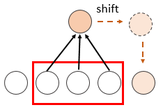
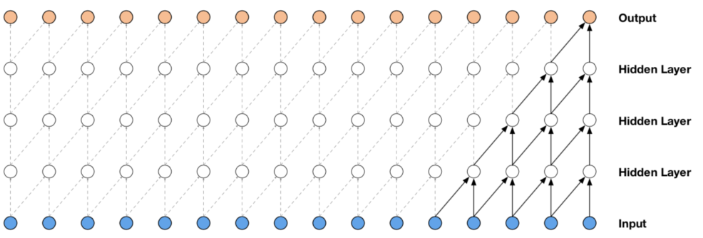
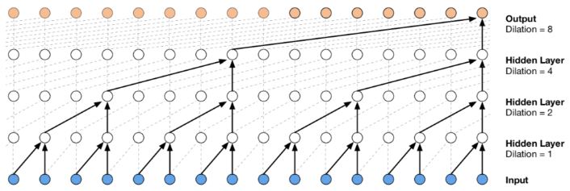
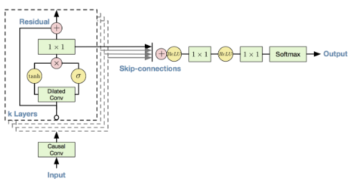

### 自回归模型简介（二）：WaveNet

***

【**参考资料**】

cs231n 2018  [Lecture 20: Reversible and Autoregressive Models](https://www.cs.toronto.edu/~rgrosse/courses/csc321_2018/slides/lec20.pdf)

[WaveNet: A Generative Model for Raw Audio](https://deepmind.com/blog/article/wavenet-generative-model-raw-audio)

[How WaveNet Works](https://towardsdatascience.com/how-wavenet-works-12e2420ef386)

【**参考代码**】

[Introduction to WaveNet](https://github.com/ultimatist/WaveNet/blob/master/AAPL_WaveNet_SOL.ipynb)

**WaveNet** 是用来生成音频的自回归模型，它作用在音频信号的原始波形上（raw audio）。原始音频信号由一大堆采样点构成，通常每秒有 16, 000 个采样点或更多。

WaveNet 的结构和 PixelCNN 很像，但是它的卷积核是一维的。WaveNet 主要由一系列 causal convolution 堆叠组成。Causal convolution 的输出只与过去的值有关，在 PixelCNN 中，主要通过 masked convolution 的形式实现；而对于一维的音频数据，则只要将输出向后移位几个 time step 即可。

WaveNet 是一个全卷积网络：

使用卷积的缺点在于，卷积的感受野都是受限的，而音频数据的序列又通常都很长。为了扩大感受野，WaveNet 中采用了 dilated convolution，并且 dilation 从下往上依次增大：

WaveNet 的卷积 block 依次采用 1，2，……，512 的 dilation，所以在这个 block 的最后一层的单元拥有长度为 1024 或 64 ms 的感受野。接着再将这些 block 堆叠，得到的总共的 context 长度大概有 300 ms 。

另外，WaveNet 中使用了 gated activation 来代替原来的 Relu，这种激活形式在音频生成任务中具有较好的效果：
$$
\mathbf{z}=\tanh \left(\mathbf{W}_{f, k} \cdot \mathbf{x}\right) \odot \sigma\left(\mathbf{W}_{g, k} \cdot \mathbf{x}\right)
$$
其中 $\cdot$ 代表卷积，$\oplus$ 代表 element-wise 的相乘。这个激活函数的形式和 LSTM 中的 gate 很像，因此叫 gated activation 。

WaveNet 中还使用了 residual connection 和 skip-connection：

这里的 residual connection 是指普通的残差链接，即将某一层的输入加到输出上；skip-connection 是指将某一层的输出直接连接到最后，作用相当于是将多层的输出进行了 ensemble 来参与预测。