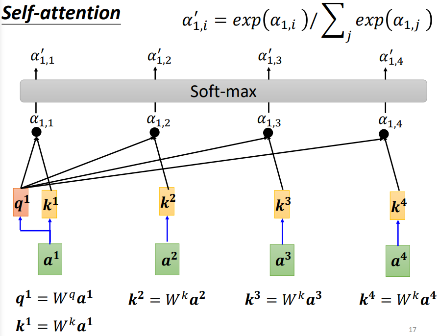
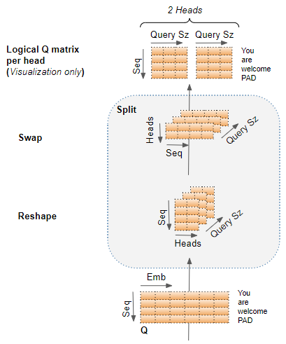

## 详解Self-attention与Transformer

【**参考文献**】

[李宏毅机器学习2021春](https://speech.ee.ntu.edu.tw/~hylee/ml/2021-spring.html)

[The Illustrated Transformer](https://jalammar.github.io/illustrated-transformer/)

[Transformers Explained Visually (Part 3): Multi-head Attention, deep dive](https://towardsdatascience.com/transformers-explained-visually-part-3-multi-head-attention-deep-dive-1c1ff1024853)

### Self-attention

Self-attention会计算输入序列中指定位置的vector与其他位置的vector之间的相关关系，然后以此进行聚合得到新的输出。

**Self-attention有两种形式：Dot-product 式和 Additive 式，Transformer 结构中使用的是前者**，而后者使用在类似 GAT 的网络结构中。

（*上图中的 `+` 代表 concatenate 操作*）

#### 基本layer

对于输入序列的某个位置的 vector（如下图中的$a^1$），Self-attention layer 首先计算它与其它其他位置的 vector 之间的相关系数（包括自身），**具体步骤**如下：

* 对于当前的目标位置，使用一个**参数矩阵** $W^q$ 对输入进行一次线性变换，变换后的结果称为 **query vector**；
* 对于序列中的其它位置（计算的时候包括自身），使用另一个**参数矩阵** $W^k$ 对输入进行线性变换，变换后的结果称为 **key vector**；
* 目标位置的 **query vector** 与所有位置的 **key vector** 做**点积**，得到对应的 attention 系数；
* 使用 softmax 对 attention 系数进行**归一化**（实际操作中还要除以向量的维度进行归一化）；

*对于自己和自己做 attention 的个人理解是为了在立足自身的前提下聚合起其他位置的信息，否则只使用其他位置的信息来替代可能会造成信息的损失。*

得到 attention 系数后，再进行各个位置信息的聚合，**具体步骤**如下：

* 使用一个**参数矩阵**$W^v$，对各个输入进行线性变换，变换后结果称为 **value vector**；
* **利用 attention 系数对 value vector 进行加权求和**，得到目标输出。

对于每个位置，self-attention layer 都进行相同的计算，并且三个参数矩阵 $W^q, W^k, W^v$ 在所有位置间共享，因此整个前传过程可以写成矩阵形式：
$$
Q = W^q I \\
K = W^k I \\
V = W^v I \\
A = K^T Q \\
A^\prime = \operatorname{softmax}(A) \\
O = V A^\prime
$$
其中 $I$ 是输入矩阵。

为便于理解，用图例表示的前传过程如下：

**第一步：计算每个位置的 query，key 和 value**

**第二步：计算attention系数并归一化**

**第三步：根据attention系数计算输出**

------

**并行化特点：**

**因为 self-attention layer 对于所有位置都执行相同的计算，与输入的顺序无关，不需要像 RNN 那样等待上一个 hidden 输出计算完毕后才能计算下一个，所以可以进行并行计算。**

------

#### Multi-head

为了增强特征表达能力，可以并行使用多个 self-attention 模块，类似于 CNN 中使用多个卷积核。**直觉上理解，可以认为每个 self-attention 模块（即一组 $W^q,W^k,W^v$）学习一种相关关系，而多个 self-attention 模块就可以学习多种不同层面的相关关系。**

具体实现时，是将参数矩阵划分成数块，每块对应一个 head：

这样可以通过一次前传就得到所有head的输出。为方便计算还要进行reshape等操作：

不同 head 得到的输出会 concat 成一个大的向量，**最后再通过一次线性变换 $W^O$ 得到最终的输出结果**，全部过程如下：

#### Positional Encoding

与RNN不同的是，Self-attention 中没有包含序列的位置信息，而位置信息对于某些任务是比较重要的，例如在 NLP 中，名词往往会跟在动词后面出现等等。为了弥补位置信息的缺失，在self attention的输入侧加入了 positional encoding 的概念。

Positional encoding 一般是一个人为定义的（当然也可以让网络学出来）、按照一定函数关系生成的 embedding，每个位置都有一个独特的 positional encoding。每个position encoding都使用加和的方式直接加到对应的输入上。

#### V.S. CNN

**Self-attention 与 CNN 的比较：**

* CNN 可以视作一种特殊的 self-attention，即只关注某个局部区域的 attention。
* Self-attention 可以视作一种具有 learnable 的 receptive filed 的 CNN，即一种更复杂的 CNN。

* 在大规模数据下，self-attention 的效果更好；而在小规模数据下，CNN 的效果更好。

#### V.S. RNN

**Self-attention 与 RNN 的比较：**

* RNN 一般只考虑当前位置之前的信息（双向RNN除外），而 self-attention 会考虑序列中所有位置的信息；
* RNN 容易产生长程遗忘的问题，在诸如 LSTM 的设计中，memory 是逐渐累积的，因此当序列较长时，前面的信息就容易被遗忘；
* RNN 不能并行，必须要等上一结果计算完成才能开始下一结果的计算，而 self-attention 可以并行。

### Transformer

Transformer 是一个 encoder-decoder 结构，一般用来处理 sequence-to-sequence 的问题。

#### Encoder

Transformer 的 encoder 由多个相同的 block 堆叠而成，每个block包括：

* **Multi-head self-attention 模块**；
* **残差连接**（即 Add）；
* **Layer Norm**（即 Norm）；
* **全连接网络**：将 attention 的输出作为输入

一个block的具体结构如下：

#### Decoder

Decoder 的结构与 encoder 大致相同，也是由若干个 block 组成。

（下图中红框内即 decoder 的部分。）

与 encoder 相比 decoder 独有的部分在于：

* **Masked multi-head self-attention**：实际上与 encoder 的 self-attention 部分相同，只不过在进行自回归式的输出时，需要将之前的输出结果作为输入来得到新的输出结果，因此需要使用一个mask来将目标位置之后的部分给遮住。

* **Encoder-decoder attention**：该模块的目的是整合encoder的输出信息。具体做法是在计算 attention 系数时，**将 encoder 输出的各个位置的 key 与 decoder 各个位置的 query 进行点积**：

  

最后再通过一层全连接与 softmax 得到最终的预测概率。