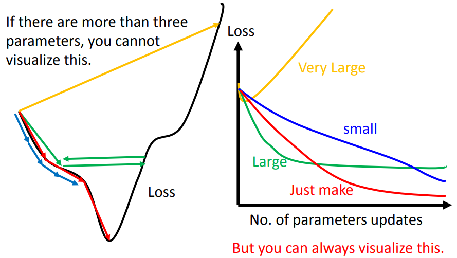
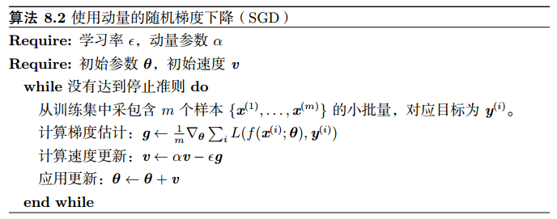
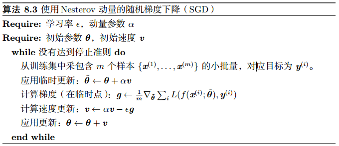
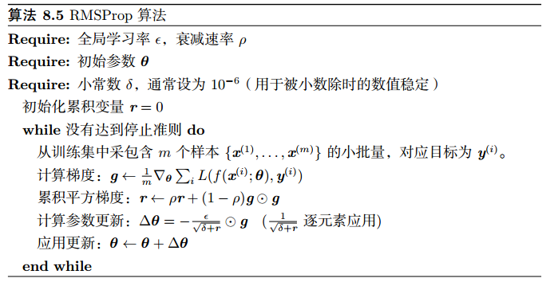
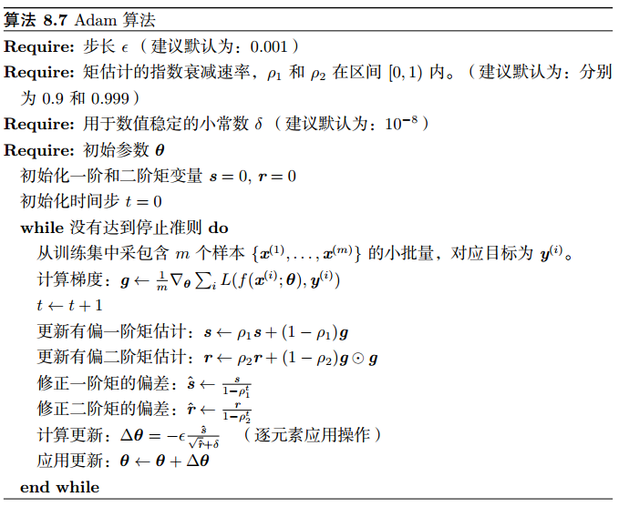

## SGD及其变体

### 0. 参考资料

李宏毅的deep learning课程中对应部分：

[Gradient Descent](http://speech.ee.ntu.edu.tw/~tlkagk/courses/ML_2016/Lecture/Gradient%20Descent%20(v2).pdf)

[Tips for Deep Learning](http://speech.ee.ntu.edu.tw/~tlkagk/courses/ML_2016/Lecture/DNN%20tip.pdf)

Sebastian Ruder 的博客
[An overview of gradient descent optimization algorithms](http://ruder.io/optimizing-gradient-descent/index.html#fnref16)

Ian Goodfellow等《Deep Learning》书中第八章

### 1. 为什么要使用SGD

这个问题分为两个层面：第一、深度神经网络所使用的优化算法大都是基于梯度下降的一阶方法，而不是例如牛顿法的二阶方法；第二、实际操作中使用的不是每次迭代都考虑所有样本的batch gradient descent，而是小批量的mini-batch gradient gradient。

首先，为什么只用一阶优化方法，不用二阶方法呢？最主要的原因是**鞍点**的存在。

对于很多高维非凸函数而言， 局部极小值（以及极大值）事实上都远少于另一类梯度为零的点： 鞍点。 在鞍点处， Hessian 矩阵同时具有正负特征值。 多类随机函数表现出以下性质：**低维空间中， 局部极小值很普遍。在更高维空间中， 局部极小值很罕见，而鞍点则很常见**。 

为了更直观地理解，Deep learning书中举了这样一个例子：试想Hessian 矩阵每个特征值的正负号由抛硬币决定，在一维情况下，很容易抛硬币得到正面朝上一次而获取局部极小点。在 n-维空间中，要抛掷n次硬币都正面朝上的难度是指数级的。

 通常来讲，局部极小值具有低代价的可能性比高代价要大得多。具有高代价的临界点更有可能是鞍点。具有极高代价的临界点就很可能是局部极大值了。所以，**收敛到局部极小值通常问题不大，但收敛到鞍点会导致较大地loss**。 

对于只使用梯度信息的一阶优化算法而言，实验中梯度下降似乎可以在许多情况下逃离鞍点。但是对于牛顿法而言，鞍点显然是一个问题。

梯度下降旨在朝 ‘‘下坡’’ 移动，而非明确寻求临界点。而牛顿法的目标是寻求梯度为零的点。如果没有适当的修改， 牛顿法就会跳进一个鞍点。**高维空间中鞍点的激增或许解释了在神经网络训练中为什么二阶方法无法成功取代梯度下降**。

 其次，是为什么使用mini-batch gradient descent。主要原因是**使用全部的数据集计算代价太大，以及训练集中可能存在的冗余**。

每次迭代只使用一个样本的方法被称为stochastic gradient descent（SGD）。所谓mini-batch，就是每次使用一个以上，但又不是全部的训练样本。使用mini-batch的原因是为了**充分发挥计算机多核并行计算的能力**。

在某些硬件上使用特定大小的数组时，运行时间会更少。**尤其是在使用GPU时**，通常使用 2的幂数作为批量大小可以获得更少的运行时间。一般，2的幂数的取值范围是32到256，16 有时在尝试大模型时使用。 

### 2. 应用SGD的关键问题

应用SGD的关键问题是学习率的调整。如果学习率太小，那么SGD的收敛会很慢（对应下图中蓝色曲线）；如果学习率太大，那么优化会在极小值点附近来回震荡，使得loss难以进一步下降（对应下图绿色曲线）；如果学习率太大，那么loss值会反而增大（对应下图黄色曲线）。

通常来讲，我们会随着迭代的增加不断减小学习率，比如我们假设当前迭代步数为$k$，初始学习率为$\epsilon$，那么可以用以下的学习率衰减策略：
$$
\epsilon_t = \frac{\epsilon}{\sqrt{t+1}} \tag{2.1}
$$
或者，也可以使学习率线性衰减，直到第$\tau$次迭代：
$$
\epsilon_k = (1-\alpha)\epsilon + \alpha\epsilon_{\tau}
$$
其中$\alpha=k/\tau$。在$\tau$步迭代之后，一般使学习率保持常数。

### 3. 动量

#### 3.1 Momentum

SGD的优化过程有时会比较慢，或者困在局部极小点，解决方法之一是使用**动量（momentum）**。Momentum引入了新的变量$v$来充当“惯性”或者“速度”的角色。使用momentum的SGD算法更新时使用上一步的动量减去当前的梯度（即加上负梯度）。

动量$v$被定义为之前所有梯度的加权和：
$$
\boldsymbol { v } \leftarrow \alpha \boldsymbol { v } - \epsilon \nabla _ { \boldsymbol { \theta } } \left( \frac { 1 } { m } \sum _ { i = 1 } ^ { m } L \left( f \left( \boldsymbol { x } ^ { ( i ) } ; \boldsymbol { \theta } \right) , \boldsymbol { y } ^ { ( i ) } \right) \right)
$$
这里$\nabla _ { \boldsymbol { \theta } } \left( \frac { 1 } { m } \sum _ { i = 1 } ^ { m } L \left( f \left( \boldsymbol { x } ^ { ( i ) } ; \boldsymbol { \theta } \right) , \boldsymbol { y } ^ { ( i ) } \right) \right)$就是当前梯度，而$v$累积了之前所有梯度。相对于$\epsilon$，$\alpha$越大，之前梯度对现在方向的影响也越大。

完整的带有动量的SGD算法如下：

 

在实践中，**$\alpha$的一般取值为0.5，0.9和0.99**。和学习率一样， $\alpha$也会随着时间不断调整。一般初始值是一个较小的值，随后会慢慢变大。随着时间推移调整$\alpha$没有收缩$\epsilon$重要。

直观上，momentum的效果如下（注意梯度负方向）：

#### 3.2 Nesterov动量

也叫Nesterov加速梯度算法（Nesterov accelerated gradient，NAG），是动量算法的一个变种。更新规则如下：
$$
\begin{array} { l } { \boldsymbol { v } \leftarrow \alpha \boldsymbol { v } - \epsilon \nabla _ { \boldsymbol { \theta } } \left[ \frac { 1 } { m } \sum _ { i = 1 } ^ { m } L \left( f \left( \boldsymbol { x } ^ { ( i ) } ; \boldsymbol { \theta } + \alpha \boldsymbol { v } \right) , \boldsymbol { y } ^ { ( i ) } \right) \right] } \\ { \boldsymbol { \theta } \leftarrow \boldsymbol { \theta } + \boldsymbol { v } } \end{array}
$$
Nesterov动量和标准动量之间的区别体现在梯度计算上。Nesterov动量中，梯度计算在施加当前速度之后。因此，Nesterov动量可以解释为往标准动量方法中添加了一个校正因子。 

完整的算法如下：

### 4. 自适应学习率

#### 4.1 AdaGrad

完整的AdaGrad算法如下：

下面我们来进行简单的推导的讨论。

由式（2.1）可以得到普通的、使用学习率衰减的SGD的更新规则：
$$
\theta_{t+1} \longleftarrow \theta_{t}-\epsilon_t g_t
$$
在此基础上，AdaGrad的做法是把学习率除以之前所有梯度的均方根，其更新规则如下：
$$
\theta_{t+1} \longleftarrow \theta_{t}-\frac{\epsilon_t}{\sigma_t} g_t \tag{4.1}
$$
其中$\sigma_t=\sqrt{\frac{1}{t+1} \sum_{i=0}^{t}(g_i)^2}$。注意到式（4.1）的分号中分子分母有公因子$\sqrt\frac{1}{t+1}$，经过整理以后，得到：
$$
\theta_{t+1} \longleftarrow \theta_{t}-\frac{\epsilon}{\sqrt{\sum_{i=0}^{t}(g_i)^2}} g_t \tag{4.2}
$$
AdaGrad是有一定理论依据的。以二次函数为例，在曲线上任意一点处，我们能够一次到达极小值点的最佳步长是$\left| x _ { 0 } + \frac { b } { 2 a } \right|$。

可以将这个步长改写为$\frac { \left| 2 a x _ { 0 } + b \right| } { 2 a }$，它代表的涵义是，最佳步长是一次梯度除以二次梯度的结果。在实际操作中，直接计算二次梯度是很复杂的，而AdaGrad所做的，就是用一次梯度来估计二次梯度。式（4.2）中，分子下的求和项${\sqrt{\sum_{i=0}^{t}(g_i)^2}}$就是对二次梯度的估计。直观上，我们可以理解为AdaGrad是在对一次梯度进行采样来反映二次梯度的大小。二次梯度越大，那么我们采样得到的一次梯度的求和就会比较大，如下图所示：

#### 4.2 RMSProp

AdaGrad有时会收敛太快，导致在找到局部极小附近之前学习率就已经很小了。RMSProp是AdaGrad的改进版本，它将梯度积累变为指数加权的移动平均。其参数更新规则为：
$$
\theta_{t+1} \longleftarrow \theta_{t}-\frac{\epsilon}{\sigma_t} g_t \tag{4.3}
$$
其中$\sigma ^ { t } = \sqrt { \alpha \left( \sigma ^ { t - 1 } \right) ^ { 2 } + ( 1 - \alpha ) \left( g ^ { t } \right) ^ { 2 } }$。

相比于AdaGrad，RMSProp使用移动平均引入了一个新的超参数$\alpha$。 

完整算法如下：

#### 4.3 Adam

Adam可以看作是RMSProp和Momentum的结合体。完整算法如下：

其中一阶和二阶矩变量分别对应了momentum和RMSProp。Adam还对一阶和二阶矩的估计进行了修正。

### 5.  优化算法的选择

各优化算法可视化的结果（来自http://ruder.io/optimizing-gradient-descent/index.html#fnref16）：

* 寻找极小值点

* 在鞍点处的表现

在优化算法的选择上，目前学术界仍没有明确的共识，这**很大程度上取决于实际操作中算法的具体表现**。

一般来讲，我们会在纯粹的SGD、momentum和Adam三者之间进行选择。前两者都需要手动调整学习率，而以Adam为代表的自适应学习率方法则不需要。目前来看，Adam是最佳的选择，但情况也不绝对。有些paper只使用纯粹的SGD配合其他初始化或学习率衰减策略，也能达到很好的结果。

如果输入数据是稀疏的，那么自适应算法有大可能会取得最好的效果。或者如果我们在意的是快速收敛和训练较深较复杂的网络，我们会选择自适应算法。在自适应算法中，RMSProp是AdaGrad的改进版本，其目的在于解决AdaGrad的学习率过快衰减的问题。类似的算法还有Adadelta。在RMSProp的基础上，Adam加入了矩估计的校正和动量。事实上，所有的自适应算法表现都差不多，Adam是其中最杰出的代表。

