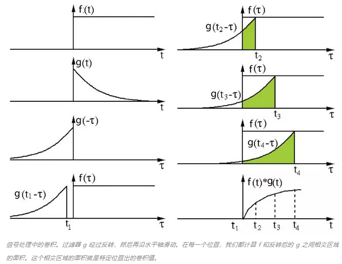
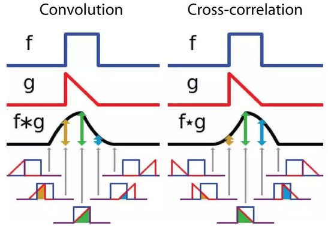
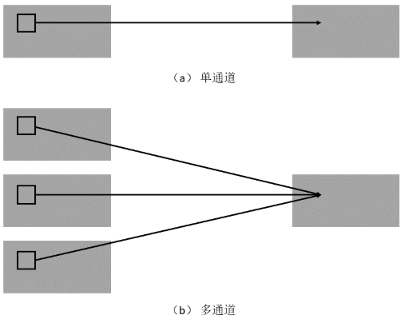
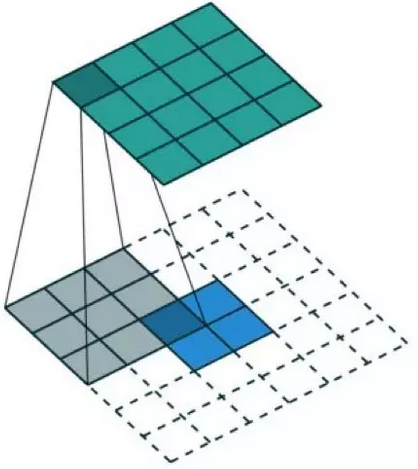
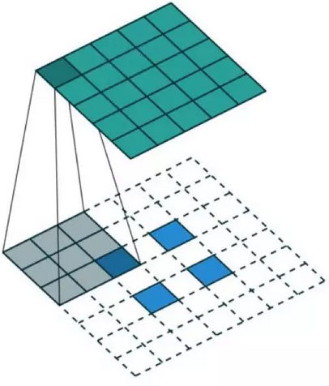
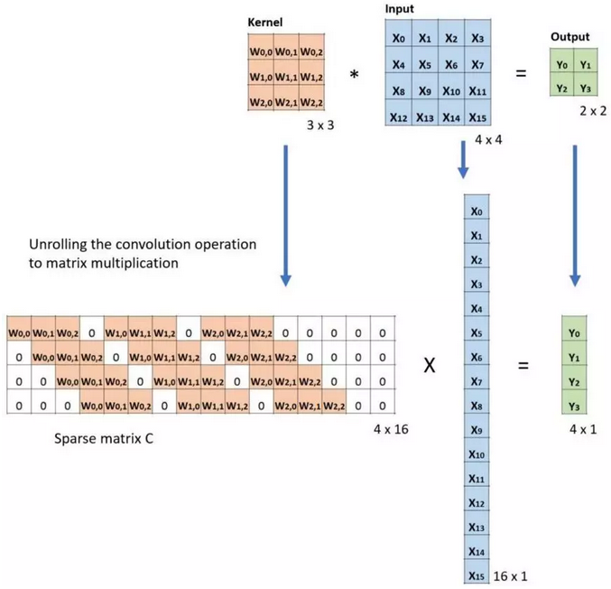
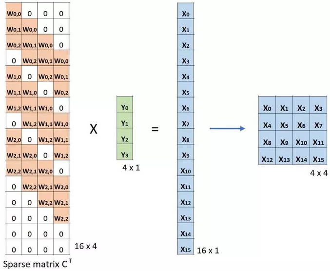
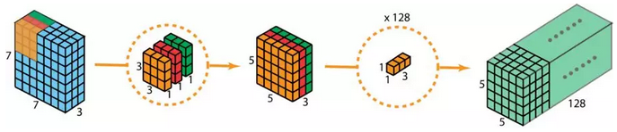
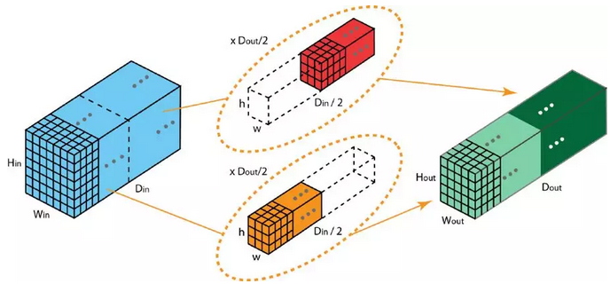

### 深度学习中的各种卷积

***

【参考资料】

机器之心	[卷积有多少种？一文读懂深度学习中的各种卷积](https://mp.weixin.qq.com/s/Olliwe3ux77H4Vlsn4IrCw)

DeepLearning-500-questions     [第五章 卷积神经网络（CNN）](https://github.com/scutan90/DeepLearning-500-questions/blob/master/ch05_%E5%8D%B7%E7%A7%AF%E7%A5%9E%E7%BB%8F%E7%BD%91%E7%BB%9C(CNN)/%E7%AC%AC%E4%BA%94%E7%AB%A0%20%E5%8D%B7%E7%A7%AF%E7%A5%9E%E7%BB%8F%E7%BD%91%E7%BB%9C%EF%BC%88CNN%EF%BC%89.md)

#### 1. 卷积与互相关的数学定义

在信号/图像处理领域，卷积的定义是：
$$
( f * g ) ( t ) = \int _ { - \infty } ^ { \infty } f ( \tau ) g ( t - \tau ) d \tau
$$
其定义是两个函数中一个函数经过反转和位移后再相乘得到的积的积分。下面的可视化展示了这一思想：

这里，函数$g$是过滤器。它被反转后再沿水平轴滑动。在每一个位置，我们都计算$f$和反转后的$g$之间相交区域的面积。这个相交区域的面积就是特定位置出的卷积值。

严格意义上来说，深度学习中使用的卷积实际上不是上面这种形式，而是另一种被称为**互相关**（cross-correlation）的操作。互相关是两个函数之间的滑动点积或滑动内积。互相关中的过滤器不经过反转，而是直接滑过函数$f$。$f$ 与$g$之间的交叉区域即是互相关。下图展示了卷积与互相关之间的差异。

在深度学习中，卷积中的过滤器不经过反转。所以我们本质上是执行逐元素乘法和加法。但在深度学习中，直接将其称之为卷积更加方便。这没什么问题，因为过滤器的权重是在训练阶段学习到的。如果上面例子中的反转函数$g$是正确的函数，那么经过训练后，学习得到的过滤器看起来就会像是反转后的函数$g$。因此，在训练之前，没必要像在真正的卷积中那样首先反转过滤器。

#### 2. 各种卷积

##### 2.1 普通卷积

普通2D卷积即如下图所示，使用一个固定大小的滤波器，对图像进行加权提特征。 

上面只是单通道的情况。实际在CNN中，我们做的是多通道卷积，操作的对象是一个三维的张量，包含（高、宽、通道），只不过我们不在通道维度上滑动卷积核，所以实质上还是在处理空间维度的2D信息。

##### 2.2 3D卷积

2D卷积的推广，多加了一个表示长度的维度（通常代表序列长度），处理的对象变成四维张量。3D卷积在视频处理技术中应用最多，这是新加的第四维度代表的就是视频的时间长度。

##### 2.3 空洞卷积

空洞卷积（dilated convolution），又称为扩张卷积（atrous convolution），常见于语义分割任务中。

直观而言，扩张卷积就是通过在核元素之间插入空格来使核「膨胀」。新增的参数$l$（扩张率）表示我们希望将核加宽的程度。具体实现可能各不相同，但通常是在核元素之间插入 $l-1$个空格。

**使用空洞卷积的好处是在参数不变的情况下，增大了感受野**。我们来看堆叠空洞卷积后对感受野的增加效果，如下图：

图（a）对应$3\times 3$的1-dilated conv，和普通的卷积操作一样。然后在上面堆叠一个$3\times 3$的2-dilated conv，即图（b）的情况。考虑到这个2-dilated conv的前一层是一个1-dilated conv，图（b）中的每个红点就是1-dilated的卷积输出，其单独的感受野为$3\times 3$，再加上第二层2-dilated conv，整体的感受野大小增加到$7 \times 7$。注意这个过程中只有9个红色点发生卷积操作，卷积核的参数数量并没有改变，但是感受野扩大了（如果第二层仍然使用普通卷积，感受野大小是$5 \times 5$）。同理，图（c）中使用的是4-dilated conv操作，跟在两个1-dilated和2-dilated conv的后面，能达到$15 \times 15$的感受野。而传统的三个普通卷积核堆叠，只能达到$7 \times 7$的感受野大小。

##### 2.4 转置卷积

转置卷积，又称为解卷积、反卷积（de-convolution），主要用于上采样。传统的卷积操作过后原图像的大小会减小（在不做padding的情况下），而转置卷积过后图像的大小会增大。可以使用直接的卷积实现转置卷积。对于下图的例子，我们在一个$2 \times 2$的输入（周围加了$2 \times 2$的单位步长的零填充）上应用一个$3\times 3$核的转置卷积。上采样输出的大小是 $4 \times 4$。

通过应用各种填充和步长，我们可以将同样的$2 \times 2$输入图像映射到不同的图像尺寸。下面，转置卷积被用在了同一张$2 \times 2$ 输入上（输入之间插入了一个零，并且周围加了$2\times 2$ 的单位步长的零填充），所得输出的大小是$5 \times 5$。

我们可以从矩阵乘法的角度来理解转置卷积。定义$C$为卷积核，$Large$为输入图像，$Small$为输出图像。经过卷积（矩阵乘法）后，我们将大图像下采样为小图像，即$C \times Large = Small$。

下面的例子展示了这种运算的工作方式。它将输入平展为$16×1$的矩阵，并将卷积核转换为一个稀疏矩阵（$4 \times 16$）。然后，在稀疏矩阵和平展的输入之间使用矩阵乘法。之后，再将所得到的矩阵（$4 \times 1$）转换为$ 2 \times 2​$的输出。

对于转置卷积来说，是将小图像上采样为大图像，这时我们把小图像乘上矩阵$C$的转置，即$C^T \times Small=Large$。如下图所示

这就是名称“转置卷积”的由来。

##### 2.5 1×1卷积

1×1卷积只对通道维度进行操作，其作用主要有两个方面：

* 实现信息的跨通道交互和整合;
* 对卷积核通道数进行降维和升维，减小参数量。

第一点不难理解，关于第二点，典型例子是Inception和ResNet结构。当输入和输出的通道数很大时，直接进行卷积，卷积核的参数量也会变的很大；而加入1×1卷积后，可以降低输入的通道数，因此卷积核参数、运算复杂度也就大幅度下降。

##### 2.6 可分离卷积

在普通卷积中，$3 \times 3$卷积核直接与图像卷积；在可分离卷积中，$ 3 \times 3$的核被拆解为$3 \times 1$和$1 \times 3$的核，图像先与$3 \times 1$核做卷积，再与$1 \times 3$核做卷积。这样，执行同样的操作时仅需 6 个参数，而不是 9 个。

引入可分离卷积的目的是为了减少参数。如果给两个拆解后的核都应用激活函数，这样做也能增加非线性。

在视频处理中常常会见到可分离卷积的情况，做法是将3D卷积拆解为2D的空间卷积和1D的时间卷积。不过使用可分离卷积限制了卷积核搜索空间的大小，有时会得到次优的结果，所以并非是所有场合都使用可分离卷积。

##### 2.7 深度可分卷积

深度可分卷积应用在MobileNet和Xception等模型中，在Xception中，它也被称为depth-wise convolution。深度可分卷积包括对每个通道独立使用的卷积和$1 \times 1$卷积两部分。

一般卷积过程中，单个卷积核是对所有通道都进行卷积：

在上图中，我们使用了128个$3 \times 3 \times 3$的卷积核来得到128通道的输出图像。深度可分卷积的做法则是将一个$3 \times 3 \times 3$拆成3个$3 \times 3$的卷积，然后每个卷积核对应每个通道独立进行卷积：

在这种情况下，我们实际上只进行了空间上的下采样，而没有进行通道维度上的关联。为了提高深度，深度可分卷积在第二步使用128个$1 \times 1$的卷积核，来得到最终128通道的输出图像。

深度可分卷积的完整过程如下：

这样做的目的当然是为了减少参数，所以深度可分卷积常常被应用在移动端部署的模型上。不过深度可分卷积会降低卷积中参数的数量。因此，对于较小的模型而言，如果用深度可分卷积替代 2D 卷积，模型的能力可能会显著下降。因此，得到的模型可能是次优的。但是，如果使用得当，深度可分卷积能在不降低模型性能的前提下实现效率提升。

##### 2.8 群卷积

群卷积（group convolution）最早出现在AlexNet中，目的是为了实现在两块GPU上并行计算。在群卷积中，过滤器会被分为不同的组。每一组都负责特定深度的典型 2D 卷积。如下图所示：

上图展示了具有两个过滤器分组的群卷积。在每个过滤器分组中，每个过滤器的深度仅有名义上的 2D 卷积的一半。它们的深度是 Din/2。每个过滤器分组包含 Dout/2 个过滤器。第一个过滤器分组（红色）与输入层的前一半（[:, :, 0:Din/2]）卷积，而第二个过滤器分组（橙色）与输入层的后一半（[:, :, Din/2:Din]）卷积。因此，每个过滤器分组都会创建 Dout/2 个通道。整体而言，两个分组会创建 2×Dout/2 = Dout 个通道。然后我们将这些通道堆叠在一起，得到有 Dout 个通道的输出层。

上一节提及的深度可分卷积实际上是群卷积的特殊情形。应用群卷积的典型模型是ResNeXt。

群卷积的优点如下：

* **训练高效**。因为卷积被分成了多个路径，每个路径都可由不同的 GPU 分开处理，所以模型可以并行方式在多个 GPU 上进行训练。相比于在单个 GPU 上完成所有任务，这样的在多个 GPU 上的模型并行化能让网络在每个步骤处理更多图像。人们一般认为模型并行化比数据并行化更好。后者是将数据集分成多个批次，然后分开训练每一批。但是，当批量大小变得过小时，我们本质上是执行随机梯度下降，而非批梯度下降。这会造成更慢，有时候更差的收敛结果。

* **模型更高效**，即模型参数会随过滤器分组数的增大而减少。

* **使用群卷积的模型的表征能力也许更强**。可能的解释原因是网络的参数数量得到了减少，更不容易过拟合，在这里群卷积起到了类似正则化的效果。此外，每个过滤器分组都会学习数据的一个独特表征。正如 AlexNet 的作者指出的那样，过滤器分组似乎会将学习到的过滤器结构性地组织成两个不同的分组——黑白过滤器和彩色过滤器。

  

  

