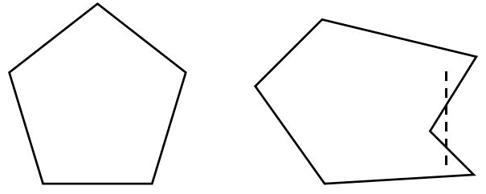
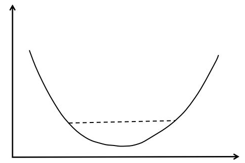
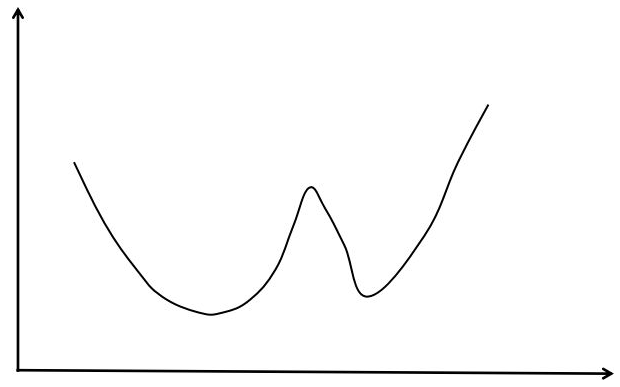
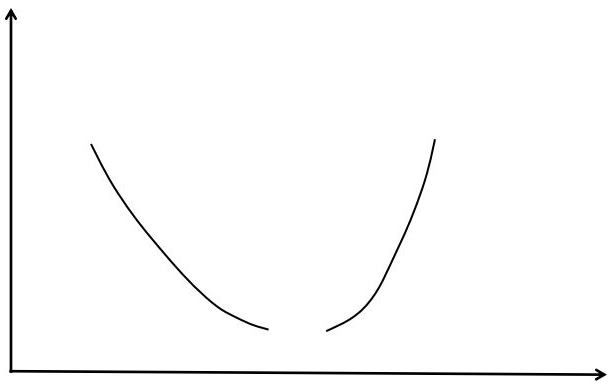

### 凸优化的基本介绍

凸优化理论是最优化理论中最重要的组成部分，大多数经典的机器学习模型实际上都是在求解凸优化问题，比如线性回归、logistics回归和SVM等。凸优化问题的优势在于，其局部最优解就是全局最优解。因此，对于一个凸优化问题，我们总能找到它的全局最优解，而不用担心陷入局部最优的情况，使得凸优化问题的求解相对比较容易。

本笔记将主要介绍凸优化的一些基本概念，包括凸集、凸函数和凸优化问题的定义。主要参考如下资料：

[理解凸优化](https://zhuanlan.zhihu.com/p/37108430)

#### 1. 凸集

凸集的定义是：对于n维空间中点的集合C，如果对集合中的任意两点x和y，以及实数$0 \leq \theta \leq 1$，都有
$$
\theta x + ( 1 - \theta ) y \in C \tag{1.1}
$$
式（1.1）的意义是，一个凸集中任意两点之间的线段必定也在该集合内。从几何意义上来说，凸集的边界是凸的，没有凹进去的地方。

下图是凸集（左）和非凸集（右）的示意图

     
    <figcaption>from https://zhuanlan.zhihu.com/p/37108430</figcaption>

实际问题中几个常见的凸集的例子:

1）全空间$R^{n}$

显然，$n$维实向量空间$R^{n}$是一个凸集。这一结论的意义在于，如果一个优化问题不带任何约束（即可行域为$R^{n}$），那么其可行域是一个凸集。

2）仿射子空间

给定$m$行$n$列的矩阵$A$和$m$维向量$b$，仿射子空间定义为如下向量的集合：
$$
\left\{ x \in R ^ { n } : A x = b \right\}
$$
它对应于非齐次线性方程组的解空间。

不难证明，仿射子空间是一个凸集。这一结论的意义在于，如果一组约束是线性等式约束，那么它定义的可行域是一个凸集。

3）多面体

多面体定义为：
$$
\left\{ x \in R ^ { n } : A x \leq b \right\}
$$
它是多个线性不等式围成的区域。多面体也是一个凸集，这一结论的意义在于，如果一组约束是线性不等式约束，则它定义的可行域是一个凸集。

一个重要的结论是：多个凸集的交集还是交集。即假设$ C _ { 1 } , \dots , C _ { k }$是凸集，那么它们的交集$\bigcap _ { i = 1 } ^ { k } C _ { i }$仍是凸集。

这一结论的意义在于，对于多个约束的情况，如果每个等式或者不等式约束条件定义的可行域都是凸集，那么这些条件联合起来定义的可行域还是凸集。

#### 2. 凸函数

在函数定义域内，如果对于任意$x$和$y$，以及实数$0\leq\theta\leq1$，都满足以下条件：
$$
f ( \theta x + ( 1 - \theta ) y ) \leq \theta f ( x ) + ( 1 - \theta ) f ( y )
$$
则称该函数为凸函数。

凸函数的几何意义是“弦在曲线上”，即连接函数曲线上任意两点的线段都在函数曲线的上方，如下图所示：

     
    <figcaption>from https://zhuanlan.zhihu.com/p/37108430</figcaption>

如把上式中的不等号去掉，即：
$$
f ( \theta x + ( 1 - \theta ) y ) < \theta f ( x ) + ( 1 - \theta ) f ( y )
$$
则称函数是严格凸函数。

几个重要的概念

1）凸函数的一阶判定规则为：
$$
f ( y ) \geq f ( x ) + \nabla f ( x ) ^ { T } ( y - x )
$$
其几何解释是函数在任何点处的切线都位于函数的下方。

2）凸函数的二阶判定规则是其Hessian矩阵为半正定矩阵，即：
$$
\nabla ^ { 2 } f ( x ) \succeq 0
$$
3）凸函数的非负线性组合是凸函数

假设$f _ { i }$是凸函数，并且$W _ { i } \geq 0$，则：
$$
f ( x ) = \sum _ { i = 1 } ^ { k } w _ { i } f _ { i } ( x )
$$
为凸函数。

4）下水平集

给定一个凸函数以及一个实数 $\alpha$ ，函数的$\alpha$下水平集（sub-level set）定义为函数值小于等于$\alpha$的点构成的集合：
$$
\{ x \in D ( f ) : f ( x ) \leq \alpha \}
$$
根据凸函数的定义，很容易证明该集合是一个凸集。这个概念的用途在于我们需要确保优化问题中一些不等式约束条件定义的可行域是凸集，如果是凸函数构成的不等式，则是凸集。

#### 3. 凸优化

有了凸集和凸函数的定义之后，我们就可以给出凸优化的定义。如果一个最优化问题的可行域是凸集，并且目标函数是凸函数，则该问题为凸优化问题。

凸优化问题的另一种通用写法是：
$$
\begin{array} { c l } { \min _ { x } } & { f _ { 0 } ( x ) } \\ { \text { s.t. } } & { g _ { i } ( x ) \leq 0 , \quad i = 1 , \ldots , m } \\ { } & { h _ { i } ( x ) = 0 , \quad i = 1 , \ldots , p } \end{array}
$$
其中$g_{i}(x)$是不等式约束函数，为凸函数；$h_{i}(x)$是等式约束函数，为仿射函数。

之所以凸优化问题的定义要求目标函数是凸函数而且优化变量的可行域是凸集，是因为缺其中任何一个条件都不能保证局部最优解是全局最优解。下面来看两个反例。

情况1：可行域是凸集，函数不是凸函数。这样的例子如下图所示：

     
    <figcaption>from https://zhuanlan.zhihu.com/p/37108430</figcaption>

上图中优化变量的可行域是整个实数集，显然是凸集，目标函数不是凸函数，有两个局部最小值，这不能保证局部最小值就是全局最小值。

情况2：可行域不是凸集，函数是凸函数。这样的例子如下图所示：

     
    <figcaption>from https://zhuanlan.zhihu.com/p/37108430</figcaption>

在上图中可行域不是凸集，中间有断裂，目标函数还是凸函数。在曲线的左边和右边各有一个最小值，不能保证局部最小值就是全局最小值。