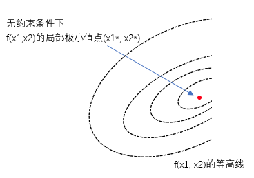
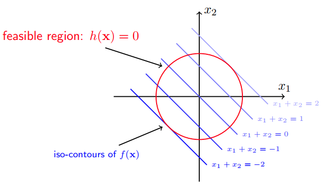
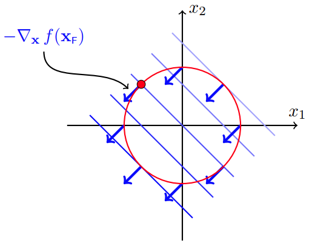
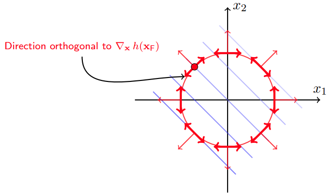
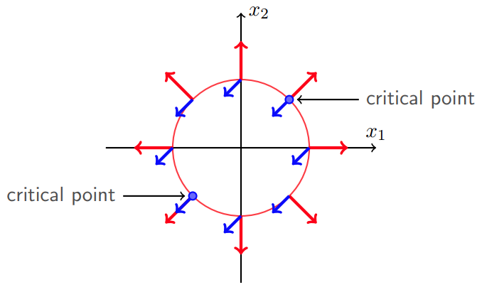
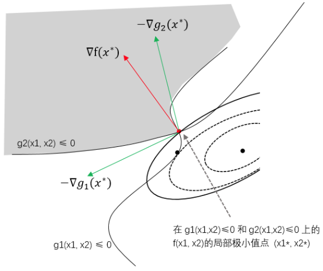
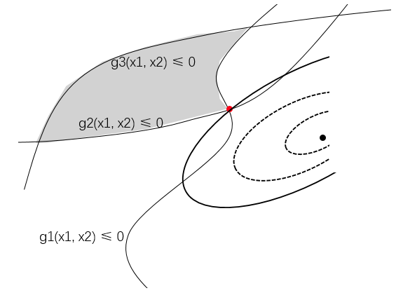

### 理解KKT条件

本笔记是对（凸）优化理论中拉格朗日乘子法和KKT条件的理解和总结，大量参考了如下资料：

[Convex Optimization, Stephen Boyd and Lieven Vandenberghe, Cambridge University ](https://web.stanford.edu/~boyd/cvxbook/)

[拉格朗日乘子法和KKT条件](https://www.cnblogs.com/liaohuiqiang/p/7805954.html)

[如何通俗地讲解对偶问题？尤其是拉格朗日对偶lagrangian duality？](https://www.zhihu.com/question/58584814)

一句话总结：KKT条件就是无约束优化问题中最优值点的必要条件（导数为0）在包含等式约束和不等式约束的优化问题中的推广，它是基于拉格朗日乘子法得来的。

#### 1. 无约束优化

无约束优化问题的求解很简单，直接求解目标函数的梯度即可。对于凸优化问题来说，梯度为0的点也就是全局最优值点。另外需要注意的是，梯度为0是全局最优解的必要条件，即梯度为0的点不一定是全局最优点，而全局最优点处的梯度必定为0。

     
    <figcaption>from https://www.zhihu.com/question/58584814</figcaption>

#### 2. 等式约束

##### 2.1 简单例子

我们先来考虑一种简单的情况，有如下优化问题
$$
\begin{eqnarray} 
& \min _ {x} & \quad f(x) = x_{1} + x_{2} \\
& s.t. & \quad h(x) = x_{1}^2 + x_{2}^2 - 2 = 0
\end{eqnarray}
$$
该问题只含有一个等式约束，其目标函数和约束函数可以用二维平面来表示：

     
    <figcaption>from https://www.cnblogs.com/liaohuiqiang/p/7805954.html</figcaption>

不考虑圆$h(x)$的限制时，$f(x)$要得到极小值，需要往$f(x)$的负梯度（下降最快的方向）方向走，如下图蓝色箭头。

     
    <figcaption>from https://www.cnblogs.com/liaohuiqiang/p/7805954.html</figcaption>

如果考虑圆$h(x)$的限制，要得到极小值，需要沿着圆的切线方向走，如下图红色粗箭头。注意这里的方向不是$h(x)$的梯度，而是正交于$h(x)$的梯度，$h(x)$梯度如下图的红色细箭头。

     
    <figcaption>from https://www.cnblogs.com/liaohuiqiang/p/7805954.html</figcaption>

在极小值点，$f(x)$和$h(x)$的等高线是相切的。并且可以发现，在极小值点处，$f(x)$的负梯度和$h(x)$的梯度在**同一直线**上，如下图critical point的蓝色和红色箭头所示。

     
    <figcaption>from https://www.cnblogs.com/liaohuiqiang/p/7805954.html</figcaption>

于是我们可以得到
$$
\nabla _ { x } f \left( x  ^ { * } \right) = \nu \nabla _ { x } h \left( x  ^ { * } \right)  \tag {2.1}
$$
可知，在极小值点处，式(2.1)必定满足，我们可以将式(2.1)成为拉格朗日条件。

要使式(2.1)成立，我们只要构造拉格朗日函数
$$
L ( x , \nu ) = f ( x ) + \nu h ( x )
$$
并令其对$x$求偏导的结果为零，就可以得到拉格朗日条件，这也就是拉格朗日乘子法的由来。

##### 2.2 一般情况

我们可以考虑更一般的情况，有
$$
\begin{eqnarray} 
& \min _ {x} & \quad f(x) \\
& s.t. & \quad h(x) = 0
\end{eqnarray}
$$
同样以二维平面为例，如下图所示

     
    <figcaption>from https://www.zhihu.com/question/58584814</figcaption>

 我们将$h(x)=0$沿着曲线方向参数化为$x(t)$，$x^{*}=x(t^*)$。必有$f(x)$在上图红点$x^{*}$处的梯度方向与$x(t)$的切线方向垂直，即
$$
\nabla f \left( x ^ { * } \right) \cdot \dot { x } \left( t ^ { * } \right) = 0
$$
另外，由$h(x)= 0 $可知，复合函数$h(x(t))=0$，两边求导，并且根据链式法则，有
$$
\nabla h ( x ) \cdot \dot { x } ( t ) = 0
$$
代入$x^{*}$和$t^{*}$，即可得
$$
\nabla h \left( x ^ { * } \right) \cdot \dot { x } \left( t ^ { * } \right) = 0
$$
我们可以得到，$ \nabla f \left( x ^ { * } \right)$垂直于$ \dot { x } \left( t ^ { * } \right)$，$\nabla h \left( x ^ { * } \right)$也垂直于$ \dot { x } \left( t ^ { * } \right)$，所以$ \nabla f \left( x ^ { * } \right)$和$\nabla h \left( x ^ { * } \right)$共线，有
$$
\nabla _ { x } f \left( x  ^ { * } \right) = \mu \nabla _ { x } h \left( x  ^ { * } \right)  \tag {2.1}
$$
即式(2.1)成立。于是接下来只要和之前一样构造拉格朗日函数，并且求偏导等于0即可。

#### 3. 不等式约束

不等式约束的情况稍微复杂一些，这里需要引入互补松弛性(complementary slackness)的概念，我们依然从一个简单的例子开始

##### 3.1 简单例子

我们分两种情况来考虑不等式约束，第一种情况是目标函数（在不考虑可行域限制时）的极小值点落在可行域内（不包含其边界），第二种是极小值点落在可行域外（包含边界）。

首先是极小值点落在可行域内的情况，我们考虑
$$
\begin{eqnarray} 
& \min _ {x} & \quad f(x) = x_{1}^{2} + x_{2}^{2} \\
& s.t. & \quad g(x) = x_{1}^2 + x_{2}^2 - 1 \leq 0
\end{eqnarray}
$$
这个优化问题只包含一个不等式约束。

     
    <figcaption>from https://www.cnblogs.com/liaohuiqiang/p/7805954.html</figcaption>

显然$f(x)$的极小值为原点(0,0)，落在可行域内。可行域以原点为圆心，半径为1。在极小值点$x^{*}$处，有$g(x^{*}) < 0$，$\nabla f(x^{*})=0$，我们可以认为，此时不等式约束不起作用。

对于极小值点落在可行域外的情况，我们考虑
$$
\begin{eqnarray} 
& \min _ {x} & \quad f(x) = (x_{1}-1.1)^{2} + (x_{2}+1.1)^{2} \\
& s.t. & \quad g(x) = x_{1}^2 + x_{2}^2 - 1 \leq 0
\end{eqnarray}
$$
显然$f(x)$的极小值为原点(1.1, -1.1)，落在可行域外。可行域以原点为圆心，半径为1。这种情况约束起作用，要考虑求解$f(x)$在可行域内的极小值点。

对于$f(x)$而言要沿着$f(x)$的负梯度方向走，才能走到极小值点，如下图的蓝色箭头。而$g(x)$的梯度往区域外发散，如下图红色箭头。

     
    <figcaption>from https://www.cnblogs.com/liaohuiqiang/p/7805954.html</figcaption>

显然，走到可行域内极小值点的时候，**$g(x)$的梯度和$f(x)$的负梯度同向**（下面式(3.1)中$\lambda >0$的原因）。因为极小值点在边界上，此时$g(x)$等于0。我们有
$$
- \nabla _ { x } f \left( x  ^ { * } \right) = \lambda \nabla _ { x } g \left( x  ^ { * } \right) \quad and \quad \lambda > 0 \tag {3.1}
$$
把两种情况总结一下：

a) 当目标函数极小值点落在可行域内时，约束不起作用，直接令$f(x)$的梯度等于0求解，此时$g(x)<0$;

b) 目标函数极小值点落在可行域外时，约束起作用，约束下的极小值点应该落在可行域边界上，即$g(x)=0$，此时有$g(x)$的梯度和$f(x)$的负梯度同向。

构造拉格朗日函数
$$
L ( x, \lambda ) = f (x ) + \lambda g ( x  )
$$
对于情况a)，因为约束不起作用，意味着$\lambda=0$，即约束被省略。

综合两种情况，不难发现，在极小值点处，总有
$$
\lambda ^ { * } g \left( x  ^ { * } \right) = 0 \tag{3.2}
$$
这个性质就是**互补松弛性**。

总结一下，不等式约束下的极小值点需满足以下条件：
$$
\begin{array} { l } { \nabla _ { \mathbf { x } } L  \left( \mathbf { x } ^ { * } , \lambda ^ { * } \right) = \mathbf { 0 } } \\ { \lambda ^ { * } \geq 0 } \\ { \lambda ^ { * } g \left( \mathbf { x } ^ { * } \right) = 0 } \\ { g \left( \mathbf { x } ^ { * } \right) \leq 0 } \end{array}
$$
这就是著名的KKT条件。

##### 3.2 一般情况

我们来考虑两个不等式约束起作用的情况：
$$
\begin{eqnarray} 
& \min _ {x} & \quad f(x) \\
& s.t. & \quad g_{1}(x) \leq 0 \\
& \quad & \quad g_{2}(x) \leq 0
\end{eqnarray}
$$
以二维平面为例，如下图

     
    <figcaption>from https://www.zhihu.com/question/58584814</figcaption>

阴影部分是可行域，与$f(x)$的等高线相加的点（红点）是满足约束的最小值点。从图中可以看到，在最小值点处，目标函数梯度$ \nabla f \left( x ^ { * } \right) $（红色箭头）一定在两条约束曲线负梯度方向$- \nabla g _ { 1 } \left( x ^ { * } \right)$和$ - \nabla g _ { 2 } \left( x ^ { * } \right)$（绿色箭头）之间，也就说，$ \nabla f \left( x ^ { * } \right) $能被$- \nabla g _ { 1 } \left( x ^ { * } \right)$和$ - \nabla g _ { 2 } \left( x ^ { * } \right)$线性表出，有
$$
\nabla f \left( x ^ { * } \right) = - \lambda _ { 1 } \nabla g _ { 1 } \left( x ^ { * } \right) - \lambda _ { 2 } \nabla g _ { 2 } \left( x ^ { * } \right) \tag {3.3}
$$
其中$\lambda_{1} \geq 0$，$\lambda_{2} \geq 0$。

如果我们再加入一个不等式约束$g_{3}(x) \leq 0$，但它在最小值点处不起作用，如下图

     
    <figcaption>from https://www.zhihu.com/question/58584814</figcaption>

此时根据互补松弛性，我们令$\lambda_{3} = 0$，那么有
$$
\nabla f \left( x ^ { * } \right) = - \lambda _ { 1 } \nabla g _ { 1 } \left( x ^ { * } \right) - \lambda _ { 2 } \nabla g _ { 2 } \left( x ^ { * } \right)- \lambda _ { 3 } \nabla g _ { 3 } \left( x ^ { * } \right) \tag{3.4}
$$
虽然我们多加了一个不等式约束，但实际上最后得到的最小值点梯度是与式(3.3)一致的。

构造拉格朗日函数
$$
L ( x, \lambda ) = f (x ) + \lambda_{1} g_{1} ( x  ) + \lambda_{2} g_{2} ( x  ) + \lambda_{3} g_{3} ( x  )
$$
对于更多的不等式，我们可以继续构造下去，有几个不等式，就有几个拉格朗日乘子。

#### 4. KKT条件

对于一个带有等式约束和不等式约束的优化问题
$$
\begin{array} { c l } { \min _ { x } } & { f _ { 0 } ( x ) } \\ { \text {s.t.} } & { f _ { i } ( x ) \leq 0 , \quad i = 1 , \ldots , m } \\ { } & { h _ { i } ( x ) = 0 , \quad i = 1 , \ldots , p } \end{array}
$$
完整的KKT条件表述如下：
$$
\begin{eqnarray} 
f _ { i } ( x ) &\leq& 0 , \quad i = 1 , \cdots , m \tag{4.1} \\
h _ { i } ( x ) &\leq& 0 , \quad i = 1 , \cdots , p \tag{4.2} \\
\lambda_{i} &\geq& 0 , \quad i = 1 , \cdots , m \tag{4.3} \\
\lambda _ { i } f _ { i } ( x ) &=& 0 , \quad i = 1 , \cdots , m \tag{4.4} \\
\nabla f _ { 0 } ( x ) + &\sum _ { i = 1 } ^ { m }& \lambda _ { i } \nabla f _ { i } ( x ) + \sum _ { i = 1 } ^ { p } \nu _ { i } \nabla h _ { i } ( x ) = 0 \tag{4.5}
\end{eqnarray}
$$
其中，式（4.1）和（4.2）是原始约束，式（4.3）是对偶可行性的要求，式（4.4）是互补松弛性的要求，式（4.5）即为拉格朗日函数关于$x$的梯度。

需要注意的是，KKT条件是一个必要条件，也就是说，满足KKT条件的点不一定是最小值点，但最小值点必定满足KKT条件。对于凸优化问题来说，由于不存在局部极小值，因此KKT条件此时变为最小值点的充要条件。